# Landingpages erstellen und veröffentlichen {#create-lp}

>[!CAUTION]
>
>Die Verwendung von Landingpages ist derzeit nur für ausgewählte Benutzer verfügbar. Wenn Sie diese Funktion nutzen möchten, wenden Sie sich an Ihren Kundenbetreuer bei der Adobe.

## Auf Landingpages zugreifen

Um auf die Landingpage-Liste zuzugreifen, wählen Sie **[!UICONTROL Journey-Management]** > **[!UICONTROL Landingpages]** über das Menü links.

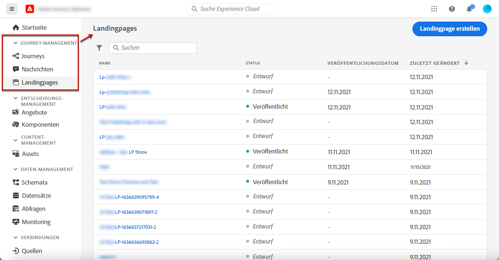

Die **[!UICONTROL Landing Pages]** Liste zeigt alle erstellten Elemente an. Sie können sie nach ihrem Status oder Änderungsdatum filtern.

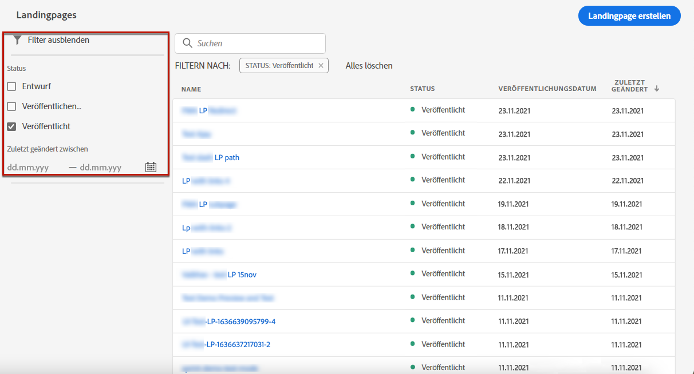

## Landingpage erstellen

Gehen Sie zur Erstellung einer Landingpage wie folgt vor:

1. Klicken Sie in der Landingpage-Liste auf **[!UICONTROL Landingpage erstellen]**.

   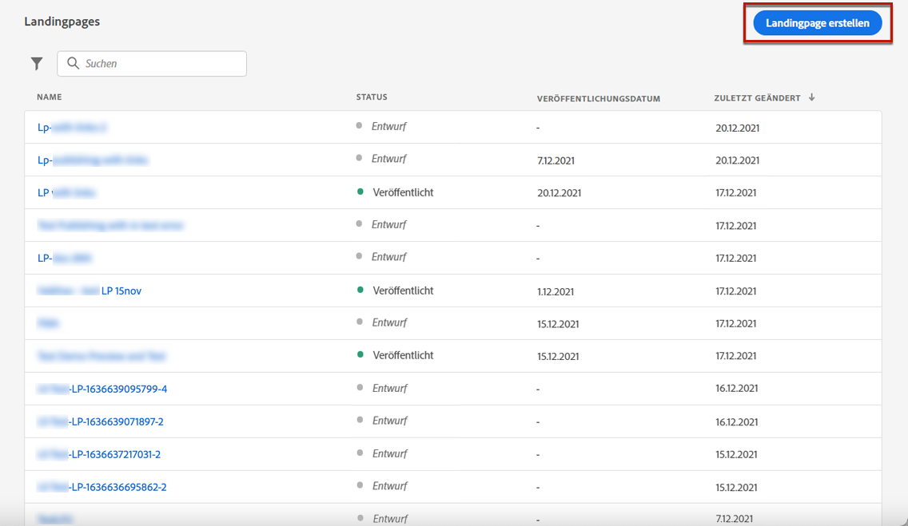

1. Fügen Sie einen Titel hinzu. Sie können bei Bedarf eine Beschreibung hinzufügen.

   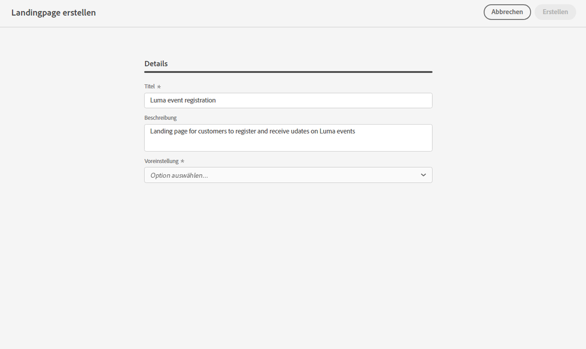

1. Klicken Sie auf **[!UICONTROL Erstellen]**.

1. Die primäre Seite und ihre Eigenschaften werden angezeigt. Erfahren Sie, wie Sie die Seiteneinstellungen konfigurieren [here](#configure-primary-page).

   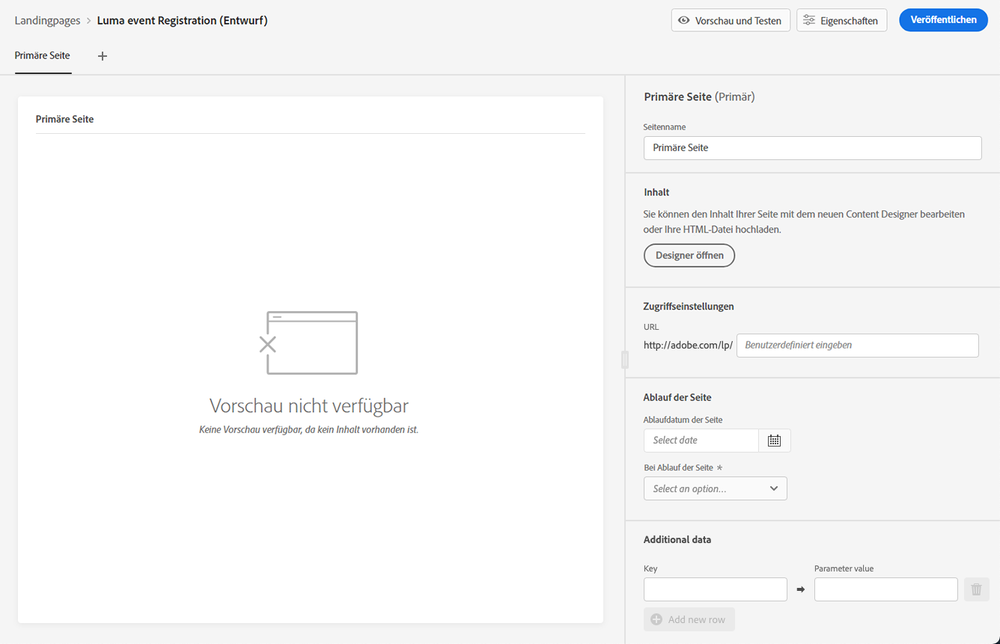

1. Klicken Sie auf das Symbol + , um eine Unterseite hinzuzufügen. Erfahren Sie, wie Sie die Einstellungen konfigurieren [here](#configure-subpages).

   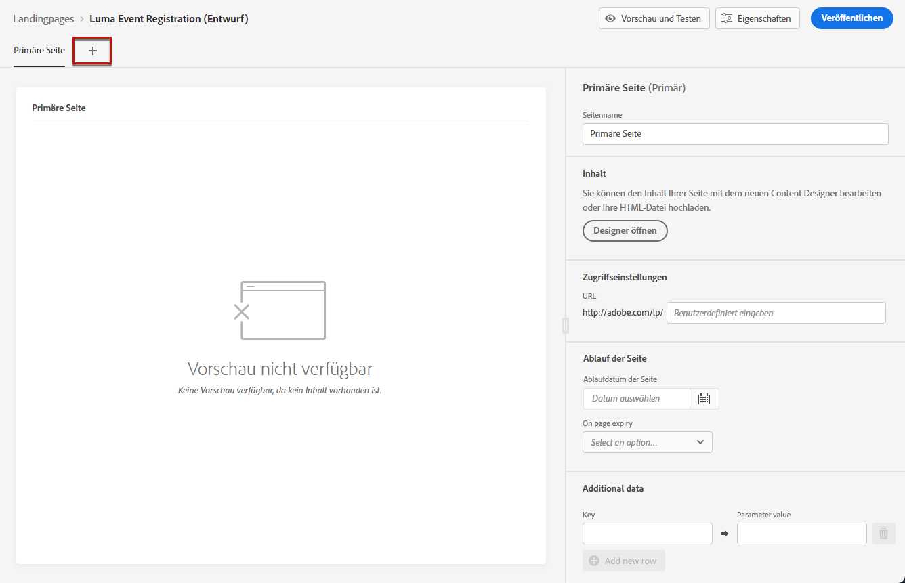

Nachdem Sie die [primäre Seite](#configure-primary-page) und [Unterseiten](#configure-subpages) Wenn vorhanden, können Sie [test](#test) und [publish](#publish) Ihre Landingpage.

## Primärseite konfigurieren {#configure-primary-page}

Die primäre Seite ist die Seite, die den Benutzern sofort angezeigt wird, wenn sie auf den Link zu Ihrer Landingpage klicken, z. B. von einer E-Mail oder einer Website aus.

Gehen Sie wie folgt vor, um die Einstellungen der primären Seite zu definieren.

1. Sie können den Seitennamen ändern, also **[!UICONTROL Primäre Seite]** Standardmäßig.

1. Bearbeiten Sie den Inhalt Ihrer Seite mit dem Content Designer. Erfahren Sie, wie Sie Landingpage-Inhalte erstellen. [here](design-lp.md).

   

1. Definieren Sie Ihre Landingpage-URL.

   >[!CAUTION]
   >
   >Die Landingpage-URL muss eindeutig sein.

   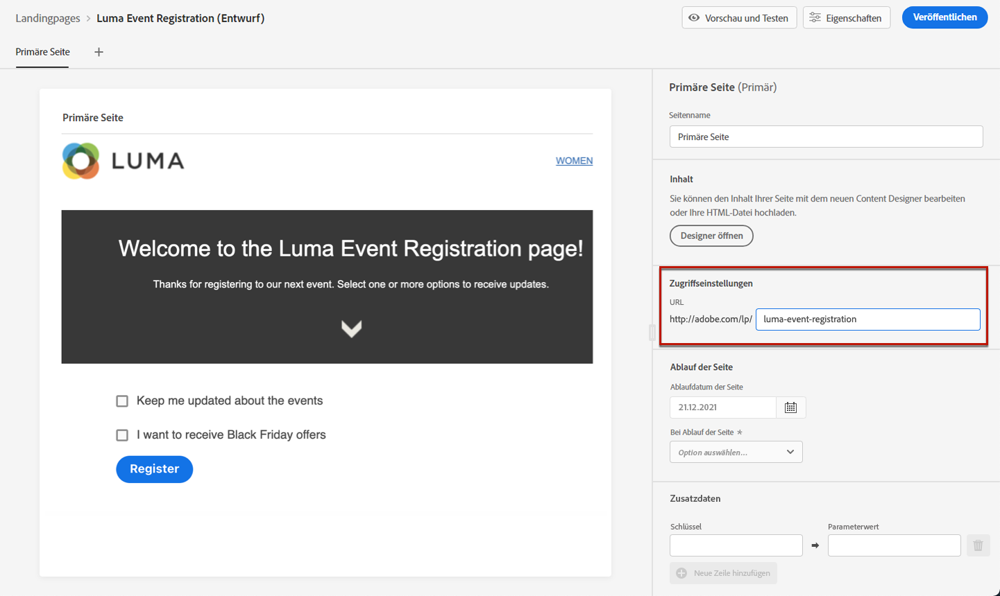

   Der erste Teil der URL ist vorausgefüllt und kann nicht über die Benutzeroberfläche bearbeitet werden. Wenden Sie sich zur Einrichtung an Ihren Kundenbetreuer oder an den für die Adobe zuständigen Support-Mitarbeiter. [Support-Team der Adobe](https://helpx.adobe.com/de/enterprise/admin-guide.html/enterprise/using/support-for-experience-cloud.ug.html){target=&quot;_blank&quot;}.

1. Sie können ein Ablaufdatum für Ihre Seite festlegen. In diesem Fall müssen Sie eine Aktion nach Ablauf der Seite auswählen:

   * **[!UICONTROL Umleitungs-URL]**: Geben Sie die URL der Seite ein, zu der Benutzer weitergeleitet werden, wenn die Seite abläuft.
   * **[!UICONTROL Benutzerdefinierte Seite]**: [Konfigurieren einer Unterseite](#configure-subpages) und wählen Sie sie aus der angezeigten Dropdownliste aus.
   * **[!UICONTROL Browser-Fehler]**: Geben Sie den Fehlertext ein, der anstelle der Seite angezeigt wird.

   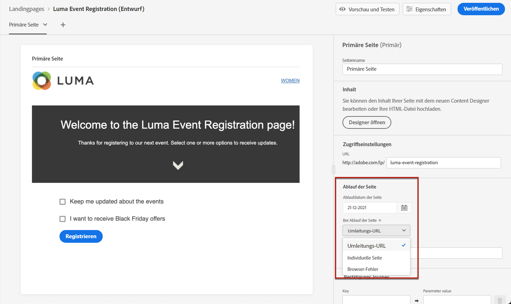

   <!--1. In the **[!UICONTROL Additional data]** section, define a **[!UICONTROL Key]** and the corresponding **[!UICONTROL Parameter value]**. // you can define how the data entered in the landing page is managed once it has been submitted by a user??-->

1. Wenn Sie eine oder mehrere Abonnementlisten für die primäre Seite ausgewählt haben, werden diese im **[!UICONTROL Abonnementliste]** Abschnitt.

   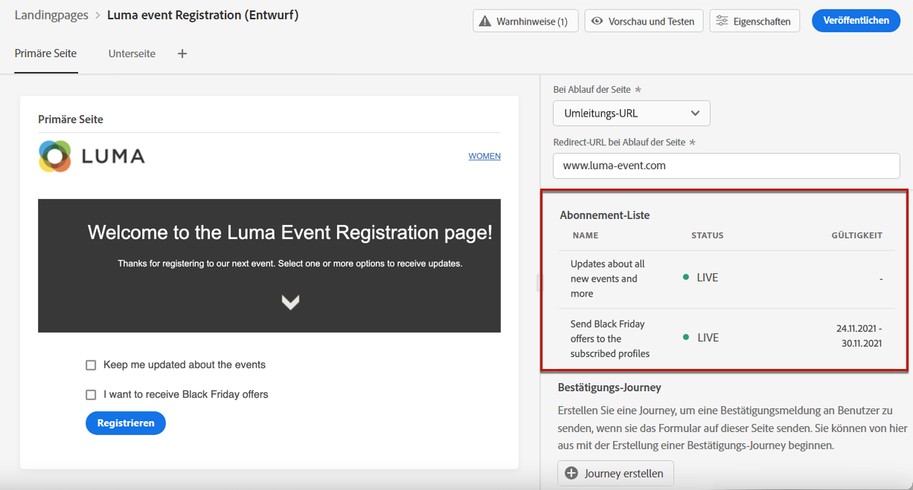

1. Von der Landingpage aus können Sie direkt eine Journey erstellen, die Benutzern eine Bestätigungsnachricht sendet, wenn sie das Formular übermitteln.

   

   Klicken **[!UICONTROL Journey erstellen]** zu starten [diese Journey konfigurieren](../building-journeys/journey-gs.md#jo-build). Sie werden zum **[!UICONTROL Journey-Management]** > **[!UICONTROL Journey]** Liste.

## Unterseiten konfigurieren {#configure-subpages}

Sie können beliebig viele Unterseiten hinzufügen. Sie können beispielsweise eine Dankeseite erstellen, die angezeigt wird, sobald die Benutzer das Formular senden. Sie können auch eine Fehlerseite definieren, die aufgerufen wird, wenn bei der Landingpage ein Fehler auftritt.

Gehen Sie wie folgt vor, um Einstellungen für Unterseiten zu definieren.

1. Sie können den Seitennamen ändern, also **[!UICONTROL Unterseite 1]** Standardmäßig.

1. Bearbeiten Sie den Inhalt Ihrer Seite mit dem Content Designer. Erfahren Sie, wie Sie Landingpage-Inhalte erstellen. [here](design-lp.md).

1. Definieren Sie Ihre Landingpage-URL.

   Der erste Teil der URL ist vorausgefüllt und kann nicht über die Benutzeroberfläche bearbeitet werden. Wenden Sie sich zur Einrichtung an Ihren Kundenbetreuer oder an den für die Adobe zuständigen Support-Mitarbeiter. [Support-Team der Adobe](https://helpx.adobe.com/enterprise/admin-guide.html/enterprise/using/support-for-experience-cloud.ug.html){target=&quot;_blank&quot;}.

   >[!CAUTION]
   >
   >Die Landingpage-URL muss eindeutig sein.

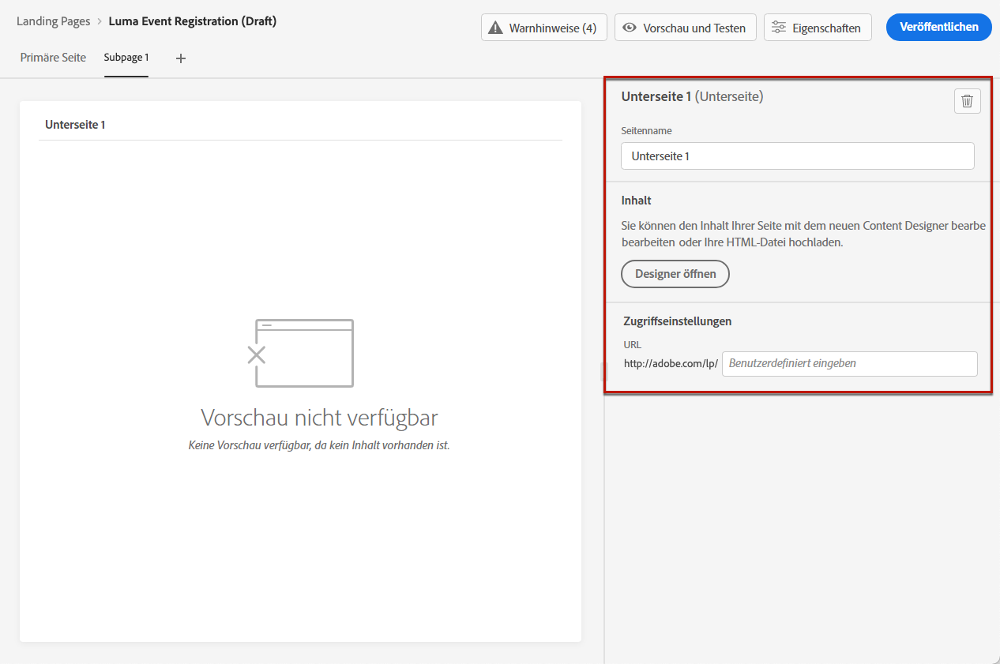

## Landingpage testen {#test}

Nachdem Sie die Einstellungen und den Inhalt Ihrer Landingpage definiert haben, können Sie sie mit Testprofilen in der Vorschau anzeigen. Wenn Sie [personalisierter Inhalt](../personalization/personalize.md)können Sie anhand von Testprofildaten überprüfen, wie dieser Inhalt auf der Landingpage dargestellt wird.

>[!CAUTION]
>
>Um Ihre Nachrichten in der Vorschau darzustellen und einen Testversand durchzuführen, benötigen Sie Testprofile. Auf [dieser Seite](../building-journeys/creating-test-profiles.md) erfahren Sie, wie Sie Testprofile erstellen.

1. Klicken Sie in der Landingpage-Benutzeroberfläche oder im Inhaltsentwickler auf die Schaltfläche **[!UICONTROL Vorschau und Test]** -Schaltfläche, um auf die Auswahl des Testprofils zuzugreifen.

   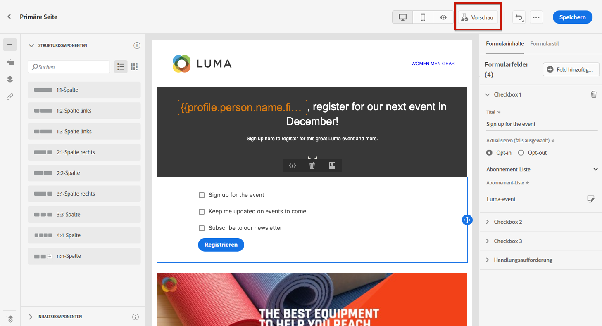

1. Wählen Sie ein oder mehrere Testprofile aus.

   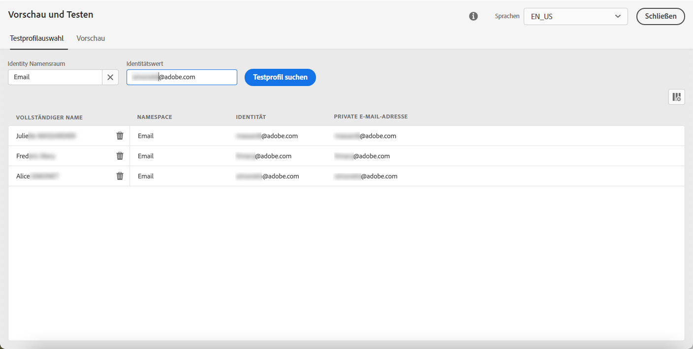

   Die Schritte zum Auswählen von Testprofilen sind mit denen beim Testen einer Nachricht identisch. Weitere Informationen dazu finden Sie in [diesem Abschnitt](../preview.md#select-test-profiles).

1. Klicken Sie auf **[!UICONTROL Vorschau]** zum Testen Ihrer Landingpage.

   <!--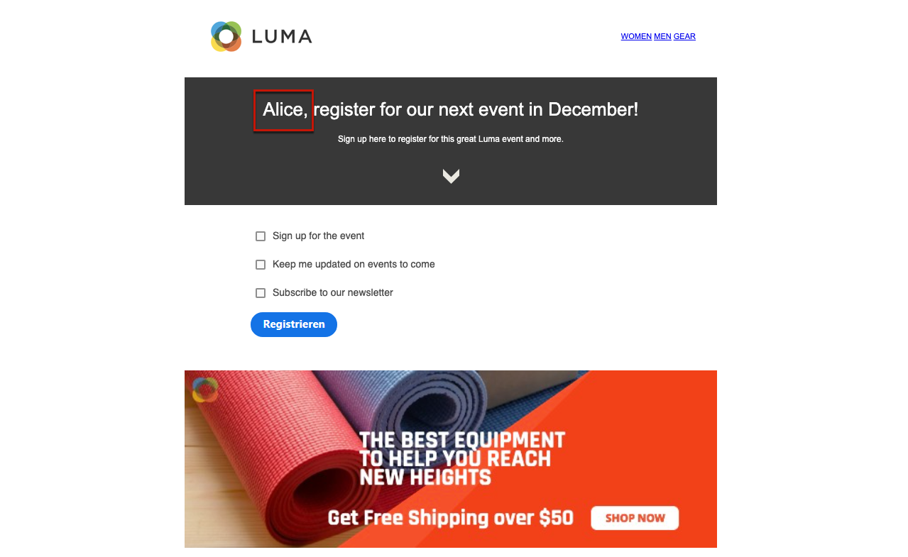-->

1. Personalisierte Elemente werden durch die ausgewählten Testprofildaten ersetzt. Wählen Sie weitere Testprofile aus, um das Rendering für jede Variante Ihrer Landingpage in der Vorschau anzuzeigen.

## Prüfen von Warnhinweisen {#alerts}

Warnungen werden beim Erstellen Ihrer Landingpage angezeigt, wenn Sie wichtige Maßnahmen vor der Veröffentlichung treffen müssen.

Warnhinweise werden oben rechts im Bildschirm angezeigt, wie unten dargestellt:

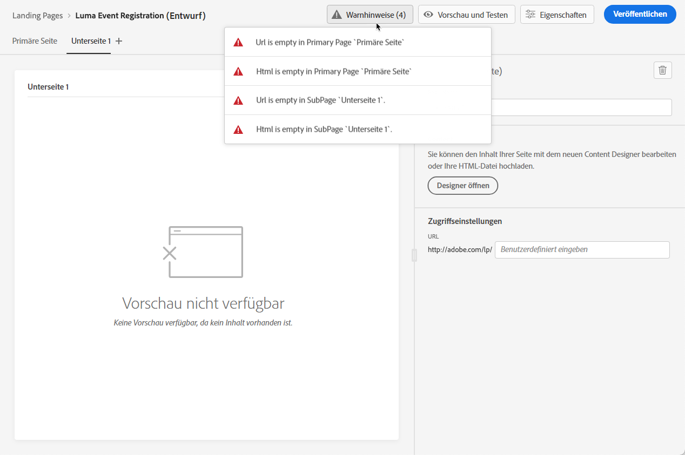

>[!NOTE]
>
>Wenn diese Schaltfläche nicht angezeigt wird, wurde kein Warnhinweis erkannt.

Es können zwei Arten von Warnhinweisen auftreten:

* **Warnhinweise** geben Hinweise auf Empfehlungen und zeigen Best Practices. <!--For example, a message will display if -->

* **Fehler** verhindern, dass Sie die Nachricht veröffentlichen, solange sie nicht behoben sind. Beispielsweise werden Sie in einer Meldung darauf hingewiesen, dass die URL der primären Seite fehlt.

<!--All possible warnings and errors are detailed [below](#alerts-and-warnings).-->

>[!CAUTION]
>
> Sie müssen alle **Fehler**-Warnungen vor der Veröffentlichung auflösen.

<!--The settings and elements checked by the system are listed below. You will also find information on how to adapt your configuration to resolve the corresponding issues.

**Warnings**:

* 

**Errors**:

* 

>[!CAUTION]
>
> To be able to publish your message, you need to resolve all **error** alerts.
-->

## Landingpage publizieren {#publish}

Sobald Ihre Landingpage fertig ist, können Sie sie veröffentlichen, um sie für die Verwendung in einer Nachricht oder auf einer Website verfügbar zu machen.

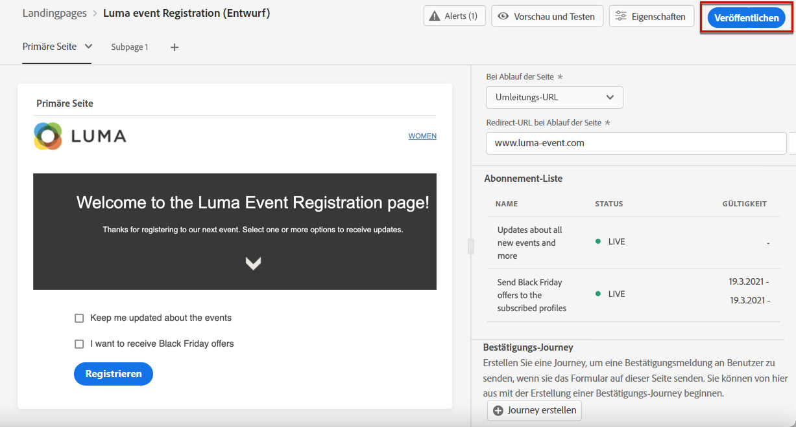

>[!CAUTION]
>
>Prüfen und lösen Sie Warnhinweise vor der Veröffentlichung. [Weitere Informationen](#alerts)

Sobald Ihre Landingpage publiziert wurde, wird sie mit der **[!UICONTROL Veröffentlicht]** Status.

Sie ist jetzt live und der Link zu ihr kann in einer [message](../create-message.md) und über einen [Journey](../building-journeys/journey.md).
