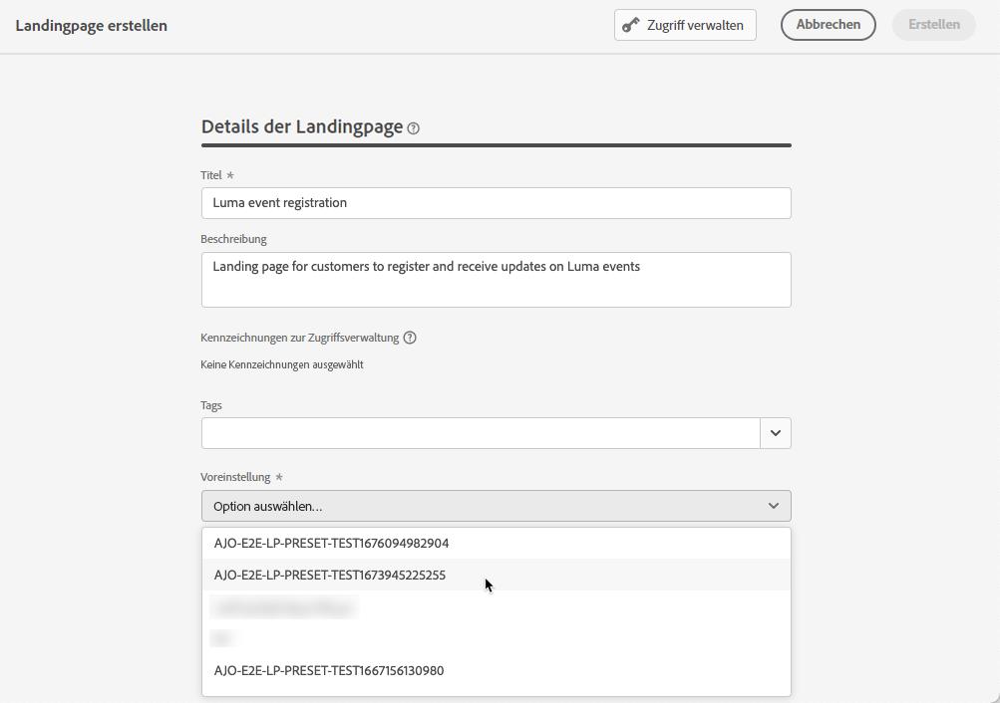
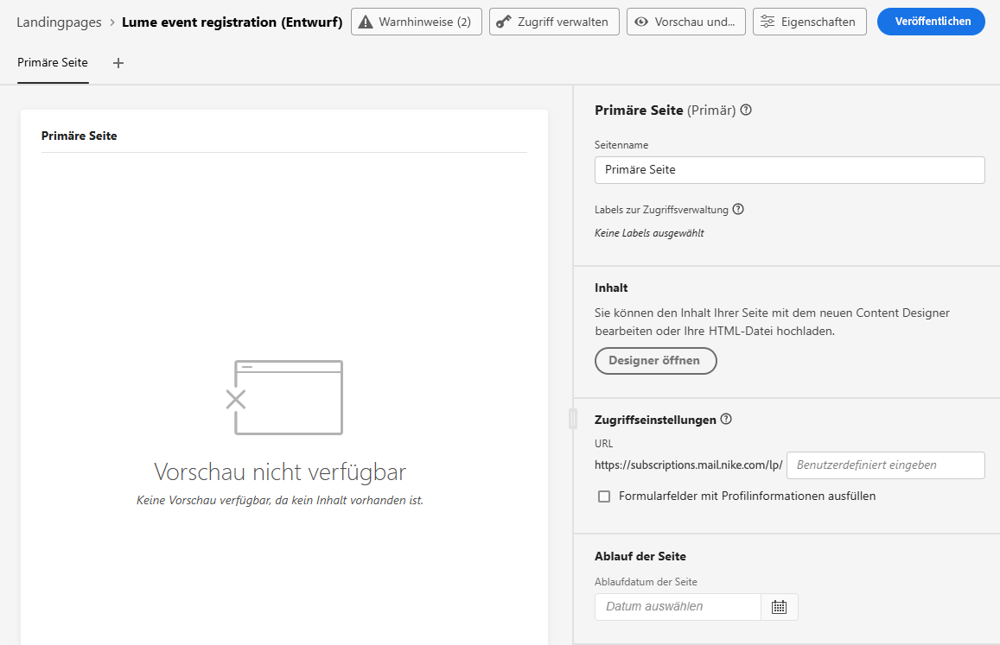
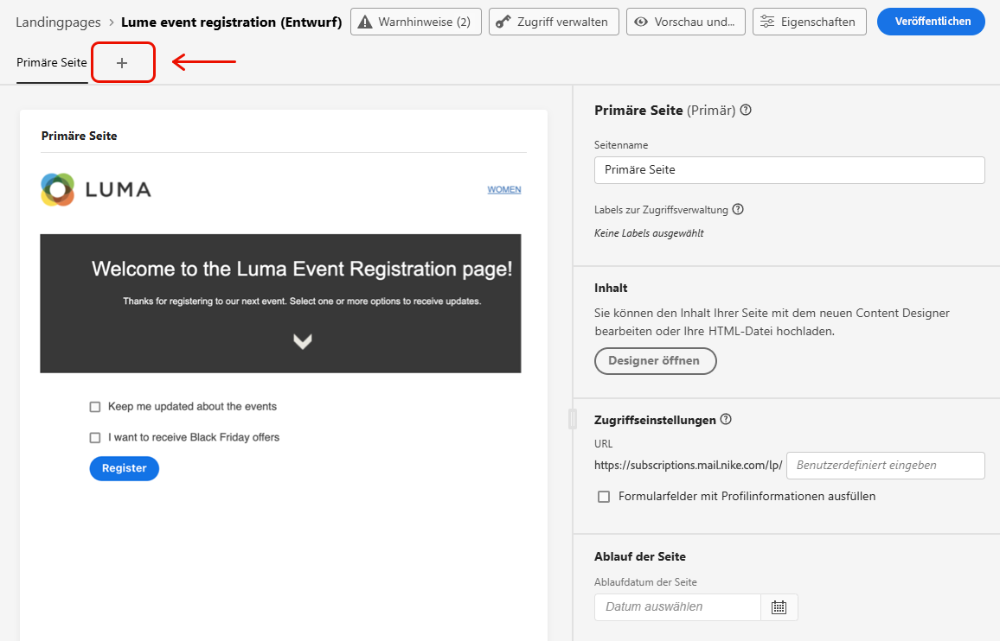
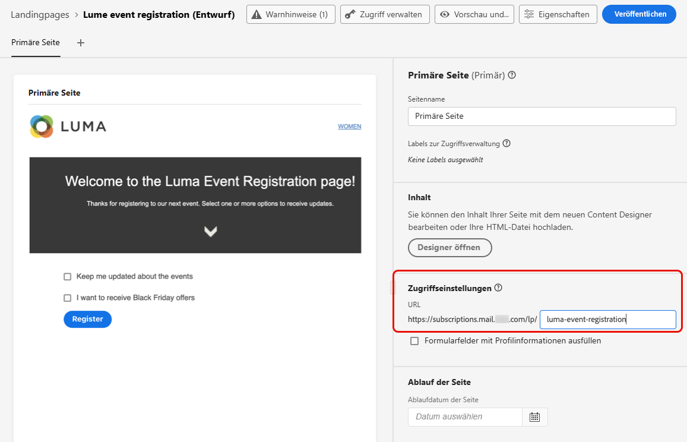
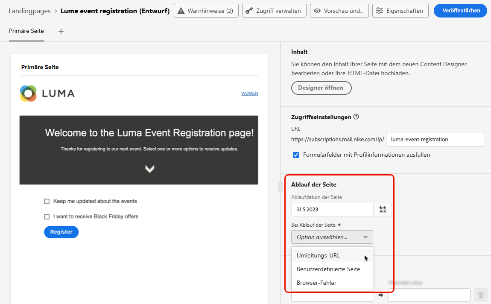

# Erstellen und Veröffentlichen von Landingpages {#create-lp}

## Zugreifen auf Landingpages {#access-landing-pages}

Um auf die Landingpage-Liste zuzugreifen, wählen Sie im linken Menü **[!UICONTROL Journey-Management]** > **[!UICONTROL Landingpages]** aus.

Die **[!UICONTROL Landingpage]**-Liste zeigt alle erstellten Elemente an. Sie können sie nach ihrem Status oder Änderungsdatum filtern.

In dieser Liste können Sie auf den [Live-Bericht der Landingpage](../reports/lp-report-live.md) oder den [globalen Bericht der Landingpage](../reports/lp-report-global.md) für veröffentlichte Elemente zugreifen.

Sie können eine Landingpage auch löschen, duplizieren und ihre Veröffentlichung aufheben.

>[!CAUTION]
>
>Wenn Sie die Veröffentlichung einer Landingpage aufheben, auf die in einer Nachricht verwiesen wird, funktioniert der Link zur Landingpage nicht mehr, und es wird eine Fehlerseite angezeigt.

Klicken Sie auf das Drei-Punkt-Menü neben einer Landingpage, um die gewünschte Aktion auszuwählen.

>[!NOTE]
>
>Sie können eine [veröffentlichte](#publish-landing-page) Landingpage nicht löschen. Um sie zu löschen, müssen Sie zunächst die Veröffentlichung aufheben.

## Erstellen einer Landingpage {#create-landing-page}

>[!CONTEXTUALHELP]
>id="ajo_lp_create"
>title="Definition und Konfiguration Ihrer Landingpage"
>abstract="Um eine Landingpage zu erstellen, müssen Sie eine Voreinstellung auswählen, dann die primäre Seite und die untergeordneten Seiten konfigurieren und Ihre Seite schließlich testen, bevor Sie sie veröffentlichen."
>additional-url="https://experienceleague.adobe.com/docs/journey-optimizer/using/landing-pages/lp-configuration/lp-presets.html?lang=de#lp-create-preset" text="Erstellen von Landingpage-Voreinstellungen"
>additional-url="https://experienceleague.adobe.com/docs/journey-optimizer/using/landing-pages/create-lp.html?lang=de#publish-landing-page" text="Veröffentlichen der Landingpage"

>[!CONTEXTUALHELP]
>id="ajo_lp_access_management_labels"
>title="Zuweisen von Kennzeichnungen zu Ihrer Landingpage"
>abstract="Zum Schutz sensibler digitaler Assets können Sie mithilfe von Kennzeichnungen Berechtigungen definieren, um den Datenzugriff auf Ihre Landingpage zu verwalten."
>additional-url="https://experienceleague.adobe.com/docs/journey-optimizer/using/access-control/object-based-access.html?lang=de" text="Zugriffssteuerung auf Objektebene"

Gehen Sie wie folgt vor, um eine Landingpage zu erstellen:

1. Klicken Sie in der Landingpage-Liste auf **[!UICONTROL Landingpage erstellen]**.

   

1. Fügen Sie einen Titel hinzu. Sie können bei Bedarf eine Beschreibung hinzufügen.

   

1. Um der Landingpage benutzerdefinierte oder Core-Datennutzungsbezeichnungen zuzuweisen, wählen Sie **[!UICONTROL Zugriff verwalten]**. [Weitere Informationen zur Zugriffssteuerung auf Objektebene (OLAC)](../administration/object-based-access.md)

   <!--You can add a tag. See AEP documentation?-->

1. Wählen Sie eine Voreinstellung aus. In [diesem Abschnitt](../landing-pages/lp-presets.md#lp-create-preset) erfahren Sie, wie Sie Landingpage-Voreinstellungen erstellen.

   

1. Klicken Sie auf **[!UICONTROL Erstellen]**.

1. Die Primärseite und ihre Eigenschaften werden angezeigt. [Hier](#configure-primary-page) erfahren Sie, wie Sie die Einstellungen der Primärseite konfigurieren.

   

1. Klicken Sie auf das Symbol „+“, um eine Unterseite hinzuzufügen. [Hier](#configure-subpages) erfahren Sie, wie Sie die Einstellungen der Unterseite konfigurieren.

   

Nachdem Sie die [Primärseite](#configure-primary-page) und die [Unterseiten](#configure-subpages) (sofern vorhanden) konfiguriert und gestaltet haben, können Sie Ihre Landingpage [testen](#test-landing-page) und [veröffentlichen](#publish-landing-page).

## Konfigurieren der Primärseite {#configure-primary-page}

>[!CONTEXTUALHELP]
>id="ajo_lp_primary_page"
>title="Definieren der primären Seiteneinstellungen"
>abstract="Die primäre Seite erscheint den Benutzenden sofort, nachdem sie auf den Link zu Ihrer Landingpage geklickt haben, beispielsweise in einer E-Mail oder auf einer Website."
>additional-url="https://experienceleague.adobe.com/docs/journey-optimizer/using/landing-pages/landing-pages-design/design-lp.html?lang=de" text="Erstellen der Landingpage-Inhalte"

>[!CONTEXTUALHELP]
>id="ajo_lp_access_settings"
>title="Definieren Ihrer Landingpage-URL"
>abstract="Definieren Sie in diesem Abschnitt eine eindeutige Landingpage-URL. Für den ersten Teil der URL müssen Sie zuvor eine Landingpage-Subdomain als Teil der von Ihnen ausgewählten Voreinstellung eingerichtet haben."
>additional-url="https://experienceleague.adobe.com/docs/journey-optimizer/using/landing-pages/lp-configuration/lp-subdomains.html?lang=de" text="Konfigurieren von Landingpage-Subdomains"
>additional-url="https://experienceleague.adobe.com/docs/journey-optimizer/using/landing-pages/lp-configuration/lp-presets.html?lang=de#lp-create-preset" text="Erstellen von Landingpage-Voreinstellungen"

Die Primärseite ist die Seite, die den Benutzern als Erstes angezeigt wird, nachdem sie auf den Link zu Ihrer Landingpage geklickt haben, z. B. über eine E-Mail oder eine Website.

Gehen Sie wie folgt vor, um die Einstellungen der Primärseite zu definieren.

1. Sie können den Seitennamen ändern, der standardmäßig **[!UICONTROL Primärseite]** lautet.

1. Bearbeiten Sie den Inhalt Ihrer Seite mit dem Content Designer. [Hier](design-lp.md) erfahren Sie, wie Sie den Inhalt von Landingpages definieren.

   

1. Definieren Sie Ihre Landingpage-URL. Für den ersten Teil der URL müssen Sie zuvor eine Landingpage-Subdomain als Teil der von Ihnen ausgewählten [Voreinstellung](../landing-pages/lp-presets.md#lp-create-preset) eingerichtet haben. [Weitere Informationen](../landing-pages/lp-subdomains.md)

   >[!CAUTION]
   >
   >Die Landingpage-URL muss eindeutig sein.

   

   >[!NOTE]
   >
   >Sie können nicht auf Ihre Landingpage zugreifen, indem Sie diese URL einfach in einen Webbrowser kopieren, selbst wenn sie bereits veröffentlicht wurde. Stattdessen können Sie sie mit der Vorschaufunktion wie in [diesem Abschnitt](#test-landing-page) beschrieben testen.

1. Wenn auf der Landingpage die bereits verfügbaren Formulardaten vorab ausgefüllt werden sollen, wählen Sie die Option **[!UICONTROL Formularfelder mit Profilinformationen vorausfüllen]**.

   

   Wenn diese Option aktiviert ist und ein Profil sich bereits für eine An-/Abmeldung entschieden hat oder bereits einer Abonnementliste hinzugefügt wurde, wird seine Auswahl bei der Anzeige der Landingpage berücksichtigt.

   Wenn sich beispielsweise ein Profil für den Empfang von Nachrichten zu künftigen Ereignissen entschieden hat, ist die entsprechende Checkbox bereits aktiviert, wenn diesem Profil die Landingpage das nächste Mal angezeigt wird.

   

1. Sie können ein Ablaufdatum für Ihre Seite festlegen. In diesem Fall müssen Sie eine Aktion nach Ablauf der Seite auswählen:

   * **[!UICONTROL Umleitungs-URL]**: Geben Sie die URL der Seite ein, zu der Benutzer weitergeleitet werden, wenn die Seite abgelaufen ist.
   * **[!UICONTROL Benutzerdefinierte Seite]**: [Konfigurieren Sie eine Unterseite](#configure-subpages) und wählen Sie diese aus der angezeigten Dropdown-Liste aus.
   * **[!UICONTROL Browser-Fehler]**: Geben Sie den Fehlertext ein, der anstatt der Seite angezeigt wird.

   

1. Definieren Sie im Abschnitt **[!UICONTROL Zusätzliche Daten]** einen oder mehrere Schlüssel und die zugehörigen Parameterwerte. Sie können diese Schlüssel im Inhalt Ihrer primären Seite und der Unterseiten mithilfe des [Ausdruckseditors](../personalization/personalization-build-expressions.md) verwenden. Weiterführende Informationen finden Sie in [diesem Abschnitt](lp-content.md#use-form-component#use-additional-data).

   

1. Wenn Sie beim [Erstellen der Primärseite](design-lp.md) eine oder mehrere Abonnement-Listen ausgewählt haben, werden diese im Abschnitt **[!UICONTROL Abonnement-Liste]** angezeigt.

   

1. Sie können direkt über die Landingpage [eine Journey erstellen](../building-journeys/journey-gs.md#jo-build), über die Benutzern beim Senden des Formulars eine Bestätigungsnachricht gesendet wird. Am Ende dieses [Anwendungsfalls](lp-use-cases.md#subscription-to-a-service) erfahren Sie, wie Sie eine solche Journey erstellen.

   

   Klicken Sie auf **[!UICONTROL Journey erstellen]**, um zur Liste **[!UICONTROL Journey-Management]** > **[!UICONTROL Journeys]** weitergeleitet zu werden.

## Konfigurieren von Unterseiten {#configure-subpages}

>[!CONTEXTUALHELP]
>id="ajo_lp_subpage"
>title="Definieren der Unterseiteneinstellungen"
>abstract="Sie können bis zu 2 Unterseiten hinzufügen. Sie können beispielsweise eine „Danke“-Seite erstellen, die angezeigt wird, sobald Benutzer das Formular übermitteln, und Sie können eine Fehlerseite definieren, die erscheint, wenn ein Problem mit der Landingpage auftritt."
>additional-url="https://experienceleague.adobe.com/docs/journey-optimizer/using/landing-pages/landing-pages-design/design-lp.html?lang=de" text="Erstellen der Landingpage-Inhalte"

>[!CONTEXTUALHELP]
>id="ajo_lp_access_settings-subpage"
>title="Definieren Ihrer Landingpage-URL"
>abstract="Definieren Sie in diesem Abschnitt eine eindeutige Landingpage-URL. Für den ersten Teil der URL müssen Sie zuvor eine Landingpage-Subdomain als Teil der von Ihnen ausgewählten Voreinstellung eingerichtet haben."
>additional-url="https://experienceleague.adobe.com/docs/journey-optimizer/using/landing-pages/lp-configuration/lp-subdomains.html?lang=de" text="Konfigurieren von Landingpage-Subdomains"
>additional-url="https://experienceleague.adobe.com/docs/journey-optimizer/using/landing-pages/lp-configuration/lp-presets.html?lang=de#lp-create-preset" text="Erstellen von Landingpage-Voreinstellungen"

Sie können bis zu 2 Unterseiten hinzufügen. Sie können beispielsweise eine „Danke“-Seite erstellen, die angezeigt wird, sobald Benutzer das Formular übermitteln, und Sie können eine Fehlerseite definieren, die erscheint, wenn ein Problem mit der Landingpage auftritt.

Gehen Sie wie folgt vor, um die Einstellungen der Unterseite zu definieren.

1. Sie können den Seitennamen ändern, der standardmäßig **[!UICONTROL Unterseite 1]** lautet.

1. Bearbeiten Sie den Inhalt Ihrer Seite mit dem Content Designer. [Hier](design-lp.md) erfahren Sie, wie Sie den Inhalt von Landingpages definieren.

   >[!NOTE]
   >
   >Sie können von jeder Unterseite derselben Landingpage aus einen Link zur primären Seite einfügen. Um beispielsweise Benutzer umzuleiten, die sich geirrt haben und erneut abonnieren möchten, können Sie einen Link von der Bestätigungs-Unterseite zur primären Abonnementseite hinzufügen. In [diesem Abschnitt](../email/message-tracking.md#insert-links) erfahren Sie, wie Sie Links einfügen.

1. Definieren Sie Ihre Landingpage-URL. Für den ersten Teil der URL müssen Sie zuvor eine Subdomain für die Landingpage eingerichtet haben. [Weitere Informationen](../landing-pages/lp-subdomains.md)

   >[!CAUTION]
   >
   >Die Landingpage-URL muss eindeutig sein.

## Testen der Landingpage {#test-landing-page}

Nachdem Sie die Einstellungen und den Inhalt Ihrer Landingpage definiert haben, können Sie sie mit Testprofilen in der Vorschau anzeigen. Bei Verwendung von [personalisierten Inhalten](../personalization/personalize.md) können Sie prüfen, wie diese Inhalte auf der Landingpage angezeigt werden, und dabei Daten von Testprofilen nutzen.

>[!CAUTION]
>
>Um Ihre Nachrichten in der Vorschau darzustellen und einen Testversand durchzuführen, benötigen Sie verfügbare Testprofile. Hier erfahren Sie, wie Sie ein [Testprofil erstellen](../segment/creating-test-profiles.md).

1. Klicken Sie auf der Landingpage auf die Schaltfläche **[!UICONTROL Vorschau und Test]**, um zur Testprofil-Auswahl zu gelangen.

   

   >[!NOTE]
   >
   >Die Schaltfläche **[!UICONTROL Vorschau]** kann auch über den Content Designer aufgerufen werden.

1. Wählen Sie auf dem Bildschirm **[!UICONTROL Vorschau und Test]** eines oder mehrere Testprofile aus.

   

   Die Schritte zum Auswählen von Testprofilen sind mit denen beim Testen einer Nachricht identisch. Weitere Informationen dazu finden Sie in [diesem Abschnitt](../email/preview.md#select-test-profiles).

1. Wählen Sie die Registerkarte **[!UICONTROL Vorschau]** aus und klicken Sie auf **[!UICONTROL Vorschau öffnen]**, um Ihre Landingpage zu testen.

   

1. Die Vorschau Ihrer Landingpage wird auf einer neuen Registerkarte geöffnet. Personalisierte Elemente werden durch die ausgewählten Testprofildaten ersetzt.

   

1. Wählen Sie für jede Variante Ihrer Landingpage andere Testprofile zum Rendern von Vorschauen aus.

## Prüfen von Warnhinweisen {#check-alerts}

Während Sie Ihre Landingpage erstellen, werden Sie durch Warnhinweise informiert, wenn Sie wichtige Aktionen ausführen müssen, bevor Sie die Landingpage veröffentlichen.

Warnhinweise werden oben rechts im Bildschirm angezeigt, wie unten dargestellt:

>[!NOTE]
>
>Wenn diese Schaltfläche nicht angezeigt wird, wurde kein Warnhinweis erkannt.

Es können zwei Arten von Warnhinweisen auftreten:

* **Warnhinweise** geben Hinweise auf Empfehlungen und zeigen Best Practices. <!--For example, a message will display if -->

* **Fehler** verhindern, dass Sie die Landingpage veröffentlichen, solange nicht alle Fehler behoben sind. Beispielsweise erhalten Sie eine Warnung, wenn die Primärseiten-URL fehlt.

<!--All possible warnings and errors are detailed [below](#alerts-and-warnings).-->

>[!CAUTION]
>
> Sie müssen vor der Veröffentlichung alle Warnhinweise zu **Fehlern** beheben.

<!--The settings and elements checked by the system are listed below. You will also find information on how to adapt your configuration to resolve the corresponding issues.

**Warnings**:

* 

**Errors**:

* 

>[!CAUTION]
>
> To be able to publish your message, you must resolve all **error** alerts.
-->

## Veröffentlichen der Landingpage {#publish-landing-page}

Sobald Ihre Landingpage fertig ist, können Sie sie veröffentlichen, um sie für die Verwendung in einer Nachricht verfügbar zu machen.

>[!CAUTION]
>
>Prüfen und beseitigen Sie Warnhinweise vor der Veröffentlichung. [Weitere Informationen](#check-alerts)

Sobald die Landingpage veröffentlicht wurde, wird sie der Landingpage-Liste mit dem Status **[!UICONTROL Veröffentlicht]** hinzugefügt.

Sie ist jetzt live und kann in einer [!DNL Journey Optimizer]-Nachricht, die über eine [Journey](../building-journeys/journey.md) gesendet wird, verwendet werden.

>[!NOTE]
>
>Sie können die Wirkung Ihrer Landingpage mithilfe spezifischer Berichte überwachen. [Weitere Informationen](../reports/lp-report-live.md)

