# Landingpage-Inhalt gestalten {#design-lp-content}

So erstellen Sie Inhalte für Ihre Landingpage [primäre Seite](create-lp.md#configure-primary-page) oder [subpage](create-lp.md#configure-subpages), bewegen Sie den Mauszeiger über den Inhalt der primären Seite und klicken Sie auf **[!UICONTROL Designer öffnen]**. Sie können auch in der rechten Palette auf die entsprechende Schaltfläche klicken.

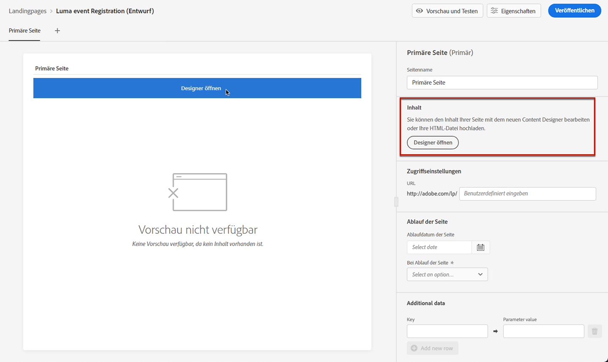

Von dort aus haben Sie folgende Möglichkeiten:

* **Landingpage von Grund auf neu gestalten** über die Benutzeroberfläche des Inhaltsdesigners und die Verwendung von Bildern aus [Adobe Experience Manager Assets Essentials](../assets-essentials.md). Erfahren Sie, wie Sie Inhalte erstellen oder integrierte Vorlagen verwenden. [in diesem Abschnitt](../create-email-content.md).

* **Rohes HTML kodieren oder einfügen** direkt in den Inhaltsdesigner. Erfahren Sie [in diesem Abschnitt](../existing-content.md#import-raw-html-code), wie Sie Ihren eigenen Inhalt kodieren.

* **Importieren Sie vorhandenen HTML-Inhalt** aus einer Datei oder einem .zip-Ordner. Erfahren Sie, wie Sie Inhalte importieren [in diesem Abschnitt](../existing-content.md#import-html-content-from-file).

>[!NOTE]
>
>Der Inhaltseditor für Landingpages ähnelt größtenteils dem E-Mail-Designer. Weitere Informationen finden Sie unter [Inhaltserstellung mit [!DNL Journey Optimizer]](../design-emails.md).

## Landingpage-spezifischen Inhalt definieren {#define-lp-specific-content}

Gehen Sie wie folgt vor, um bestimmte Inhalte zu definieren, mit denen Benutzer ihre Auswahl auf Ihrer Landingpage festlegen und übermitteln können.

1. Ziehen Sie die Landingpage-spezifische **[!UICONTROL Formular]** -Komponente aus der linken Palette in den Hauptarbeitsbereich.

   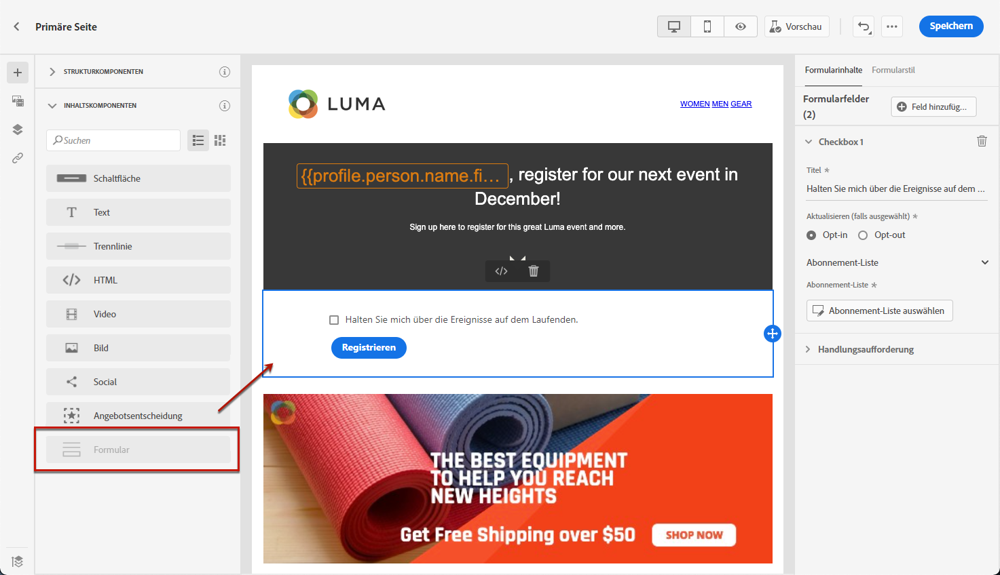

   >[!NOTE]
   >
   >Die **[!UICONTROL Formular]** -Komponente kann nur einmal auf derselben Seite verwendet werden.

1. Wählen Sie sie aus. Die **[!UICONTROL Formularinhalt]** in der rechten Palette angezeigt, damit Sie die verschiedenen Formularfelder bearbeiten können.

   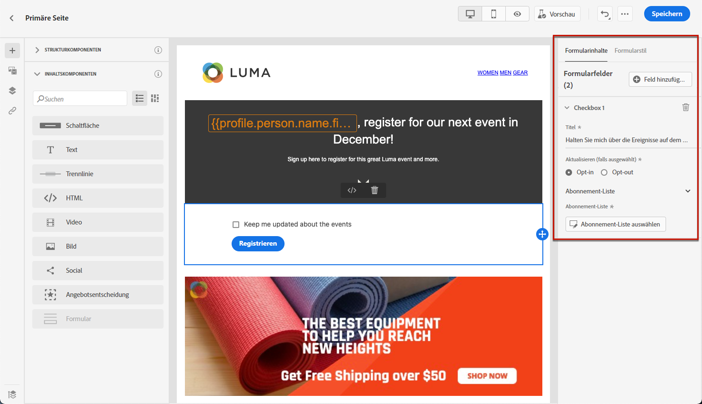

   >[!NOTE]
   >
   >Wechseln Sie zu **[!UICONTROL Formularstil]** jederzeit zum Bearbeiten der Stile des Formularkomponenteninhalts. [Weitere Informationen](#define-lp-styles)

1. Aus dem **[!UICONTROL Kontrollkästchen 1]** können Sie den Titel bearbeiten, der diesem Kontrollkästchen entspricht.

1. Definieren Sie, ob dieses Kontrollkästchen Benutzern das Ein- und Ausschließen ermöglicht: Sind sie damit einverstanden, Nachrichten zu erhalten oder bitten sie darum, nicht mehr kontaktiert zu werden?

   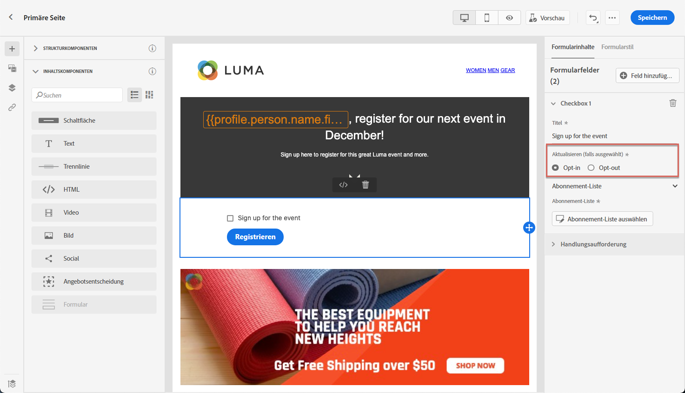

1. Wählen Sie aus, was zwischen den drei folgenden Optionen aktualisiert werden soll:

   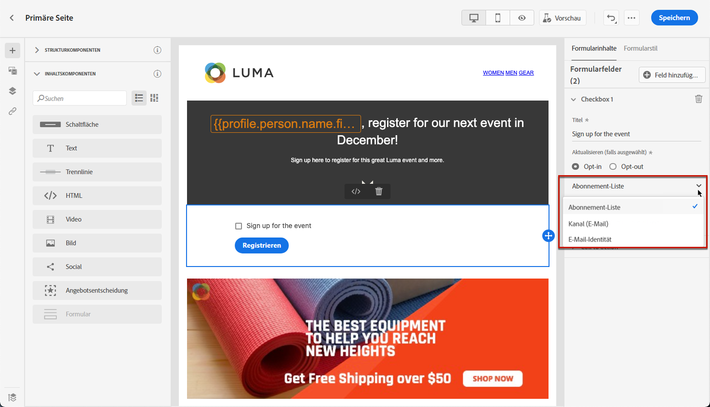

   * **[!UICONTROL Abonnementliste]**: Sie müssen die Abonnementliste auswählen, die aktualisiert wird, wenn das Profil dieses Kontrollkästchen aktiviert. Weitere Informationen finden Sie unter [Abonnementlisten](subscription-list.md).

      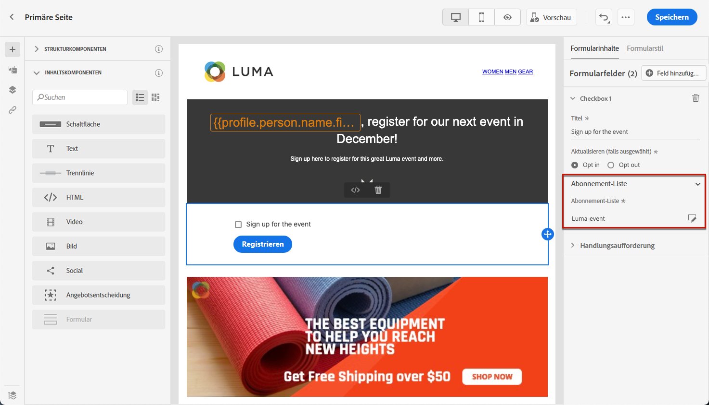

   * **[!UICONTROL Kanal (E-Mail)]**: Das Opt-in- oder Opt-out-Verfahren gilt für den gesamten Kanal. Wenn beispielsweise ein Profil, das sich abmeldet, zwei E-Mail-Adressen hat, werden beide Adressen aus all Ihrer Kommunikation ausgeschlossen.

   * **[!UICONTROL Email-Identität]**: Das Opt-in- oder Opt-out-Verfahren gilt nur für die E-Mail-Adresse, die für den Zugriff auf die Landingpage verwendet wurde. Wenn beispielsweise ein Profil zwei E-Mail-Adressen hat, erhält nur die für die Anmeldung verwendete E-Mail-Adresse Nachrichten von Ihrer Marke.

1. Klicken **[!UICONTROL Feld hinzufügen]** > **[!UICONTROL Kontrollkästchen]** , um ein weiteres Kontrollkästchen hinzuzufügen. Wiederholen Sie die obigen Schritte, um die Eigenschaften zu definieren.

   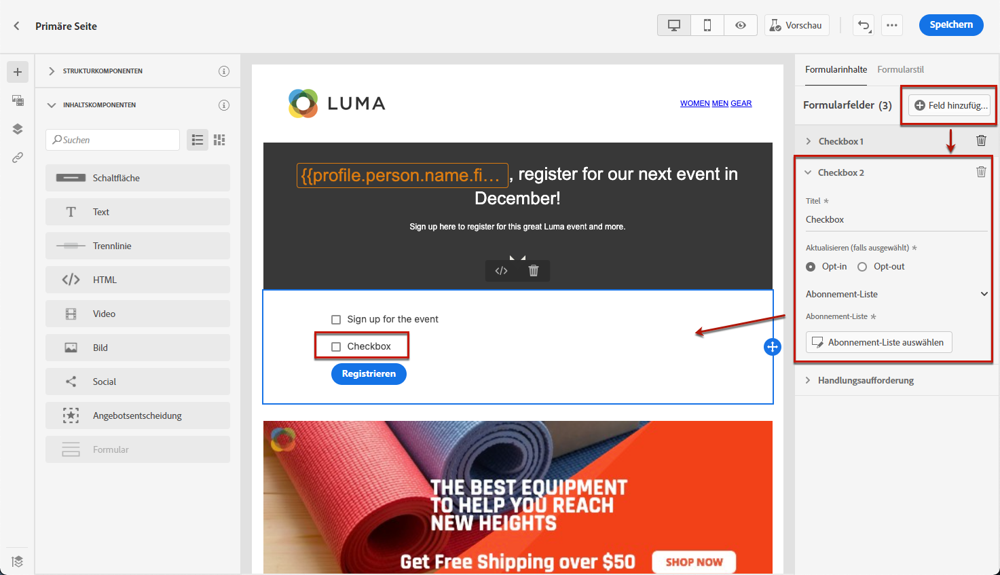

1. Nachdem Sie alle gewünschten Kontrollkästchen hinzugefügt haben, klicken Sie auf **[!UICONTROL Aktionsaufruf]** um den entsprechenden Abschnitt zu erweitern. Damit können Sie das Verhalten der Schaltfläche im **[!UICONTROL Formular]** -Komponente.

   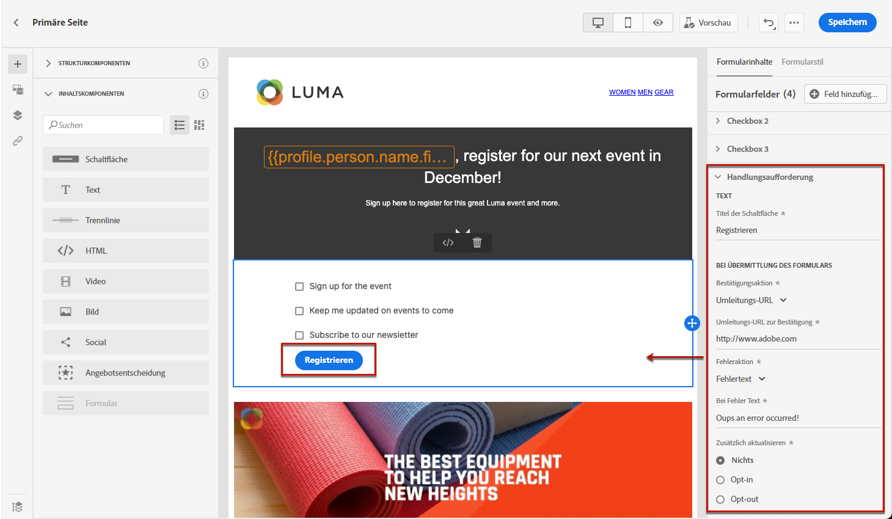

1. Definieren Sie, was beim Klicken auf die Schaltfläche passieren soll:

   * **[!UICONTROL Umleitungs-URL]**: Geben Sie die URL der Seite ein, zu der die Benutzer umgeleitet werden.
   * **[!UICONTROL Bestätigungstext]**: Geben Sie den Bestätigungstext ein, der angezeigt werden soll.
   * **[!UICONTROL Link zu einer Unterseite]**: Konfigurieren Sie eine [subpage](create-lp.md#configure-subpages) und wählen Sie sie aus der angezeigten Dropdownliste aus.

   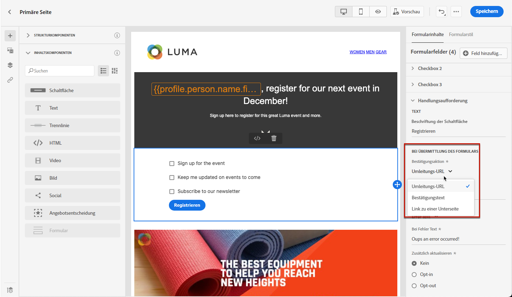

1. Definieren Sie, was beim Klicken auf die Schaltfläche passieren soll, falls ein Fehler auftritt:

   * **[!UICONTROL Umleitungs-URL]**: Geben Sie die URL der Seite ein, zu der die Benutzer umgeleitet werden.
   * **[!UICONTROL Fehlertext]**: Geben Sie den Fehlertext ein, der angezeigt werden soll. Beim Definieren der [Formularstile](#define-lp-styles).

   * **[!UICONTROL Link zu einer Unterseite]**: Konfigurieren Sie eine [subpage](create-lp.md#configure-subpages) und wählen Sie sie aus der angezeigten Dropdownliste aus.

   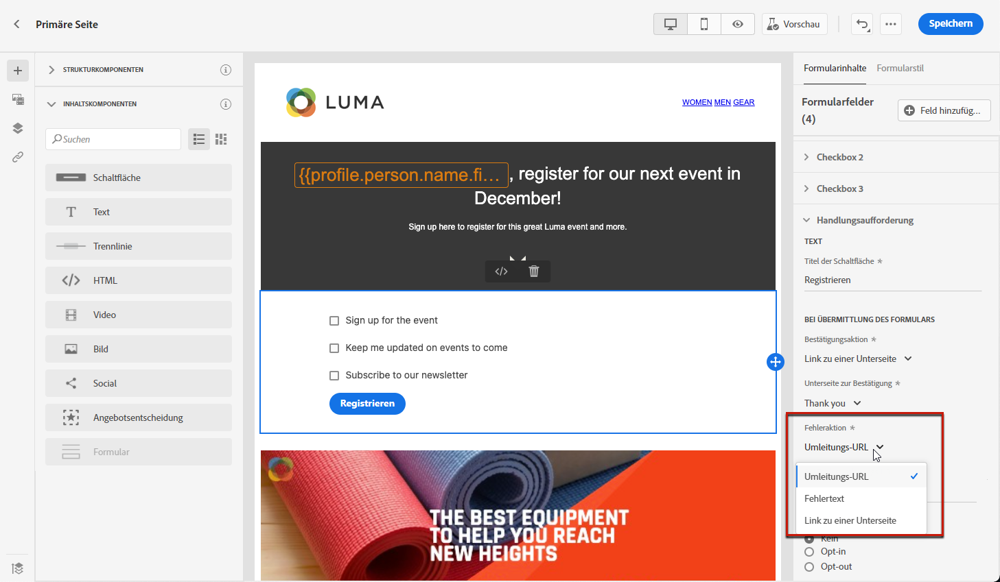

1. Wenn Sie beim Senden des Formulars zusätzliche Aktualisierungen vornehmen möchten, wählen Sie **[!UICONTROL Opt-in]** oder **[!UICONTROL Opt-out]** und definieren Sie, ob Sie eine Abonnementliste, den Kanal oder nur die verwendete E-Mail-Adresse aktualisieren möchten.

   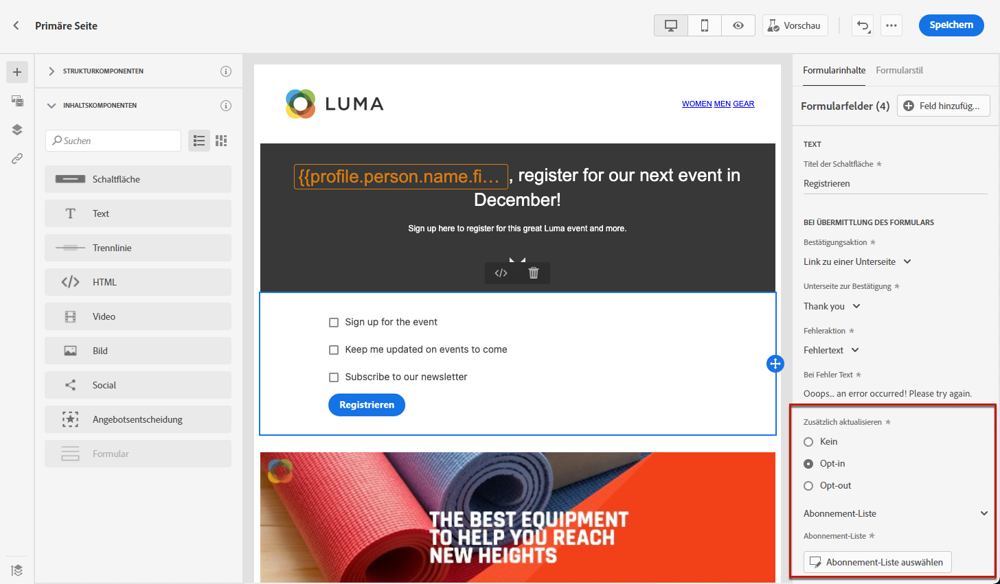

1. Speichern Sie den Inhalt und klicken Sie auf den Pfeil neben dem Seitennamen, um zum Abschnitt [Landingpage-Eigenschaften](create-lp.md#configure-primary-page).

   

<!--Will the name Email Designer be kept if you can also design LP with the same tool? > To modify in Messages section > content designer or Designer-->

## Formularstile für Landingpages definieren {#define-lp-styles}

1. Um die Stile Ihres Formularkomponenteninhalts zu ändern, wechseln Sie jederzeit zum **[!UICONTROL Formularstil]** Registerkarte.

   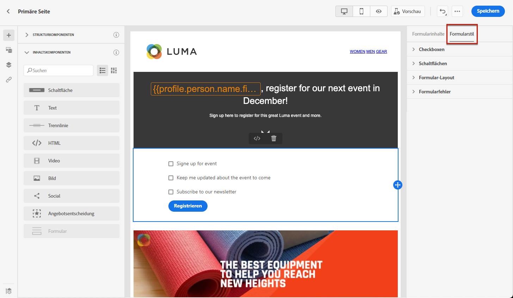

1. Erweitern Sie die **[!UICONTROL Kontrollkästchen]** -Abschnitt, um das Erscheinungsbild der Kontrollkästchen und des entsprechenden Texts zu definieren. Sie können beispielsweise die Schriftfamilie oder -größe und die Rahmenfarbe des Kontrollkästchens anpassen.

   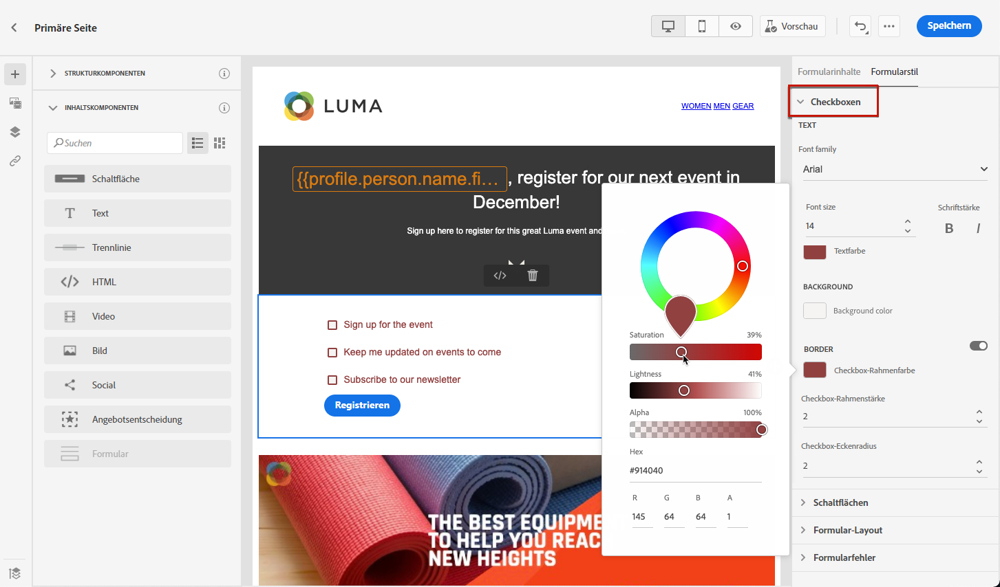

1. Erweitern Sie die **[!UICONTROL Schaltflächen]** -Abschnitt, um das Erscheinungsbild der Schaltfläche im Komponentenformular zu ändern. Sie können beispielsweise einen Rahmen hinzufügen, die Beschriftungsfarbe beim Bewegen des Mauszeigers bearbeiten oder die Ausrichtung der Schaltfläche anpassen.

   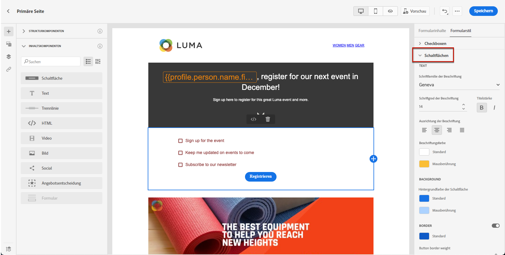

   Sie können einige Ihrer Einstellungen in der Vorschau anzeigen, z. B. die Farbe der Schaltflächenbeschriftung beim Bewegen des Mauszeigers, indem Sie die **[!UICONTROL Vorschau]** Schaltfläche. Weitere Informationen zum Testen von Landingpages [here](create-lp.md#test).

   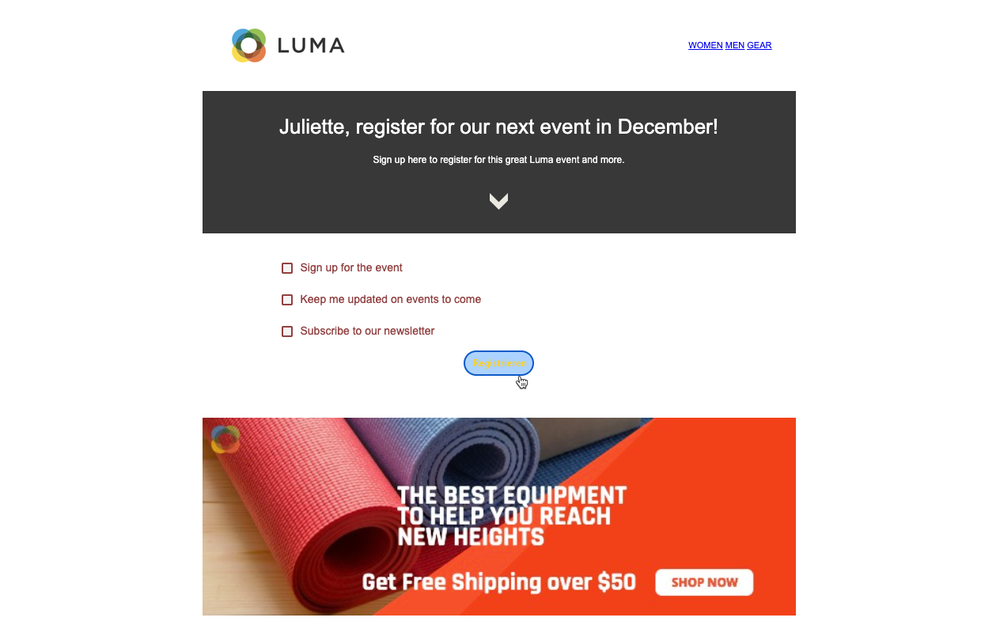

1. Erweitern Sie die **[!UICONTROL Formularlayout]** um die Layouteinstellungen wie die Hintergrundfarbe, den Abstand oder den Rand zu bearbeiten.

   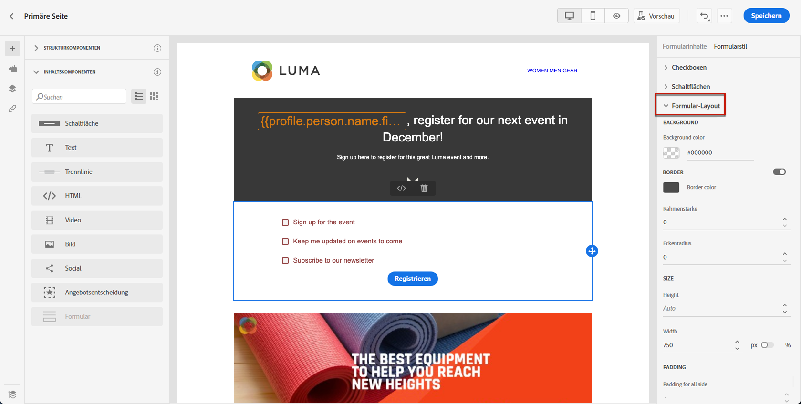

1. Erweitern Sie die **[!UICONTROL Formularfehler]** -Abschnitt, um die Anzeige der Fehlermeldung anzupassen, die im Falle eines Problems angezeigt wird. Aktivieren Sie die entsprechende Option, um den Fehlertext im Formular in der Vorschau anzuzeigen.

   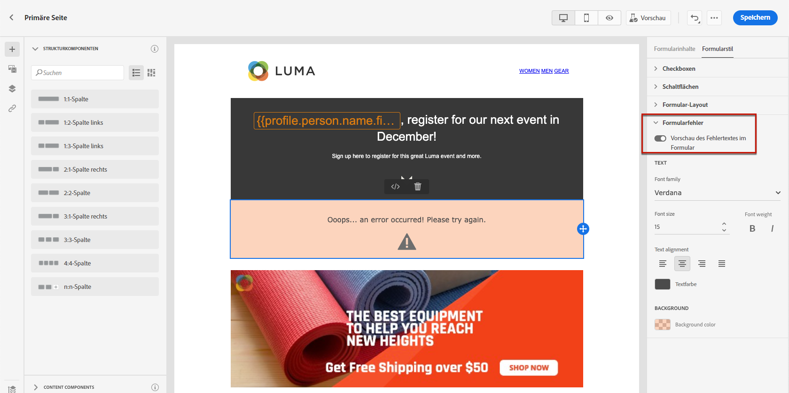

