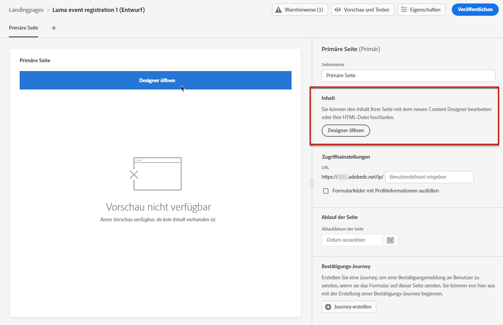

# Erstellen der Landingpage-Inhalte {#design-lp}

Um Inhalte für die [Primärseite](create-lp.md#configure-primary-page) oder [Unterseite](create-lp.md#configure-subpages) Ihrer Landingpage zu erstellen, bewegen Sie den Mauszeiger über die Seiteninhalte und klicken Sie auf **[!UICONTROL Designer öffnen]**. Sie können auch in der rechten Palette auf die entsprechende Schaltfläche klicken.

Dort haben Sie folgende Möglichkeiten:

* **Entwerfen Sie Ihre Landingpage von Grund auf** über die Benutzeroberfläche des E-Mail-Designers und nutzen Sie Bilder aus [Adobe Experience Manager Assets](../integrations/assets.md). Um zu erfahren, wie Sie Inhalte entwerfen <!--or use built-in templates-->, lesen Sie [diesen Abschnitt](../email/content-from-scratch.md).

* **Generieren Sie Inhalte mit dem KI-Assistenten**, um die Erstellung von Landingpages mit KI-generierten Texten und Bildern zu beschleunigen. [Weitere Informationen zum KI-Assistenten](../content-management/generative-full-content.md).

* **Codieren Sie oder fügen Sie rohen HTML-Code** direkt in Content Designer ein. Erfahren Sie [in diesem Abschnitt](../email/code-content.md), wie Sie Ihren eigenen Inhalt codieren.

* **Importieren Sie vorhandenen HTML-Inhalt** aus einer Datei oder einem .zip-Ordner. [In diesem Abschnitt](../email/existing-content.md) erfahren Sie, wie Sie Inhalte importieren.

* **Verwenden Sie eine gespeicherte Landingpage-Vorlage**, die in [!DNL Journey Optimizer] erstellt wurde. [Weitere Informationen](lp-templates.md)

Sobald Sie sich im Inhalts-Designer für Landingpages befinden, können Sie dieselben Komponenten wie für eine E-Mail verwenden und Landingpage-spezifische Inhalte mithilfe der Formularkomponente definieren. [Weitere Informationen](lp-content.md)

>[!NOTE]
>
>Der Content-Designer für Landingpages ähnelt dem E-Mail-Designer größtenteils. Weitere Informationen finden Sie unter [Inhaltserstellung mit [!DNL Journey Optimizer]](../email/get-started-email-design.md).
>
>Die [EU-Richtlinie zur Barrierefreiheit](https://eur-lex.europa.eu/legal-content/DE/TXT/?uri=CELEX%3A32019L0882){target="_blank"} legt fest, dass jegliche digitale Kommunikation barrierefrei sein sollte. Beachten Sie beim Erstellen von Inhalten in [!DNL Journey Optimizer] die konkreten Richtlinien [auf dieser Seite](../email/accessible-content.md).
