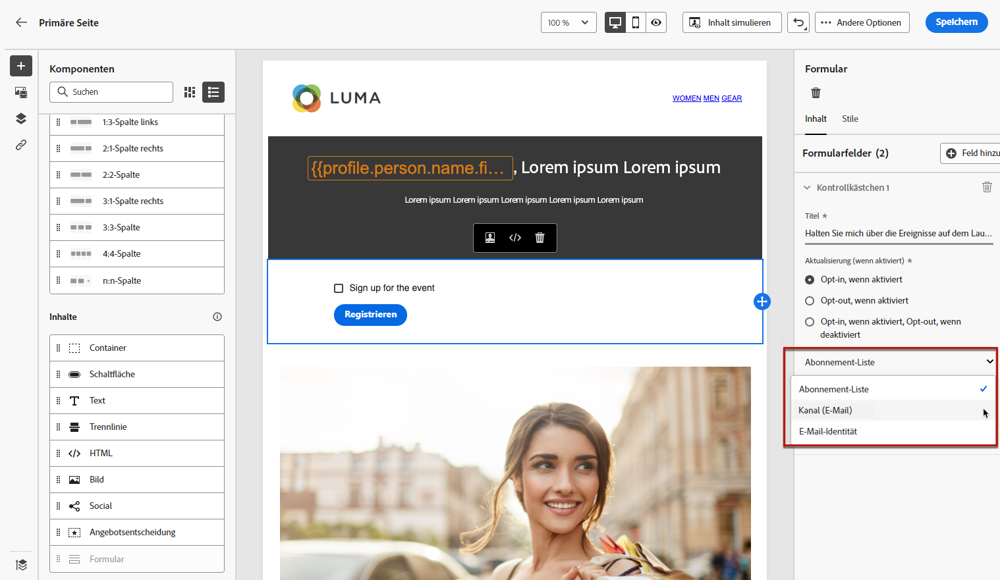
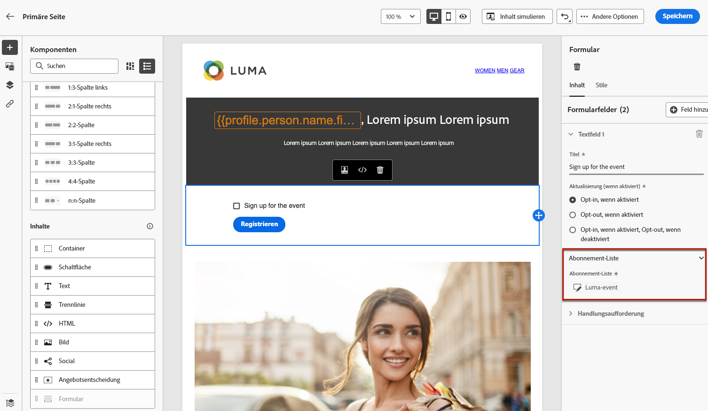
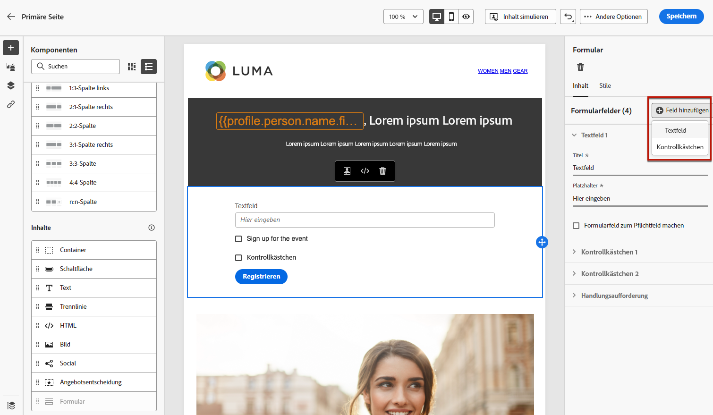
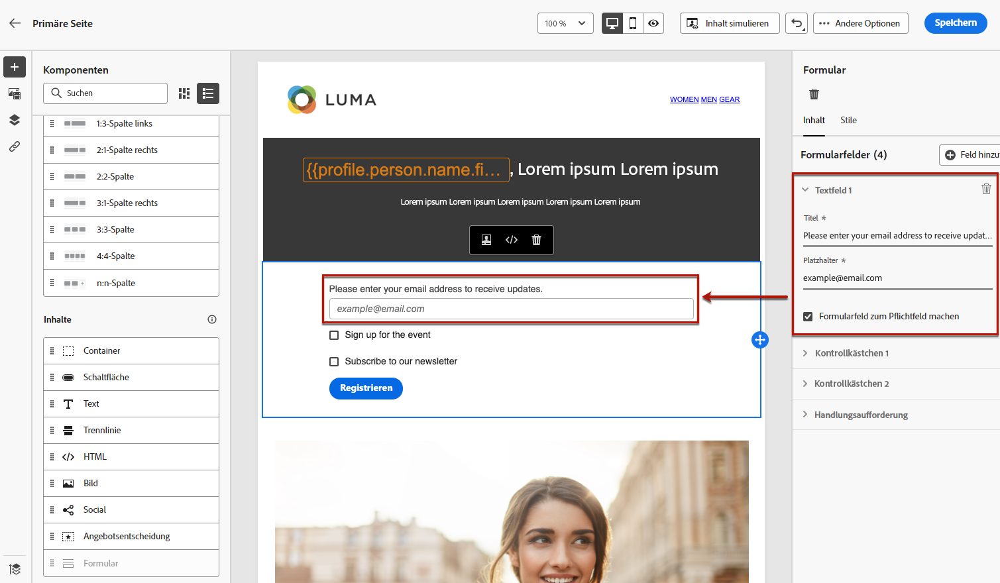
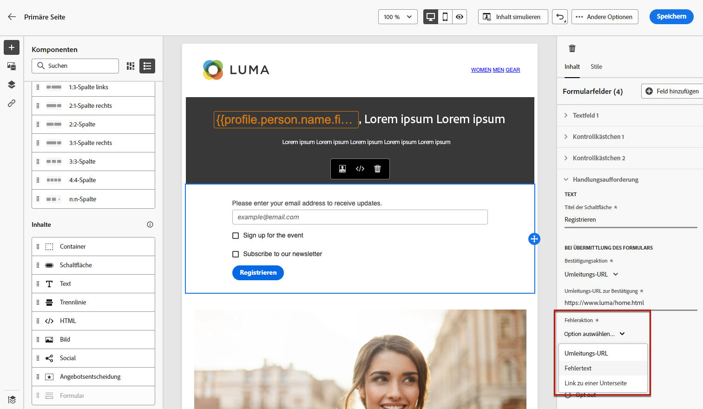
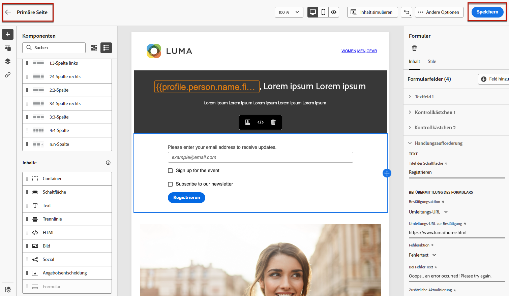
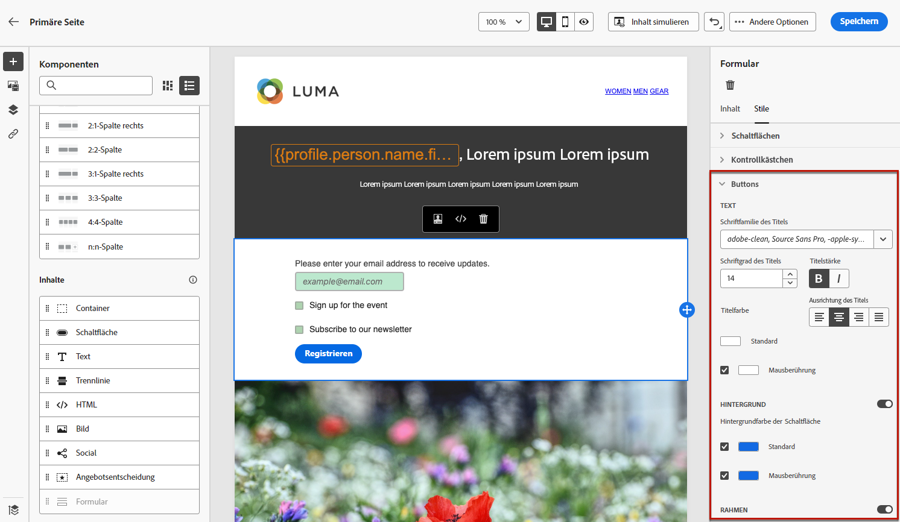
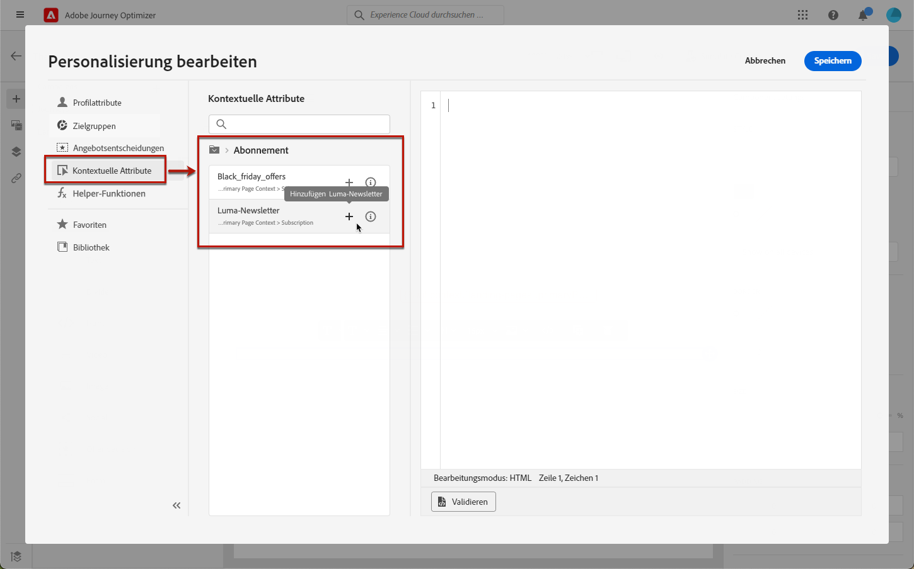
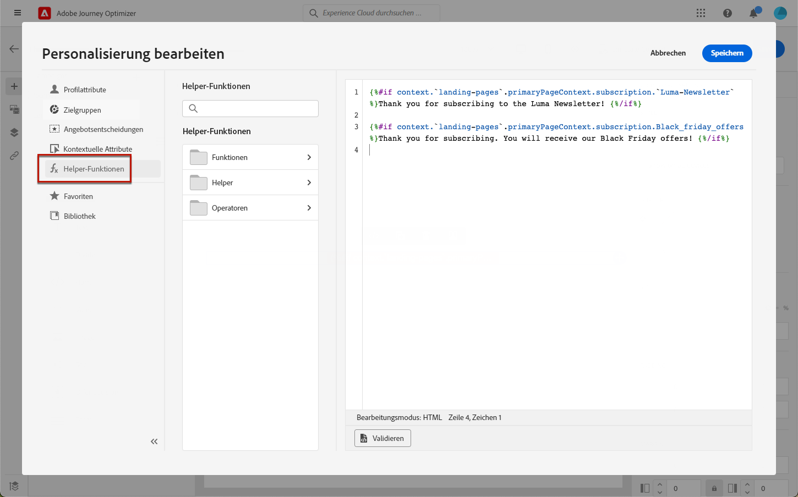

# Definieren von Landingpage-spezifischen Inhalten {#lp-content}

>[!CONTEXTUALHELP]
>id="ac_lp_components"
>title="Verwenden von Inhaltskomponenten"
>abstract="Inhaltskomponenten sind leere Platzhalter für Inhalte, mit denen Sie das Layout einer Landingpage erstellen können. Um spezifische Inhalte zu definieren, die es Benutzenden ermöglichen, ihre Auswahl zu treffen und abzusenden, können Sie die Formularkomponente nutzen."
>additional-url="https://experienceleague.adobe.com/docs/journey-optimizer/using/email/design-email/add-content/content-components.html?lang=de#add-content-components" text="Hinzufügen von Inhaltskomponenten"

Um den Inhalt Ihrer Landingpage zu entwerfen, können dieselben Komponenten wie für eine E-Mail verwendet werden. [Weitere Informationen](../email/content-components.md#add-content-components)

Um spezifische Inhalte zu entwerfen, mit denen Benutzende ihre Auswahl treffen und übermitteln können, können Sie die [Formularkomponente nutzen](#use-form-component) und ihre [Landingpage-spezifischen Stile](#lp-form-styles) definieren.

>[!NOTE]
>
>Sie können auch eine Clickthrough-Landingpage ohne **[!UICONTROL Formular]**-Komponente erstellen. In diesem Fall wird die Landingpage Benutzern angezeigt, sie müssen jedoch kein Formular absenden. Dies kann nützlich sein, wenn Sie nur eine Landingpage präsentieren möchten, ohne eine Aktion, wie beispielsweise ein Opt-in oder Opt-out, von Ihren Empfängern zu verlangen, oder wenn Sie Informationen bereitstellen möchten, die keine Benutzereingabe erfordern.

Mit dem Inhaltseditor für Landingpages können auch kontextbezogene Daten aus der Primärseite einer Unterseite genutzt werden. [Weitere Informationen](#use-primary-page-context)

## Verwenden der Formularkomponente {#use-form-component}

>[!CONTEXTUALHELP]
>id="ac_lp_formfield"
>title="Festlegen der Formularkomponentenfelder"
>abstract="Hier kann definiert werden, wie die Empfängerinnen und Empfänger ihre Auswahl auf der Landingpage sehen und übermitteln."
>additional-url="https://experienceleague.adobe.com/docs/journey-optimizer/using/landing-pages/landing-pages-design/lp-content.html?lang=de#p-form-styles" text="Definieren von Formularstilen für Landingpages"

>[!CONTEXTUALHELP]
>id="ac_lp_submission"
>title="Effekt der Schaltfläche"
>abstract="Es kann definiert werden, was beim Senden des Landingpage-Formulars durch Benutzende geschehen soll."

Um spezifische Inhalte zu definieren, die es den Benutzenden ermöglichen, eine Auswahl auf der Landingpage zu treffen und zu übermitteln, kann die **[!UICONTROL Formular-Komponente]** verwendet werden. Gehen Sie dazu wie folgt vor.

1. Ziehen Sie die Landingpage-spezifische **[!UICONTROL Formular]**-Komponente aus der linken Palette in den Hauptarbeitsbereich.

   

   >[!NOTE]
   >
   >Die **[!UICONTROL Formular]**-Komponente kann auf einer Seite nur einmal verwendet werden.

1. Wählen Sie sie aus. Die Registerkarte **[!UICONTROL Formularinhalt]** wird in der rechten Palette angezeigt, damit Sie die verschiedenen Felder des Formulars bearbeiten können.

   

   >[!NOTE]
   >
   >Wechseln Sie zu **[!UICONTROL Stile]** jederzeit zum Bearbeiten der Stile des Formularkomponenteninhalts. [Weitere Informationen](#define-lp-styles)

1. Im Abschnitt **[!UICONTROL Kontrollkästchen 1]** können Sie den Titel bearbeiten, der diesem Kontrollkästchen entspricht.

1. Definieren Sie, ob dieses Kontrollkästchen Benutzern die An- oder Abmeldung ermöglichen soll: Erklären sie sich damit einverstanden, Nachrichten zu erhalten, oder möchten sie nicht mehr kontaktiert werden?

   

   Wählen Sie unter den drei folgenden Optionen eine aus:

   * **[!UICONTROL Opt-out, wenn aktiviert]**: Benutzer müssen das Kontrollkästchen markieren, um ihre Zustimmung zu erteilen (Opt-in).
   * **[!UICONTROL Opt-out, wenn markiert]**: Benutzer müssen das Kontrollkästchen markieren, um ihre Zustimmung zu entfernen (Opt-out).
   * **[!UICONTROL Opt-in, wenn aktiviert, Opt-out, wenn deaktiviert]**: Mit dieser Option können Sie ein einziges Kontrollkästchen für das Opt-in/Opt-out einfügen. Benutzer müssen das Kontrollkästchen aktivieren, um ihr Einverständnis zu erteilen (Opt-in), und es deaktivieren, um ihr Einverständnis zurückzuziehen (Opt-out).

1. Wählen Sie aus den drei folgenden Optionen aus, was aktualisiert werden soll:

   

   * **[!UICONTROL Abonnement-Liste]**: Sie müssen die Abonnement-Liste auswählen, die aktualisiert wird, wenn das Profil dieses Kontrollkästchen aktiviert. Weitere Informationen finden Sie unter [Abonnement-Listen](subscription-list.md).

      <!---->

   * **[!UICONTROL Kanal (E-Mail)]**: Die An- oder Abmeldung gilt für den gesamten Kanal. Wenn beispielsweise ein Profil, das sich abgemeldet hat, zwei E-Mail-Adressen hat, werden beide Adressen aus Ihrer gesamten Kommunikation ausgeschlossen.

   * **[!UICONTROL E-Mail-Identität]**: Das Opt-in oder Opt-out gilt nur für die E-Mail-Adresse, die für den Zugriff auf die Landingpage verwendet wurde. Wenn beispielsweise ein Profil zwei E-Mail-Adressen hat, erhält nur diejenige E-Mail-Adresse, mit der es sich angemeldet hat, Nachrichten von Ihrer Marke.

1. Klicken Sie auf **[!UICONTROL Feld hinzufügen]** > **[!UICONTROL Kontrollkästchen]**, um ein weiteres Kontrollkästchen hinzuzufügen. Wiederholen Sie die obigen Schritte, um die Eigenschaften zu definieren.

   

1. Sie können auch ein **[!UICONTROL Textfeld]** hinzufügen.

   

   * Geben Sie den **[!UICONTROL Titel]** ein, der über dem Feld im Formular angezeigt wird.

   * Geben Sie einen **[!UICONTROL Platzhalter]**-Text ein. Dieser wird innerhalb des Felds angezeigt, bevor die Benutzerin oder der Benutzer das Feld ausfüllt.

   * Aktivieren Sie bei Bedarf die Option **[!UICONTROL Formularfeld obligatorisch machen]**. In diesem Fall kann das Formular der Landingpage nur gesendet werden, wenn der Benutzer dieses Feld ausgefüllt hat. Wenn ein Pflichtfeld nicht ausgefüllt wurde, erscheint eine Fehlermeldung, wenn der Benutzer das Formular sendet.

   

1. Nachdem Sie alle gewünschten Kontrollkästchen und/oder Textfelder hinzugefügt haben, klicken Sie auf **[!UICONTROL Handlungsaufforderung]**, um den entsprechenden Abschnitt zu erweitern. Damit können Sie das Verhalten der Schaltfläche in der **[!UICONTROL Formular]**-Komponente definieren.

   

1. Definieren Sie, was beim Klicken auf die Schaltfläche passieren soll:

   * **[!UICONTROL Umleitungs-URL]**: Geben Sie die URL der Seite ein, zu der die Benutzer umgeleitet werden.
   * **[!UICONTROL Bestätigungstext]**: Geben Sie den Bestätigungstext ein, der angezeigt werden soll.
   * **[!UICONTROL Link zu einer Unterseite]**: Konfigurieren Sie eine [Unterseite](create-lp.md#configure-subpages) und wählen Sie sie aus der angezeigten Dropdown-Liste aus.

   

1. Definieren Sie, was beim Klicken auf die Schaltfläche passieren soll, falls ein Fehler auftritt:

   * **[!UICONTROL Umleitungs-URL]**: Geben Sie die URL der Seite ein, zu der die Benutzer umgeleitet werden.
   * **[!UICONTROL Fehlertext]**: Geben Sie den Fehlertext ein, der angezeigt werden soll. Beim Definieren der [Formularstile](#define-lp-styles) können Sie sich eine Vorschau des Fehlertexts ansehen.

   * **[!UICONTROL Link zu einer Unterseite]**: Konfigurieren Sie eine [Unterseite](create-lp.md#configure-subpages) und wählen Sie sie aus der angezeigten Dropdown-Liste aus.

   

1. Wenn Sie beim Senden des Formulars zusätzliche Aktualisierungen vornehmen möchten, wählen Sie **[!UICONTROL Opt-in]** oder **[!UICONTROL Opt-out]** und definieren Sie, ob Sie eine Abonnementliste, den Kanal oder nur die verwendete E-Mail-Adresse aktualisieren möchten.

   

1. Speichern Sie die Inhalte und klicken Sie auf den Pfeil neben dem Seitennamen, um zurück zum Abschnitt [Landingpage-Eigenschaften](create-lp.md#configure-primary-page) zu gelangen.

   

## Definieren von Formularstilen für Landingpages {#lp-form-styles}

1. Um die Stile Ihres Formularkomponenteninhalts zu ändern, wechseln Sie jederzeit zum **[!UICONTROL Stil]** Registerkarte.

   

1. Die **[!UICONTROL Felder]** standardmäßig erweitert und ermöglicht es Ihnen, das Erscheinungsbild des Textfelds zu bearbeiten, z. B. die Beschriftung und Platzhalterschrift, die Position der Beschriftung, die Hintergrundfarbe des Felds oder den Feldrand.

   

1. Erweitern Sie den Abschnitt **[!UICONTROL Kontrollkästchen]**, um das Erscheinungsbild der Kontrollkästchen und des entsprechenden Texts zu definieren. Sie können beispielsweise die Schriftfamilie, die Schriftgröße oder die Rahmenfarbe des Kontrollkästchens anpassen.

   

1. Erweitern Sie den Abschnitt **[!UICONTROL Schaltflächen]**, um das Erscheinungsbild der Schaltfläche im Komponentenformular zu ändern. Sie können beispielsweise die Schriftart ändern, einen Rahmen hinzufügen, die Beschriftungsfarbe beim Bewegen des Mauszeigers bearbeiten oder die Ausrichtung der Schaltfläche anpassen.

   

   Sie können einige Ihrer Einstellungen in der Vorschau anzeigen, z. B. die Farbe der Schaltflächenbeschriftung beim Bewegen des Mauszeigers, indem Sie die **[!UICONTROL Inhalt simulieren]** Schaltfläche. Weitere Informationen zum Testen von Landingpages finden Sie [hier](create-lp.md#test-landing-page).

   <!---->

1. Erweitern Sie den Abschnitt **[!UICONTROL Formular-Layout]**, um die Layout-Einstellungen wie die Hintergrundfarbe, den Abstand oder den Rand zu bearbeiten.

   

1. Erweitern Sie den Abschnitt **[!UICONTROL Formularfehler]**, um die Fehlermeldung anzupassen, die im Falle eines Problems angezeigt wird. Klicken Sie die entsprechende Option an, um den Fehlertext im Formular in der Vorschau anzuzeigen.

   

## Verwenden des primären Seitenkontexts {#use-primary-page-context}

Sie können kontextuelle Daten verwenden, die von einer anderen Seite innerhalb derselben Landingpage stammen.

Wenn Sie zum Beispiel ein Kontrollkästchen<!-- or the submission of the page--> mit einer [Abonnementliste](subscription-list.md) auf der primären Landingpage verknüpfen, können Sie diese Abonnementliste auf der Unterseite „Vielen Dank“ verwenden.

Angenommen, Sie verknüpfen zwei Kontrollkästchen auf Ihrer primären Seite mit zwei verschiedenen Abonnementlisten. Wenn ein Benutzer eine dieser Listen abonniert, möchten Sie beim Absenden des Formulars eine bestimmte Nachricht anzeigen, je nachdem, welches Kästchen die Person ausgewählt hat.

Gehen Sie dazu wie folgt vor:

1. Auf der Primärseite wird jedes Kontrollkästchen der **[!UICONTROL Formular]**-Komponente mit der entsprechenden Abonnement-Liste verknüpft. [Weitere Informationen](#use-form-component).

   

1. Platzieren Sie den Mauszeiger auf der Unterseite an der Stelle, an der Sie den Text einfügen möchten, und wählen Sie in der kontextuellen Symbolleiste **[!UICONTROL Personalisierung hinzufügen]**.

   

1. Im Fenster **[!UICONTROL Personalisierung bearbeiten]** wählen Sie **[!UICONTROL Kontextuelle Attribute]** > **[!UICONTROL Landing Pages]** > **[!UICONTROL Primärer Seitenkontext]** > **[!UICONTROL Abonnement]**.

1. Alle Abonnementlisten, die Sie auf der primären Seite ausgewählt haben, werden aufgelistet. Wählen Sie über das Symbol „+“ die entsprechenden Elemente aus.

   

1. Fügen Sie die entsprechenden Bedingungen über die Hilfsfunktionen des Ausdruckseditors hinzu. [Weitere Informationen](../personalization/functions/functions.md)

   

   >[!CAUTION]
   >
   >Wenn der Ausdruck ein Sonderzeichen wie einen Bindestrich enthält, müssen Sie den Text einschließlich des Bindestrichs mit Escape-Zeichen versehen.

1. Speichern Sie Ihre Änderungen.

Wenn Benutzer jetzt eines der Kontrollkästchen auswählen,

die dem ausgewählten Kontrollkästchen entsprechende Meldung beim Senden des Formulars angezeigt wird.

<!---->

>[!NOTE]
>
>Wenn Benutzende die beiden Kontrollkästchen aktivieren, werden beide Texte angezeigt.

<!--
## Use landing page additional data {#use-additional-data}

When [configuring the primary page](create-lp.md#configure-primary-page), you can create additional data to enable storing information when the landing page is being submitted.

>[!NOTE]
>
>This data may not be visible to users who visit the page.

If you defined one or more keys with their corresponding values when [configuring the primary page](create-lp.md#configure-primary-page), you can leverage these keys in the content of your primary page and subpages using the [Expression editor](../personalization/personalization-build-expressions.md).

///When you reuse the same text on a page, this enables you to dynamically change that text if needed, without going through each occurrence.

For example, if you define the company name as a key, you can quickly update it everywhere (on all the pages of a given landing page) by changing it only once in the [primary page settings](create-lp.md#configure-primary-page).///

To leverage these keys in a landing page, follow the steps below:

1. When configuring the primary page, define a key and its corresponding value in the **[!UICONTROL Additional data]** section. [Learn more](create-lp.md#configure-primary-page)

    

1. When editing your primary page with the designer, place the pointer of your mouse where you want to insert your key and select **[!UICONTROL Add personalization]** from the contextual toolbar.

    

1. In the **[!UICONTROL Edit Personalization]** window, select **[!UICONTROL Contextual attributes]** > **[!UICONTROL Landing Pages]** > **[!UICONTROL Additional Context]**.

    

1. All the keys that you created when configuring the primary page are listed. Select the key of your choice using the + icon.

    

1. Save your changes and repeat the steps above as many times as needed.

    

    You can see that the personalization item corresponding to your key is now displayed everywhere you inserted it.
-->