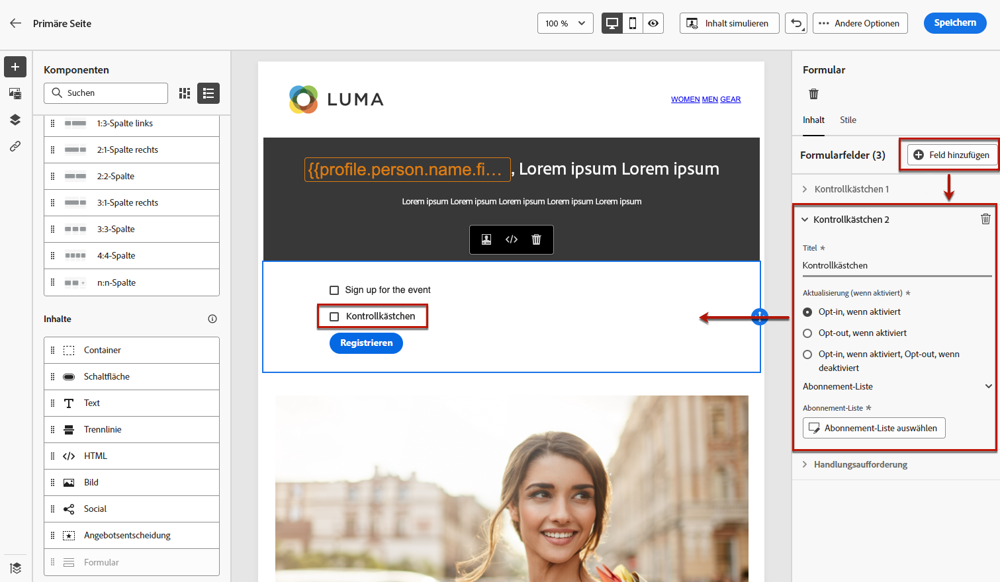
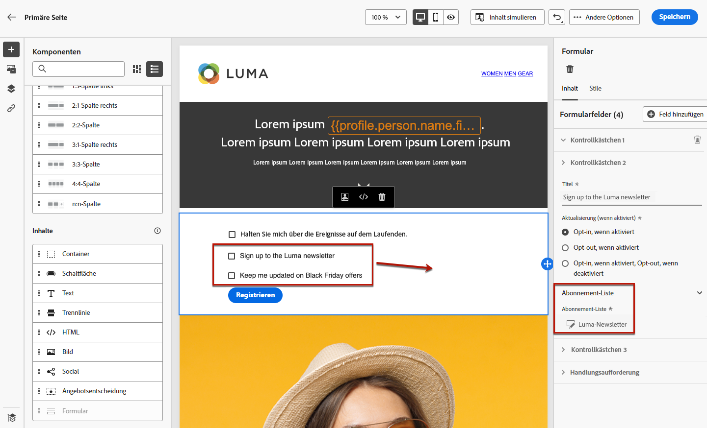
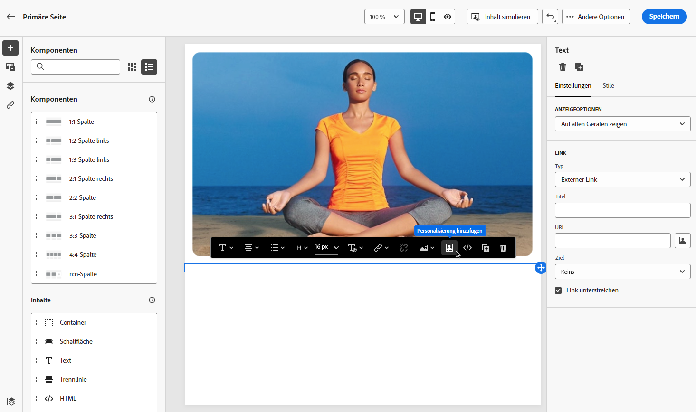
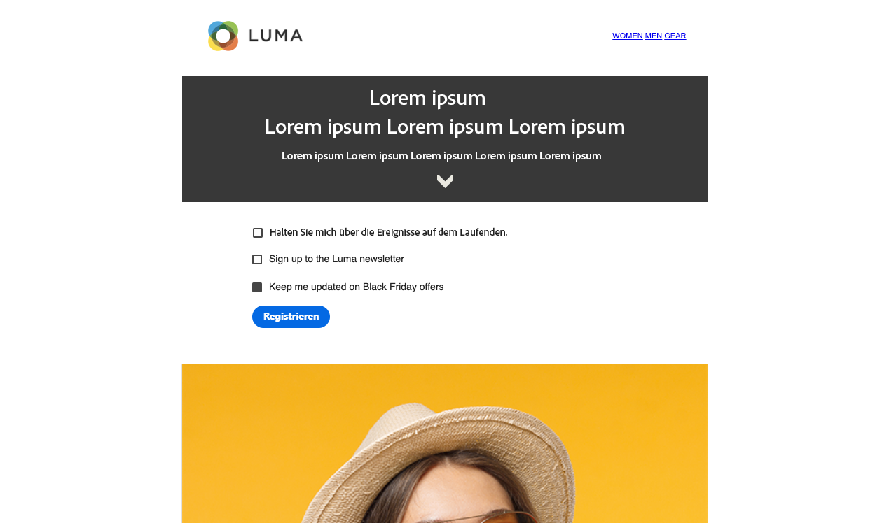
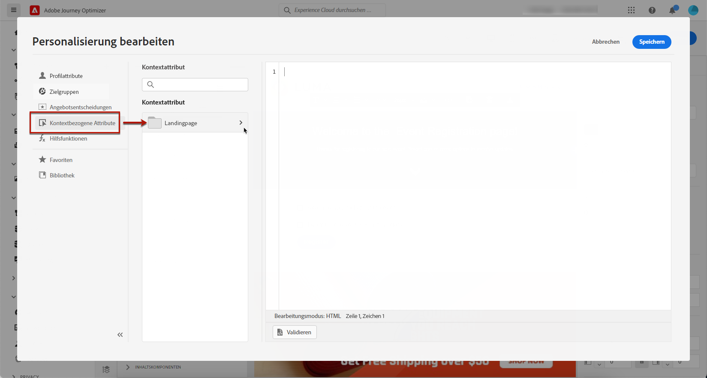
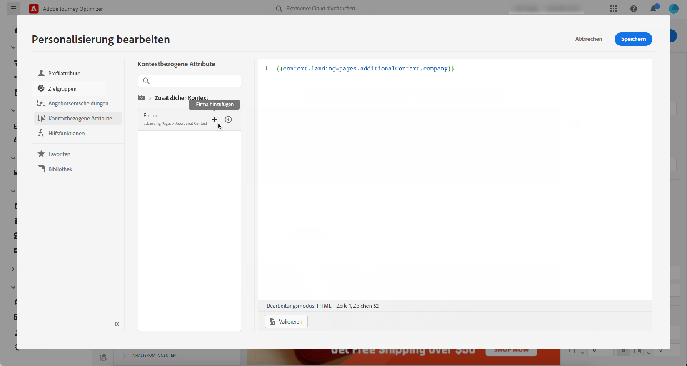
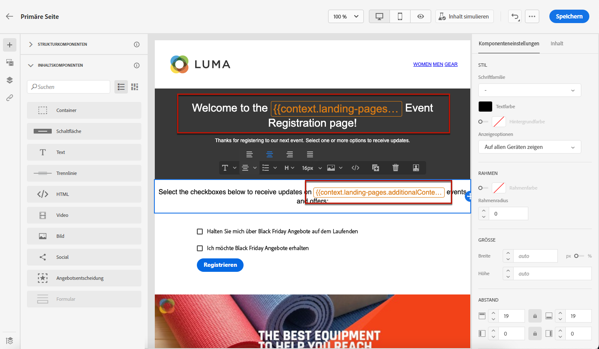

# Landingpage-spezifischen Inhalt definieren {#lp-content}

Um bestimmte Inhalte zu definieren, mit denen Benutzer ihre Auswahl auf Ihrer Landingpage festlegen und unterbreiten können, verwenden Sie das **[!UICONTROL Form]** -Komponente. Gehen Sie dazu wie folgt vor.

>[!NOTE]
>
>Sie können auch eine Clickthrough-Landingpage ohne **[!UICONTROL Form]** -Komponente. In diesem Fall wird die Landingpage Benutzern angezeigt, sie müssen jedoch kein Formular senden. Dies kann nützlich sein, wenn Sie nur eine Landingpage präsentieren möchten, ohne von Ihren Empfängern Maßnahmen zu ergreifen (z. B. Opt-in oder Opt-out) oder Informationen bereitstellen möchten, für die keine Benutzereingabe erforderlich ist.

## Formularkomponente verwenden {#use-form-component}

1. Ziehen Sie die Landingpage-spezifische **[!UICONTROL Form]** -Komponente aus der linken Palette in den Hauptarbeitsbereich.

   

   >[!NOTE]
   >
   >Die **[!UICONTROL Form]** -Komponente kann nur einmal auf derselben Seite verwendet werden.

1. Wählen Sie es aus. Die **[!UICONTROL Form content]** in der rechten Palette angezeigt, damit Sie die verschiedenen Felder des Formulars bearbeiten können.

   

   >[!NOTE]
   >
   >Wechseln Sie zu **[!UICONTROL Form style]** jederzeit zum Bearbeiten der Stile des Formularkomponenteninhalts. [Weitere Infos](#define-lp-styles)

1. Aus dem **[!UICONTROL Checkbox 1]** können Sie den Titel bearbeiten, der diesem Kontrollkästchen entspricht.

1. Definieren Sie, ob dieses Kontrollkästchen Benutzern das Ein- und Ausschließen ermöglicht: Sind sie damit einverstanden, Nachrichten zu erhalten oder bitten sie darum, nicht mehr kontaktiert zu werden?

   

   Wählen Sie unter den drei folgenden Optionen aus:

   * **[!UICONTROL Opt in if checked]**: -Benutzer müssen das Kontrollkästchen aktivieren, um ihre Zustimmung zu erteilen (Opt-in).
   * **[!UICONTROL Opt out if checked]**: -Benutzer müssen das Kontrollkästchen aktivieren, um ihre Zustimmung zu entfernen (Opt-out).
   * **[!UICONTROL Opt in if checked, opt out if unchecked]**: Mit dieser Option können Sie eine einzige Checkbox für das Opt-in/Opt-out einfügen. Benutzer müssen das Kontrollkästchen aktivieren, um zuzustimmen (Opt-in), und es deaktivieren, um ihre Zustimmung zu entfernen (Opt-out).

1. Wählen Sie aus, was zwischen den drei folgenden Optionen aktualisiert werden soll:

   

   * **[!UICONTROL Subscription list]**: Sie müssen die Abonnementliste auswählen, die aktualisiert wird, wenn das Profil dieses Kontrollkästchen aktiviert. Weitere Informationen finden Sie unter [Abonnementlisten](subscription-list.md).

      

   * **[!UICONTROL Channel (email)]**: Das Opt-in- oder Opt-out-Verfahren gilt für den gesamten Kanal. Wenn beispielsweise ein Profil, das sich abmeldet, zwei E-Mail-Adressen hat, werden beide Adressen aus all Ihrer Kommunikation ausgeschlossen.

   * **[!UICONTROL Email identity]**: Das Opt-in- oder Opt-out-Verfahren gilt nur für die E-Mail-Adresse, die für den Zugriff auf die Landingpage verwendet wurde. Wenn beispielsweise ein Profil zwei E-Mail-Adressen hat, erhält nur die für die Anmeldung verwendete E-Mail-Adresse Nachrichten von Ihrer Marke.

1. Klicken **[!UICONTROL Add field]** > **[!UICONTROL Checkbox]** , um ein weiteres Kontrollkästchen hinzuzufügen. Wiederholen Sie die obigen Schritte, um die Eigenschaften zu definieren.

   

1. Nachdem Sie alle gewünschten Kontrollkästchen hinzugefügt haben, klicken Sie auf **[!UICONTROL Call to action]** um den entsprechenden Abschnitt zu erweitern. Damit können Sie das Verhalten der Schaltfläche im **[!UICONTROL Form]** -Komponente.

   

1. Definieren Sie, was beim Klicken auf die Schaltfläche passieren soll:

   * **[!UICONTROL Redirect URL]**: Geben Sie die URL der Seite ein, zu der die Benutzer umgeleitet werden.
   * **[!UICONTROL Confirmation text]**: Geben Sie den Bestätigungstext ein, der angezeigt werden soll.
   * **[!UICONTROL Link to a subpage]**: Konfigurieren Sie eine [subpage](create-lp.md#configure-subpages) und wählen Sie sie aus der angezeigten Dropdownliste aus.

   

1. Definieren Sie, was beim Klicken auf die Schaltfläche passieren soll, falls ein Fehler auftritt:

   * **[!UICONTROL Redirect URL]**: Geben Sie die URL der Seite ein, zu der die Benutzer umgeleitet werden.
   * **[!UICONTROL Error text]**: Geben Sie den Fehlertext ein, der angezeigt werden soll. Beim Definieren der [Formularstile](#define-lp-styles).

   * **[!UICONTROL Link to a subpage]**: Konfigurieren Sie eine [subpage](create-lp.md#configure-subpages) und wählen Sie sie aus der angezeigten Dropdownliste aus.

   

1. Wenn Sie beim Senden des Formulars zusätzliche Aktualisierungen vornehmen möchten, wählen Sie **[!UICONTROL Opt in]** oder **[!UICONTROL Opt out]** und definieren Sie, ob Sie eine Abonnementliste, den Kanal oder nur die verwendete E-Mail-Adresse aktualisieren möchten.

   

1. Speichern Sie den Inhalt und klicken Sie auf den Pfeil neben dem Seitennamen, um zum Abschnitt [Landingpage-Eigenschaften](create-lp.md#configure-primary-page).

   

## Formularstile für Landingpages definieren {#lp-form-styles}

1. Um die Stile Ihres Formularkomponenteninhalts zu ändern, wechseln Sie jederzeit zum **[!UICONTROL Form style]** Registerkarte.

   

1. Erweitern Sie die **[!UICONTROL Checkboxes]** -Abschnitt, um das Erscheinungsbild der Kontrollkästchen und des entsprechenden Texts zu definieren. Sie können beispielsweise die Schriftfamilie oder -größe und die Rahmenfarbe des Kontrollkästchens anpassen.

   

1. Erweitern Sie die **[!UICONTROL Buttons]** -Abschnitt, um das Erscheinungsbild der Schaltfläche im Komponentenformular zu ändern. Sie können beispielsweise einen Rahmen hinzufügen, die Beschriftungsfarbe beim Bewegen des Mauszeigers bearbeiten oder die Ausrichtung der Schaltfläche anpassen.

   

   Sie können einige Ihrer Einstellungen in der Vorschau anzeigen, z. B. die Farbe der Schaltflächenbeschriftung beim Bewegen des Mauszeigers, indem Sie die **[!UICONTROL Preview]** Schaltfläche. Weitere Informationen zum Testen von Landingpages [here](create-lp.md#test-landing-page).

   

1. Erweitern Sie die **[!UICONTROL Form layout]** um die Layouteinstellungen wie die Hintergrundfarbe, den Abstand oder den Rand zu bearbeiten.

   

1. Erweitern Sie die **[!UICONTROL Form error]** -Abschnitt, um die Anzeige der Fehlermeldung anzupassen, die im Falle eines Problems angezeigt wird. Aktivieren Sie die entsprechende Option, um den Fehlertext im Formular in der Vorschau anzuzeigen.

   

## Primärseitenkontext verwenden {#use-primary-page-context}

Sie können Kontextdaten verwenden, die von einer anderen Seite innerhalb derselben Landingpage stammen.

Wenn Sie beispielsweise ein Kontrollkästchen verknüpfen<!-- or the submission of the page--> zu [Abonnementliste](subscription-list.md) auf der primären Landingpage können Sie diese Abonnementliste auf der &quot;Vielen Dank&quot;-Unterseite verwenden.

Angenommen, Sie verknüpfen zwei Kontrollkästchen auf Ihrer primären Seite mit zwei verschiedenen Abonnementlisten. Wenn sich ein Benutzer für eine dieser Optionen anmeldet, möchten Sie beim Senden des Formulars je nach ausgewähltem Kontrollkästchen eine bestimmte Nachricht anzeigen.

Gehen Sie dazu wie folgt vor:

1. Verknüpfen Sie auf der primären Seite jedes Kontrollkästchen mit der entsprechenden Abonnementliste. [Weitere Infos](#use-form-component).

   

1. Platzieren Sie den Mauszeiger auf der Unterseite an der Stelle, an der Sie den Text einfügen möchten, und wählen Sie **[!UICONTROL Add personalization]** in der dedizierten Symbolleiste.

   

1. Im **[!UICONTROL Edit personalization]** auswählen **[!UICONTROL Contextual attributes]** > **[!UICONTROL Landing Pages]** > **[!UICONTROL Primary Page Context]** > **[!UICONTROL Subscription]**.

1. Alle Abonnementlisten, die Sie auf der primären Seite ausgewählt haben, werden aufgelistet. Wählen Sie über das Symbol + die entsprechenden Elemente aus.

   

1. Fügen Sie die relevanten Bedingungen mithilfe der Hilfsfunktionen des Ausdruckseditors hinzu. [Weitere Infos](../personalization/functions/functions.md)

   

   >[!CAUTION]
   >
   >Wenn der Ausdruck ein Sonderzeichen wie einen Bindestrich enthält, müssen Sie den Text einschließlich des Bindestrichs mit Escape-Zeichen versehen.

1. Speichern Sie Ihre Änderungen.

Wenn Benutzer jetzt eines der Kontrollkästchen aktivieren, wird beim Senden des Formulars die dem ausgewählten Kontrollkästchen entsprechende Meldung angezeigt.

>[!NOTE]
>
>Wenn ein Benutzer die beiden Kontrollkästchen aktiviert, werden beide Texte angezeigt.

<!--
## Use landing page additional data {#use-additional-data}

When [configuring the primary page](create-lp.md#configure-primary-page), you can create additional data to enable storing information when the landing page is being submitted.

>[!NOTE]
>
>This data may not be visible to users who visit the page.

If you defined one or more keys with their corresponding values when [configuring the primary page](create-lp.md#configure-primary-page), you can leverage these keys in the content of your primary page and subpages using the [Expression editor](../personalization/personalization-build-expressions.md).

///When you reuse the same text on a page, this enables you to dynamically change that text if needed, without going through each occurrence.

For example, if you define the company name as a key, you can quickly update it everywhere (on all the pages of a given landing page) by changing it only once in the [primary page settings](create-lp.md#configure-primary-page).///

To leverage these keys in a landing page, follow the steps below:

1. When configuring the primary page, define a key and its corresponding value in the **[!UICONTROL Additional data]** section. [Learn more](create-lp.md#configure-primary-page)

    

1. When editing your primary page with the designer, place the pointer of your mouse where you want to insert your key and select **[!UICONTROL Add personalization]** from the contextual toolbar.

    

1. In the **[!UICONTROL Edit Personalization]** window, select **[!UICONTROL Contextual attributes]** > **[!UICONTROL Landing Pages]** > **[!UICONTROL Additional Context]**.

    

1. All the keys that you created when configuring the primary page are listed. Select the key of your choice using the + icon.

    

1. Save your changes and repeat the steps above as many times as needed.

    

    You can see that the personalization item corresponding to your key is now displayed everywhere you inserted it.
-->