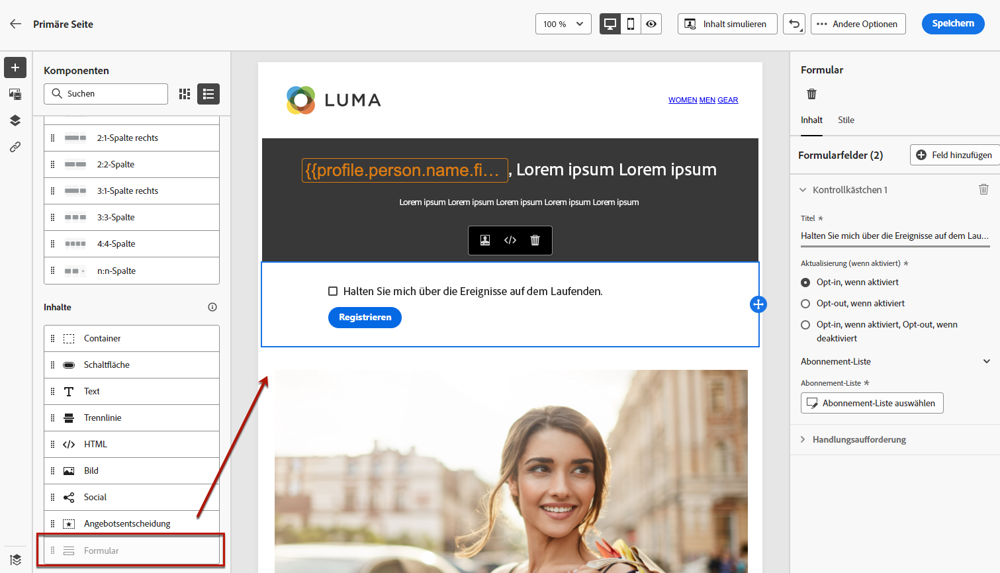
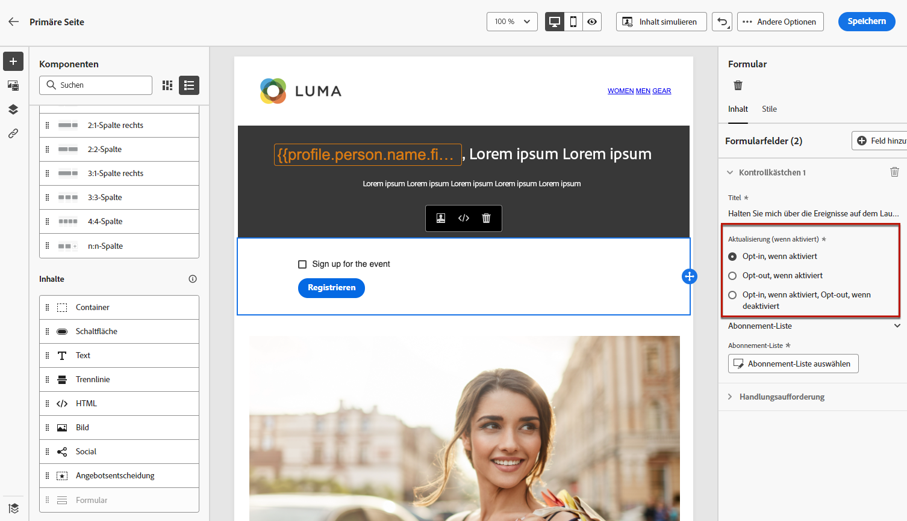
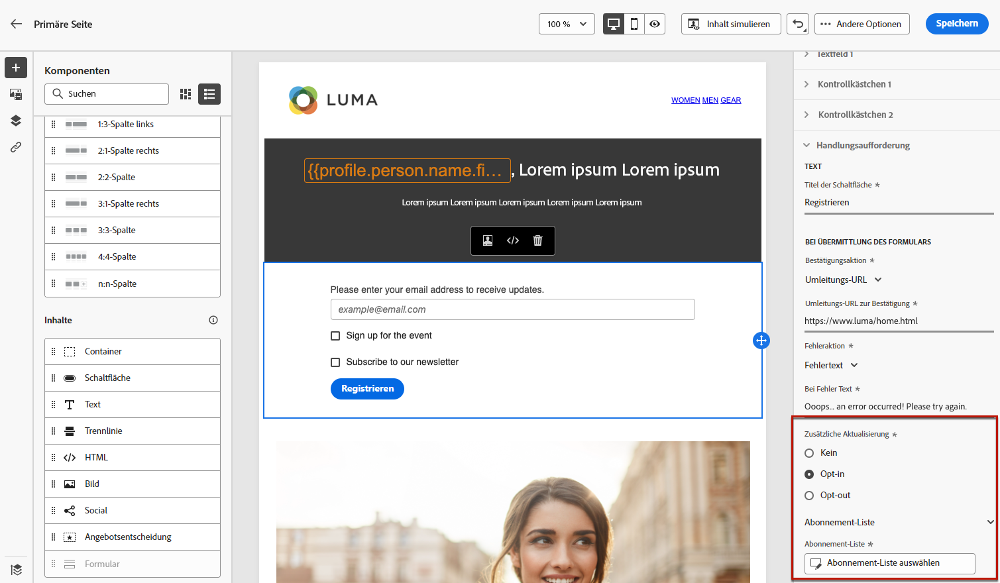
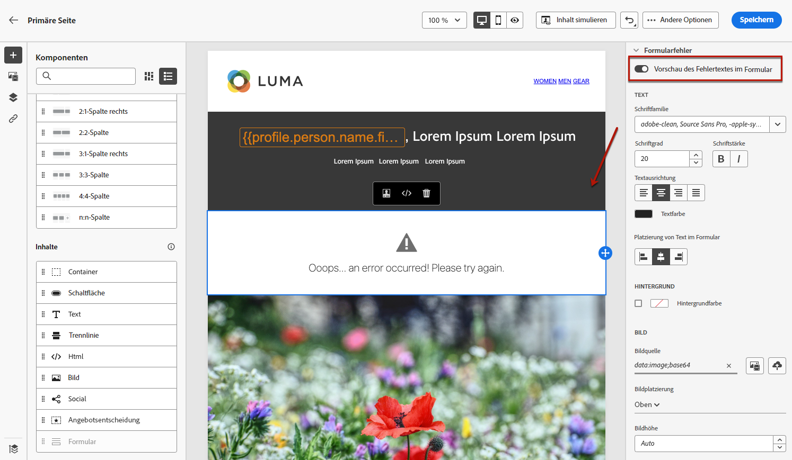

# Definieren von Landingpage-spezifischen Inhalten {#lp-content}

Um bestimmte Inhalte zu definieren, mit denen Benutzer ihre Auswahl auf Ihrer Landingpage festlegen und unterbreiten können, verwenden Sie das **[!UICONTROL Formular]** -Komponente. Gehen Sie dazu wie folgt vor.

>[!NOTE]
>
>Sie können auch eine Clickthrough-Landingpage ohne **[!UICONTROL Formular]** -Komponente. In diesem Fall wird die Landingpage Benutzern angezeigt, sie müssen jedoch kein Formular senden. Dies kann nützlich sein, wenn Sie nur eine Landingpage präsentieren möchten, ohne von Ihren Empfängern Maßnahmen zu ergreifen (z. B. Opt-in oder Opt-out) oder Informationen bereitstellen möchten, für die keine Benutzereingabe erforderlich ist.

## Formularkomponente verwenden {#use-form-component}

1. Ziehen Sie die Landingpage-spezifische **[!UICONTROL Formular]**-Komponente aus der linken Palette in den Hauptarbeitsbereich.

   

   >[!NOTE]
   >
   >Die **[!UICONTROL Formular]**-Komponente kann auf einer Seite nur einmal verwendet werden.

1. Wählen Sie sie aus. Die Registerkarte **[!UICONTROL Formularinhalt]** wird in der rechten Palette angezeigt, damit Sie die verschiedenen Felder des Formulars bearbeiten können.

   

   >[!NOTE]
   >
   >Sie können jederzeit zur Registerkarte **[!UICONTROL Formularstil]** wechseln, um die Stile Ihrer Inhalte in der Formularkomponente zu bearbeiten. [Weitere Informationen](#define-lp-styles)

1. Im Abschnitt **[!UICONTROL Kontrollkästchen 1]** können Sie den Titel bearbeiten, der diesem Kontrollkästchen entspricht.

1. Definieren Sie, ob dieses Kontrollkästchen Benutzern die An- oder Abmeldung ermöglichen soll: Erklären sie sich damit einverstanden, Nachrichten zu erhalten, oder möchten sie nicht mehr kontaktiert werden?

   

   Wählen Sie unter den drei folgenden Optionen aus:

   * **[!UICONTROL Opt-in, wenn aktiviert]**: -Benutzer müssen das Kontrollkästchen aktivieren, um ihre Zustimmung zu erteilen (Opt-in).
   * **[!UICONTROL Opt-out bei Aktivierung]**: -Benutzer müssen das Kontrollkästchen aktivieren, um ihre Zustimmung zu entfernen (Opt-out).
   * **[!UICONTROL Opt-in, wenn aktiviert, Opt-out, wenn deaktiviert]**: Mit dieser Option können Sie eine einzige Checkbox für das Opt-in/Opt-out einfügen. Benutzer müssen das Kontrollkästchen aktivieren, um ihr Einverständnis zu erteilen (Opt-in), und es deaktivieren, um ihr Einverständnis zurückzuziehen (Opt-out).

1. Wählen Sie aus den drei folgenden Optionen aus, was aktualisiert werden soll:

   

   * **[!UICONTROL Abonnement-Liste]**: Sie müssen die Abonnement-Liste auswählen, die aktualisiert wird, wenn das Profil dieses Kontrollkästchen aktiviert. Weitere Informationen finden Sie unter [Abonnement-Listen](subscription-list.md).

      

   * **[!UICONTROL Kanal (E-Mail)]**: Die An- oder Abmeldung gilt für den gesamten Kanal. Wenn beispielsweise ein Profil, das sich abgemeldet hat, zwei E-Mail-Adressen hat, werden beide Adressen aus Ihrer gesamten Kommunikation ausgeschlossen.

   * **[!UICONTROL E-Mail-Identität]**: Das Opt-in oder Opt-out gilt nur für die E-Mail-Adresse, die für den Zugriff auf die Landingpage verwendet wurde. Wenn beispielsweise ein Profil zwei E-Mail-Adressen hat, erhält nur diejenige E-Mail-Adresse, mit der es sich angemeldet hat, Nachrichten von Ihrer Marke.

1. Klicken Sie auf **[!UICONTROL Feld hinzufügen]** > **[!UICONTROL Kontrollkästchen]**, um ein weiteres Kontrollkästchen hinzuzufügen. Wiederholen Sie die obigen Schritte, um die Eigenschaften zu definieren.

   

1. Nachdem Sie alle gewünschten Kontrollkästchen hinzugefügt haben, klicken Sie auf **[!UICONTROL Aktion]**, um den entsprechenden Abschnitt zu erweitern. Damit können Sie das Verhalten der Schaltfläche in der **[!UICONTROL Formular]**-Komponente definieren.

   

1. Definieren Sie, was beim Klicken auf die Schaltfläche passieren soll:

   * **[!UICONTROL Umleitungs-URL]**: Geben Sie die URL der Seite ein, zu der die Benutzer umgeleitet werden.
   * **[!UICONTROL Bestätigungstext]**: Geben Sie den Bestätigungstext ein, der angezeigt werden soll.
   * **[!UICONTROL Link zu einer Unterseite]**: Konfigurieren Sie eine [Unterseite](create-lp.md#configure-subpages) und wählen Sie sie aus der angezeigten Dropdown-Liste aus.

   

1. Definieren Sie, was beim Klicken auf die Schaltfläche passieren soll, falls ein Fehler auftritt:

   * **[!UICONTROL Umleitungs-URL]**: Geben Sie die URL der Seite ein, zu der die Benutzer umgeleitet werden.
   * **[!UICONTROL Fehlertext]**: Geben Sie den Fehlertext ein, der angezeigt werden soll. Beim Definieren der [Formularstile](#define-lp-styles) können Sie sich eine Vorschau des Fehlertexts ansehen.

   * **[!UICONTROL Link zu einer Unterseite]**: Konfigurieren Sie eine [Unterseite](create-lp.md#configure-subpages) und wählen Sie sie aus der angezeigten Dropdown-Liste aus.

   

1. Wenn Sie beim Senden des Formulars zusätzliche Aktualisierungen vornehmen möchten, wählen Sie **[!UICONTROL Opt-in]** oder **[!UICONTROL Opt-out]** und definieren Sie, ob Sie eine Abonnementliste, den Kanal oder nur die verwendete E-Mail-Adresse aktualisieren möchten.

   

1. Speichern Sie die Inhalte und klicken Sie auf den Pfeil neben dem Seitennamen, um zurück zum Abschnitt [Landingpage-Eigenschaften](create-lp.md#configure-primary-page) zu gelangen.

   

<!--Will the name Email Designer be kept if you can also design LP with the same tool? > To modify in Messages section > content designer or Designer-->

## Definieren von Formularstilen für Landingpages {#lp-form-styles}

1. Um die Stile der Inhalte Ihrer Formularkomponente zu ändern, können Sie jederzeit zur Registerkarte **[!UICONTROL Formularstil]** wechseln.

   

1. Erweitern Sie den Abschnitt **[!UICONTROL Kontrollkästchen]**, um das Erscheinungsbild der Kontrollkästchen und des entsprechenden Texts zu definieren. Sie können beispielsweise die Schriftfamilie oder Schriftgröße sowie die Rahmenfarbe des Kontrollkästchens anpassen.

   

1. Erweitern Sie den Abschnitt **[!UICONTROL Schaltflächen]**, um das Erscheinungsbild der Schaltfläche im Komponentenformular zu ändern. Sie können beispielsweise einen Rahmen hinzufügen, die Beschriftungsfarbe beim Bewegen des Mauszeigers bearbeiten oder die Ausrichtung der Schaltfläche anpassen.

   

   Sie können einige Ihrer Einstellungen, z. B. die Farbe der Schaltflächenbeschriftung beim Bewegen des Mauszeigers, in der Vorschau anzeigen, indem Sie die Schaltfläche **[!UICONTROL Vorschau]** verwenden. Weitere Informationen zum Testen von Landingpages finden Sie [hier](create-lp.md#test-landing-page).

   

1. Erweitern Sie den Abschnitt **[!UICONTROL Formular-Layout]**, um die Layout-Einstellungen wie die Hintergrundfarbe, den Abstand oder den Rand zu bearbeiten.

   

1. Erweitern Sie den Abschnitt **[!UICONTROL Formularfehler]**, um die Fehlermeldung anzupassen, die im Falle eines Problems angezeigt wird. Klicken Sie die entsprechende Option an, um den Fehlertext im Formular in der Vorschau anzuzeigen.

   

