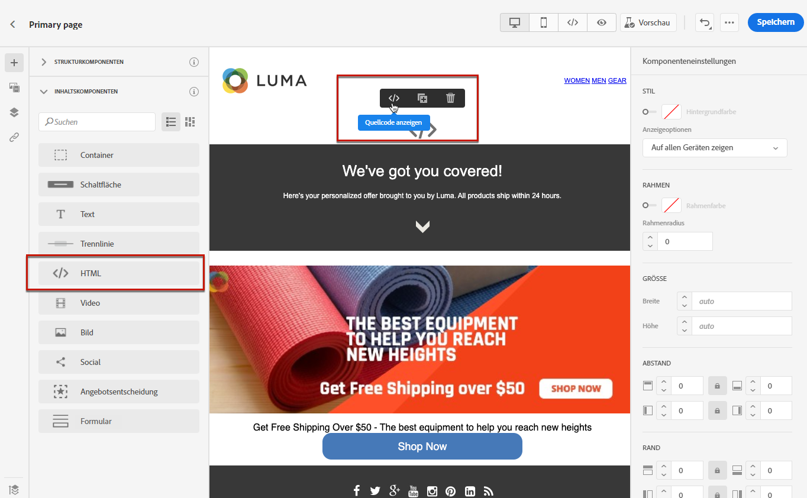

# Verwenden von benutzerdefiniertem JavaScript in einer Landingpage {#lp-custom-js}

Sie können den Inhalt Ihrer Landingpage mit benutzerdefiniertem JavaScript definieren. Wenn Sie beispielsweise erweiterte Stile oder benutzerdefinierte Verhaltensweisen zu Ihren Landingpages hinzufügen möchten, können Sie Ihre eigenen Steuerelemente erstellen und in [!DNL Journey Optimizer] ausführen.

## Einfügen von JavaScript-Code in eine Landingpage

Um benutzerdefiniertes JavaScript in die Inhalte von Landingpages einzufügen, haben Sie die folgenden Möglichkeiten:

* Importieren Sie vorhandene HTML-Inhalte, wenn Sie mit der Erstellung des Inhalts beginnen, und wählen Sie die Datei aus, die Ihren benutzerdefinierten JavaScript-Code enthält. [In diesem Abschnitt](../email/existing-content.md) erfahren Sie, wie Sie Inhalte importieren.

* Erstellen Sie Ihre Landingpage von Grund auf neu oder aus einer gespeicherten Vorlage. Ziehen Sie die **[!UICONTROL HTML]**-Inhaltskomponente in die Arbeitsfläche und zeigen Sie den Quell-Code an, um Ihr JavaScript zur Komponente hinzuzufügen. In [diesem Abschnitt](../email/content-components.md#HTML) erfahren Sie, wie Sie die HTML-Komponente verwenden. <!--You can also simply switch the whole landing page content to code view and enter or paste your JavaScript code.-->

   

* Geben Sie JavaScript-Code direkt in den Inhalts-Designer ein oder fügen Sie ihn ein. Erfahren Sie [in diesem Abschnitt](../email/code-content.md), wie Sie Ihren eigenen Inhalt codieren.

>[!NOTE]
>
>Derzeit können Sie bei der [Vorschau der Landingpage](create-lp.md#test-landing-page) kein JavaScript in Aktion anzeigen.

Damit die Landingpage korrekt angezeigt wird, verwenden Sie die folgende Syntax, wie in den folgenden Abschnitten beschrieben.

## Code-Initialisierung

Zur Initialisierung Ihres JavaScript-Codes müssen Sie das Ereignis `lpRuntimeReady` verwenden. Dieses Ereignis wird nach erfolgreicher Initialisierung der Bibliothek ausgelöst. Der Rückruf wird mit dem `lpRuntime`-Objekt ausgeführt, um die Bibliotheksmethode und die Erweiterungspunkte (Hooks) verfügbar zu machen.

`LpRuntime` steht für „Landingpage-Laufzeit“. Dieses Objekt ist die Hauptbibliothekskennung. Sie stellt Erweiterungspunkte, Methoden zur Formularübermittlung und andere Dienstprogrammmethoden bereit, die in benutzerdefiniertem JavaScript verwendet werden können.

**Beispiel:**

```
if(window.lpRuntime){
    init(window.lpRuntime);
}else{
    window.addEventListener('lpRuntimeReady',function(e){
        init(e.detail);
    });
}
 
function init(lpRuntime){
    // Enter custom JavaScript here using methods from lpRuntime.
}
```

## Erweiterungspunkte

Mithilfe von Erweiterungspunkten können Sie während des Lebenszyklus der Formularübermittlung eine Methode anhängen. Beispielsweise können Sie mithilfe von Erweiterungspunkten eine Formularüberprüfung durchführen, bevor das Formular tatsächlich übermittelt wird.

Im Folgenden finden Sie die Erweiterungspunkte, die Sie verwenden können:

| Name | Beschreibung |
|--- |--- |
| addBeforeSubmitHook | Benutzerdefinierter Erweiterungspunkt, der vor der Formularübermittlung aufgerufen werden soll. Gibt „true“ zurück, um die Übermittlung fortzusetzen, sonst wird „false“ zurückgegeben, um die Übermittlung zu blockieren. |
| addOnFailureHook | Benutzerdefinierter Erweiterungspunkt, der bei fehlgeschlagener Formularübermittlung aufgerufen werden soll. |
| addOnSuccessHook | Benutzerdefinierter Erweiterungspunkt, der bei erfolgreicher Formularübermittlung aufgerufen werden soll. |

**Beispiel:**

```
//LpRuntime hooks
lpRuntime.hooks.addBeforeSubmitHook(function(){
    // Add your validation logic here.
});
```

## Benutzerdefinierte Formularübermittlung

Die unten aufgeführten Methoden werden verwendet, um benutzerdefinierte Formularübermittlungen durchzuführen.

>[!NOTE]
>
>Da die Formularübermittlung von benutzerdefiniertem JavaScript gehandhabt wird, muss die Standardübermittlung explizit deaktiviert werden, indem die globale Variable `disableDefaultFormSubmission` auf `true` gesetzt wird.

| Name | Beschreibung |
|--- |--- |
| submitForm | Diese Methode übermittelt das Formular und verarbeitet den Post-Übermittlungs-Fluss. |
| submitFormPartial | Diese Methode übermittelt auch das Formular, überspringt aber den Post-Übermittlungs-Fluss. Wenn Sie zum Beispiel die Umleitung zur Erfolgsseite nach erfolgreicher Übermittlung konfiguriert haben, erfolgt diese Umleitung im Falle einer teilweisen Übermittlung des Formulars nicht. |

**Beispiele:**

```
//LpRuntime methods
window.disableDefaultFormSubmission = true        // Flag to disable the default submission flow.
 
lpRuntime.submitForm(formSubmissionData);         // This will trigger the default form submission handling like redirecting to error or success page.
  
lpRuntime.submitFormPartial(formSubmissionData,{   // This will not trigger the default submission handling.
    beforeSubmit : callback,
    onFailure : failureCallback,                   // Custom onFailureCallback - will be used in partial submission of form.
    onSuccess : successCallback                    // Custom onSuccessCallback - will be used in partial submission of form.
})
```

## Dienstprogrammfunktion

| Name | Beschreibung |
|--- |--- |
| getFormData | Diese Methode kann verwendet werden, um `formData` in Form eines JSON-Objekts abzurufen. Dieses Objekt kann zur Übermittlung des Formulars an `submitForm` übergeben werden. |

**Beispiel:**

```
let formData = lpRuntime.getFormData();                           // Method to generate formdata
 
lpRuntime.submitForm(formData);
```

## Anwendungsfälle

### Anwendungsfall 1: Hinzufügen von Validierungen vor der Formularübermittlung

```
<html>
<body>
// Enter HTML body here.
  
<script>
        if(window.lpRuntime){
          console.log('got runtime',lpRuntime);
          init(window.lpRuntime);
        }else{
          window.addEventListener('lpRuntimeReady',function(e){
            init(window.lpRuntime);
          });
        }
        
  
      // Here validate the function is checking if the checkbox is selected. This method should return true if you want form submission.
      function validateForm(){
        return document.querySelector('.spectrum-Checkbox-input').checked;
      }    
  
      function init(lpRuntime){
          lpRuntime.hooks.addBeforeSubmitHook(function(){
              return validateForm(); // This method should return true if you want to proceed with submission.
          })
      }
  
</script>  
  
</body>
</html>
```

### Anwendungsfall 2: Teilweise Formularübermittlung

Sie haben beispielsweise ein Formular mit mehreren Kontrollkästchen auf der Seite. Wenn ein Kontrollkästchen aktiviert wird, sollen diese Daten im Backend gespeichert werden, ohne darauf zu warten, dass der Benutzer auf die Schaltfläche „Senden“ klickt.

```
<html>
<body>
    <form>
        <input type='checkbox' value="1" name="name1"/>
        <input type='checkbox' value="2" name="name2"/>
        <input type='checkbox' value="3" name="name3"/>
        <input type='checkbox' value="4" name="name4"/>
    </form>
  
<script>
      window.disableDefaultFormSubmission=true;
 
      window.addEventListener('lpRuntimeReady',function(e){        
        init(e.detail)
      }
 
     function init(lpRuntime){
        window.getElementByTagName('input').addEventListener('change',function(e){
            let formData = lpRuntime.getFormData();
            lpRuntime.submitFormPartial(formData);
        })
      }
    </script>
  
</body>
</html>
```

### Anwendungsfall 3: Benutzerdefinierte Analyse-Tags

Mit JavaScript können Sie Listener für Eingabefelder hinzufügen und einen benutzerdefinierten Trigger für Analytics-Aufrufe anhängen.

```
<html>
<body>
    <form>
        <input type='checkbox' value="1" name="name1"/>
        <input type='checkbox' value="2" name="name2"/>
        <input type='checkbox' value="3" name="name3"/>
        <input type='checkbox' value="4" name="name4"/>
    </form>
  
<script>
      window.disableDefaultFormSubmission=false;  
 
      window.addEventListener('lpRuntimeReady',function(e){        
        init(e.detail)
      }
 
     function init(lpRuntime){
         window.getElementByTagName('input').addEventListener('change',function(e){
            //trigger analytics events
        })
      }
        
    </script>
  
</body>
</html>
```

### Anwendungsfall 4: Dynamisches Formular

```
<html>
<body>
    <form>
        <input type='checkbox' value="1" name="name1"/>
        <div class="hiddenInput hidden">
            <input type='text' name="name2"/>
        </div>
    </form>
  
<script>
      window.disableDefaultFormSubmission=false;     
 
      window.addEventListener('lpRuntimeReady',function(e){        
        init(e.detail)
      }
 
      function init(lpRuntime){
        window.getElementByTagName('input').addEventListener('change',function(e){
            document.querySelector('.hiddenInput').toggleClass('hidden');
        })
      }
        
    </script>
  
</body>
</html>
```
