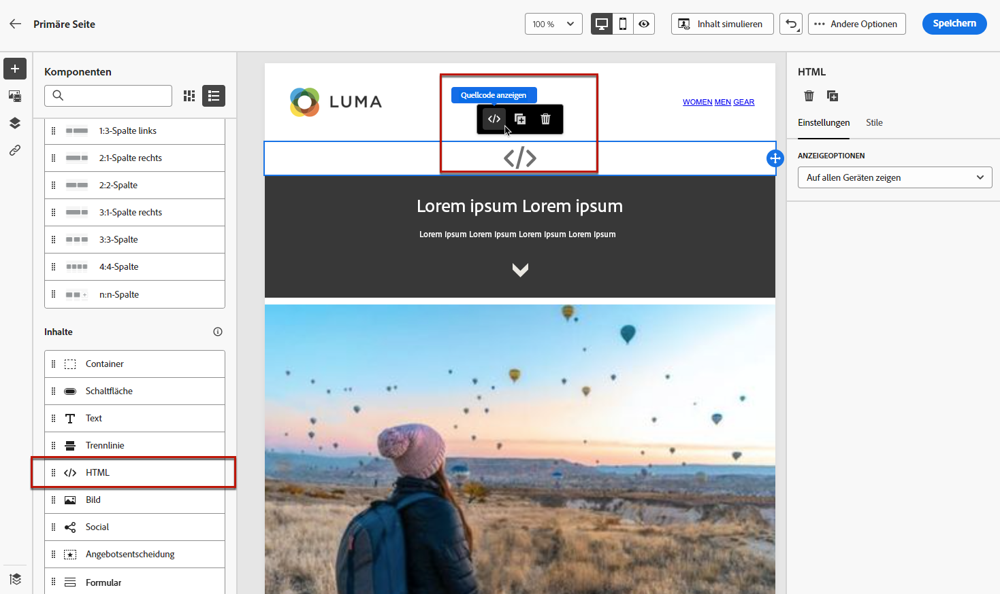

# Verwenden von benutzerdefiniertem JavaScript in einer Landingpage {#lp-custom-js}

Sie können den Inhalt Ihrer Landingpage mit benutzerdefiniertem JavaScript definieren. Wenn Sie beispielsweise erweiterte Stile oder benutzerdefinierte Verhaltensweisen zu Ihren Landingpages hinzufügen möchten, können Sie Ihre eigenen Steuerelemente erstellen und in [!DNL Journey Optimizer].

## JavaScript-Code in eine Landingpage einfügen

Um benutzerdefiniertes JavaScript in den Inhalt von Landingpages einzufügen, können Sie entweder Folgendes tun:

* Importieren Sie vorhandenen HTML-Inhalt, wenn Sie mit der Erstellung des Inhalts beginnen, und wählen Sie die Datei aus, die Ihren benutzerdefinierten JavaScript-Code enthält. Erfahren Sie, wie Sie Inhalte importieren [in diesem Abschnitt](../email/existing-content.md).

* Erstellen Sie Ihre Landingpage von Grund auf neu oder aus einer gespeicherten Vorlage. Ziehen Sie die **[!UICONTROL HTML]** Inhaltskomponente in die Arbeitsfläche und zeigen Sie den Quellcode an, um Ihr JavaSCript zur Komponente hinzuzufügen. Erfahren Sie, wie Sie die HTML-Komponente in [diesem Abschnitt](../email/content-components.md#HTML). <!--You can also simply switch the whole landing page content to code view and enter or paste your JavaScript code.-->

   

* Geben Sie JavaScript-Code direkt in den Inhaltsdesigner ein oder fügen Sie ihn ein. Erfahren Sie, wie Sie eigene Inhalte kodieren [in diesem Abschnitt](../email/code-content.md).

>[!NOTE]
>
>Derzeit ist es nicht möglich, JavaScript in Aktion anzuzeigen, wenn [Landingpage-Vorschau](create-lp.md#test-landing-page).

Damit die Landingpage korrekt angezeigt wird, verwenden Sie die folgende Syntax, wie in den folgenden Abschnitten beschrieben.

## Code-Initialisierung

Zur Initialisierung Ihres JavaScript-Codes müssen Sie die Variable `lpRuntimeReady` -Ereignis. Dieses Ereignis wird nach erfolgreicher Initialisierung der Bibliothek ausgelöst. Der Rückruf wird mit der `lpRuntime` -Objekt, um die Bibliotheksmethode und die Hooks verfügbar zu machen.

`LpRuntime` steht für &quot;Landingpage Runtime&quot;. Dieses Objekt ist die Hauptbibliothekskennung. Sie stellt Hooks, Methoden zur Formularübermittlung und andere Dienstprogrammmethoden bereit, die in benutzerdefiniertem JavaScript verwendet werden können.

**Beispiel:**

```
if(window.lpRuntime){
    init(window.lpRuntime);
}else{
    window.addEventListener('lpRuntimeReady',function(e){
        init(e.detail);
    });
}
 
function init(lpRuntime){
    // Enter custom JavaScript here using methods from lpRuntime.
}
```

## Hooks

Mithilfe von Hooks können Sie während des Lebenszyklus der Formularübermittlung eine Methode anhängen. Beispielsweise können Sie mithilfe von Erweiterungspunkten eine Formularüberprüfung durchführen, bevor das Formular tatsächlich gesendet wird.

Im Folgenden finden Sie die Hooks, die Sie verwenden können:

| Name | Beschreibung |
|--- |--- |
| addBeforeSubmitHook | Benutzerdefinierter Erweiterungspunkt, der vor der Formularübermittlung aufgerufen werden soll. Gibt &quot;true&quot;zurück, um die Übermittlung fortzusetzen, sonst wird &quot;false&quot;zurückgegeben, um die Übermittlung zu blockieren. |
| addOnFailureHook | Benutzerdefinierter Erweiterungspunkt, der bei fehlgeschlagener Formularübermittlung aufgerufen werden soll. |
| addOnSuccessHook | Benutzerdefinierter Erweiterungspunkt, der bei erfolgreicher Formularübermittlung aufgerufen werden soll. |

**Beispiel:**

```
//LpRuntime hooks
lpRuntime.hooks.addBeforeSubmitHook(function(){
    // Add your validation logic here.
});
```

## Benutzerdefinierte Formularübermittlung

Die unten aufgeführten Methoden werden verwendet, um benutzerdefinierte Formularübermittlungen durchzuführen.

>[!NOTE]
>
>Da die Formularübermittlung von benutzerdefiniertem JavaScript verarbeitet wird, muss die Standardübermittlung explizit deaktiviert werden, indem eine globale Variable festgelegt wird `disableDefaultFormSubmission` nach `true`.

| Name | Beschreibung |
|--- |--- |
| submitForm | Diese Methode sendet das Formular und verarbeitet den Post-Submit-Fluss. |
| submitFormPartial | Diese Methode sendet auch das Formular, überspringt aber den Post-Submit-Fluss. Wenn Sie beispielsweise die Umleitung zur Erfolgsseite nach erfolgreicher Übermittlung konfiguriert haben, erfolgt diese Weiterleitung nicht bei teilweiser Formularübermittlung. |

**Beispiele:**

```
//LpRuntime methods
window.disableDefaultFormSubmission = true        // Flag to disable the default submission flow.
 
lpRuntime.submitForm(formSubmissionData);         // This will trigger the default form submission handling like redirecting to error or success page.
  
lpRuntime.submitFormPartial(formSubmissionData,{   // This will not trigger the default submission handling.
    beforeSubmit : callback,
    onFailure : failureCallback,                   // Custom onFailureCallback - will be used in partial submission of form.
    onSuccess : successCallback                    // Custom onSuccessCallback - will be used in partial submission of form.
})
```

## Dienstprogrammfunktion

| Name | Beschreibung |
|--- |--- |
| getFormData | Diese Methode kann zum Abrufen der `formData` in Form eines JSON-Objekts. Dieses Objekt kann an `submitForm` für die Formularübermittlung. |

**Beispiel:**

```
let formData = lpRuntime.getFormData();                           // Method to generate formdata
 
lpRuntime.submitForm(formData);
```

## Anwendungsbeispiele

### Anwendungsfall 1: Hinzufügen von Validierungen vor der Formularübermittlung

```
<html>
<body>
// Enter HTML body here.
  
<script>
        if(window.lpRuntime){
          console.log('got runtime',lpRuntime);
          init(window.lpRuntime);
        }else{
          window.addEventListener('lpRuntimeReady',function(e){
            init(window.lpRuntime);
          });
        }
        
  
      // Here validate the function is checking if the checkbox is selected. This method should return true if you want form submission.
      function validateForm(){
        return document.querySelector('.spectrum-Checkbox-input').checked;
      }    
  
      function init(lpRuntime){
          lpRuntime.hooks.addBeforeSubmitHook(function(){
              return validateForm(); // This method should return true if you want to proceed with submission.
          })
      }
  
</script>  
  
</body>
</html>
```

### Anwendungsfall 2: Teilformularübermittlung

Sie haben beispielsweise ein Formular mit mehreren Kontrollkästchen auf der Seite. Wenn Sie ein Kontrollkästchen aktivieren, sollen diese Daten im Backend gespeichert werden, ohne darauf zu warten, dass der Benutzer auf die Senden-Schaltfläche klickt.

```
<html>
<body>
    <form>
        <input type='checkbox' value="1" name="name1"/>
        <input type='checkbox' value="2" name="name2"/>
        <input type='checkbox' value="3" name="name3"/>
        <input type='checkbox' value="4" name="name4"/>
    </form>
  
<script>
      window.disableDefaultFormSubmission=true;
 
      window.addEventListener('lpRuntimeReady',function(e){        
        init(e.detail)
      }
 
     function init(lpRuntime){
        window.getElementByTagName('input').addEventListener('change',function(e){
            let formData = lpRuntime.getFormData();
            lpRuntime.submitFormPartial(formData);
        })
      }
    </script>
  
</body>
</html>
```

### Anwendungsfall 3: Benutzerdefinierte Analyse-Tags

Mit JavaScript können Sie Listener von Eingabefeldern hinzufügen und einen benutzerdefinierten Analytics-Aufruf-Trigger anhängen.

```
<html>
<body>
    <form>
        <input type='checkbox' value="1" name="name1"/>
        <input type='checkbox' value="2" name="name2"/>
        <input type='checkbox' value="3" name="name3"/>
        <input type='checkbox' value="4" name="name4"/>
    </form>
  
<script>
      window.disableDefaultFormSubmission=false;  
 
      window.addEventListener('lpRuntimeReady',function(e){        
        init(e.detail)
      }
 
     function init(lpRuntime){
         window.getElementByTagName('input').addEventListener('change',function(e){
            //trigger analytics events
        })
      }
        
    </script>
  
</body>
</html>
```

### Anwendungsfall 4: Dynamisches Formular

```
<html>
<body>
    <form>
        <input type='checkbox' value="1" name="name1"/>
        <div class="hiddenInput hidden">
            <input type='text' name="name2"/>
        </div>
    </form>
  
<script>
      window.disableDefaultFormSubmission=false;     
 
      window.addEventListener('lpRuntimeReady',function(e){        
        init(e.detail)
      }
 
      function init(lpRuntime){
        window.getElementByTagName('input').addEventListener('change',function(e){
            document.querySelector('.hiddenInput').toggleClass('hidden');
        })
      }
        
    </script>
  
</body>
</html>
```
