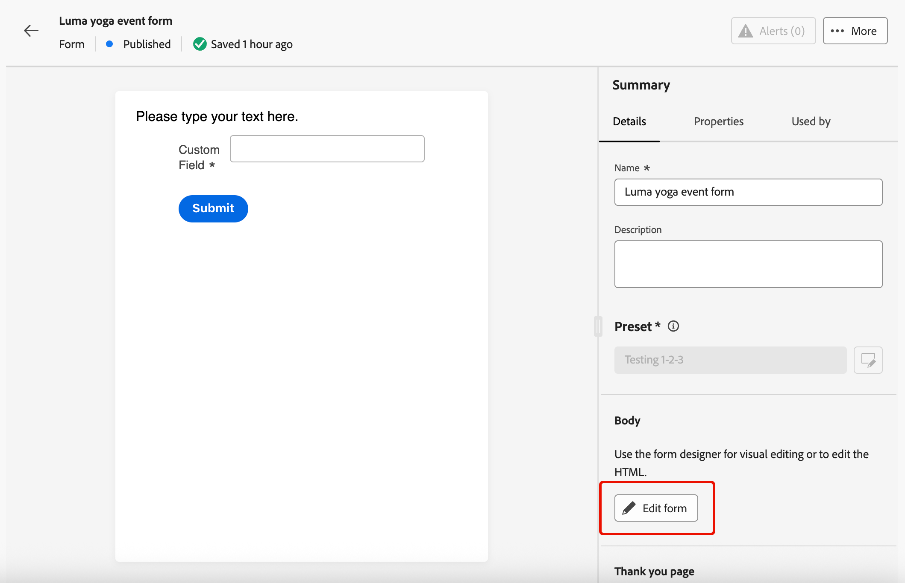

# Verwenden von Formularen in Ihren Landingpages {#lp-forms}

>[!AVAILABILITY]
>
>Diese Funktion ist nur eingeschränkt verfügbar. Wenden Sie sich an den Adobe-Support, um Zugang zu erhalten.

Um Profildaten mit Ihren [!DNL Journey Optimizer] Landingpages zu erfassen und Ihre [!DNL Experience Platform] Datensätze anzureichern, können Sie Formulare in Ihren Landingpages nutzen.

## Erstellen einer Formularvoreinstellung {#create-form-preset}

>[!CONTEXTUALHELP]
>id="ajo_lp_form_connection"
>title="Auswählen des zu verwendenden Endpunktes"
>abstract="Definieren Sie den Streaming-Endpunkt, an den Daten beim Senden des Formulars gesendet werden."
>additional-url="https://experienceleague.adobe.com/de/docs/experience-platform/sources/ui-tutorials/create/streaming/http" text="Erstellen einer HTTP-API-Streaming-Verbindung"

>[!CONTEXTUALHELP]
>id="ajo_lp_form_dataset"
>title="Auswählen eines Datensatzes"
>abstract="Definieren Sie einen Datensatz, in dem die Formularantworten gespeichert und widergespiegelt werden. Sie können einen bestimmten Datensatz eingeben oder aus der Liste auswählen."

Bevor Sie ein Formular erstellen können, müssen Sie eine dedizierte Vorgabe erstellen, in der Sie den Verbindungsendpunkt auswählen, an den Formulardaten gesendet werden, und den Datensatz, in dem die im Formular erfassten Daten gespeichert werden.

Wenn Daten auf dem Streaming-Endpunkt landen, werden sie mit den Datensatzinformationen verknüpft. Mithilfe der generierten Quell-/Zielverbindungen und des Quellflusses werden die Daten dann in den Datensatz übertragen.

Beim Erstellen einer Voreinstellung:

* Sie können mehrere Vorgaben mit verschiedenen Kombinationen aus Datensätzen und Streaming-Verbindungen einrichten.
* Derselbe Datensatz oder dieselbe Streaming-Verbindung kann über mehrere Voreinstellungen hinweg wiederverwendet werden.
* Jede Streaming-Verbindung generiert automatisch Ressourcen wie:
   * **Source-Verbindung** - woher die Daten stammen.
   * **Zielverbindung** - wo die Daten gespeichert oder genutzt werden.
   * **Source-**: Die Pipeline, die Daten von der Quellverbindung in [!DNL Experience Platform] verschiebt, um Zuordnungen, Umwandlungen und Validierungen zu verarbeiten.

>[!NOTE]
>
> Um auf Formularvorgaben zuzugreifen und sie zu bearbeiten, benötigen Sie die Berechtigung **[!UICONTROL Formularvorgaben verwalten]** für die Produktions-Sandbox. Weitere Informationen zu Berechtigungen finden Sie [ (diesem Abschnitt](../administration/high-low-permissions.md#administration-permissions).<!--TBC-->

1. Um auf das Inventar **[!UICONTROL Formularvorgaben]** zuzugreifen, wählen Sie **[!UICONTROL Administration]** > **[!UICONTROL Kanäle]** >**[!UICONTROL Formulareinstellungen]** aus dem linken Menü aus.

1. Klicken Sie **[!UICONTROL Formularvorgabe erstellen]**.

1. Aktualisieren Sie den Namen, um ihn leichter abzurufen, und fügen Sie bei Bedarf eine Beschreibung hinzu.

   {width=80%}

1. Wählen Sie die **[!UICONTROL Streaming-Verbindung]** aus, die für dieses Formular verwendet werden soll. Dies ist der Streaming-Endpunkt, an den Daten beim Senden des Formulars gesendet werden.

   >[!NOTE]
   >
   >Weitere Informationen zum Erstellen einer Streaming-Quellverbindung finden Sie in der [Dokumentation zu Experience Platform](https://experienceleague.adobe.com/de/docs/experience-platform/sources/ui-tutorials/create/streaming/http){target="_blank"}.

1. Wählen Sie einen **[!UICONTROL Datensatz]** aus, um ihn mit dem Formular zu verknüpfen. Hier werden die Formularantworten gespeichert und dargestellt. Sie können einen bestimmten Datensatz eingeben oder aus der Liste auswählen.

   >[!NOTE]
   >
   >Derzeit stehen nur [!DNL Adobe Experience Platform] Datensätze zur Auswahl. Es kann jeweils nur ein Datensatz ausgewählt werden.

1. Klicken Sie auf **[!UICONTROL Veröffentlichen]**. Ihre Voreinstellung kann jetzt in einem Formular verwendet werden.

## Zugriff und Verwaltung von Formularen {#access-forms}

Um auf die Formularliste zuzugreifen, wählen Sie **[!UICONTROL Content]** Management > **[!UICONTROL Forms]** aus dem linken Menü aus.

Alle vorhandenen Formulare werden angezeigt. Sie können Formulare nach Status, Erstellungs- oder Änderungsdatum filtern.

## Erstellen und Gestalten eines Formulars {#create-form}

>[!CONTEXTUALHELP]
>id="ajo_lp_form_preset"
>title="Auswählen einer Voreinstellung"
>abstract="Wählen Sie eine vordefinierte Voreinstellung aus, die die zu verwendende Verbindung und einen vordefinierten Datensatz für Ihr Formular enthält."
>additional-url="https://experienceleague.adobe.com/de/docs/journey-optimizer/using/content-management/landing-pages/lp-forms#create-form-preset" text="Erstellen einer Formularvoreinstellung"

Gehen Sie wie folgt vor, um ein Formular zu erstellen.

1. Klicken Sie in der Liste **** Forms **[!UICONTROL auf „Formular erstellen]**.

1. Einen Namen hinzufügen. Sie können bei Bedarf eine Beschreibung hinzufügen.

   

1. Wählen Sie eine **[!UICONTROL Vorgabe]** aus, die die zu verwendende Verbindung und einen vordefinierten Datensatz für Ihr Formular enthält. [Erfahren Sie, wie Sie eine Formularvorgabe erstellen](#create-form-preset)

1. Klicken Sie auf **[!UICONTROL Erstellen]**. Der Formular-Designer wird geöffnet. Dort können Sie Strukturen und Inhalte ([) hinzufügen](../email/content-components.md#add-content-components) um Inhalte zu erstellen. Sie können die Komponenten [Text](../email/content-components.md#text) und **[!UICONTROL Feld]** verwenden.

1. Um Profildaten und Attribute zu erfassen, fügen Sie dem Formular bestimmte Felder hinzu. [Weitere Informationen](#define-fields)

1. Konfigurieren und gestalten Sie diese Felder. [Weitere Informationen](#configure-fields)

1. Sie können das Layout, die Formatierung und die Abmessungen des Formulars nach Bedarf mithilfe des Bereichs **[!UICONTROL Stile]** anpassen. [Erfahren Sie mehr über das Styling](../email/get-started-email-style.md)

1. Nachdem Sie alle Felder konfiguriert haben, klicken Sie auf **[!UICONTROL Speichern und schließen]**.

1. Konfigurieren Sie die Dankesseite. [Weitere Informationen](#thank-you-page)

1. **[!UICONTROL Veröffentlichen]** des Formulars, um es für die Auswahl auf Landingpages verfügbar zu machen.

### Spezifische Felder definieren {#define-fields}

Um dem Formular bestimmte Felder hinzuzufügen, ziehen Sie eine Struktur per Drag-and-Drop auf die Arbeitsfläche und ziehen Sie eine Komponente **[!UICONTROL Feld]** in das Formular<!--**[!UICONTROL Select field attribute]** or **[!UICONTROL Add custom field]**.-->

Wählen Sie dann eine der folgenden Optionen aus:

>[!BEGINTABS]

>[!TAB Feldattribut auswählen]

Verwenden Sie diese Option, um ein Attribut basierend auf dem Datensatzschema auszuwählen, das mit Ihrem Formular verknüpft ist.

>[!NOTE]
>
>Der Datensatz wird in der für Ihr Formular ausgewählten Voreinstellung definiert. [Weitere Informationen](#create-form-preset)

{width=100%}

Sie können beispielsweise die E-Mail-Adresse und die Personen-ID festlegen. Wenn Benutzer diese Felder ausfüllen, werden die eingegebenen Informationen im ausgewählten Datensatz gespeichert.

{width=55%}

Um die erfassten Daten einem Profil zuzuordnen, wählen Sie ein Profilidentitätsfeld aus. Die Identitätsfelder werden in **[!UICONTROL Attributliste mit „Erforderlich]** gekennzeichnet, sodass Sie nach ihnen filtern können.

{width=65%}

>[!TAB Benutzerdefiniertes Feld hinzufügen]

Mit dieser Option können Sie einfach ein freies Feld definieren, ohne es einem Feld im verknüpften Datensatz zuzuordnen.

{width=85%}

>[!ENDTABS]

### Konfigurieren und Entwerfen eines Felds {#configure-fields}

Nachdem Sie ein Feldattribut ausgewählt oder ein benutzerdefiniertes Feld hinzugefügt haben, können Sie seine Details sowie sein Verhalten beim Senden des Formulars weiter anpassen.

1. Im Abschnitt **[!UICONTROL Felddetails]** der Registerkarte **[!UICONTROL Inhalt]** auf der rechten Seite können Sie die folgenden Elemente nach Bedarf angeben:

   * Passen Sie **[!UICONTROL Titel]** an, um es für die Empfänger Ihres Formulars zu verdeutlichen.
   * Ändern Sie den **[!UICONTROL Feldtyp]** entsprechend Ihren Anforderungen. Dabei kann es sich um ein Kontrollkästchen, eine Währung, ein Datum, einen Schieberegler, eine URL usw. handeln.

     >[!NOTE]
     >
     >Die anderen Felddetails können je nach ausgewähltem Feldtyp variieren.

   * Fügen Sie einen **[!UICONTROL Platzhalter]** hinzu.<!--To explain-->
   * Geben Sie **[!UICONTROL instructions]** an.<!--How will they be displayed in the form? To explain-->
   * Geben Sie **[!UICONTROL Standardwert]** ein, der angezeigt wird, bevor die Benutzer Ihres Formulars das Feld ausfüllen.
   * Sie können eine benutzerdefinierte (**[!UICONTROL )]**.
   * Legen Sie eine **[!UICONTROL Maximale Länge]** fest. Eine Fehlermeldung wird angezeigt, wenn die Empfänger des Formulars das Limit beim Ausfüllen des Felds überschreiten.

   {width=85%}

1. Im Abschnitt **[!UICONTROL Feldverhalten]** können Sie Folgendes definieren:

   * Wählen Sie **[!UICONTROL Erforderlich]**, um dieses Feld obligatorisch zu machen. Wenn Benutzende das Feld nicht ausfüllen, können sie das Formular nicht senden.
   * Wählen Sie **[!UICONTROL Sensitive]** aus, damit bei dem Feld die Groß-/Kleinschreibung beachtet wird. <!--To confirm - do you mean retain capitalization when added to the dataset?-->
   * Wählen Sie **[!UICONTROL Vorbefüllt aktiviert]** aus, um das Feld aus den Profilinformationen auszufüllen, falls verfügbar.<!--Even for a custom field, or a field not mapped to a profile? What happens if no data is available?-->
   * Wählen Sie **[!UICONTROL Eingabemaske aktivieren]**, um die Benutzereingabe durch generische Zeichen zu ersetzen. Sie können *9* für eine beliebige Zahl, *a* für einen beliebigen Buchstaben oder * für eine beliebige Zahl oder einen Buchstaben verwenden.<!--Not sure how you define that in the form-->

   {width=75%}

### Konfigurieren der Dankesseite {#thank-you-page}

>[!CONTEXTUALHELP]
>id="ajo_lp_forms_thankyou_page"
>title="Dankesseite"
>abstract="Konfigurieren Sie den Vorgang, der erfolgt, wenn jemand das Formular ausfüllt oder weiterleitet."

Konfigurieren Sie **[!UICONTROL Abschnitt „Dankeseite]**, was passiert, wenn ein Benutzer das Formular ausfüllt.

{width=70%}

Richten Sie eine der folgenden Aktionen ein:

* **[!UICONTROL Auf Seite bleiben]** - Mit dieser Option bleibt der Besucher auf derselben Seite, wenn das Formular gesendet wurde.
* **[!UICONTROL Landingpage]** - Wählen Sie eine veröffentlichte [Landingpage](create-lp.md) aus, zu der der Benutzer nach dem Absenden des Formulars weitergeleitet wird.
* **[!UICONTROL Externe URL]** - Geben Sie die vollständige URL ein, die als Folgeseite verwendet werden soll. Nachdem der Benutzer das Formular gesendet hat, wird er an die angegebene URL weitergeleitet.
* **[!UICONTROL Bedingte Umleitung]** - Richten Sie Regeln ein, um verschiedene Folgeaktionen basierend auf den Formularantworten dynamisch anzuzeigen.

  Sie können für jede spezifische Zielgruppe eine Regel definieren. Sie können beispielsweise eine bestimmte Landingpage für US-Bürger, eine andere Seite für Personen mit Wohnsitz in Kanada usw. anzeigen. Richten Sie abschließend eine Standardaktion für Benutzer ein, die nicht unter eine von Ihnen definierte Regel fallen.

  >[!NOTE]
  >
  >Die in einer Regel definierten Bedingungen werden sequenziell gelesen.

  {width=40%}

## Bearbeiten eines veröffentlichten Formulars {#edit-form}

Sobald ein Formular veröffentlicht wurde, können Sie es weiterhin bearbeiten. Gehen Sie wie folgt vor.

1. Rufen Sie die [Formularliste](#access-forms) auf und wählen Sie ein veröffentlichtes Formular aus.

1. Klicken Sie auf die **[!UICONTROL Formular bearbeiten]**.

   {width=90%}

1. Eine neue Version des Formulars wird mit dem Status Entwurf erstellt. Klicken Sie **[!UICONTROL Entwurfsversion erstellen]**.

1. Aktualisieren Sie das Formular nach Bedarf und klicken Sie auf **[!UICONTROL Speichern]**. Das Formular hat jetzt den **[!UICONTROL Veröffentlicht (mit Entwurf]**:

   * Die aktuelle Version hat weiterhin den Status **[!UICONTROL Veröffentlicht]**, bis Sie die aktualisierte Version veröffentlichen.

   * Die aktualisierte Version weist den Status **[!UICONTROL Entwurf]** auf.

1. Zurück in der Formularübersicht können Sie zwischen den beiden Versionen des Formulars navigieren.

   {width=70%}

1. Im Abschnitt **[!UICONTROL Entwurf]** können Sie den Entwurf entweder veröffentlichen oder verwerfen sowie die Details oder den Inhalt des Formulars bearbeiten.

   {width=75%}

## Verwenden des Formulars in einer Landingpage {#leverage-form-in-lp}

Sie können dieses Formular jetzt in eine Landingpage einbetten, um Daten zu erfassen, die den im Formular definierten Attributen entsprechen, und sie im ausgewählten Datensatz zu speichern. Gehen Sie wie folgt vor.

1. Erstellen Sie eine Landingpage. [Weitere Informationen](create-lp.md#create-landing-page)

1. Wählen Sie **[!UICONTROL Landingpage-Typ]** Datenerfassung“ aus und klicken Sie auf **[!UICONTROL Erstellen]**.

   {width=65%}

1. Konfigurieren Sie die Primärseite. [Weitere Informationen](create-lp.md#configure-primary-page)

1. Öffnen Sie den [Landingpage-Designer](design-lp.md).

1. Ziehen Sie per Drag-and **[!UICONTROL Drop eine]** Strukturkomponente“ in Ihren Inhalt. Ziehen Sie eine **[!UICONTROL Formular]**-Komponente in diese Struktur.

   >[!NOTE]
   >
   >Auf einer Landingpage können nur veröffentlichte Formulare ausgewählt werden.

1. Wählen Sie im **[!UICONTROL Einbettungsformular]** das erstellte Formular aus.

   

   >[!NOTE]
   >
   >Sie können das ausgewählte Formular mithilfe der Schaltfläche **[!UICONTROL Formular bearbeiten]** aktualisieren. Das Formular wird auf einer neuen Registerkarte geöffnet. Die Schritte zum Bearbeiten des Formularinhalts sind dieselben wie in [diesem Abschnitt](#create-form) beschrieben.

1. Konfigurieren Sie **[!UICONTROL Abschnitt]** Folgenachrichtentyp), was passiert, wenn ein Benutzer das Formular ausfüllt:

   * Wählen Sie **[!UICONTROL Formular definiert]** aus, um die Aktion auszuwählen, die im eingebetteten Formular definiert wurde. [Weitere Informationen](#thank-you-page)

   * Sie können auch eine veröffentlichte [Landingpage) auswählen](create-lp.md) zu der der Benutzer nach dem Absenden des Formulars weitergeleitet wird.

   * Oder definieren Sie eine **[!UICONTROL externe URL]** als Folgeseite, auf die Benutzer beim Senden des Formulars weitergeleitet werden.

1. Speichern und testen Sie Ihre Landingpage. [Weitere Informationen](create-lp.md#test-landing-page)

Sobald Ihre Landingpage [veröffentlicht) ](create-lp.md#publish-landing-page) auf einer Journey verwendet wurde und Benutzer das Formular ausfüllen, werden die eingegebenen Informationen in den ausgewählten Datensatz aufgenommen.

>[!NOTE]
>
>Wenn Sie die Veröffentlichung eines Formulars aufheben, das in einer Landingpage verwendet wird, bearbeiten Sie dieses Formular und veröffentlichen Sie es erneut. Für die Landingpage wird immer die neueste veröffentlichte Version des Formulars verwendet.
