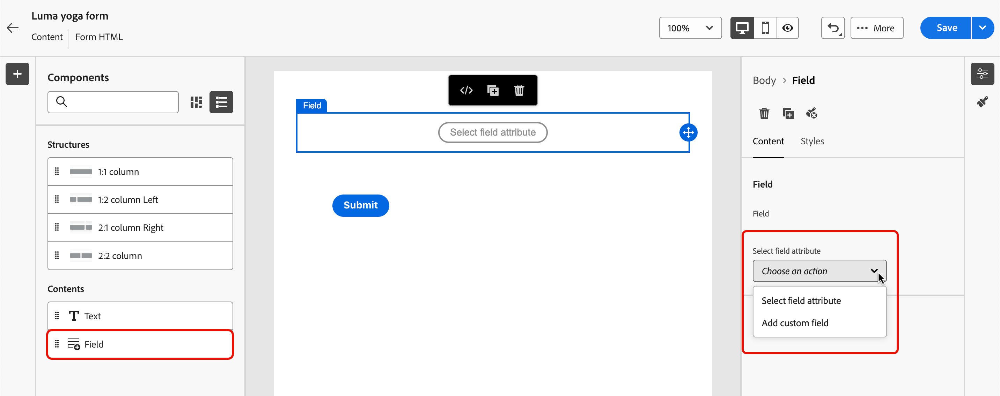

# Verwenden von Formularen in Ihren Landingpages {#lp-forms}

>[!AVAILABILITY]
>
>Diese Funktion ist derzeit nur für Kundschaft in den USA und Australien verfügbar. Wenden Sie sich an den Adobe-Support, um Zugriff zu erhalten.

Um Profildaten mit Ihren [!DNL Journey Optimizer]-Landingpages zu erfassen und Ihre [!DNL Experience Platform]-Datensätze anzureichern, können Sie in Ihren Landingpages Formulare nutzen.

## Erstellen einer Formularvoreinstellung {#create-form-preset}

>[!CONTEXTUALHELP]
>id="ajo_lp_form_connection"
>title="Auswählen des zu verwendenden Endpunkts"
>abstract="Den Streaming-Endpunkt definieren, an den Daten beim Senden des Formulars gesendet werden."
>additional-url="https://experienceleague.adobe.com/de/docs/experience-platform/sources/ui-tutorials/create/streaming/http" text="Erstellen einer HTTP-API-Streaming-Verbindung"

>[!CONTEXTUALHELP]
>id="ajo_lp_form_dataset"
>title="Auswählen eines Datensatzes"
>abstract="Definieren Sie einen Datensatz, in dem die Formularantworten gespeichert und dargestellt werden. Sie können etwas eingeben, um einen bestimmten Datensatz zu durchsuchen, oder einen Datensatz aus der Liste auswählen."

Bevor Sie ein Formular erstellen können, müssen Sie eine dedizierte Voreinstellung einrichten, in der Sie den Verbindungsendpunkt auswählen, an den Formulardaten gesendet werden. Zudem müssen Sie den Datensatz auswählen, in dem die im Formular erfassten Daten gespeichert werden.

Sobald Daten auf dem Streaming-Endpunkt landen, werden sie mit den Datensatzinformationen verknüpft. Mithilfe der generierten Quell-/Zielverbindungen und des Quellflusses werden die Daten dann in den Datensatz übertragen.

Beim Erstellen einer Voreinstellung:

* Sie können mit verschiedenen Kombinationen aus Datensätzen und Streaming-Verbindungen unterschiedliche Voreinstellungen einrichten.
* Derselbe Datensatz oder dieselbe Streaming-Verbindung kann über verschiedene Voreinstellungen hinweg wiederverwendet werden.
* Jede Streaming-Verbindung generiert automatisch Ressourcen wie:
   * **Quellverbindung**: Woher die Daten stammen.
   * **Zielverbindung**: Wo die Daten gespeichert oder genutzt werden.
   * **Quellfluss**: Die Pipeline, die Daten von der Quellverbindung in [!DNL Experience Platform] bewegt, um Zuordnungen, Umwandlungen und Validierungen zu verarbeiten.

<!--
>[!NOTE]
>
> To access and edit form presets, you must have the **[!UICONTROL Manage form presets]** permission on the production sandbox. Learn more about permissions in [this section](../administration/high-low-permissions.md#administration-permissions).TBC
-->

Gehen Sie wie folgt vor, um eine Formularvoreinstellung zu erstellen.

1. Um auf das Inventar **[!UICONTROL Formularvoreinstellungen]** zuzugreifen, wählen Sie aus dem linken Menü **[!UICONTROL Administration]** > **[!UICONTROL Kanäle]** >**[!UICONTROL Formulareinstellungen]** aus.

1. Klicken Sie auf **[!UICONTROL Formularvoreinstellung erstellen]**.

1. Aktualisieren Sie den Namen, um sie leichter finden zu können, und fügen Sie bei Bedarf eine Beschreibung hinzu.

   {width=80%}

1. Wählen Sie die **[!UICONTROL Streaming-Verbindung]** aus, die für dieses Formular verwendet werden soll. Dies ist der Streaming-Endpunkt, an den Daten beim Übermitteln des Formulars gesendet werden.

   Weitere Informationen zum Erstellen einer Streaming-Quellverbindung finden Sie in der [Dokumentation zu Experience Platform](https://experienceleague.adobe.com/de/docs/experience-platform/sources/ui-tutorials/create/streaming/http){target="_blank"}.

   >[!IMPORTANT]
   >
   >Damit eine HTTP-API-Streaming-Verbindung in der Dropdown-Liste angezeigt wird, muss sie beim Erstellen in Adobe Experience Platform die folgenden Anforderungen erfüllen:
   >
   >* **Datentyp** muss auf **XDM** festgelegt sein (nicht Rohdaten)
   >* **Authentifizierung** muss **deaktiviert** sein (nicht authentifizierte Verbindung)
   >
   >Wenn Ihre Streaming-Verbindung nicht in der Liste angezeigt wird, stellen Sie sicher, dass beide Bedingungen erfüllt sind. <!--Learn how to [create a non-authenticated connection with XDM data type](https://experienceleague.adobe.com/en/docs/experience-platform/sources/ui-tutorials/create/streaming/http#create-a-streaming-connection){target="_blank"}.-->

1. Wählen Sie einen **[!UICONTROL Datensatz]** aus, um ihn mit dem Formular zu verknüpfen. Hier werden die Formularantworten gespeichert und dargestellt. Sie können etwas eingeben, um einen bestimmten Datensatz zu durchsuchen, oder einen Datensatz aus der Liste auswählen.

   >[!NOTE]
   >
   >Derzeit stehen nur **Profil-**) und **Nicht-Profil-**) [!DNL Adobe Experience Platform] Datensätze zur Auswahl. Es kann jeweils nur ein Datensatz ausgewählt werden. Systemdatensätze können nicht zum Speichern von Formulardaten verwendet werden. [Weitere Informationen zu Datensätzen](../data/get-started-datasets.md)

1. Klicken Sie auf **[!UICONTROL Veröffentlichen]**. Ihre Voreinstellung kann jetzt in einem Formular verwendet werden.

## Aufrufen und Verwalten von Formularen {#access-forms}

Um auf die Formularliste zuzugreifen, wählen Sie im Menü links **[!UICONTROL Content-Management]** > **[!UICONTROL Formulare]** aus.

Alle vorhandenen Formulare werden angezeigt. Sie können Formulare nach ihrem Status bzw. ihrem Erstellungs- oder Änderungsdatum filtern.

## Erstellen und Entwerfen eines Formulars {#create-form}

>[!CONTEXTUALHELP]
>id="ajo_lp_form_preset"
>title="Auswählen einer Voreinstellung"
>abstract="Wählen Sie eine vordefinierte Voreinstellung aus, die die zu verwendende Verbindung und einen vordefinierten Datensatz für Ihr Formular enthält."
>additional-url="https://experienceleague.adobe.com/de/docs/journey-optimizer/using/content-management/landing-pages/lp-forms#create-form-preset" text="Erstellen einer Formularvoreinstellung"

Gehen Sie wie folgt vor, um ein Formular zu erstellen.

1. Klicken Sie in der Liste **[!UICONTROL Formulare]** auf **[!UICONTROL Formular erstellen]**. 

1. Fügen Sie einen Namen hinzu. Sie können bei Bedarf eine Beschreibung hinzufügen.

   

1. Wählen Sie eine **[!UICONTROL Voreinstellung]** aus, die die zu verwendende Verbindung und einen vordefinierten Datensatz für Ihr Formular enthält. [Informationen zum Erstellen einer Formularvoreinstellung](#create-form-preset)

1. Klicken Sie auf **[!UICONTROL Erstellen]**. Der Formular-Designer wird geöffnet. Dort können Sie Strukturen und [Inhaltskomponenten](../email/content-components.md#add-content-components) hinzufügen, um Inhalte zu erstellen. Sie können die Komponenten [Text](../email/content-components.md#text) und **[!UICONTROL Feld]** nutzen.

1. Um Profildaten und Attribute zu erfassen, fügen Sie dem Formular spezifische Felder hinzu. [Weitere Informationen](#define-fields)

1. Konfigurieren und gestalten Sie diese Felder. [Weitere Informationen](#configure-fields)

1. Sie können das Layout, die Formatierung und die Abmessungen des Formulars nach Bedarf mithilfe des Bereichs **[!UICONTROL Stile]** anpassen. [Weitere Informationen zu Stilen](../email/get-started-email-style.md)

1. Nachdem Sie alle Felder konfiguriert haben, klicken Sie auf **[!UICONTROL Speichern und schließen]**.

1. Konfigurieren Sie die Dankeseite. [Weitere Informationen](#thank-you-page)

1. **[!UICONTROL Veröffentlichen]** Sie das Formular, um es für die Auswahl in Landingpages verfügbar zu machen.

### Definieren spezifischer Felder {#define-fields}

Um dem Formular spezifische Felder hinzuzufügen, ziehen Sie eine Struktur per Drag-and-Drop in die Arbeitsfläche und ziehen Sie eine Komponente vom Typ **[!UICONTROL Feld]** hinein.<!--**[!UICONTROL Select field attribute]** or **[!UICONTROL Add custom field]**.-->

Wählen Sie anschließend eine der folgenden Optionen aus:

>[!BEGINTABS]

>[!TAB Auswählen eines Feldattributs]

Verwenden Sie diese Option, um ein Attribut anhand des Datensatzschemas auszuwählen, das mit dem Formular verknüpft ist.

>[!NOTE]
>
>Der Datensatz wird in der für Ihr Formular ausgewählten Voreinstellung definiert. [Weitere Informationen](#create-form-preset)

{width=100%}

Sie können beispielsweise die E-Mail-Adresse und die Personen-ID festlegen. Wenn Benutzende diese Felder ausfüllen, werden die eingegebenen Daten im ausgewählten Datensatz gespeichert.

{width=55%}

Um die erfassten Daten einem Profil zuzuordnen, wählen Sie ein Profilidentitätsfeld aus. Die Identitätsfelder sind in der Attributliste mit **[!UICONTROL Erforderlich]** gekennzeichnet, sodass Sie nach ihnen filtern können.

{width=65%}

>[!TAB Hinzufügen eines benutzerdefinierten Felds]

Mit dieser Option können Sie bequem ein freies Feld definieren, ohne es einem Feld im verknüpften Datensatz zuzuordnen.

{width=85%}

>[!ENDTABS]

### Konfigurieren und Gestalten eines Felds {#configure-fields}

Nachdem Sie ein Feldattribut ausgewählt oder ein benutzerdefiniertes Feld hinzugefügt haben, können Sie dessen Details sowie sein Verhalten beim Übermitteln des Formulars weiter anpassen.

1. Im Abschnitt **[!UICONTROL Felddetails]** der Registerkarte **[!UICONTROL Inhalt]** auf der rechten Seite können Sie nach Bedarf die folgenden Elemente angeben:

   * Passen Sie das **[!UICONTROL Label]** an, um es für die Empfängerinnen und Empfänger Ihres Formulars zu verdeutlichen.
   * Ändern Sie bei Bedarf den **[!UICONTROL Feldtyp]**. Dabei kann es sich um ein Kontrollkästchen, eine Währung, ein Datum, einen Regler, eine URL usw. handeln.

     >[!NOTE]
     >
     >Die anderen Felddetails können je nach ausgewähltem Feldtyp variieren.

   * Fügen Sie einen **[!UICONTROL Platzhalter]** hinzu.<!--To explain-->
   * Geben Sie **[!UICONTROL Anweisungen]** an.<!--How will they be displayed in the form? To explain-->
   * Geben Sie einen **[!UICONTROL Standardwert]** ein, der angezeigt wird, bevor die Benutzenden des Formulars das Feld ausfüllen.
   * Sie können eine benutzerdefinierte **[!UICONTROL Validierungsnachricht]** definieren.
   * Legen Sie eine **[!UICONTROL Maximale Länge]** fest. Es wird eine Fehlermeldung angezeigt, wenn die Empfängerinnen und Empfänger des Formulars beim Ausfüllen des Felds das Limit überschreiten.

   {width=85%}

1. Im Abschnitt **[!UICONTROL Feldverhalten]** können Sie Folgendes definieren:

   * Wählen Sie **[!UICONTROL Erforderlich]** aus, um dieses Feld obligatorisch zu machen. Wenn Benutzende das Feld nicht ausfüllen, können sie das Formular nicht absenden.
   * Wählen Sie **[!UICONTROL Groß-/Kleinschreibung beachten]** aus, damit bei dem Feld die Groß-/Kleinschreibung beachtet wird. <!--To confirm - do you mean retain capitalization when added to the dataset?-->
   * Wählen Sie **[!UICONTROL Vorbefüllt aktiviert]** aus, um das Feld mit den Profildaten auszufüllen, falls verfügbar.<!--Even for a custom field, or a field not mapped to a profile? What happens if no data is available?-->
   * Wählen Sie **[!UICONTROL Eingabemaske aktivieren]**, um die Benutzereingabe durch generische Zeichen zu ersetzen. Sie können *9* für eine beliebige Zahl, *a* für einen beliebigen Buchstaben oder * für eine beliebige Zahl oder einen beliebigen Buchstaben verwenden.<!--Not sure how you define that in the form-->

   {width=75%}

### Konfigurieren der Dankeseite {#thank-you-page}

>[!CONTEXTUALHELP]
>id="ajo_lp_forms_thankyou_page"
>title="Dankeseite"
>abstract="Konfigurieren Sie, was geschehen soll, wenn eine Person das Formular ausfüllt oder weiterleitet."

Konfigurieren Sie in den Formulardetails im Abschnitt **[!UICONTROL Dankeseite]**, was geschehen soll, wenn eine Person das Formular ausfüllt.

Richten Sie eine der folgenden Aktionen ein:

* **[!UICONTROL Auf Seite bleiben]**: Mit dieser Option bleibt die Besucherin bzw. der Besucher auf derselben Seite, wenn das Formular gesendet wird.
* **[!UICONTROL Landingpage]**: Wählen Sie eine veröffentlichte [Landingpage](create-lp.md) aus, zu der die Benutzerin bzw. der Benutzer nach dem Senden des Formulars weitergeleitet wird.
* **[!UICONTROL Externe URL]**: Geben Sie die vollständige URL ein, die als Nachfolgeseite verwendet werden soll. Nachdem die Benutzerin bzw. der Benutzer das Formular gesendet hat, wird sie bzw. er an die angegebene URL weitergeleitet.
* **[!UICONTROL Bedingte Umleitung]**: Richten Sie Regeln ein, um abhängig von den Formularantworten dynamisch verschiedene Nachfolgeaktionen anzuzeigen.

  Sie können für jede spezifische Zielgruppe eine Regel definieren. Sie können beispielsweise eine bestimmte Landingpage für in den USA ansässige Personen, eine andere für in Kanada ansässige Personen usw. anzeigen. Richten Sie abschließend eine Standardaktion für Benutzende ein, die nicht unter eine von Ihnen definierte Regel fallen.

  >[!NOTE]
  >
  >Die in einer Regel definierten Bedingungen werden sequenziell gelesen.

  {width=40%}

## Bearbeiten eines veröffentlichten Formulars {#edit-form}

Sobald ein Formular veröffentlicht wurde, können Sie es weiter bearbeiten. Gehen Sie wie folgt vor.

1. Rufen Sie die [Formularliste](#access-forms) auf und wählen Sie ein veröffentlichtes Formular aus.

1. Klicken Sie auf die Schaltfläche **[!UICONTROL Formular bearbeiten]**.

   {width=90%}

1. Es wird eine neue Version des Formulars mit dem Status „Entwurf“ erstellt. Klicken Sie auf **[!UICONTROL Entwurfsversion erstellen]**.

1. Überarbeiten Sie das Formular nach Bedarf und klicken Sie auf **[!UICONTROL Speichern]**. Das Formular weist jetzt den Status **[!UICONTROL Veröffentlicht (mit Entwurf)]** auf:

   * Die aktuelle Version weist weiterhin den Status **[!UICONTROL Veröffentlicht]** auf, bis Sie die aktualisierte Version veröffentlichen.

   * Die aktualisierte Version weist den Status **[!UICONTROL Entwurf]** auf.

1. In der Formularübersicht können Sie zwischen den beiden Versionen des Formulars navigieren.

   {width=70%}

1. Im Abschnitt **[!UICONTROL Entwurf]** können Sie den Entwurf entweder veröffentlichen oder verwerfen sowie die Details oder den Inhalt des Formulars bearbeiten.

   {width=75%}

## Verwenden des Formulars in einer Landingpage {#leverage-form-in-lp}

Sie können dieses Formular jetzt in eine Landingpage einbetten, um Daten zu erfassen, die den im Formular definierten Attributen entsprechen, und sie im ausgewählten Datensatz zu speichern. Gehen Sie wie folgt vor.

1. Erstellen Sie eine Landingpage. [Weitere Informationen](create-lp.md#create-landing-page)

1. Wählen Sie als Landingpage-Typ **[!UICONTROL Datenerfassung]** aus und klicken Sie auf **[!UICONTROL Erstellen]**.

   {width=65%}

1. Konfigurieren Sie die Primärseite. [Weitere Informationen](create-lp.md#configure-primary-page)

1. Öffnen Sie den [Designer für Landingpages](design-lp.md).

1. Ziehen Sie eine **[!UICONTROL Strukturkomponente]** per Drag-and-Drop in Ihren Inhalt. Ziehen Sie eine **[!UICONTROL Formularkomponente]** per Drag-and-Drop in diese Struktur.

   >[!NOTE]
   >
   >In einer Landingpage können nur veröffentlichte Formulare ausgewählt werden.

1. Wählen Sie im Abschnitt **[!UICONTROL Formular einbetten]** das erstellte Formular aus.

   

   >[!NOTE]
   >
   >Sie können das ausgewählte Formular mithilfe der Schaltfläche **[!UICONTROL Formular bearbeiten]** überarbeiten. Das Formular wird in einer neuen Registerkarte geöffnet. Die Schritte zum Bearbeiten des Formularinhalts sind [in diesem Abschnitt](#create-form) beschrieben.

1. Konfigurieren Sie im Abschnitt **[!UICONTROL Folge-Typ]**, was geschehen soll, wenn eine Benutzerin bzw. ein Benutzer das Formular ausfüllt:

   * Wählen Sie **[!UICONTROL Formular definiert]** aus, um die Aktion auszuwählen, die im eingebetteten Formular definiert wurde. [Weitere Informationen](#thank-you-page)

   * Sie können auch eine veröffentlichte [Landingpage](create-lp.md) auswählen, zu der die Benutzerin bzw. der Benutzer nach dem Absenden des Formulars weitergeleitet wird.

   * Oder Sie definieren eine **[!UICONTROL externe URL]** als Folgeseite, auf die Benutzende beim Übermitteln des Formulars weitergeleitet werden.

1. Speichern und testen Sie Ihre Landingpage. [Weitere Informationen](create-lp.md#test-landing-page)

Nachdem Sie Ihre Landingpage [veröffentlicht](create-lp.md#publish-landing-page) haben und in einer Journey verwenden, werden eingegebene Daten in den ausgewählten Datensatz aufgenommen, wenn Benutzende das Formular ausfüllen.

>[!NOTE]
>
>Wenn Sie die Veröffentlichung eines Formulars aufheben, das in einer Landingpage verwendet wird, bearbeiten Sie das Formular und veröffentlichen Sie es erneut. Für die Landingpage wird immer die neueste veröffentlichte Version des Formulars genutzt.
