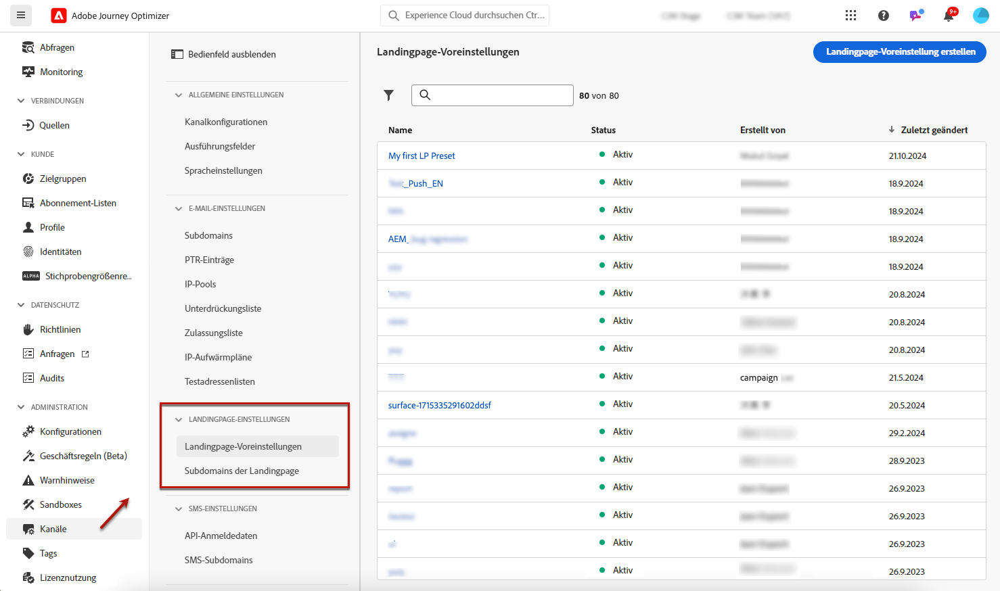
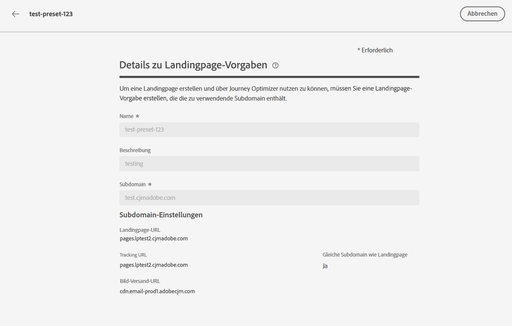
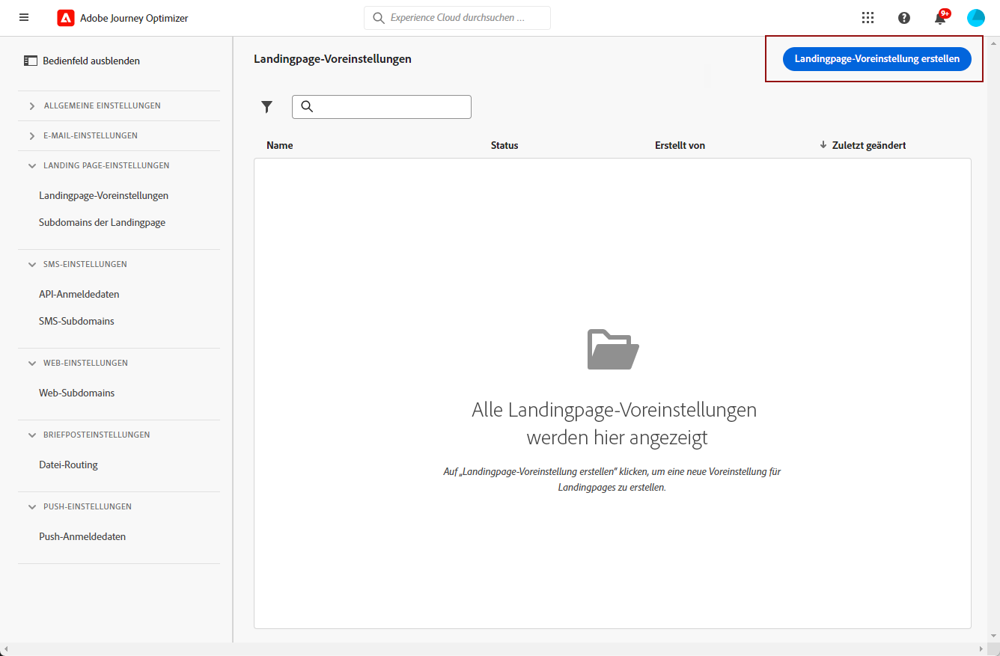
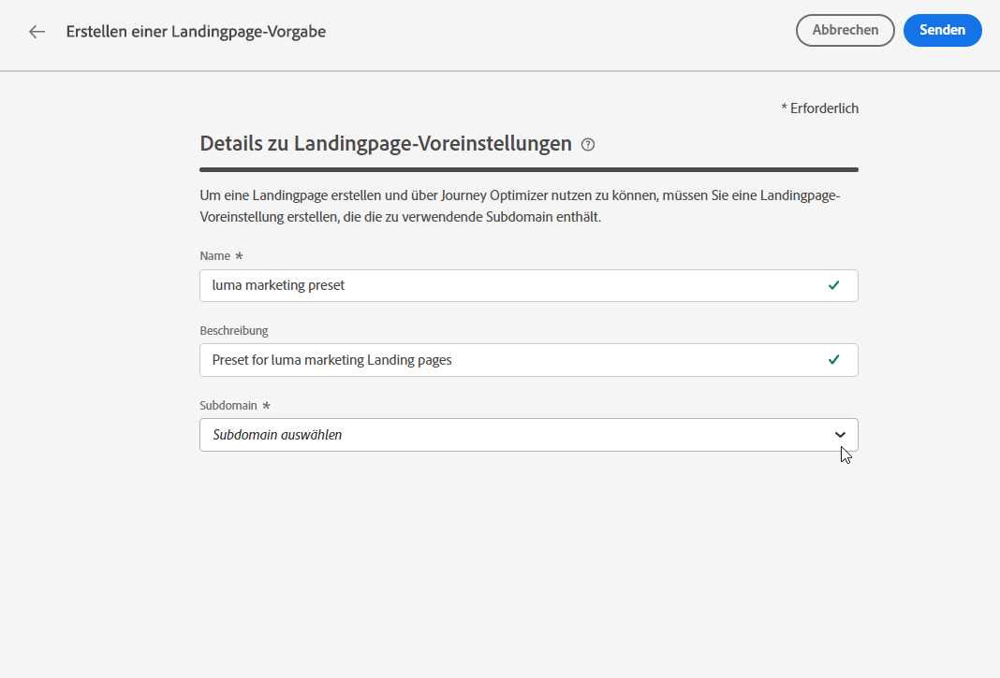
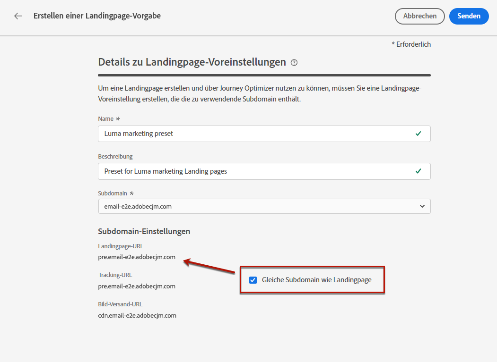
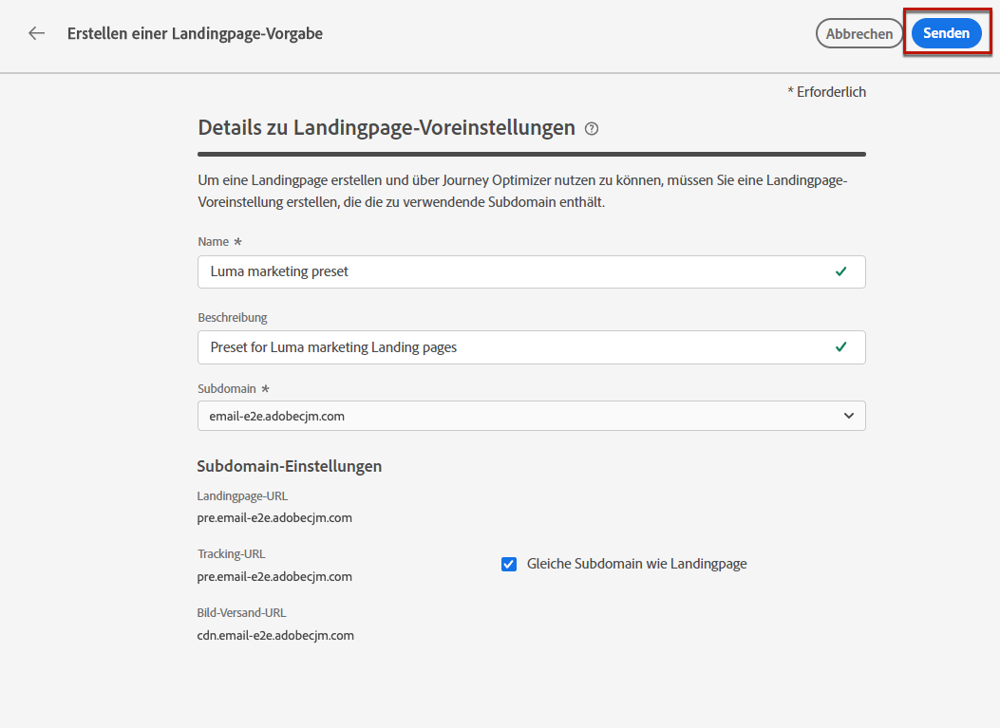
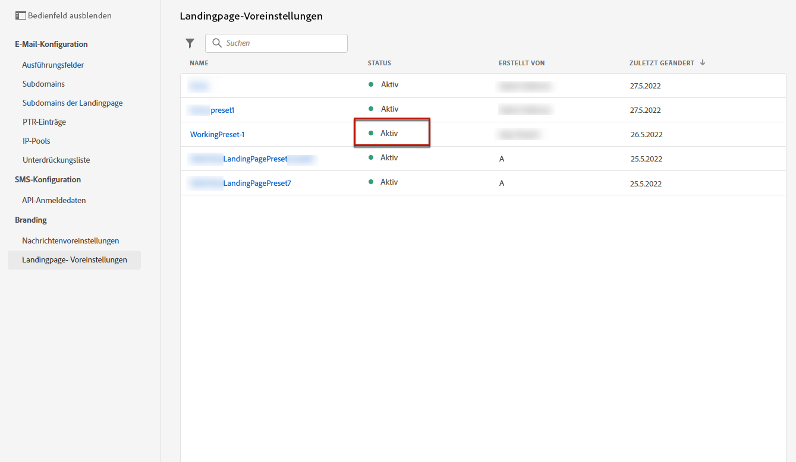

# Definieren der Landingpage-Voreinstellungen {#lp-presets}

>[!CONTEXTUALHELP]
>id="ajo_admin_config_lp_subdomain_header"
>title="Erstellen einer Landingpage-Voreinstellung"
>abstract="Um eine Landingpage erstellen und über Journey Optimizer nutzen zu können, müssen Sie eine Landingpage-Voreinstellung erstellen, die die zu verwendende Subdomain enthält."

Beim [Erstellen einer Landingpage](../landing-pages/create-lp.md#create-a-lp) müssen Sie eine Landingpage-Voreinstellung auswählen, damit Sie die Landingpage erstellen und über **[!DNL Journey Optimizer]** nutzen können.

## Zugriff auf Landingpage-Voreinstellungen {#access-lp-presets}

Gehen Sie wie folgt vor, um auf Landingpage-Voreinstellungen zuzugreifen.

1. Rufen Sie das Menü **[!UICONTROL Administration]** > **[!UICONTROL Kanäle]** auf.

1. Wählen Sie **[!UICONTROL Branding]** > **[!UICONTROL Landingpage-Voreinstellungen]** aus.

   

1. Klicken Sie auf eine beliebige Voreinstellungsbeschriftung, um auf die Voreinstellungsdetails der Landingpage zuzugreifen.

   

## Erstellen einer Landingpage-Voreinstellung {#lp-create-preset}

Gehen Sie wie folgt vor, um eine Landingpage-Voreinstellung zu erstellen.

>[!NOTE]
>
>Um eine Voreinstellung erstellen zu können, müssen Sie zuvor mindestens eine Landingpage-Subdomain konfiguriert haben. [Weitere Informationen dazu](lp-subdomains.md)

1. Rufen Sie das Menü **[!UICONTROL Administration]** > **[!UICONTROL Kanäle]** auf und wählen Sie dann **[!UICONTROL Branding]** > **[!UICONTROL Landingpage-Voreinstellungen]**.

1. Wählen Sie **[!UICONTROL Landingpage-Voreinstellung erstellen]** aus.

   

1. Geben Sie einen Namen und eine Beschreibung für die Voreinstellung ein.

   >[!NOTE]
   >
   > Namen müssen mit einem Buchstaben (A–Z) beginnen. Ein Name darf nur alphanumerische Zeichen enthalten. Sie können auch die Zeichen Unterstrich `_`, Punkt `.` und Bindestrich `-` verwenden.

1. Wählen Sie aus der Dropdown-Liste eine Landingpage-Subdomain aus.

   

   >[!NOTE]
   >
   >Um eine Subdomain auswählen zu können, müssen Sie zuvor mindestens eine Landingpage-Subdomain konfiguriert haben. [Weitere Informationen dazu](#lp-subdomains)

   Die der ausgewählten Subdomain entsprechenden Einstellungen werden angezeigt.

1. Wenn Sie die Landingpage-Subdomain als Tracking-URL auswählen möchten, aktivieren Sie die Option **[!UICONTROL Gleiche Subdomain wie Landingpage]**. [Weitere Informationen zum Tracking](../email/message-tracking.md)

   

   Wenn zum Beispiel die URL der Landingpage „pages.mail.luma.com“ und die Tracking-URL „data.mail.luma.com“ lautet, können Sie „pages.mail.luma.com“ als Tracking-Subdomain wählen.

1. Klicken Sie auf **[!UICONTROL Senden]**, um die Erstellung der Landingpage-Voreinstellung zu bestätigen. <!--You can also save the preset as draft and resume its configuration later on.-->

   <!---->

1. Nachdem die Landingpage-Voreinstellung erstellt wurde, wird sie in der Liste mit dem Status **[!UICONTROL Aktiv]** angezeigt. Sie kann nun für Ihre Landingpages verwendet werden.

   

Sie sind nun bereit, in [!DNL Journey Optimizer] [Landingpages zu erstellen](../landing-pages/create-lp.md).
<!--
>[!NOTE]
>
>Learn how to create channel surfaces for push notifications and emails in [this section](channel-surfaces.md).-->

**Verwandte Themen**:

* [Erste Schritte mit Landingpages](../landing-pages/get-started-lp.md)
* [Erstellen einer Landingpage](../landing-pages/create-lp.md#create-a-lp)
