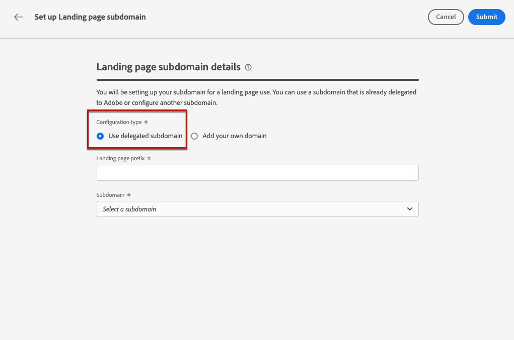

# Konfigurieren von Landingpage-Subdomains {#lp-subdomains}

>[!CONTEXTUALHELP]
>id="ajo_admin_subdomain_lp_header"
>title="Delegieren einer Subdomain der Landingpage"
>abstract="Sie richten Ihre Subdomain für die Verwendung einer Landingpage ein. Sie können eine Subdomain verwenden, die bereits an Adobe delegiert ist, oder eine andere Subdomain konfigurieren."

>[!CONTEXTUALHELP]
>id="ajo_admin_subdomain_lp"
>title="Delegieren einer Subdomain der Landingpage"
>abstract="Sie müssen eine Subdomain für Ihre Landingpages konfigurieren, da Sie diese Subdomain zum Erstellen einer Landingpage-Voreinstellung benötigen. Sie können eine Subdomain verwenden, die bereits an Adobe delegiert wurde, oder eine neue Subdomain konfigurieren."
>additional-url="https://experienceleague.adobe.com/docs/journey-optimizer/using/landing-pages/lp-configuration/lp-presets.html?lang=de#lp-create-preset" text="Erstellen von Landingpage-Voreinstellungen"

>[!CONTEXTUALHELP]
>id="ajo_admin_config_lp_subdomain"
>title="Erstellen einer Landingpage-Voreinstellung"
>abstract="Um eine Landingpage-Voreinstellung erstellen zu können, müssen Sie zuvor mindestens eine Landingpage-Subdomain konfiguriert haben, die aus der Liste „Name der Subdomain“ ausgewählt werden kann."
>additional-url="https://experienceleague.adobe.com/docs/journey-optimizer/using/landing-pages/lp-configuration/lp-presets.html?lang=de#lp-create-preset" text="Erstellen von Landingpage-Voreinstellungen"

Um [Landingpage-Voreinstellungen](lp-presets.md) erstellen zu können, müssen Sie die Subdomains einrichten, die Sie für Ihre Landingpages verwenden werden.

Sie können eine Subdomain verwenden, die bereits an Adobe delegiert wurde, oder eine andere Subdomain konfigurieren. Weitere Informationen zum Delegieren von Subdomains an Adobe finden Sie in [diesem Abschnitt](../configuration/delegate-subdomain.md).

>[!CAUTION]
>
>Die Konfiguration der Subdomain von Landingpages ist in allen Umgebungen gleich. Daher wirkt sich jede Änderung an einer Subdomain von Landingpages auch auf die Produktions-Sandboxes aus.

Beachten Sie, dass Großbuchstaben in einer Subdomain nicht zulässig sein sollten

## Verwenden einer vorhandenen Subdomain {#lp-use-existing-subdomain}

Gehen Sie wie folgt vor, um eine Subdomain zu verwenden, die bereits an Adobe delegiert wurde.

1. Rufen Sie das Menü **[!UICONTROL Administration]** > **[!UICONTROL Kanäle]** auf und wählen Sie **[!UICONTROL E-Mail-Konfiguration]** > **[!UICONTROL Landingpage-Subdomains]**.

   

1. Klicken Sie auf **[!UICONTROL Subdomain einrichten]**.

   

1. Wählen Sie **[!UICONTROL Delegierte Domain verwenden]** im Abschnitt **[!UICONTROL Konfigurationstyp]**.

   

1. Geben Sie das Präfix ein, das in Ihrer Landingpage-URL angezeigt werden soll.

   >[!NOTE]
   >
   >Nur alphanumerische Zeichen und Bindestriche sind zulässig.

1. Wählen Sie aus der Liste eine delegierte Subdomain aus.

   >[!NOTE]
   >
   >Sie können keine Subdomain auswählen, die bereits als Landingpage-Subdomain verwendet wird.

   <!--Capital letters are not allowed in subdomains. TBC by PM-->

   

   Beachten Sie, dass Sie nicht mehrere delegierte Subdomains derselben übergeordneten Domain verwenden können. Wenn zum Beispiel „marketing1.meinefirma.com“ bereits für Ihre Landingpages an Adobe delegiert wurde, können Sie „marketing2.meinefirma.com“ nicht verwenden. Da jedoch mehrstufige Subdomains für Landingpages unterstützt werden, können Sie eine Subdomain von „marketing1.meinefirma.com“ (z. B. „email.marketing1.meinefirma.com“) oder ansonsten eine andere übergeordnete Domain verwenden.

   >[!CAUTION]
   >
   >Wenn Sie eine Domain auswählen, die mit der [CNAME-Methode](../configuration/delegate-subdomain.md#cname-subdomain-delegation) an Adobe delegiert wurde, müssen Sie den DNS-Eintrag auf Ihrer Hosting-Plattform erstellen. Um den DNS-Eintrag zu generieren, gehen Sie genauso vor wie bei der Konfiguration einer neuen Landingpage-Subdomain. Weitere Informationen dazu finden Sie in [diesem Abschnitt](#lp-configure-new-subdomain).

1. Klicken Sie auf **[!UICONTROL Senden]**.

1. Nach der Übermittlung wird die Subdomain in der Liste mit dem Status **[!UICONTROL Wird verarbeitet]** angezeigt. Weiterführende Informationen zum Status von Subdomains finden Sie in [diesem Abschnitt](../configuration/about-subdomain-delegation.md#access-delegated-subdomains).<!--Same statuses?-->

   

   >[!NOTE]
   >
   >Bevor Sie diese Subdomain zum Senden von Nachrichten verwenden können, müssen Sie warten, bis Adobe die erforderlichen Prüfungen durchgeführt hat, was bis zu 4 Stunden dauern kann.<!--Learn more in [this section](delegate-subdomain.md#subdomain-validation).-->

1. Sobald die Prüfungen erfolgreich abgeschlossen sind, erhält die Subdomain den Status **[!UICONTROL Erfolg]**. Sie können jetzt damit Landingpage-Voreinstellungen erstellen.

## Konfigurieren einer neuen Subdomain {#lp-configure-new-subdomain}

>[!CONTEXTUALHELP]
>id="ajo_admin_lp_subdomain_dns"
>title="Erstellen des passenden DNS-Eintrags"
>abstract="Um eine neue Landingpage-Subdomain zu konfigurieren, müssen Sie die auf der Journey Optimizer-Benutzeroberfläche angezeigten Adobe-Nameserver-Informationen kopieren und in Ihre Domain-Hosting-Lösung einfügen, um den passenden DNS-Eintrag zu generieren. Nachdem die Prüfungen erfolgreich waren, kann die Subdomain zur Erstellung von Landingpage-Voreinstellungen verwendet werden."

Gehen Sie wie folgt vor, um eine neue Subdomain zu konfigurieren.

1. Rufen Sie das Menü **[!UICONTROL Administration]** > **[!UICONTROL Kanäle]** auf und wählen Sie **[!UICONTROL E-Mail-Konfiguration]** > **[!UICONTROL Landingpage-Subdomains]**.

1. Klicken Sie auf **[!UICONTROL Subdomain einrichten]**.

1. Wählen Sie **[!UICONTROL Eigene Domain hinzufügen]** im Abschnitt **[!UICONTROL Konfigurationstyp]**.

   

1. Geben Sie die zu delegierende Subdomain an.

   >[!CAUTION]
   >
   >Sie können keine schon vorhandene Landingpage-Subdomain verwenden.
   >
   >Großbuchstaben sind in Subdomains nicht zulässig.

   Es ist nicht zulässig, Adobe eine ungültige Subdomain zuzuweisen. Vergewissern Sie sich, dass Sie eine gültige Subdomain eingeben, die Ihrem Unternehmen gehört, z. B. marketing.ihrunternehmen.com.

   >[!NOTE]
   >
   >Bei Landingpages werden mehrstufige Subdomains unterstützt. Sie können beispielsweise „email.marketing.meinefirma.com“ verwenden.

1. Die Liste der Einträge, die auf Ihren DNS-Servern gespeichert werden sollen, wird angezeigt. Kopieren Sie diesen Datensatz oder laden Sie eine CSV-Datei herunter und navigieren Sie dann zu Ihrer Domain-Hosting-Lösung, um den entsprechenden DNS-Eintrag zu generieren.

1. Stellen Sie sicher, dass in Ihrer Domain-Hosting-Lösung ein DNS-Eintrag generiert wurde. Wenn alles ordnungsgemäß konfiguriert ist, aktivieren Sie die Checkbox „Ich bestätige...“ und klicken Sie dann auf **[!UICONTROL Senden]**.

   

   >[!NOTE]
   >
   >Wenn Sie eine neue Landingpage-Subdomain konfigurieren, verweist sie immer auf einen CNAME-Eintrag.

1. Nachdem die Subdomain-Zuweisung übermittelt wurde, wird die Subdomain in der Liste mit dem Status **[!UICONTROL In Verarbeitung]** angezeigt. Weiterführende Informationen zum Status von Subdomains finden Sie in [diesem Abschnitt](../configuration/about-subdomain-delegation.md#access-delegated-subdomains).<!--Same statuses?-->

   >[!NOTE]
   >
   >Bevor Sie diese Subdomain zum Senden von Nachrichten verwenden können, müssen Sie warten, bis Adobe die erforderlichen Prüfungen durchgeführt hat, was bis zu 4 Stunden dauern kann.<!--Learn more in [this section](#subdomain-validation).-->

1. Sobald die Prüfungen erfolgreich abgeschlossen sind, erhält die Subdomain den Status **[!UICONTROL Erfolg]**. Sie können jetzt damit Landingpage-Voreinstellungen erstellen.

   Beachten Sie, dass die Subdomain als **[!UICONTROL Fehlgeschlagen]** markiert wird, wenn Sie den Validierungseintrag in Ihrer Hosting-Lösung nicht erstellen können.
