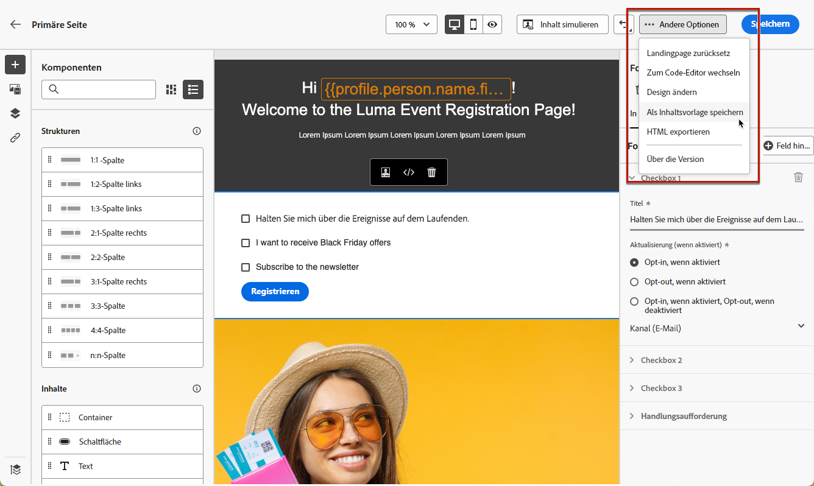
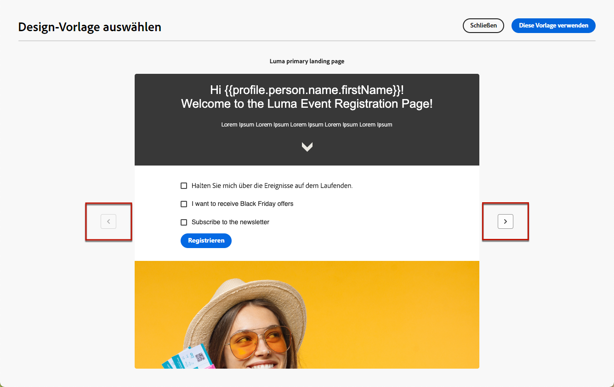

# Arbeiten mit Landingpage-Vorlagen {#work-with-templates}

## Speichern einer Seite als Vorlage {#save-as-template}

Sobald Sie Ihre [Landingpage-Inhalte](lp-content.md) entworfen haben, können Sie sie zur späteren Wiederverwendung speichern. Gehen Sie dazu wie folgt vor.

1. Klicken Sie oben rechts im Bildschirm auf das Symbol mit den Auslassungszeichen.

1. Wählen Sie aus dem Dropdown-Menü **[!UICONTROL Designvorlage speichern]** aus.

   

1. Fügen Sie dieser Vorlage einen Namen hinzu.

   

1. Klicken Sie auf **[!UICONTROL Speichern]**.

Wenn Sie das nächste Mal eine Landingpage erstellen, können Sie diese Vorlage verwenden, um Inhalte zu erstellen. Wie das geht, erfahren Sie im folgenden [Abschnitt](#use-saved-template).

## Verwenden einer gespeicherten Vorlage {#use-saved-template}

1. Öffnen Sie den [Inhalts-Designer für Landingpages](design-lp.md). Die Liste aller zuvor gespeicherten Vorlagen wird angezeigt.

1. Sie können sie nach **[!UICONTROL Name]**, **[!UICONTROL Zuletzt geändert]** und **[!UICONTROL Zuletzt erstellt]** sortieren.

   

1. Wählen Sie aus der Liste die gewünschte Vorlage aus.

1. Nach der Auswahl können Sie mithilfe der Rechts- und Linkspfeile zwischen allen gespeicherten Vorlagen wechseln.

   

1. Klicken Sie auf **[!UICONTROL Diese Landingpage verwenden]**.

1. Bearbeiten Sie die Inhalte nach Bedarf mit dem Landingpage-Designer.

>[!NOTE]
>
>Primärseitenvorlagen und Unterseitenvorlagen werden separat verwaltet, d. h. Sie können keine Primärseitenvorlage zum Erstellen einer Unterseite verwenden und umgekehrt.
