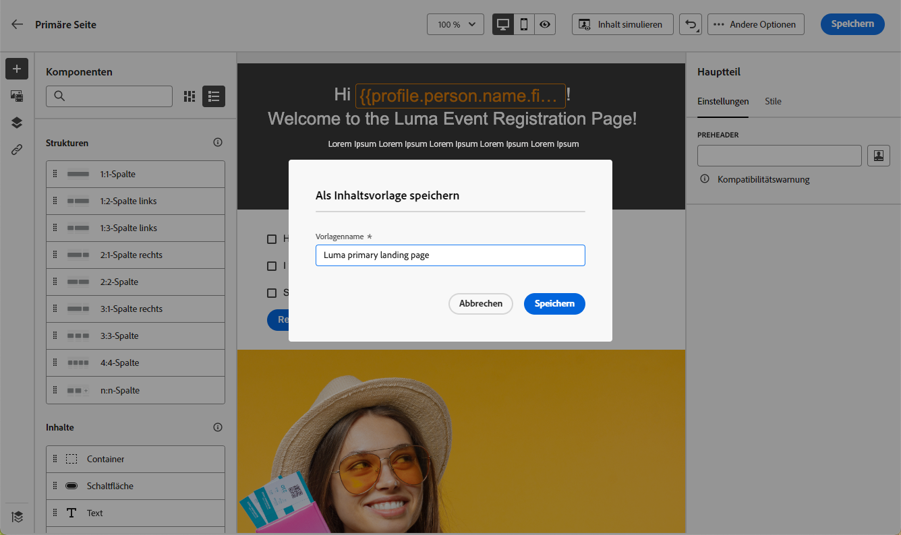

# Landingpage-Vorlagen verwenden {#work-with-templates}

## Seite als Vorlage speichern {#save-as-template}

Sobald Sie Ihre [Landingpage-Inhalt](lp-content.md), können Sie sie zur späteren Wiederverwendung speichern. Gehen Sie dazu wie folgt vor.

1. Klicken Sie oben rechts im Bildschirm auf das Auslassungszeichen.

1. Auswählen **[!UICONTROL Save design template]** aus dem Dropdown-Menü.

   

1. Fügen Sie dieser Vorlage einen Namen hinzu.

   

1. Klicken **[!UICONTROL Save]**.

Wenn Sie das nächste Mal eine Landingpage erstellen, können Sie diese Vorlage verwenden, um Inhalte zu erstellen. Erfahren Sie mehr über [Abschnitt](#use-saved-template) unten.

## Verwenden einer gespeicherten Vorlage {#use-saved-template}

1. Öffnen Sie die [Inhaltserstellung für Landingpages](design-lp.md). Die Liste aller zuvor gespeicherten Vorlagen wird angezeigt.

1. Sie können sie sortieren **[!UICONTROL By name]**, **[!UICONTROL Last modified]** und **[!UICONTROL Last created]**.

   

1. Wählen Sie aus der Liste die gewünschte Vorlage aus.

1. Nach der Auswahl können Sie mithilfe der Rechts- und Linkspfeile zwischen allen gespeicherten Vorlagen navigieren.

   

1. Klicken **[!UICONTROL Use this landing page]**.

1. Bearbeiten Sie den Inhalt nach Bedarf mit dem Landingpage-Designer.

>[!NOTE]
>
>Primäre Seitenvorlagen und Unterseitenvorlagen werden separat verwaltet, d. h., Sie können keine primäre Seitenvorlage zum Erstellen einer Unterseite verwenden und umgekehrt.
