# Anwendungsfälle für Landingpages

Im Folgenden finden Sie einige Beispiele für die Verwendung von [!DNL Journey Optimizer] -Landingpages verwenden, damit Ihre Kunden bestimmte oder alle Ihre Nachrichten an- bzw. abmelden können.

<!--The main use cases are:
* Subscription to a service
* Opt-in
* Opt-out-->

## Dienstanmeldung {#subscription-to-a-service}

Einer der häufigsten Anwendungsfälle besteht darin, Ihre Kunden zu [Dienst abonnieren](subscription-list.md) (z. B. einen Newsletter oder ein Ereignis) über eine Landingpage. Die wichtigsten Schritte werden im unten stehenden Diagramm dargestellt:

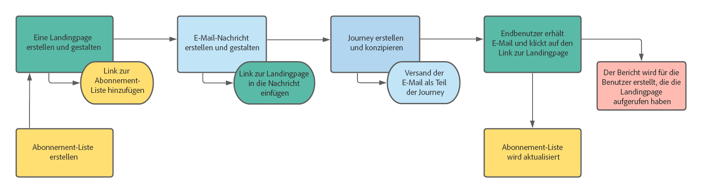

Angenommen, Sie organisieren im nächsten Monat eine Veranstaltung und möchten eine Kampagne zur Ereignisregistrierung starten<!--to keep your customers that are interested updated on that event-->. Senden Sie dazu eine E-Mail mit einem Link zu einer Landingpage, über die sich Ihre Empfänger für dieses Ereignis registrieren können. Die Benutzer, die sich registrieren, werden zur Abonnementliste hinzugefügt, die Sie zu diesem Zweck erstellt haben.

### Landingpage einrichten

1. Erstellen Sie die Abonnementliste der Ereignisregistrierung, in der die registrierten Benutzer gespeichert werden. Erfahren Sie, wie Sie eine Abonnementliste erstellen [here](subscription-list.md#define-subscription-list).

   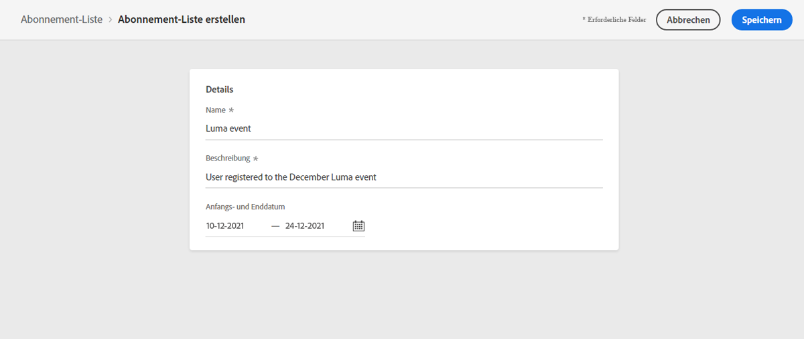

1. [Landingpage erstellen](create-lp.md) , damit sich Ihre Empfänger für Ihr Ereignis registrieren können.

1. Registrierung konfigurieren [primäre Landingpage](create-lp.md#configure-primary-page).

1. Beim Entwerfen der [Landingpage-Inhalt](design-lp.md)Wählen Sie die von Ihnen erstellte Abonnementliste aus, um sie mit den Profilen zu aktualisieren, die das Registrierungs-Kontrollkästchen aktivieren.

   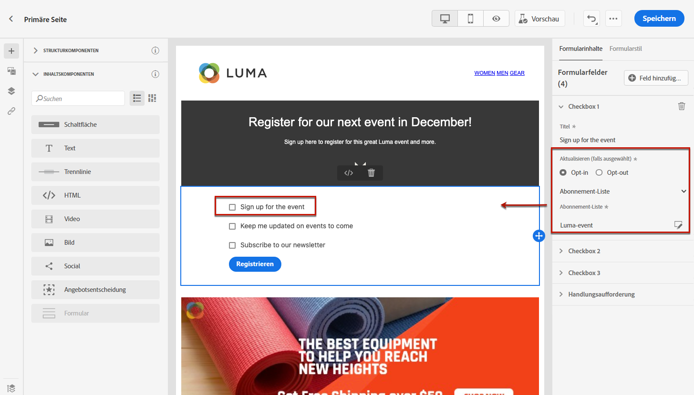

1. Erstellen Sie eine Dankeseite, die Ihren Empfängern angezeigt wird, sobald sie das Registrierungsformular übermitteln. Erfahren Sie, wie Sie Landingsubpages konfigurieren [here](create-lp.md#configure-subpages).

   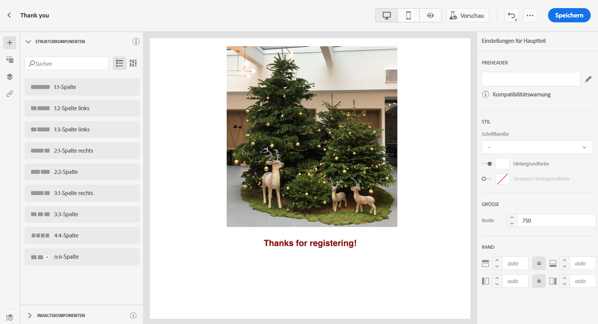

1. Landingpage publizieren.

1. [E-Mail-Nachricht erstellen](../create-message.md) um anzukündigen, dass die Registrierung nun für Ihre Veranstaltung geöffnet ist.

1. [Link einfügen](../message-tracking.md#insert-links) in Ihren Nachrichteninhalt. Auswählen **[!UICONTROL Landingpage]** als **[!UICONTROL Link-Typ]** und wählen Sie die [Landingpage](create-lp.md#configure-primary-page) die Sie für die Registrierung erstellt haben.

   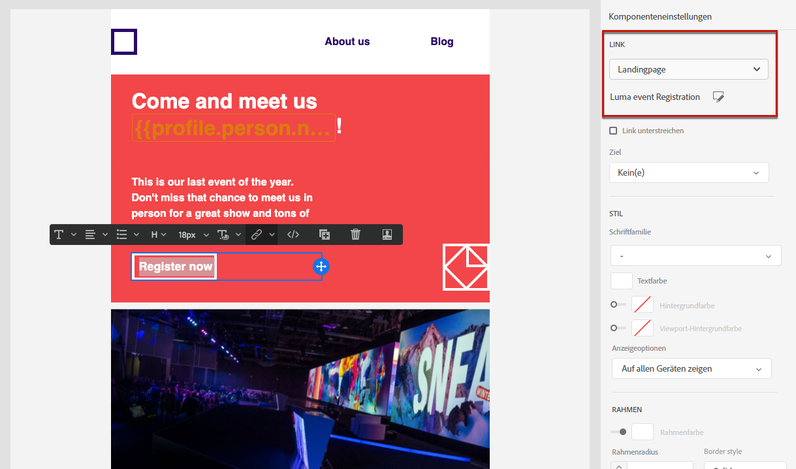

1. Speichern Sie den Inhalt und [veröffentlichen Sie Ihre Nachricht](../publish-manage-message.md).

1. Senden Sie die Nachricht über eine [Journey](../building-journeys/journey.md) um den Traffic zur Anmelde-Landingpage zu leiten.

   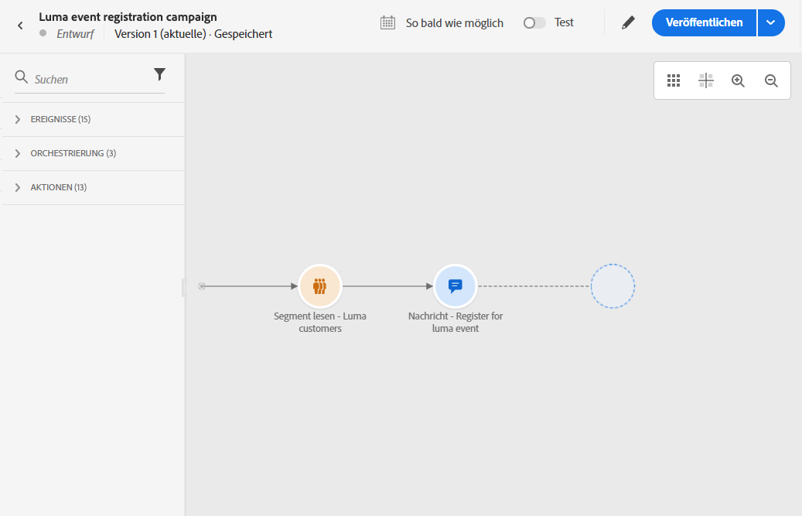

   Wenn Ihre Empfänger nach dem Erhalt der E-Mail auf den Link zur Landingpage klicken, werden sie zur Dankeseite weitergeleitet und auf die Abonnementliste gesetzt.

### Bestätigungs-E-Mail senden {#send-confirmation-email}

Zusätzlich können Sie eine Bestätigungs-E-Mail an die Empfänger senden, die sich für Ihr Ereignis registriert haben. Gehen Sie dazu wie folgt vor.

1. Erstellen eines weiteren [Journey](../building-journeys/journey.md). Sie können dies direkt über die Landingpage tun, indem Sie auf die **[!UICONTROL Journey erstellen]** Schaltfläche. [Weitere Informationen](create-lp.md#configure-primary-page)

   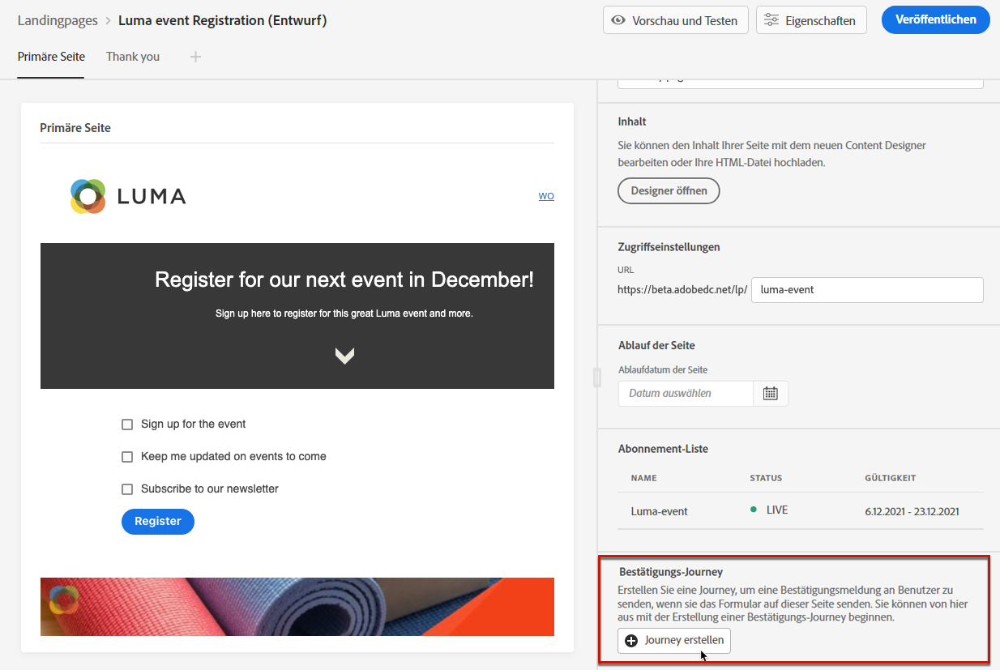

1. Erweitern Sie die Kategorie **[!UICONTROL Ereignisse]** und legen Sie eine Aktivität vom Typ **[!UICONTROL Segmentqualifikation]** auf Ihrer Arbeitsfläche ab. [Weitere Informationen](../building-journeys/segment-qualification-events.md)

1. Klicken Sie in **[!UICONTROL Segment]** und wählen Sie die von Ihnen erstellte Abonnementliste aus.

   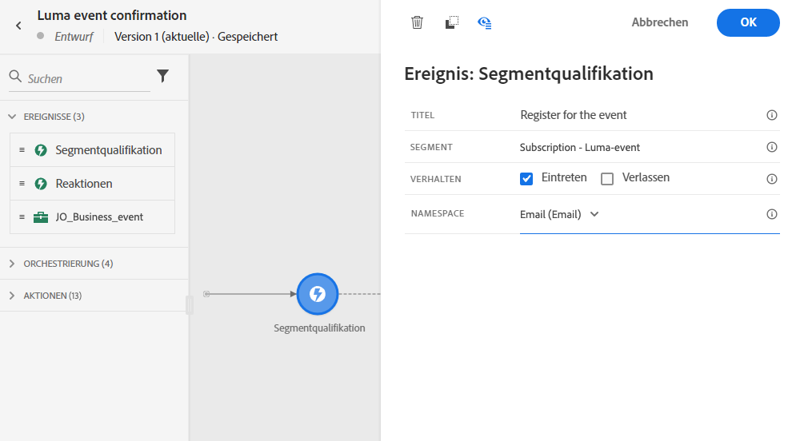

1. Wählen Sie die Bestätigungs-E-Mail Ihrer Wahl aus und senden Sie sie über die Journey.

   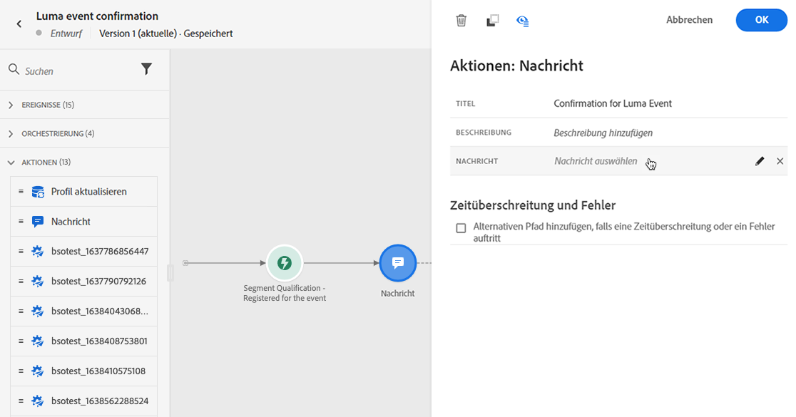

Alle Benutzer, die sich für Ihr Ereignis registriert haben, erhalten die Bestätigungs-E-Mail.

<!--The event registration's subscription list tracks the profiles who registered and you can send them targeted event updates.-->

## Abwahl {#opt-out}

Damit sich Ihre Empfänger von Ihrer Nachricht abmelden können, können Sie in Ihre E-Mails einen Link zu einer Opt-out-Landingpage einfügen.

Erfahren Sie mehr über die Verwaltung der Zustimmung Ihrer Empfänger und darüber, warum dies in [diesem Abschnitt](../consent.md).

### Opt-out-Verwaltung {#opt-out-management}

Die Möglichkeit für Empfänger, den Empfang von Mitteilungen einer Marke zu kündigen, ist eine gesetzliche Anforderung. Weitere Informationen zu den geltenden Rechtsvorschriften finden Sie in der [Dokumentation zu Adobe Experience Platform](https://experienceleague.adobe.com/docs/experience-platform/privacy/regulations/overview.html?lang=de){target=&quot;_blank&quot;}.

Aus diesem Grund müssen Sie in jeder E-Mail, die an Empfänger gesendet wird, immer einen **Link zur Abmeldung** einfügen:

* Durch das Klicken auf diesen Link werden die Empfänger zu einer Landingpage mit einer Schaltfläche zur Bestätigung weitergeleitet.
* Nach dem Klicken auf die Opt-out-Schaltfläche werden die Profildaten mit diesen Informationen aktualisiert.

### Konfigurieren des Opt-outs {#configure-opt-out}

Gehen Sie wie folgt vor, um Empfängern einer E-Mail zu ermöglichen, sich über eine Landingpage von Ihrer Nachricht abzumelden.

1. Erstellen Sie Ihre Landingpage. [Weitere Informationen](create-lp.md)

1. Definieren Sie die primäre Seite. [Weitere Informationen](create-lp.md#configure-primary-page)

1. [Design](design-lp.md) Primärseiteninhalt: Landingpage-spezifisch verwenden **[!UICONTROL Formular]** -Komponente, definieren Sie eine **[!UICONTROL Opt-out]** und wählen Sie die Option **[!UICONTROL Kanal (E-Mail)]**: Das Profil, das das Opt-out-Feld auf Ihrer Landingpage aktiviert, wird von all Ihrer Kommunikation ausgeschlossen.

   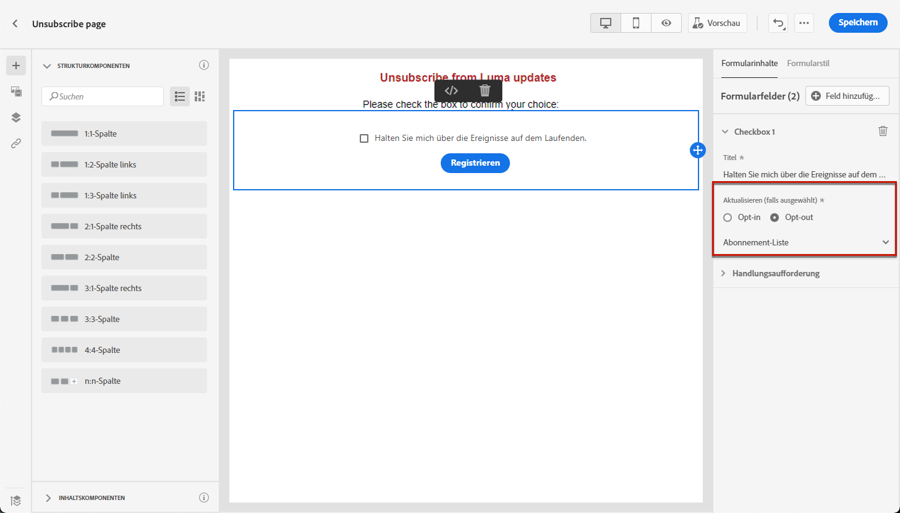

   <!--You can also build your own landing page and host it on the third-party system of your choice. To keep?-->

1. Bestätigung hinzufügen [subpage](create-lp.md#configure-subpages) wird den Benutzern angezeigt, die das Formular senden.

   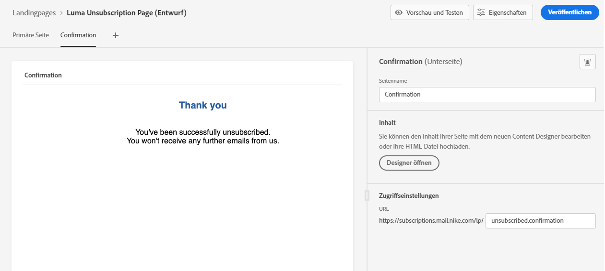

   >[!NOTE]
   >
   >Vergewissern Sie sich, dass Sie auf die Unterseite im **[!UICONTROL Formular]** Komponenten **[!UICONTROL Aktionsaufruf]** auf der primären Seite. [Weitere Informationen](design-lp.md)

1. Nachdem Sie den Inhalt Ihrer Seiten konfiguriert und definiert haben, [publish](create-lp.md#publish) die Landingpage.

   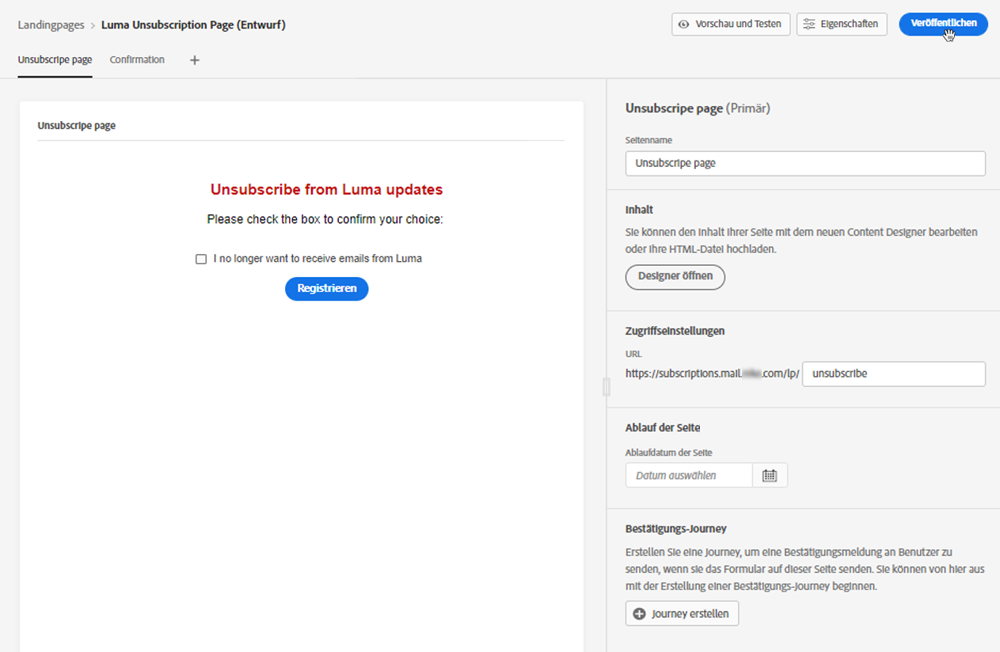

1. [E-Mail-Nachricht erstellen](../create-message.md) in [!DNL Journey Optimizer].

1. Wählen Sie Text in Ihrem Inhalt aus und [Link einfügen](../message-tracking.md#insert-links) über die dedizierte Symbolleiste. Sie können auch einen Link auf einer Schaltfläche verwenden.

   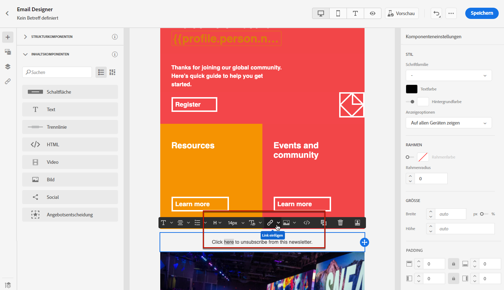

1. Auswählen **[!UICONTROL Landingpage]** von **[!UICONTROL Link-Typ]** Dropdown-Liste aus und wählen Sie die [Landingpage](create-lp.md#configure-primary-page) die Sie für die Abmeldung erstellt haben.

   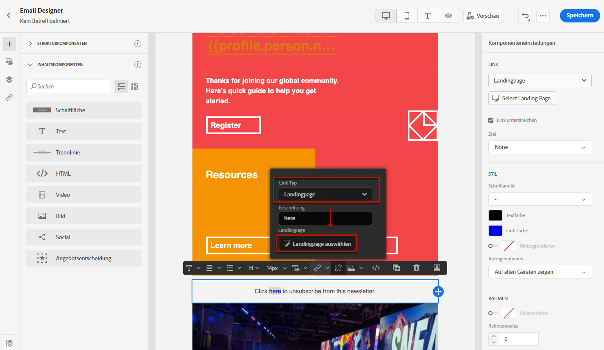

1. Speichern Sie den Inhalt und [veröffentlichen Sie Ihre Nachricht](../publish-manage-message.md).

1. Senden Sie Ihre Nachricht über eine Journey. [Weitere Informationen](../building-journeys/journey.md).

1. Wenn ein Empfänger nach Erhalt der Nachricht auf den Abmelde-Link in der E-Mail klickt, wird Ihre Landingpage angezeigt.

   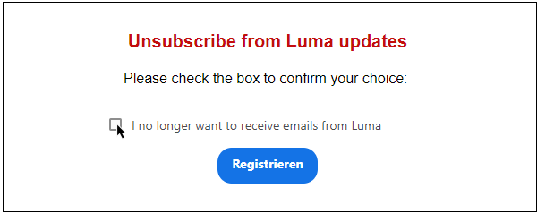

1. Wenn der Empfänger auf der Landingpage das Kästchen markiert und das Formular sendet:

   * Der abgemeldete Empfänger wird zum Bestätigungsbildschirm weitergeleitet.

   * Die Profildaten werden aktualisiert und erhalten keine Nachrichten von Ihrer Marke, es sei denn, Sie haben sich erneut angemeldet.

Um sich zu vergewissern, dass die Aktualisierung des betreffenden Profils erfolgt ist, öffnen Sie das Profil in Adobe Experience Platform, indem Sie einen Identity-Namespace und einen entsprechenden Identitätswert auswählen. Weitere Informationen finden Sie in der [Dokumentation zu Experience Platform](https://experienceleague.adobe.com/docs/experience-platform/profile/ui/user-guide.html?lang=de#getting-started){target=&quot;_blank&quot;}.

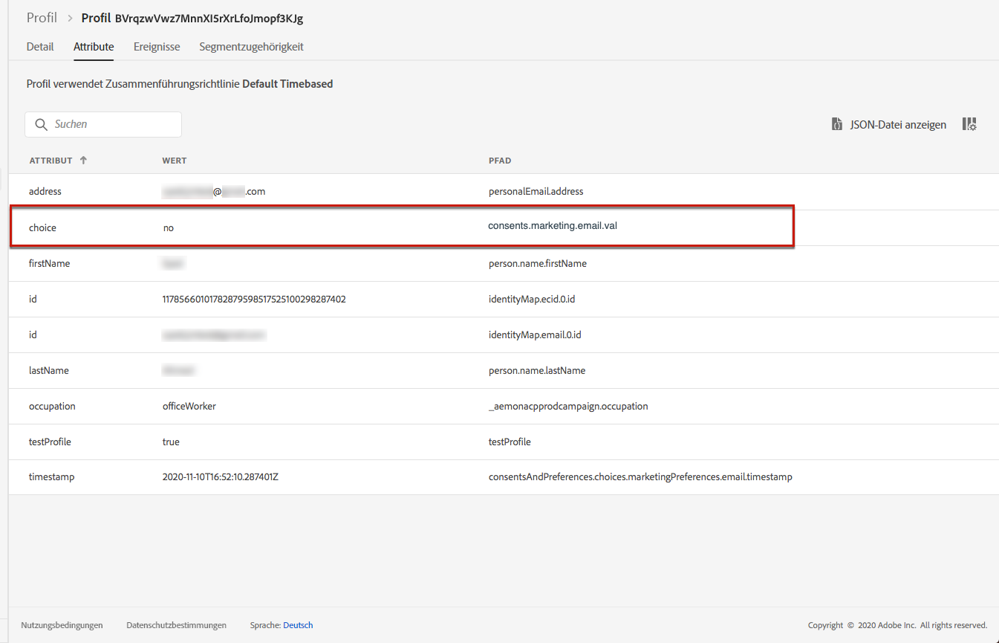

Auf der Registerkarte **[!UICONTROL Attribute]** sehen Sie, dass der Wert für **[!UICONTROL choice]** auf **[!UICONTROL no]** geändert wurde.

<!--

### Other ways to opt out

You can also enable your recipients to unsubscribe whithout using landing pages.

* **One-click opt-out**

    You can add a one-click opt-out link into your email content. This will enable your recipients to quickly unsubscribe from your communications, without being redirected to a landing page where they need to confirm opting out. [Learn more](../message-tracking.md#one-click-opt-out-link)

* **Unsubscribe link in header**

    If the recipients' email client supports displaying an unsubscribe link in the email header, emails sent with [!DNL Journey Optimizer] automatically include this link. [Learn more](../consent.md#unsubscribe-email)
-->
