# Anwendungsfälle für Landingpages {#lp-use-cases}

Im Folgenden finden Sie einige Beispiele für die Verwendung [!DNL Journey Optimizer] Landingpages zum kundenseitigen Opt-in/Opt-out für bestimmte oder alle Ihre Nachrichten.

## Dienst abonnieren {#subscription-to-a-service}

Einer der häufigsten Anwendungsfälle besteht darin, Ihre Kunden über eine Landingpage zum [Abonnieren eines Services](subscription-list.md) (z. B. eines Newsletters oder einer Veranstaltung) aufzufordern. Die wichtigsten Schritte werden im folgenden Diagramm dargestellt:

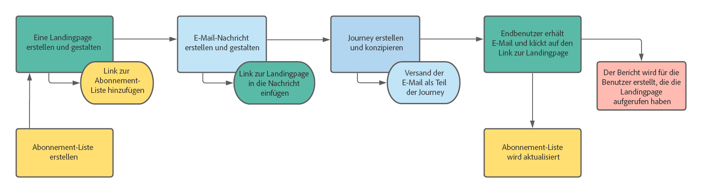

Angenommen, Sie organisieren im nächsten Monat eine Veranstaltung und möchten eine Kampagne zur Veranstaltungsregistrierung starten<!--to keep your customers that are interested updated on that event-->. Senden Sie dazu eine E-Mail mit einem Link zu einer Landingpage, über die sich Ihre Empfänger für diese Veranstaltung registrieren können. Die Benutzer, die sich registrieren, werden der Abonnement-Liste hinzugefügt, die Sie zu diesem Zweck erstellt haben.

### Einrichten einer Landingpage {#set-up-lp}

Um eine Landingpage für die Registrierung von Ereignissen einzurichten, erstellen Sie eine Abonnement-Liste, gestalten die Landingpage mit einem Registrierungsformular und konfigurieren die erforderlichen Seiten und Einstellungen. Führen Sie die folgenden Schritte aus:

1. Erstellen Sie die Abonnement-Liste der Ereignisregistrierung, in der die registrierten Benutzer gespeichert werden. Erfahren Sie (hier), wie [ Abonnement-Liste ](subscription-list.md#define-subscription-list).

   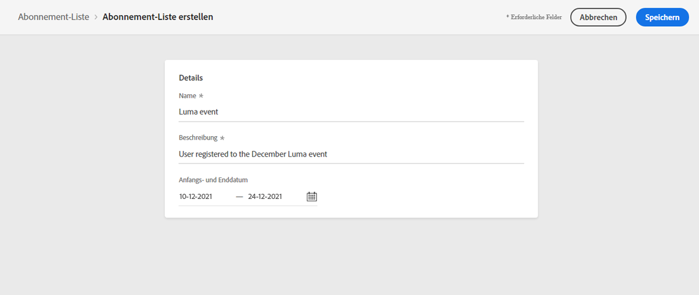

1. [Landingpage erstellen](create-lp.md) damit sich Ihre Empfänger für Ihre Veranstaltung registrieren können.

   

1. Konfigurieren Sie die Registrierung [primäre Landingpage](create-lp.md#configure-primary-page).

1. Wählen Sie beim Entwerfen der [Landingpage-Inhalte](design-lp.md) die von Ihnen erstellte Abonnement-Liste aus, um sie mit den Profilen zu aktualisieren, die das Registrierungs-Kontrollkästchen anklicken.

   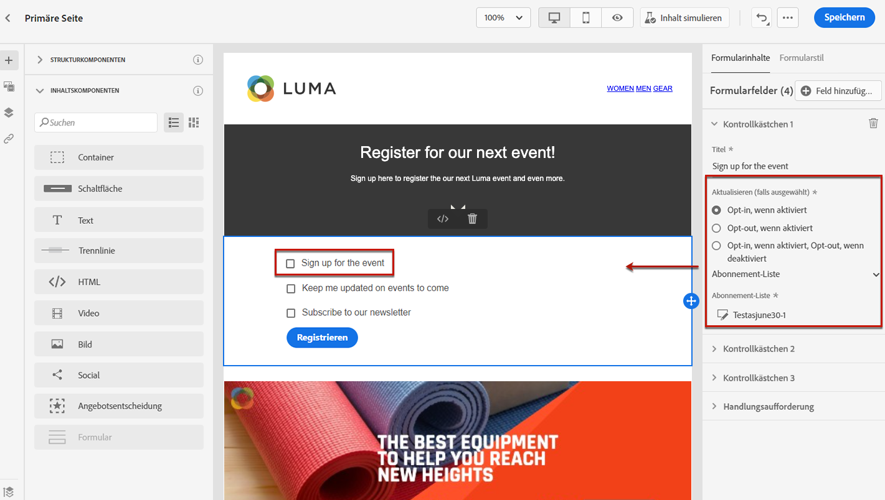

1. Erstellen Sie eine „Danke“-Seite, die Ihren Empfängern angezeigt wird, sobald sie das Registrierungsformular senden. Erfahren Sie (hier), wie Sie [ Unterseiten ](create-lp.md#configure-subpages).

   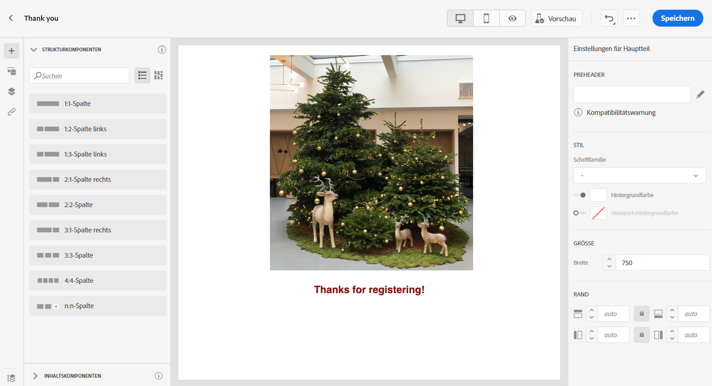

1. [Veröffentlichen](create-lp.md#publish-landing-page) der Landingpage.

1. Fügen Sie einer [Journey](../building-journeys/journey.md) die Aktivität **E-Mail** hinzu, um Traffic auf die Registrierungs-Landingpage zu lenken.

   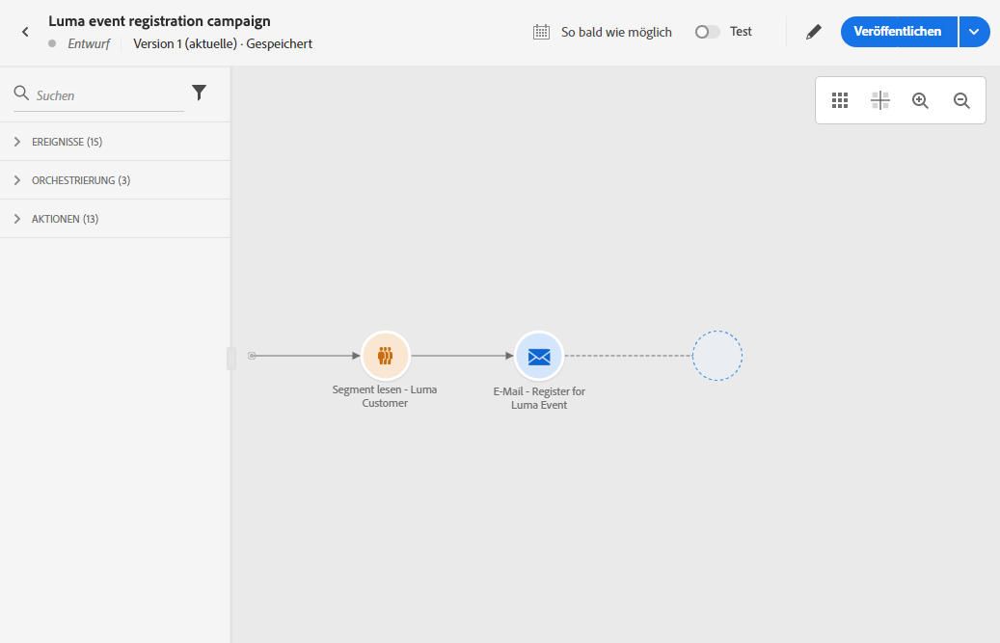

1. [Gestalten Sie die E](../email/get-started-email-design.md)Mail, um anzukündigen, dass die Anmeldung für Ihre Veranstaltung jetzt offen ist.

1. [Fügen Sie einen Link ein](../email/message-tracking.md#insert-links) in Ihren Nachrichteninhalt ein. Wählen Sie **[!UICONTROL Landingpage]** als **[!UICONTROL Link-Typ]** und wählen Sie die [Landingpage](create-lp.md#configure-primary-page), die Sie für die Registrierung erstellt haben.

   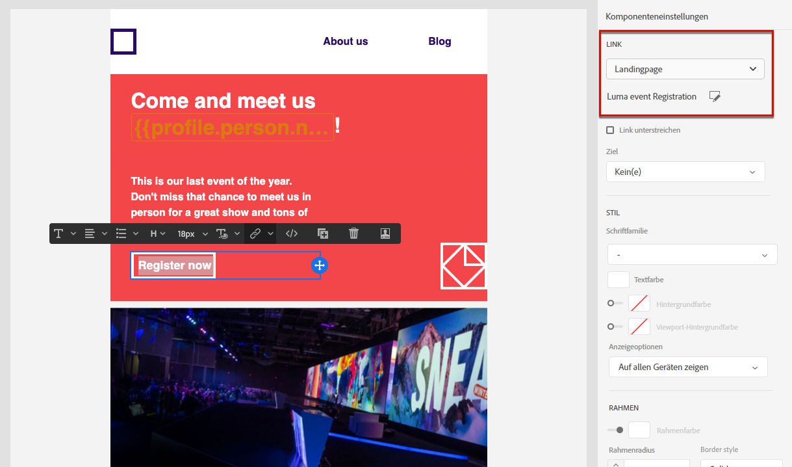

   >[!NOTE]
   >
   >Um Ihre Nachricht senden zu können, stellen Sie sicher, dass die von Ihnen ausgewählte Landingpage noch nicht abgelaufen ist. Erfahren Sie (in diesem Abschnitt), wie [ Ablaufdatum ](create-lp.md#configure-primary-page).

   Wenn Ihre Empfänger nach Erhalt der E-Mail auf den Link zur Landingpage klicken, werden sie zur „Danke“-Seite weitergeleitet und auf die Abonnement-Liste gesetzt.

### Bestätigungs-E-Mail senden {#send-confirmation-email}

Zusätzlich können Sie eine Bestätigungs-E-Mail an die Empfänger senden, die sich für Ihre Veranstaltung registriert haben. Gehen Sie dazu wie folgt vor.

1. Erstellen Sie eine weitere [Journey](../building-journeys/journey.md). Sie können dies direkt über die Landingpage tun, indem Sie auf die Schaltfläche **[!UICONTROL Journey erstellen]** klicken. [Weitere Informationen](create-lp.md#configure-primary-page)

   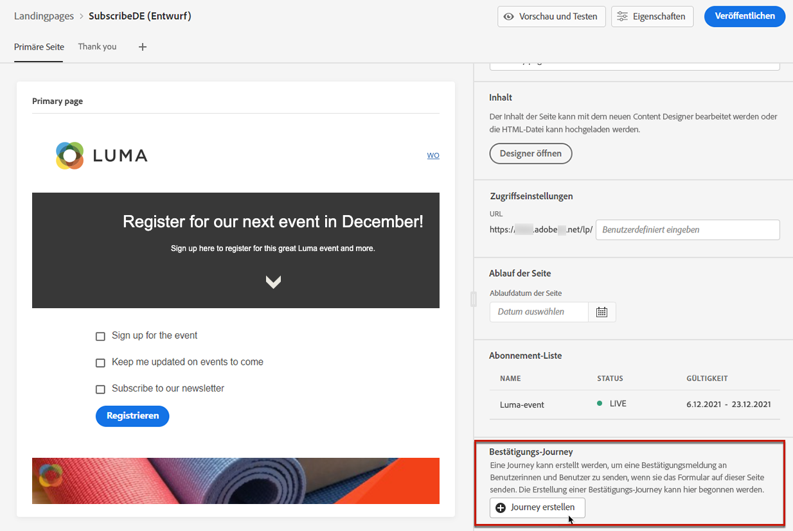

1. Erweitern Sie die Kategorie **[!UICONTROL Ereignisse]** und legen Sie eine Aktivität **[!UICONTROL Zielgruppen-Qualifizierung]** auf Ihrer Arbeitsfläche ab. [Weitere Informationen](../building-journeys/audience-qualification-events.md)

1. Klicken Sie in das Feld **[!UICONTROL Zielgruppe]** und wählen Sie die von Ihnen erstellte Abonnement-Liste aus.

   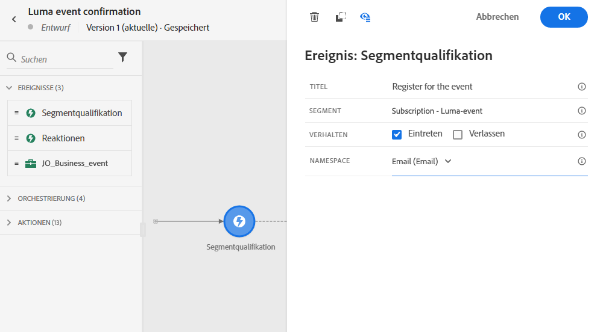

1. Fügen Sie eine Bestätigungs-E-Mail Ihrer Wahl hinzu und senden Sie sie über die Journey.

   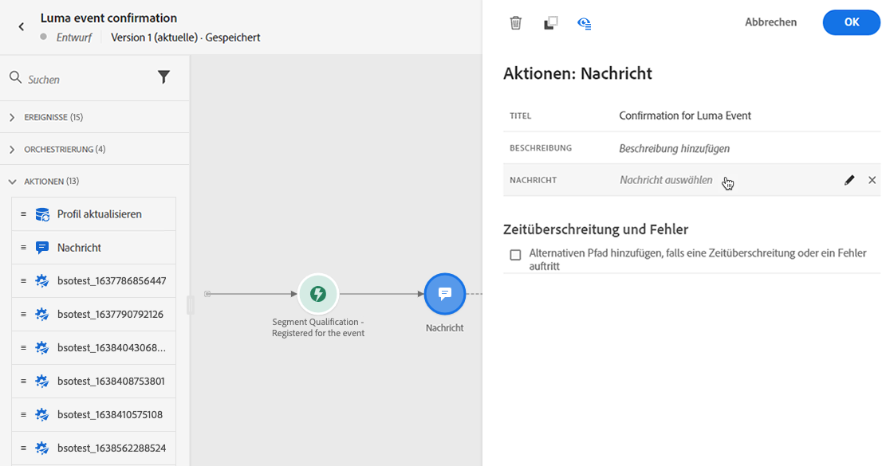

Alle Benutzer, die sich für Ihre Veranstaltung registriert haben, erhalten die Bestätigungs-E-Mail.

<!--The event registration's subscription list tracks the profiles who registered and you can send them targeted event updates.-->

## Opt-out-Landingpage {#opt-out}

Damit sich Ihre Empfänger von Ihren Nachrichten abmelden können, können Sie in Ihre E-Mails einen Link zu einer Ausschluss-Landingpage einfügen.

>[!NOTE]
>
>Weitere Informationen zur Verwaltung des Einverständnisses Ihrer Empfänger und dazu, warum dies wichtig ist, finden Sie [ (in diesem Abschnitt](../privacy/opt-out.md).

### Opt-out-Verwaltung {#opt-out-management}

Es ist gesetzlich vorgeschrieben, Empfängerinnen und Empfängern die Möglichkeit zu geben, sich vom Erhalt von Nachrichten einer Marke abzumelden. Weitere Informationen zu den geltenden Rechtsvorschriften finden Sie in der Dokumentation zu [Experience Platform](https://experienceleague.adobe.com/docs/experience-platform/privacy/regulations/overview.html#regulations){target="_blank"}.

Daher müssen Sie in jeder E **Mail, die an Empfänger gesendet wird, immer einen** Abmelde-Link“ einfügen:

* Wenn der Empfänger auf diesen Link klickt, wird er zu einer Landingpage mit einer Schaltfläche zur Bestätigung weitergeleitet.
* Beim Klicken auf die Opt-out-Schaltfläche werden die Profildaten mit diesen Informationen aktualisiert.

### Konfigurieren des E-Mail-Opt-outs {#configure-opt-out}

Gehen Sie wie folgt vor, um Empfängern einer E-Mail zu ermöglichen, sich über eine Landingpage von Ihren Nachrichten abzumelden:

1. Erstellen Sie Ihre Landingpage. [Weitere Informationen](create-lp.md)

1. Definieren Sie die Primärseite. [Weitere Informationen](create-lp.md#configure-primary-page)

1. [Design](design-lp.md) der primäre Seiteninhalt: Verwenden Sie die Landingpage-spezifische **[!UICONTROL Formular]**-Komponente, definieren Sie ein **[!UICONTROL Opt-out]**-Kontrollkästchen und aktualisieren Sie **[!UICONTROL Kanal (E-Mail)]**: Wenn ein Profil das Opt-out-Feld auf der Landingpage anklickt, wird es von der gesamten Kommunikation ausgeschlossen.

   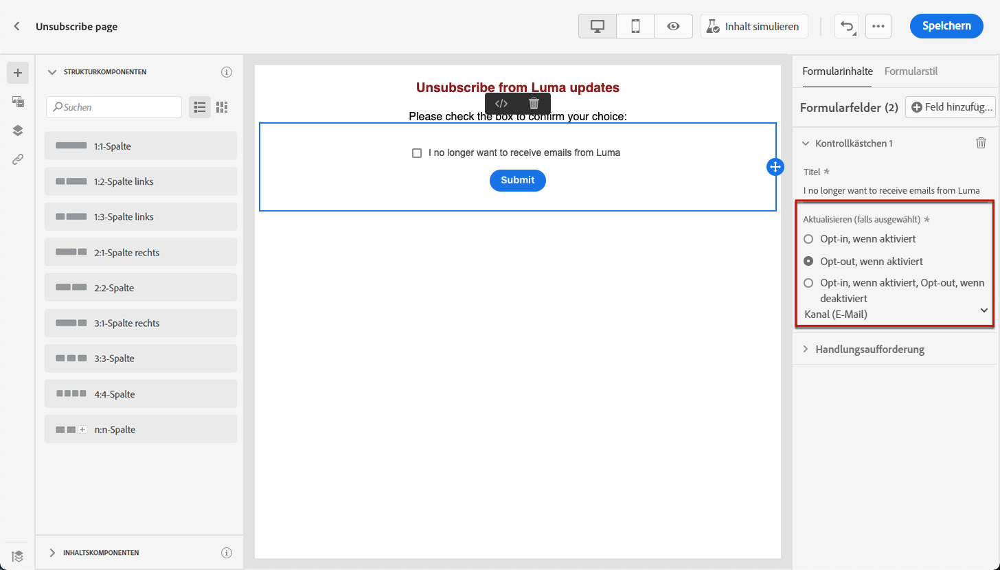

   <!--You can also build your own landing page and host it on the third-party system of your choice.-->

1. Fügen Sie eine [ (Unterseite](create-lp.md#configure-subpages) hinzu, die den Benutzern angezeigt wird, die das Formular senden.

   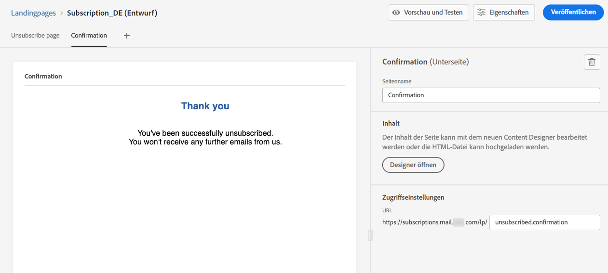

   >[!NOTE]
   >
   >Referenzieren Sie die Unterseite im Abschnitt **[!UICONTROL Call to action]** der Komponente **[!UICONTROL Formular]** der Primärseite. [Weitere Informationen](design-lp.md)

1. Nachdem Sie den Inhalt Ihrer Seiten konfiguriert und definiert haben, [ Sie ](create-lp.md#publish-landing-page) Landingpage (veröffentlichen).

1. [Erstellen einer E-Mail](../email/get-started-email-design.md)Nachricht in einer Journey.

1. Wählen Sie Text in Ihrem Inhalt aus und [fügen Sie einen Link ein](../email/message-tracking.md#insert-links) mithilfe der kontextuellen Symbolleiste. Sie können auch einen Link auf einer Schaltfläche verwenden.

1. Wählen Sie **[!UICONTROL Landingpage]** aus der Dropdown-Liste **[!UICONTROL Link-Typ]** und wählen Sie die [Landingpage](create-lp.md#configure-primary-page), die Sie für das Opt-out erstellt haben.

   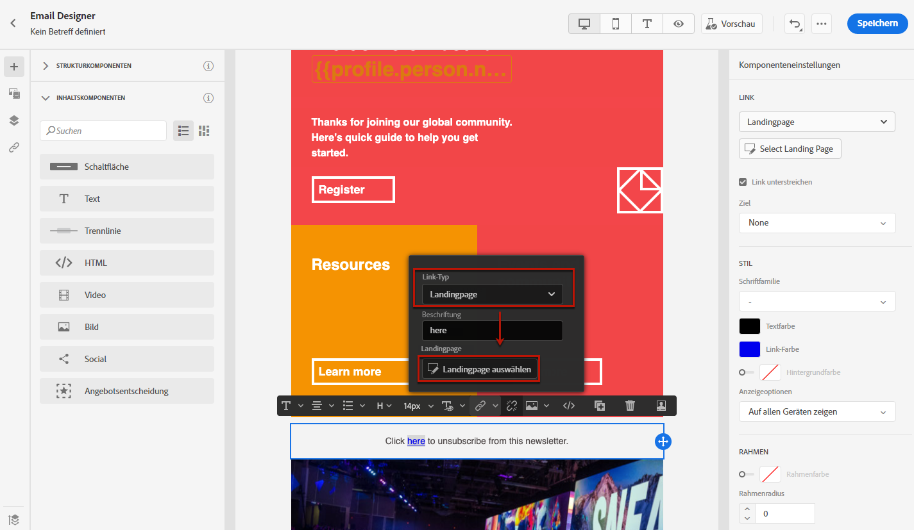

   >[!NOTE]
   >
   >Um Ihre Nachricht senden zu können, stellen Sie sicher, dass die von Ihnen ausgewählte Landingpage noch nicht abgelaufen ist. Erfahren Sie (in diesem Abschnitt), wie [ Ablaufdatum ](create-lp.md#configure-primary-page).

1. Veröffentlichen Sie und führen Sie die Journey aus. [Weitere Informationen](../building-journeys/journey.md).

1. Wenn ein Empfänger nach Erhalt der Nachricht auf den Abmelde-Link in der E-Mail klickt, wird Ihre Landingpage angezeigt.

   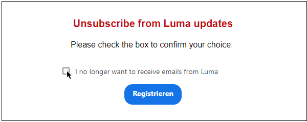

   >[!WARNING]
   >
   >Wenn Sie in der E-Mail auf den Abmelde-Link klicken, wird nur die Landingpage geöffnet. Der Empfänger muss **das Formular senden, indem er auf die Opt-out-Schaltfläche auf der Landingpage klickt** um die Abmeldung abzuschließen und sein Profileinverständnis zu aktualisieren.

   Wenn der Empfänger das Kontrollkästchen aktiviert und das Formular absendet:

   * Der abgemeldete Empfänger wird zum Bestätigungsbildschirm weitergeleitet.

   * Die Profildaten werden aktualisiert und erhalten keine Nachrichten mehr von Ihrer Marke, es sei denn, Sie haben sich erneut angemeldet.

Um sich zu vergewissern, dass die Aktualisierung des entsprechenden Profils erfolgt ist, öffnen Sie das Profil in Experience Platform, indem Sie einen Identity-Namespace und den entsprechenden Identitätswert auswählen. Weitere Informationen finden Sie in der Dokumentation zu [Experience Platform](https://experienceleague.adobe.com/docs/experience-platform/profile/ui/user-guide.html#getting-started){target="_blank"}.

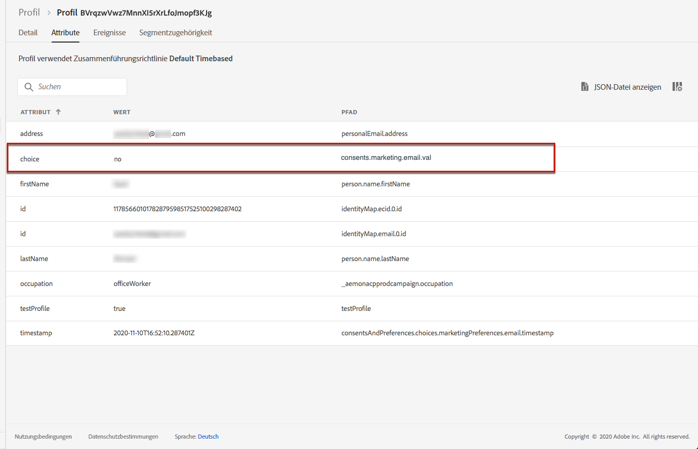

Auf der Registerkarte **[!UICONTROL Attribute]** können Sie sehen, dass der Wert für **[!UICONTROL choice]** auf **[!UICONTROL no]** geändert wurde.

Die Opt-out-Informationen werden im **Einverständnisdienst-Datensatz** gespeichert. [Weitere Informationen zu Datensätzen](../data/get-started-datasets.md)

>[!NOTE]
>
>Wenn die Zusammenführungsmethode für Ihre standardmäßige [Adobe Experience Platform](https://experienceleague.adobe.com/docs/experience-platform/profile/home.html){target="_blank"}**[!UICONTROL Profiles]**-Zusammenführungsrichtlinie **[!UICONTROL Datensatzpriorität]** ist, stellen Sie sicher, dass Sie den **[!UICONTROL AJO Consent Service-Datensatz]** aktivieren und ihn in der Zusammenführungsrichtlinie priorisieren. [Weitere Informationen](https://experienceleague.adobe.com/docs/experience-platform/profile/merge-policies/ui-guide.html#dataset-precedence-profile){target="_blank"}
>
>Selbst wenn diesem Datensatz keine Batches hinzugefügt wurden, enthält er weiterhin die Opt-in-/Opt-out-Informationen.

**Siehe auch:**

* [Opt-out mit einem Klick](../email/email-opt-out.md#one-click-opt-out)
* [Ausschluss-Link in der E-Mail-Kopfzeile](../email/email-opt-out.md#unsubscribe-header)

<!--
### Other ways to opt out

You can also enable your recipients to unsubscribe whithout using landing pages.

* **One-click opt-out**

    You can add a one-click opt-out link into your email content. This will enable your recipients to quickly unsubscribe from your communications, without being redirected to a landing page where they need to confirm opting out. [Learn more](../privacy/opt-out.md#opt-out-personalization)

* **Unsubscribe link in header**

    If the recipients' email client supports displaying an unsubscribe link in the email header, emails sent with [!DNL Journey Optimizer] automatically include this link. [Learn more](../email/email-opt-out.md#unsubscribe-header)
-->

## Übermittlungsereignis für Landingpages nutzen {#leverage-lp-event}

Sie können Informationen verwenden, die auf einer Landingpage gesendet wurden, um weitere Aktionen durchzuführen. Wenn ein Benutzer beispielsweise eine bestimmte Abonnement-Liste abonniert, können Sie diese Informationen nutzen, um diesem Benutzer eine E-Mail mit Empfehlungen für andere Abonnement-Listen zu senden.

Dazu müssen Sie ein [regelbasiertes unitäres Ereignis“ auf ](../event/about-creating.md) Grundlage des **[!UICONTROL AJO E-Mail-Tracking-Erlebnisereignisschemas]** erstellen, das die Übermittlungsinformationen enthält, und [dieses Ereignis auf einer Journey verwenden](../building-journeys/general-events.md).

>[!NOTE]
>
>Beachten Sie bei der Arbeit mit Landingpage-Übermittlungsereignissen, dass das Feld `interactionType` möglicherweise nicht immer genau die spezifische Benutzeraktion widerspiegelt. Um genau festzustellen, ob ein Benutzer sich abgemeldet, abonniert oder eine andere Aktion ausgeführt hat, überprüfen Sie immer die tatsächlichen Profilattribute (z. B. Einverständnisvoreinstellungen) oder Formularfeldwerte, anstatt sich ausschließlich auf die `interactionType` zu verlassen.

<!--
DETAILED STEPS TBC:

Follow the steps below.

1. Go to **[!UICONTROL Administration]** > **[!UICONTROL Configurations]**, and in the **[!UICONTROL Events]** section, select **[!UICONTROL Manage]**.

    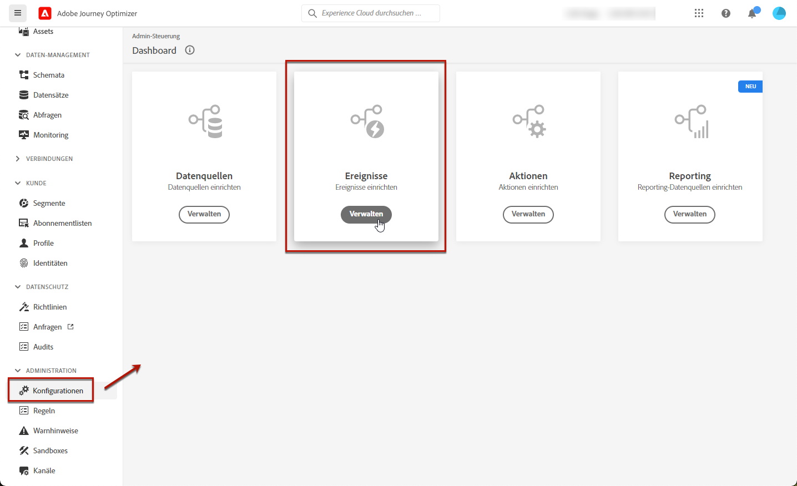

1. The list of events displays. Select **[!UICONTROL Create Event]**.

    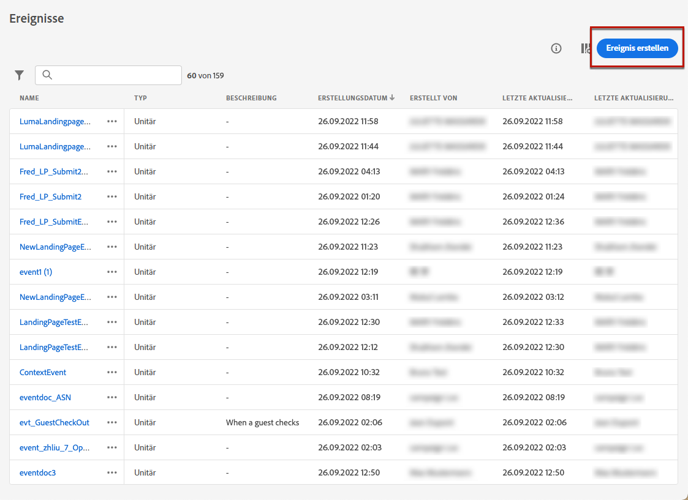

1. The event configuration pane opens on the right side of the screen. Configure a rule-based unitary event. [Learn more](../event/about-creating.md)

1. Define the schema: select **[!UICONTROL AJO Email Tracking Experience Event Schema v.1]** (available by default in [!DNL Journey Optimizer]).

    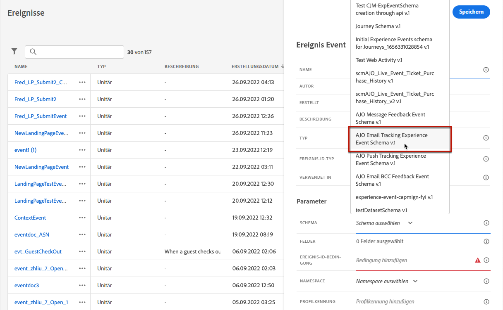

1. In the **[!UICONTROL Fields]** section, select the following elements:

    * **[!UICONTROL _experience]** > **[!UICONTROL customerJourneyManagement]** > **[!UICONTROL messageInteraction]** > **[!UICONTROL Interaction Type]**
    
    * **[!UICONTROL _experience]** > **[!UICONTROL customerJourneyManagement]** > **[!UICONTROL messageInteraction]** > **[!UICONTROL Landing Page Details]** > **[!UICONTROL Landing Page ID]**

    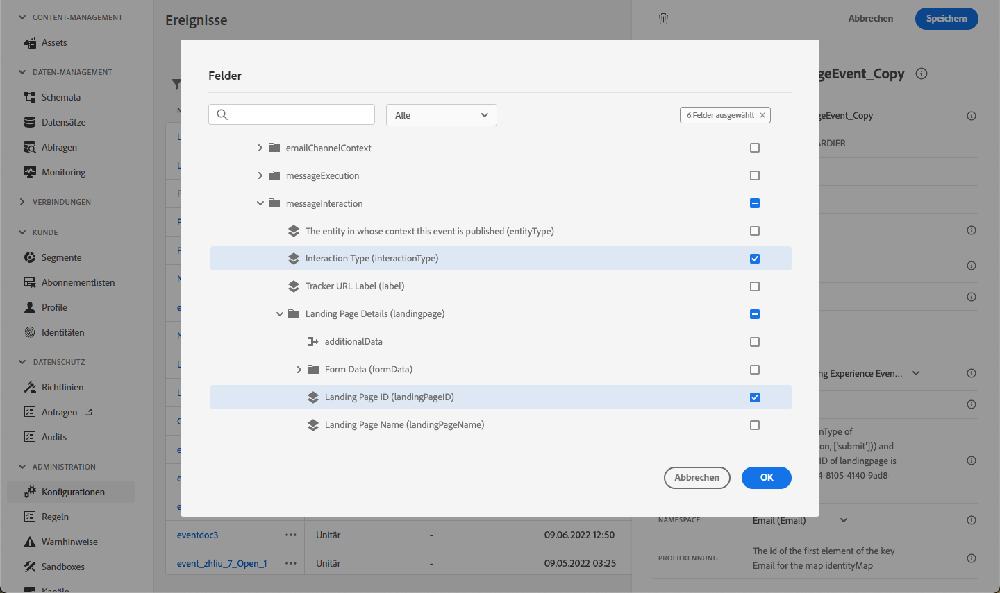

1. Click inside the **[!UICONTROL Event ID condition]** field. Using the simple personalization editor, define the condition for the **[!UICONTROL Interaction Type]** and **[!UICONTROL Landing Page ID]** fields. This will be used by the system to identify the events that will trigger your journey.

    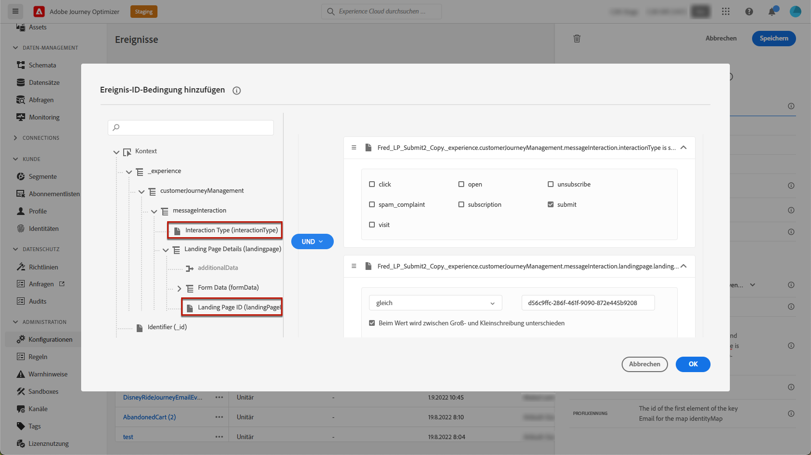

    >[!NOTE]
    >
    >To find the landing page ID, you can insert the landing page as a link into an email and select the source code from the contextual toolbar to display the landing page information.
    >
    >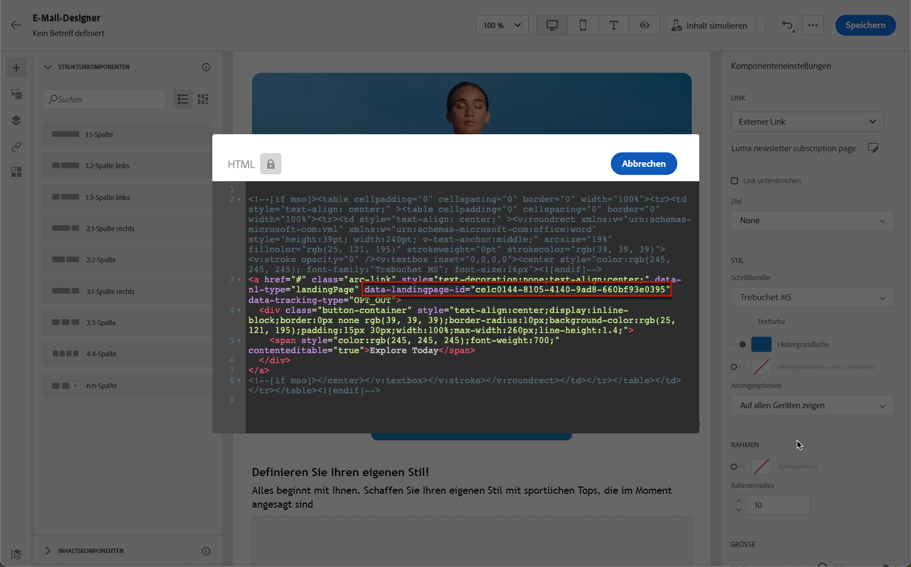

1. Save your changes.

1. Create a [journey](../building-journeys/journey.md). You can do it directly from the landing page by clicking the **[!UICONTROL Create journey]** button. Learn more [here](create-lp.md#configure-primary-page)

    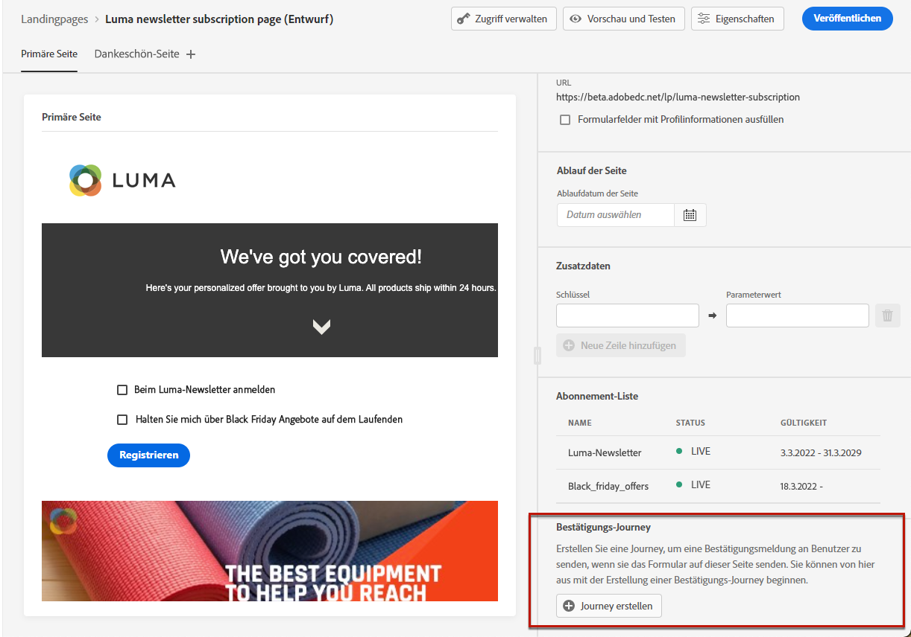

1. In the journey, unfold the **[!UICONTROL Events]** category and drop the event that you created into the canvas. Learn more [here](../building-journeys/audience-qualification-events.md)

    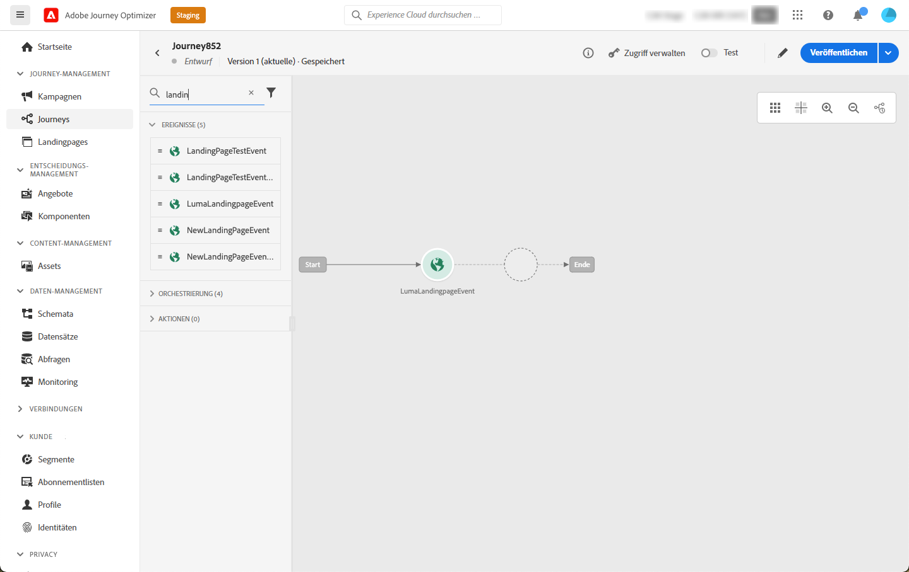

1. Unfold the **[!UICONTROL Actions]** category and drop an email action into the canvas.

    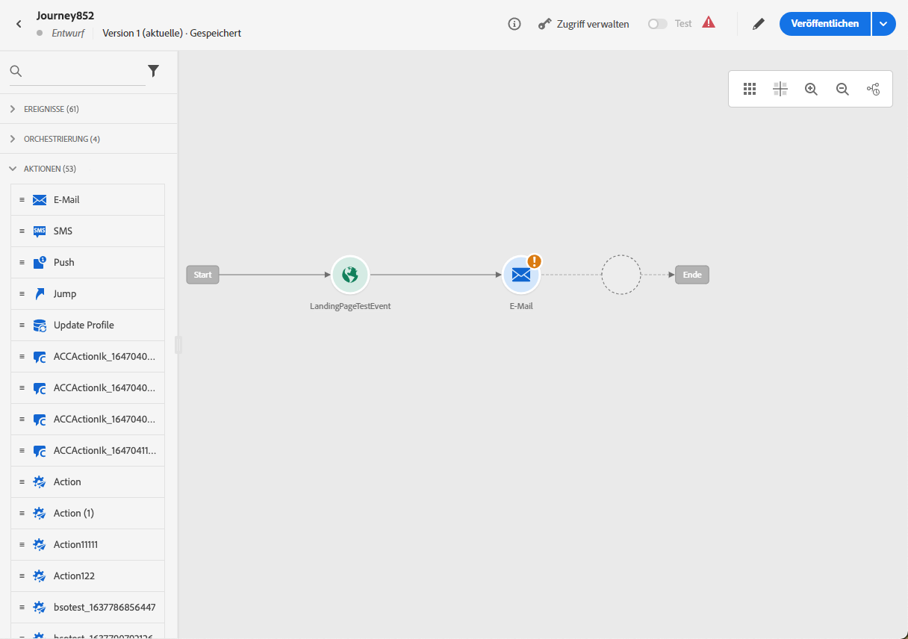

///How do you use the information from the event to send an email to the users? 
-->
