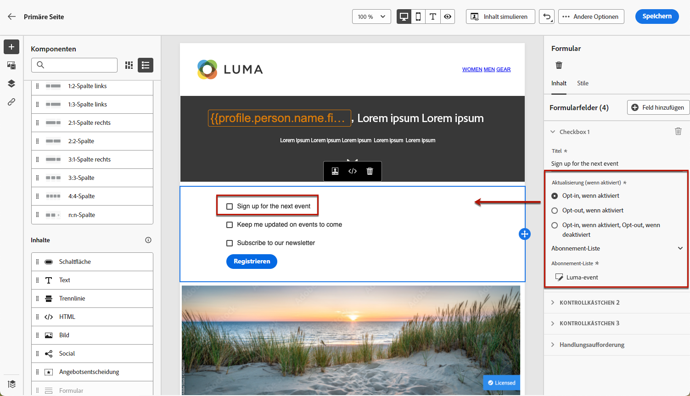
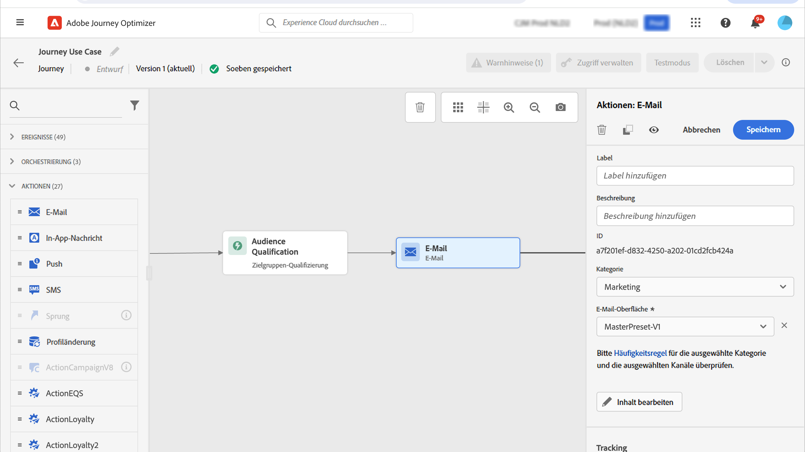
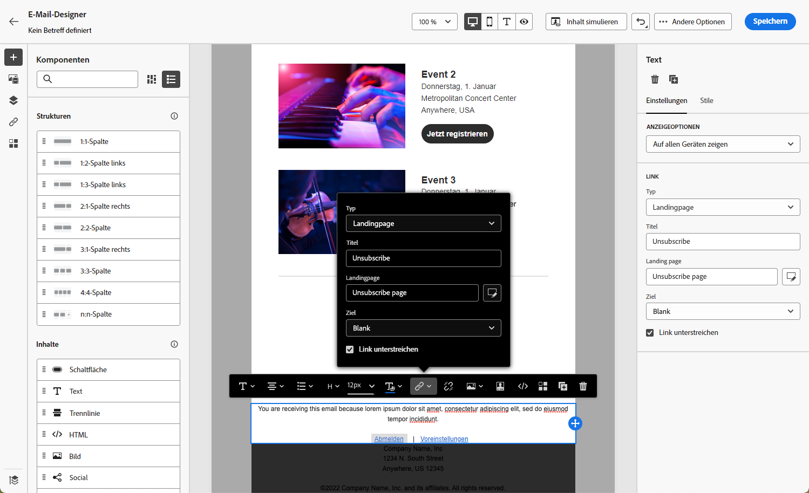

# Anwendungsfälle für Landingpages {#lp-use-cases}

Im Folgenden finden Sie einige Beispiele für die Verwendung von [!DNL Journey Optimizer]-Landingpages zum kundenseitigen Opt-in/Opt-out für bestimmte oder alle Ihre Nachrichten.

## Abonnement eines Services {#subscription-to-a-service}

Einer der häufigsten Anwendungsfälle besteht darin, Ihre Kunden über eine Landingpage zum [Abonnieren eines Services](subscription-list.md) (z. B. eines Newsletters oder einer Veranstaltung) aufzufordern. Die wichtigsten Schritte werden im unten stehenden Diagramm dargestellt:

Angenommen, Sie organisieren im nächsten Monat eine Veranstaltung und möchten eine Kampagne zur Veranstaltungsregistrierung starten<!--to keep your customers that are interested updated on that event-->. Senden Sie dazu eine E-Mail mit einem Link zu einer Landingpage, über die sich Ihre Empfänger für diese Veranstaltung registrieren können. Die Benutzer, die sich registrieren, werden zur Abonnement-Liste hinzugefügt, die Sie zu diesem Zweck erstellt haben.

### Einrichten einer Landingpage {#set-up-lp}

1. Erstellen Sie die Abonnement-Liste für die Veranstaltungsregistrierung, in der die registrierten Benutzer gespeichert werden. [Hier](subscription-list.md#define-subscription-list) erfahren Sie, wie Sie eine Abonnement-Liste erstellen.

   

1. [Erstellen Sie eine Landingpage](create-lp.md), damit sich Ihre Empfänger für Ihre Veranstaltung registrieren können.

   

1. Konfigurieren Sie die [primäre Landingpage](create-lp.md#configure-primary-page) für die Registrierung.

1. Wählen Sie beim Entwerfen der [Landingpage-Inhalte](design-lp.md) die von Ihnen erstellte Abonnement-Liste aus, um sie mit den Profilen zu aktualisieren, die das Registrierungs-Kontrollkästchen anklicken.

   

1. Erstellen Sie eine „Danke“-Seite, die Ihren Empfängern angezeigt wird, sobald sie das Registrierungsformular übermitteln. [Hier](create-lp.md#configure-subpages) erfahren Sie, wie Sie Unterseiten für die Landingpage konfigurieren.

   

1. [Veröffentlichen](create-lp.md#publish) Sie die Landingpage.

1. Fügen Sie einer [Journey](../building-journeys/journey.md) die Aktivität **E-Mail** hinzu, um Traffic auf die Registrierungs-Landingpage zu lenken.

   

1. [Gestalten Sie die E-Mail](../email/get-started-email-design.md), um anzukündigen, dass die Anmeldung für Ihre Veranstaltung jetzt offen ist.

1. [Fügen Sie einen Link](../email/message-tracking.md#insert-links) in Ihren Nachrichteninhalt ein. Wählen Sie **[!UICONTROL Landingpage]** als **[!UICONTROL Link-Typ]** und wählen Sie die [Landingpage](create-lp.md#configure-primary-page) aus, die Sie für die Registrierung erstellt haben.

   

   >[!NOTE]
   >
   >Um Ihre Nachricht senden zu können, darf die von Ihnen gewählte Landingpage noch nicht abgelaufen sein. [In diesem Abschnitt](create-lp.md#configure-primary-page) erfahren Sie, wie Sie das Ablaufdatum aktualisieren können.

   Wenn Ihre Empfänger nach dem Erhalt der E-Mail auf den Link zur Landingpage klicken, werden sie zur „Danke-Seite“ weitergeleitet und auf die Abonnement-Liste gesetzt.

### Senden einer Bestätigungs-E-Mail {#send-confirmation-email}

Zusätzlich können Sie eine Bestätigungs-E-Mail an die Empfänger senden, die sich für Ihre Veranstaltung registriert haben. Gehen Sie dazu wie folgt vor.

1. Erstellen Sie eine weitere [Journey](../building-journeys/journey.md). Sie können dies direkt über die Landingpage tun, indem Sie auf die Schaltfläche **[!UICONTROL Journey erstellen]** klicken. [Hier](create-lp.md#configure-primary-page) erhalten Sie weitere Informationen.

   

1. Erweitern Sie die Kategorie **[!UICONTROL Ereignisse]** und legen Sie eine Aktivität vom Typ **[!UICONTROL Segmentqualifikation]** in Ihrer Arbeitsfläche ab. [Hier](../building-journeys/segment-qualification-events.md) erhalten Sie weitere Informationen.

1. Klicken Sie in das Feld **[!UICONTROL Segment]** und wählen Sie die von Ihnen erstellte Abonnement-Liste aus.

   

1. Fügen Sie eine Bestätigungs-E-Mail Ihrer Wahl hinzu und senden Sie sie über die Journey.

   

Alle Benutzer, die sich für Ihre Veranstaltung registriert haben, erhalten die Bestätigungs-E-Mail.

<!--The event registration's subscription list tracks the profiles who registered and you can send them targeted event updates.-->

## Ausschluss (Opt-out) {#opt-out}

Damit Ihre Empfänger das Abonnement stornieren können, können Sie in Ihre E-Mails einen Link zu einer Ausschluss-Landingpage einfügen.

In [diesem Abschnitt](../privacy/opt-out.md) erfahren Sie mehr über die Verwaltung des Einverständnisses Ihrer Empfänger und darüber, warum dies wichtig ist.

### Opt-out-Verwaltung {#opt-out-management}

Es ist gesetzlich vorgeschrieben, eine Möglichkeit zur Kündigung des Abos einzurichten, damit Empfängerinnen und Empfänger keine Mitteilungen mehr von einer Marke erhalten. Weitere Informationen zu den geltenden Rechtsvorschriften finden Sie in der Dokumentation zu [Adobe Experience Platform](https://experienceleague.adobe.com/docs/experience-platform/privacy/regulations/overview.html?lang=de#regulations){target="_blank"}.

Aus diesem Grund müssen Sie in jeder E-Mail, die an Empfänger gesendet wird, immer einen **Link zur Abmeldung** einfügen:

* Durch das Klicken auf diesen Link werden die Empfänger zu einer Landingpage mit einer Schaltfläche zur Bestätigung weitergeleitet.
* Nach dem Klicken auf die Ausschluss-Schaltfläche werden die Profildaten mit diesen Informationen aktualisiert.

### Konfigurieren des Ausschlusses {#configure-opt-out}

Gehen Sie wie folgt vor, um Empfängern einer Nachricht zu ermöglichen, dieses Abonnement über eine Landingpage zu stornieren.

1. Erstellen Sie Ihre Landingpage. [Weitere Informationen](create-lp.md)

1. Definieren Sie die Primärseite. [Weitere Informationen](create-lp.md#configure-primary-page)

1. [Gestaltung](design-lp.md) des primären Seiteninhalts: Verwenden Sie die Landingpage-spezifische **[!UICONTROL Formular]**-Komponente, definieren Sie ein Kontrollkästchen zum **[!UICONTROL Opt-out]** und wählen Sie die Aktualisierung von **[!UICONTROL Kanal (E-Mail)]**. Jetzt wird jedes Profil, das auf Ihrer Landingpage das Opt-out-Kästchen ankreuzt, von Ihrer gesamten Kommunikation ausgeschlossen.

   

   <!--You can also build your own landing page and host it on the third-party system of your choice.-->

1. Fügen Sie eine [Unterseite](create-lp.md#configure-subpages) zur Bestätigung hinzu, die den Nutzern angezeigt wird, die das Formular übermitteln.

   

   >[!NOTE]
   >
   >Referenzieren Sie die Unterseite im Abschnitt **[!UICONTROL Call to Action]** der **[!UICONTROL Formular]**-Komponente der Primärseite. [Weitere Informationen](design-lp.md)

1. Nachdem Sie den Inhalt Ihrer Seiten konfiguriert und definiert haben, können Sie die Landingpage [veröffentlichen](create-lp.md#publish).

   

1. [Erstellen sie eine E-Mail-Nachricht](../email/get-started-email-design.md) in einer Journey.

1. Wählen Sie Text in Ihrem Inhalt aus und fügen Sie mithilfe der kontextuellen Symbolleiste einen [Link ein](../email/message-tracking.md#insert-links). Auch ein Link auf einer Schaltfläche kann verwendet werden.

   

1. Wählen Sie **[!UICONTROL Landingpage]** aus der Dropdown-Liste **[!UICONTROL Link-Typ]** und wählen Sie die [Landingpage](create-lp.md#configure-primary-page), die Sie für das Opt-out erstellt haben.

   

   >[!NOTE]
   >
   >Um Ihre Nachricht senden zu können, darf die von Ihnen gewählte Landingpage noch nicht abgelaufen sein. [In diesem Abschnitt](create-lp.md#configure-primary-page) erfahren Sie, wie Sie das Ablaufdatum aktualisieren können.

1. Veröffentlichen Sie die Journey und führen Sie sie aus. [Weitere Informationen](../building-journeys/journey.md).

1. Wenn ein Empfänger nach Erhalt der Nachricht auf den Abmelde-Link in der E-Mail klickt, wird Ihre Landingpage angezeigt.

   

   Wenn der Empfänger das Kästchen aktiviert und das Formular absendet:

   * Der abgemeldete Empfänger wird zum Bestätigungsbildschirm weitergeleitet.

   * Die Profildaten werden aktualisiert und erhalten keine Nachrichten mehr von Ihrer Marke, es sei denn, das Profil meldet sich erneut an.

Um sich zu vergewissern, dass die Aktualisierung des betreffenden Profils erfolgt ist, öffnen Sie das Profil in Adobe Experience Platform, indem Sie einen Identity-Namespace und einen entsprechenden Identitätswert auswählen. Weitere Informationen finden Sie in der [Dokumentation zu Adobe Experience Platform](https://experienceleague.adobe.com/docs/experience-platform/profile/ui/user-guide.html?lang=de#getting-started){target="_blank"}.

Auf der Registerkarte **[!UICONTROL Attribute]** können Sie sehen, dass der Wert für **[!UICONTROL Auswahl]** auf **[!UICONTROL Nein]** geändert wurde.

Die Opt-out-Informationen werden im **Einverständnisdienst-Datensatz** gespeichert. [Weitere Informationen zu Datensätzen](../data/get-started-datasets.md)

>[!NOTE]
>
>Wenn die Zusammenführungsmethode für Ihre standardmäßige [Adobe Experience Platform](https://experienceleague.adobe.com/docs/experience-platform/profile/home.html?lang=de){target="_blank"} **[!UICONTROL Profiles]** merge policy is **[!UICONTROL Dataset Precedence]**, make sure to enable the **[!UICONTROL AJO Consent Service Dataset]** and to prioritize it in the merge policy. [Learn more](https://experienceleague.adobe.com/docs/experience-platform/profile/merge-policies/ui-guide.html?lang=de#dataset-precedence-profile){target="_blank"}
>
>Selbst wenn diesem Datensatz keine Batches hinzugefügt wurden, enthält er weiterhin die Opt-in-/Opt-out-Informationen.

<!--

### Other ways to opt out

You can also enable your recipients to unsubscribe whithout using landing pages.

* **One-click opt-out**

    You can add a one-click opt-out link into your email content. This will enable your recipients to quickly unsubscribe from your communications, without being redirected to a landing page where they need to confirm opting out. [Learn more](../privacy/opt-out.md#one-click-opt-out-link)

* **Unsubscribe link in header**

    If the recipients' email client supports displaying an unsubscribe link in the email header, emails sent with [!DNL Journey Optimizer] automatically include this link. [Learn more](../privacy/opt-out.md#unsubscribe-header)

////////

## Leverage landing page submission event {#leverage-lp-event}

You can use information that was submitted on a landing page to send communications to your customers. For example, if a user subscribes to a given subscription list, you can leverage that information to send an email recommending other subscription lists to that user.

To do this, you need to create an event containing the landing page submission information and use it in a journey. Follow the steps below.

1. Go to **[!UICONTROL Administration]** > **[!UICONTROL Configurations]**, and in the **[!UICONTROL Events]** section, select **[!UICONTROL Manage]**.

    

1. The list of events displays. Select **[!UICONTROL Create Event]**.

    

1. The event configuration pane opens on the right side of the screen. Configure a rule-based unitary event. [Learn more](../event/about-creating.md)

1. Define the schema: select **[!UICONTROL AJO Email Tracking Experience Event Schema v.1]** (available by default in [!DNL Journey Optimizer]).

    

1. In the **[!UICONTROL Fields]** section, select the following elements:

    * **[!UICONTROL _experience]** > **[!UICONTROL customerJourneyManagement]** > **[!UICONTROL messageInteraction]** > **[!UICONTROL Interaction Type]**
    
    * **[!UICONTROL _experience]** > **[!UICONTROL customerJourneyManagement]** > **[!UICONTROL messageInteraction]** > **[!UICONTROL Landing Page Details]** > **[!UICONTROL Landing Page ID]**

    

1. Click inside the **[!UICONTROL Event ID condition]** field. Using the simple expression editor, define the condition for the **[!UICONTROL Interaction Type]** and **[!UICONTROL Landing Page ID]** fields. This will be used by the system to identify the events that will trigger your journey.

    

    >[!NOTE]
    >
    >To find the landing page ID, you can insert the landing page as a link into an email and select the source code from the contextual toolbar to display the landing page information.
    >
    >

1. Save your changes.

1. Create a [journey](../building-journeys/journey.md). You can do it directly from the landing page by clicking the **[!UICONTROL Create journey]** button. Learn more [here](create-lp.md#configure-primary-page)

    

1. In the journey, unfold the **[!UICONTROL Events]** category and drop the event that you created into the canvas. Learn more [here](../building-journeys/segment-qualification-events.md)

    

1. Unfold the **[!UICONTROL Actions]** category and drop an email action into the canvas.

    

///How do you use the information from the event to send an email to the users? -->
