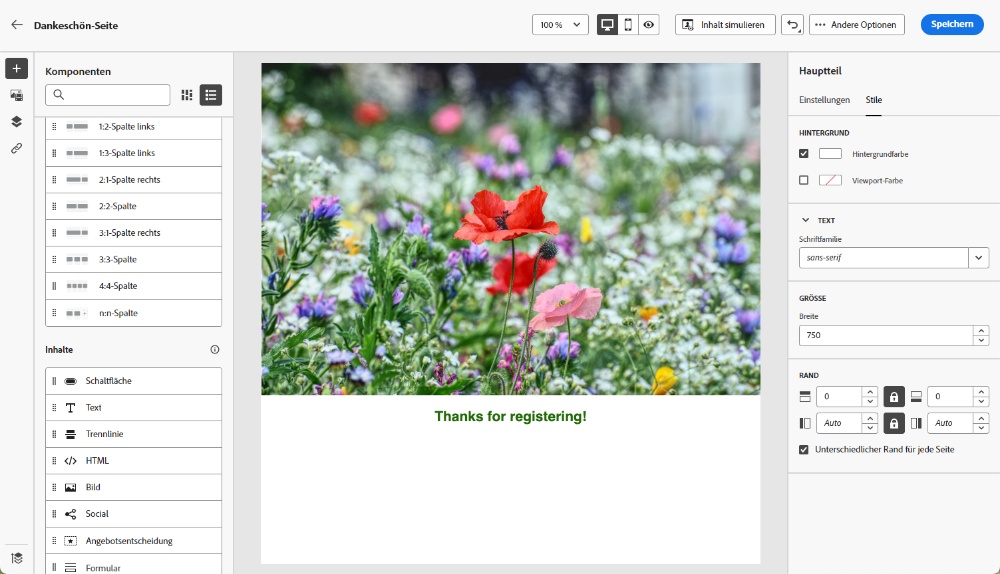
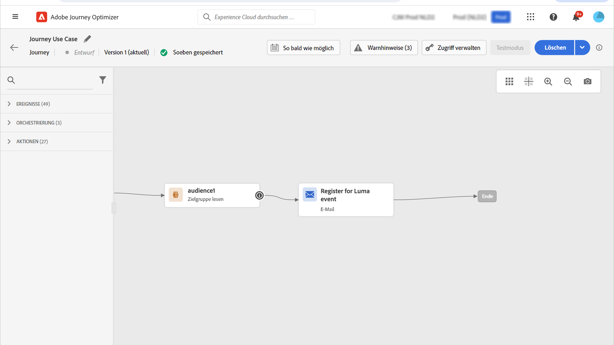
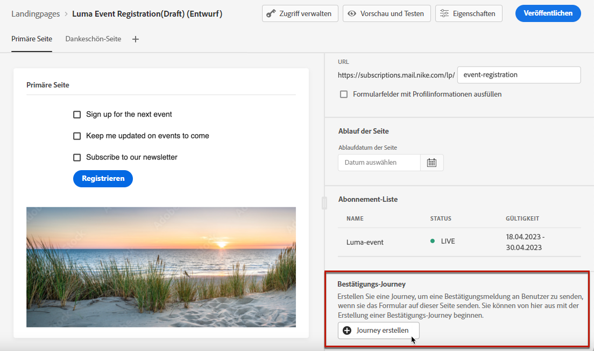
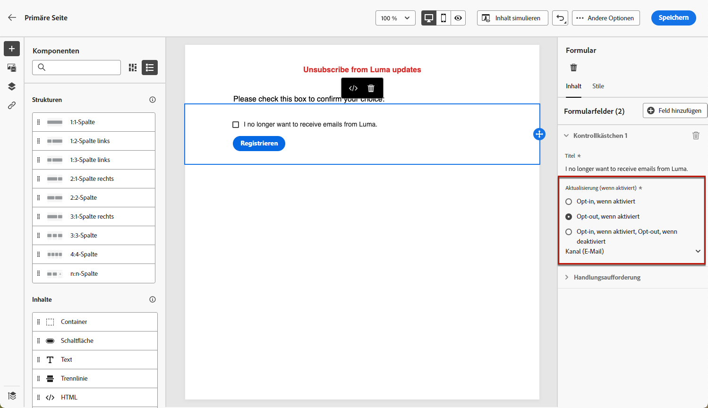
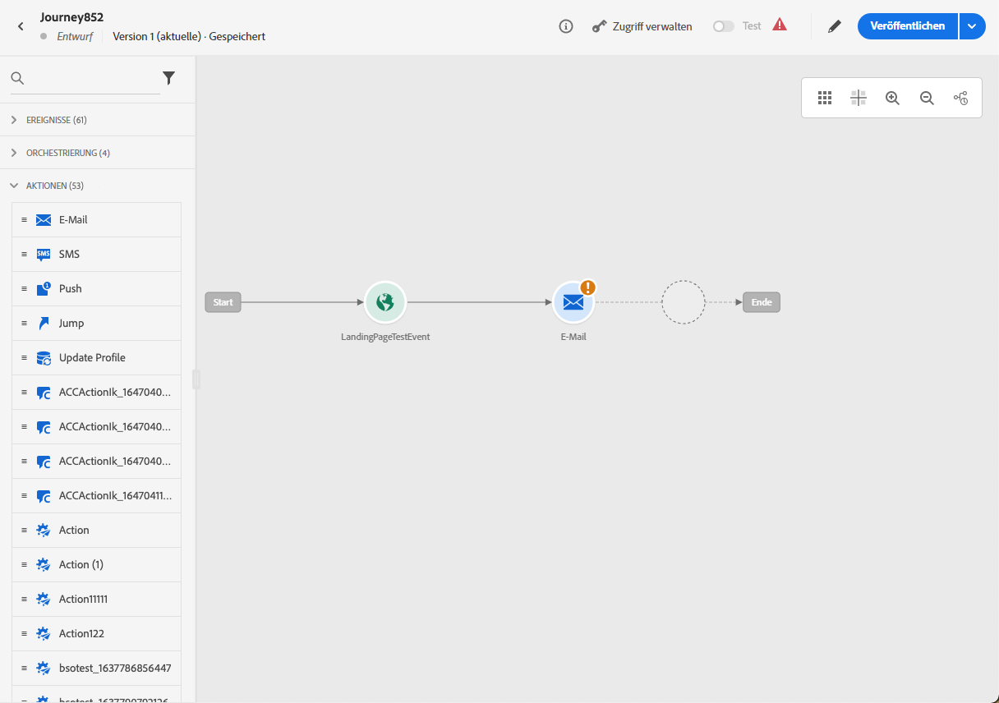

# Anwendungsfälle für Landingpages {#lp-use-cases}

Im Folgenden finden Sie einige Beispiele für die Verwendung von [!DNL Journey Optimizer] -Landingpages verwenden, damit Ihre Kunden bestimmte oder alle Ihre Nachrichten an- bzw. abmelden können.

## Dienstanmeldung {#subscription-to-a-service}

Einer der häufigsten Anwendungsfälle besteht darin, Ihre Kunden zu [Dienst abonnieren](subscription-list.md) (z. B. einen Newsletter oder ein Ereignis) über eine Landingpage. Die wichtigsten Schritte werden im unten stehenden Diagramm dargestellt:

Angenommen, Sie organisieren im nächsten Monat eine Veranstaltung und möchten eine Kampagne zur Ereignisregistrierung starten<!--to keep your customers that are interested updated on that event-->. Senden Sie dazu eine E-Mail mit einem Link zu einer Landingpage, über die sich Ihre Empfänger für dieses Ereignis registrieren können. Die Benutzer, die sich registrieren, werden zur Abonnementliste hinzugefügt, die Sie zu diesem Zweck erstellt haben.

### Landingpage einrichten {#set-up-lp}

1. Erstellen Sie die Abonnementliste der Ereignisregistrierung, in der die registrierten Benutzer gespeichert werden. Erfahren Sie, wie Sie eine Abonnementliste erstellen [here](subscription-list.md#define-subscription-list).

   

1. [Landingpage erstellen](create-lp.md) , damit sich Ihre Empfänger für Ihr Ereignis registrieren können.

   

1. Registrierung konfigurieren [primäre Landingpage](create-lp.md#configure-primary-page).

1. Beim Entwerfen der [Landingpage-Inhalt](design-lp.md)Wählen Sie die von Ihnen erstellte Abonnementliste aus, um sie mit den Profilen zu aktualisieren, die das Registrierungs-Kontrollkästchen aktivieren.

   

1. Erstellen Sie eine Dankeseite, die Ihren Empfängern angezeigt wird, sobald sie das Registrierungsformular übermitteln. Erfahren Sie, wie Sie Landingsubpages konfigurieren [here](create-lp.md#configure-subpages).

   

1. [Veröffentlichen](create-lp.md#publish) die Landingpage.

1. In [Journey](../building-journeys/journey.md), fügen Sie eine **Email** -Aktivität, um den Traffic zur Anmelde-Landingpage zu leiten.

   

1. [E-Mail erstellen](../email/get-started-email-design.md) um anzukündigen, dass die Registrierung nun für Ihre Veranstaltung geöffnet ist.

1. [Link einfügen](../email/message-tracking.md#insert-links) in Ihren Nachrichteninhalt. Auswählen **[!UICONTROL Landing page]** als **[!UICONTROL Link type]** und wählen Sie die [Landingpage](create-lp.md#configure-primary-page) die Sie für die Registrierung erstellt haben.

   

   >[!NOTE]
   >
   >Um Ihre Nachricht senden zu können, muss die ausgewählte Landingpage noch nicht abgelaufen sein. Erfahren Sie, wie Sie das Ablaufdatum aktualisieren [in diesem Abschnitt](create-lp.md#configure-primary-page).

   Wenn Ihre Empfänger nach dem Erhalt der E-Mail auf den Link zur Landingpage klicken, werden sie zur Dankeseite weitergeleitet und auf die Abonnementliste gesetzt.

### Bestätigungs-E-Mail senden {#send-confirmation-email}

Zusätzlich können Sie eine Bestätigungs-E-Mail an die Empfänger senden, die sich für Ihr Ereignis registriert haben. Gehen Sie dazu wie folgt vor.

1. Erstellen eines weiteren [Journey](../building-journeys/journey.md). Sie können dies direkt über die Landingpage tun, indem Sie auf die **[!UICONTROL Create journey]** Schaltfläche. Weitere Infos [here](create-lp.md#configure-primary-page)

   

1. Entfalten Sie die **[!UICONTROL Events]** Kategorie und legen Sie eine **[!UICONTROL Segment Qualification]** -Aktivität in Ihre Arbeitsfläche. Weitere Infos [here](../building-journeys/segment-qualification-events.md)

1. Klicken Sie in **[!UICONTROL Segment]** und wählen Sie die von Ihnen erstellte Abonnementliste aus.

   

1. Fügen Sie eine Bestätigungs-E-Mail Ihrer Wahl hinzu und senden Sie sie durch die Journey.

   

Alle Benutzer, die sich für Ihr Ereignis registriert haben, erhalten die Bestätigungs-E-Mail.

<!--The event registration's subscription list tracks the profiles who registered and you can send them targeted event updates.-->

## Abwahl {#opt-out}

Damit sich Ihre Empfänger von Ihrer Nachricht abmelden können, können Sie in Ihre E-Mails einen Link zu einer Opt-out-Landingpage einfügen.

Erfahren Sie mehr über die Verwaltung der Zustimmung Ihrer Empfänger und darüber, warum dies in [diesem Abschnitt](../privacy/opt-out.md).

### Opt-out-Verwaltung {#opt-out-management}

Eine gesetzliche Voraussetzung ist, Empfängern die Möglichkeit zu geben, sich vom Erhalt von Nachrichten einer Marke abzumelden. Weitere Informationen zu den geltenden Rechtsvorschriften finden Sie im Abschnitt [Dokumentation zu Experience Platform](https://experienceleague.adobe.com/docs/experience-platform/privacy/regulations/overview.html#regulations){target=&quot;_blank&quot;}.

Daher müssen Sie immer eine **Abmelde-Link** in jeder an Empfänger gesendeten E-Mail:

* Wenn Sie auf diesen Link klicken, werden die Empfänger zu einer Landingpage weitergeleitet, die eine Schaltfläche enthält, über die sich die Abmeldung bestätigen lässt.
* Nach dem Klicken auf die Opt-out-Schaltfläche werden die Profildaten mit diesen Informationen aktualisiert.

### Konfigurieren des Opt-outs {#configure-opt-out}

Gehen Sie wie folgt vor, um Empfängern einer E-Mail zu ermöglichen, sich über eine Landingpage von Ihrer Nachricht abzumelden.

1. Erstellen Sie Ihre Landingpage. [Weitere Infos](create-lp.md)

1. Definieren Sie die primäre Seite. [Weitere Infos](create-lp.md#configure-primary-page)

1. [Design](design-lp.md) Primärseiteninhalt: Landingpage-spezifisch verwenden **[!UICONTROL Form]** -Komponente, definieren Sie eine **[!UICONTROL Opt-out]** und wählen Sie die Option **[!UICONTROL Channel (email)]**: Das Profil, das das Opt-out-Feld auf Ihrer Landingpage aktiviert, wird von all Ihrer Kommunikation ausgeschlossen.

   

   <!--You can also build your own landing page and host it on the third-party system of your choice.-->

1. Bestätigung hinzufügen [subpage](create-lp.md#configure-subpages) wird den Benutzern angezeigt, die das Formular senden.

   

   >[!NOTE]
   >
   >Vergewissern Sie sich, dass Sie auf die Unterseite im **[!UICONTROL Call to action]** Abschnitt **[!UICONTROL Form]** -Komponente. [Weitere Infos](design-lp.md)

1. Nachdem Sie den Inhalt Ihrer Seiten konfiguriert und definiert haben, [publish](create-lp.md#publish) die Landingpage.

   

1. [E-Mail-Nachricht erstellen](../email/get-started-email-design.md) in einer Journey.

1. Wählen Sie Text in Ihrem Inhalt aus und [Link einfügen](../email/message-tracking.md#insert-links) über die dedizierte Symbolleiste. Sie können auch einen Link auf einer Schaltfläche verwenden.

   

1. Auswählen **[!UICONTROL Landing page]** von **[!UICONTROL Link type]** Dropdown-Liste aus und wählen Sie die [Landingpage](create-lp.md#configure-primary-page) die Sie für die Abmeldung erstellt haben.

   

   >[!NOTE]
   >
   >Um Ihre Nachricht senden zu können, muss die ausgewählte Landingpage noch nicht abgelaufen sein. Erfahren Sie, wie Sie das Ablaufdatum aktualisieren [in diesem Abschnitt](create-lp.md#configure-primary-page).

1. Veröffentlichen Sie die Journey und führen Sie sie aus. [Weitere Infos](../building-journeys/journey.md).

1. Wenn ein Empfänger nach Erhalt der Nachricht auf den Abmelde-Link in der E-Mail klickt, wird Ihre Landingpage angezeigt.

   

   Wenn der Empfänger das Kästchen markiert und das Formular sendet:

   * Der abgemeldete Empfänger wird zum Bestätigungsbildschirm weitergeleitet.

   * Die Profildaten werden aktualisiert und erhalten keine Nachrichten von Ihrer Marke, es sei denn, Sie haben sich erneut angemeldet.

Um zu überprüfen, ob die Auswahl des entsprechenden Profils aktualisiert wurde, gehen Sie zu Experience Platform und greifen Sie auf das Profil zu, indem Sie einen Identitäts-Namespace und einen entsprechenden Identitätswert auswählen. Weitere Informationen finden Sie unter [Dokumentation zu Experience Platform](https://experienceleague.adobe.com/docs/experience-platform/profile/ui/user-guide.html#getting-started){target=&quot;_blank&quot;}.

Im **[!UICONTROL Attributes]** -Registerkarte anzeigen, können Sie sehen, dass der Wert für **[!UICONTROL choice]** hat sich geändert auf **[!UICONTROL no]**.

<!--

### Other ways to opt out

You can also enable your recipients to unsubscribe whithout using landing pages.

* **One-click opt-out**

    You can add a one-click opt-out link into your email content. This will enable your recipients to quickly unsubscribe from your communications, without being redirected to a landing page where they need to confirm opting out. [Learn more](../privacy/opt-out.md#one-click-opt-out-link)

* **Unsubscribe link in header**

    If the recipients' email client supports displaying an unsubscribe link in the email header, emails sent with [!DNL Journey Optimizer] automatically include this link. [Learn more](../privacy/opt-out.md#unsubscribe-header)

////////

## Leverage landing page submission event {#leverage-lp-event}

You can use information that was submitted on a landing page to send communications to your customers. For example, if a user subscribes to a given subscription list, you can leverage that information to send an email recommending other subscription lists to that user.

To do this, you need to create an event containing the landing page submission information and use it in a journey. Follow the steps below.

1. Go to **[!UICONTROL Administration]** > **[!UICONTROL Configurations]**, and in the **[!UICONTROL Events]** section, select **[!UICONTROL Manage]**.

    

1. The list of events displays. Select **[!UICONTROL Create Event]**.

    

1. The event configuration pane opens on the right side of the screen. Configure a rule-based unitary event. [Learn more](../event/about-creating.md)

1. Define the schema: select **[!UICONTROL AJO Email Tracking Experience Event Schema v.1]** (available by default in [!DNL Journey Optimizer]).

    

1. In the **[!UICONTROL Fields]** section, select the following elements:

    * **[!UICONTROL _experience]** > **[!UICONTROL customerJourneyManagement]** > **[!UICONTROL messageInteraction]** > **[!UICONTROL Interaction Type]**
    
    * **[!UICONTROL _experience]** > **[!UICONTROL customerJourneyManagement]** > **[!UICONTROL messageInteraction]** > **[!UICONTROL Landing Page Details]** > **[!UICONTROL Landing Page ID]**

    

1. Click inside the **[!UICONTROL Event ID condition]** field. Using the simple expression editor, define the condition for the **[!UICONTROL Interaction Type]** and **[!UICONTROL Landing Page ID]** fields. This will be used by the system to identify the events that will trigger your journey.

    

    >[!NOTE]
    >
    >To find the landing page ID, you can insert the landing page as a link into an email and select the source code from the contextual toolbar to display the landing page information.
    >
    >

1. Save your changes.

1. Create a [journey](../building-journeys/journey.md). You can do it directly from the landing page by clicking the **[!UICONTROL Create journey]** button. Learn more [here](create-lp.md#configure-primary-page)

    

1. In the journey, unfold the **[!UICONTROL Events]** category and drop the event that you created into the canvas. Learn more [here](../building-journeys/segment-qualification-events.md)

    

1. Unfold the **[!UICONTROL Actions]** category and drop an email action into the canvas.

    

///How do you use the information from the event to send an email to the users? -->
