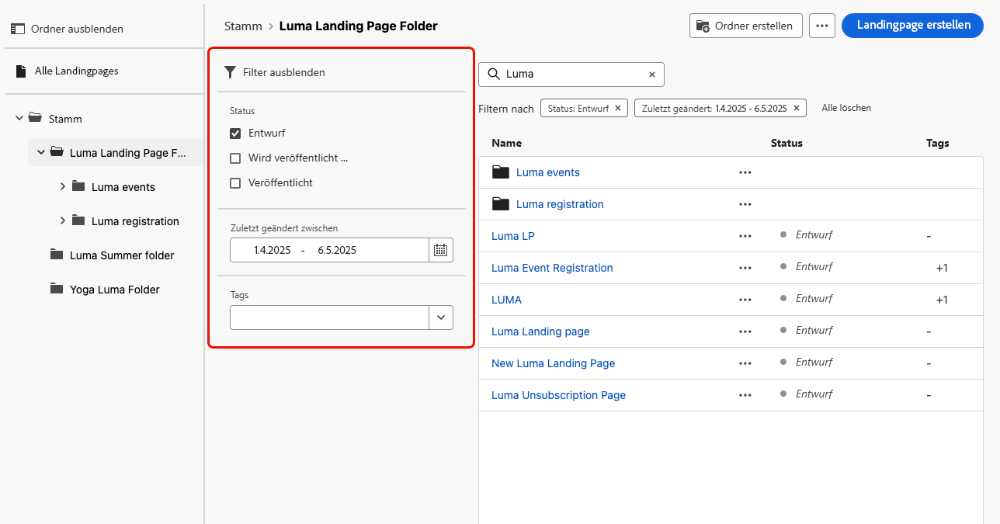

# Verwalten von Landingpages {#manage-lp}

## Zugreifen auf Landingpages {#access-landing-pages}

Um auf die Liste der Landingpages zuzugreifen, wählen Sie im Menü links **[!UICONTROL Content-Management]** > **[!UICONTROL Landingpages]** aus.

Alle vorhandenen Landingpages werden angezeigt.

Im linken Bereich können Sie Landingpages in Ordnern organisieren. Standardmäßig werden alle Elemente angezeigt. Bei der Auswahl eines Ordners werden nur die Landingpages und Ordner angezeigt, die im ausgewählten Ordner enthalten sind. [Weitere Informationen](#folders)

Um nach einem bestimmten Element zu suchen, geben Sie einen Namen in das Suchfeld ein. Wenn ein [Ordner](#folders) ausgewählt wird, gilt die Suche für alle Landingpages oder Ordner in der ersten Hierarchieebene dieses Ordners<!--(not nested items)-->.

Sie können Landingpages nach Status, Änderungsdatum oder Tags filtern.

In dieser Liste können Sie auf die drei Punkte neben einer Landingpage klicken und die gewünschte Aktion auswählen:

* Rufen Sie für [veröffentlichte](create-lp.md#publish-landing-page) Landingpages den [Landingpage-Bericht](../reports/lp-report-global-cja.md) und [Live-Bericht der letzten 24 Stunden](../reports/lp-report-live.md) auf.

* **Löschen** und **Veröffentlichung aufheben** einer Landingpage. Sie können eine [veröffentlichte](create-lp.md#publish-landing-page) Landingpage nicht löschen. Um sie zu löschen, müssen Sie zunächst die Veröffentlichung aufheben.

  >[!CAUTION]
  >
  >Wenn Sie die Veröffentlichung einer Landingpage aufheben, auf die in einer Nachricht verwiesen wird, funktioniert der Link zur Landingpage nicht mehr, und Benutzerinnen und Benutzern wird eine Fehlerseite angezeigt, wenn sie auf sie zugreifen versuchen.

* **Duplizieren** jede Landingpage.

* Bearbeiten Sie die einer Landingpage zugeordneten [Tags](../start/search-filter-categorize.md#tags).

* Verschieben Sie die Landingpage in einen Ordner . [Weitere Informationen](#folders)

## Verwenden von Ordnern zum Verwalten von Landingpages {#folders}

>[!CONTEXTUALHELP]
>id="ajo_lp_folders"
>title="Organisieren von Landingpages in Ordnern"
>abstract="Verwenden Sie Ordner, um Ihre Landingpages entsprechend den Anforderungen Ihrer Organisation zu kategorisieren und zu verwalten."

Um die Navigation auf Ihren Landingpages zu vereinfachen, können Sie Ordner verwenden, um sie effektiver in einer strukturierten Hierarchie zu organisieren. Auf diese Weise können Sie die Elemente entsprechend den Anforderungen Ihrer Organisation kategorisieren und verwalten.

1. Klicken Sie auf **[!UICONTROL Alle Landingpages]**, um alle zuvor erstellten Elemente ohne Ordnergruppierung anzuzeigen.

   

1. Klicken Sie auf den **[!UICONTROL Stammordner]**, um alle erstellten Ordner anzuzeigen.

   >[!NOTE]
   >
   >Wenn Sie noch keine Ordner erstellt haben, werden alle Landingpages angezeigt.

1. Klicken Sie auf einen beliebigen Ordner im **[!UICONTROL Stammordner]**, um dessen Inhalt anzuzeigen.

1. Wenn Sie auf den **[!UICONTROL Stammordner]** oder einen anderen Ordner klicken, wird die Schaltfläche **[!DNL Create folder]** angezeigt. Wählen Sie sie aus.

   

1. Geben Sie einen Namen für den neuen Ordner ein und klicken Sie auf **[!UICONTROL Speichern]**. Der neue Ordner wird innerhalb des **[!UICONTROL Stammordners]** oder innerhalb des aktuell ausgewählten Ordners angezeigt.

1. Sie können auf die Schaltfläche **[!UICONTROL Weitere Aktionen]** klicken, um den Ordner umzubenennen oder zu löschen.

   

1. Mit der Schaltfläche **[!UICONTROL Mehr Aktionen]** können Sie Landingpages auch in einen anderen vorhandenen Ordner verschieben.

1. Nun können Sie zu dem Ordner navigieren, den Sie gerade erstellt haben. Jede neue Landingpage, [ Sie ](create-lp.md#create-landing-page.md) erstellen, wird im aktuellen Ordner gespeichert.

   
