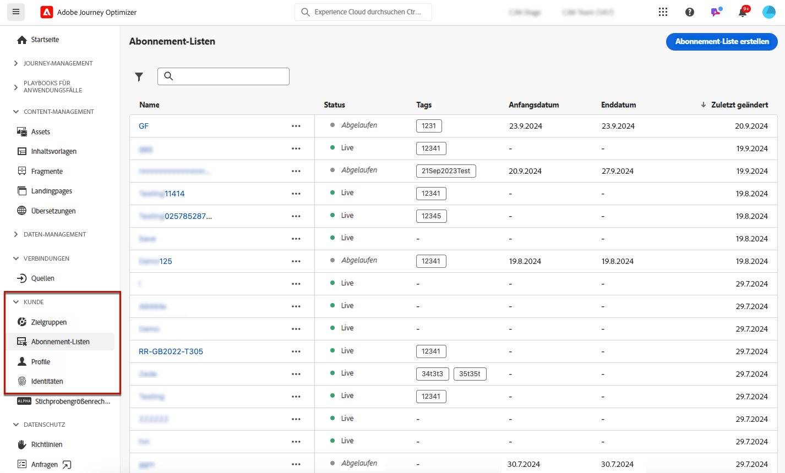
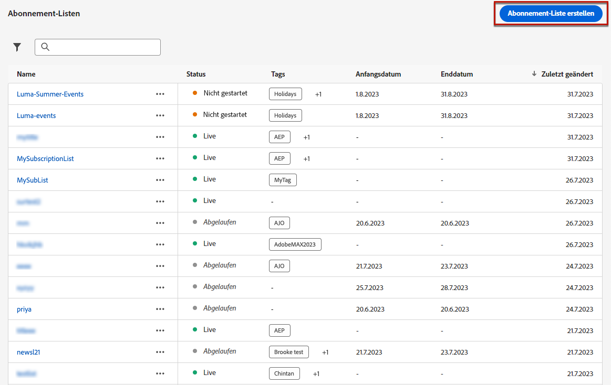
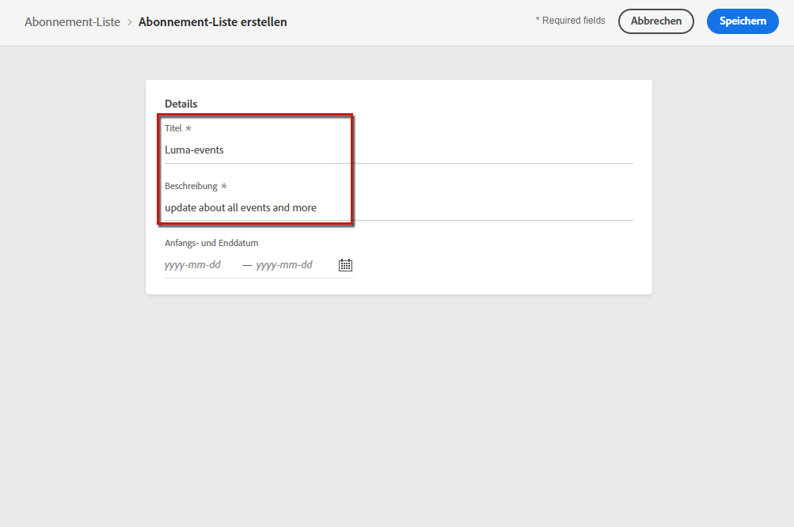
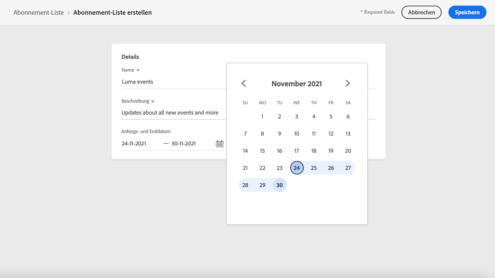
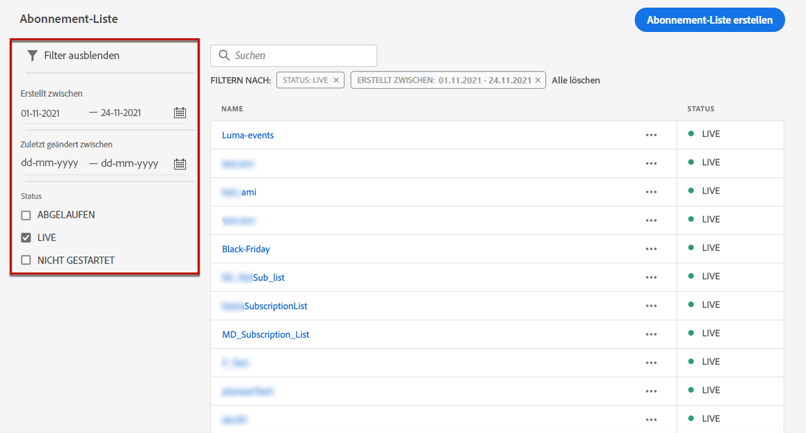

# Abonnement-Listen {#create-subscription-list}

## Was ist eine Abonnement-Liste? {#subscription-list-definition}

>[!CONTEXTUALHELP]
>id="ajo_subscription_list"
>title="Einrichten einer Abonnementliste"
>abstract="Erstellen Sie eine Abonnementliste, um Profile zu erfassen, die sich für den Empfang von Nachrichten zu einem bestimmten Thema oder Ereignis entschieden haben. "
>additional-url="https://experienceleague.adobe.com/docs/journey-optimizer/using/landing-pages/subscription-list.html?lang=de#define-subscription-list" text="Erstellen einer Abonnementliste"

Ein Anmeldedienst unterstützt die Vermarktung von Waren und Dienstleistungen, die Kunden angeboten werden, die sich für den laufenden Erhalt von Mitteilungen zu einem bestimmten Thema/Ereignis/Interesse usw. entschieden haben. In [!DNL Journey Optimizer] werden diese angemeldeten Kunden in einer Abonnement-Liste erfasst.

Beispiele für einen Anmeldedienst:

* ein Newsletter, z. B.: „Laufen als Sport“
* ein Ereignis, z. B.: „Summit 2021“
* ein Webinar, z. B.: „Mehr über Kryptowährungen erfahren“
* Interesse an einem bestimmten Produkt/Sport/Service usw., z. B.: „Interesse daran, in den nächsten 12 Monaten ein Haus zu kaufen“
* eine Präferenz für die Art der Benachrichtigung, z. B.: „Empfangen neuer Song-Benachrichtigungen per E-Mail“

Die Profile können über eine [Landingpage](create-lp.md) zu einer Abonnement-Liste hinzugefügt werden. Ein Beispiel dazu finden Sie in [diesem Abschnitt](lp-use-cases.md#subscription-to-a-service).

## Erstellen einer Abonnementliste {#define-subscription-list}

Gehen Sie wie folgt vor, um eine Abonnement-Liste zu erstellen.

1. Um auf die Abonnement-Listen zuzugreifen, wählen Sie **[!UICONTROL Kunde]** > **[!UICONTROL Abonnement-Liste]** aus.

   

1. Wählen Sie die Schaltfläche **[!UICONTROL Abonnement-Liste erstellen]** aus.

   

1. Fügen Sie einen Titel und eine Beschreibung hinzu. Dies sind Pflichtfelder.

   

   >[!CAUTION]
   >
   >Derzeit können Sie im Feld **[!UICONTROL Titel]** keine Leerzeichen verwenden oder einen Namen eingeben, der bereits für eine andere Abonnementliste existiert.

1. Sie können ein Start- und Enddatum definieren.

   

1. Klicken Sie auf **[!UICONTROL Speichern]**.

In der Liste werden alle erstellten Abonnement-Listen angezeigt. Sie können sie nach dem Erstellungs- oder Änderungsdatum und ihrem Status filtern.

Folgende Status sind möglich:

* **[!UICONTROL Nicht gestartet]**: Sie haben ein Startdatum definiert, das nach dem aktuellen Datum liegt. Die angemeldeten Profile erhalten noch keine Nachrichten, die für diese Abonnementliste bestimmt sind.
* **[!UICONTROL Live]**: Das aktuelle Datum liegt zwischen dem Start- und dem Enddatum der Abonnement-Liste oder Sie haben kein Start-/Enddatum definiert, was bedeutet, dass die Abonnement-Liste immer live ist.
* **[!UICONTROL Abgelaufen]**: Das Enddatum wurde überschritten, sodass die Abonnement-Liste nicht mehr gültig ist. Profile mit Abonnements erhalten keine weiteren Mitteilungen mehr, die für diese Abonnement-Liste bestimmt sind.

Nachdem die Abonnement-Liste erstellt wurde, kann sie in einer Landingpage verwendet werden. Die Profile, die sich über das Landingpage-Formular anmelden, werden der Liste hinzugefügt. [Weitere Informationen](design-lp.md)

Abonnement-Listen können auch als Segmente verwendet werden, wenn [Journeys erstellt werden](../building-journeys/journey-gs.md#jo-build) und Personalisierung hinzugefügt wird.

>[!NOTE]
>
>Die Wirkung von Abonnement-Listen kann über spezifische Berichte überwacht werden. [Weitere Informationen](../reports/subscription-report-live.md)
