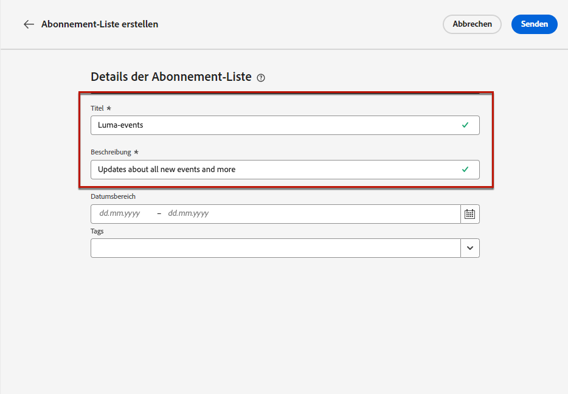
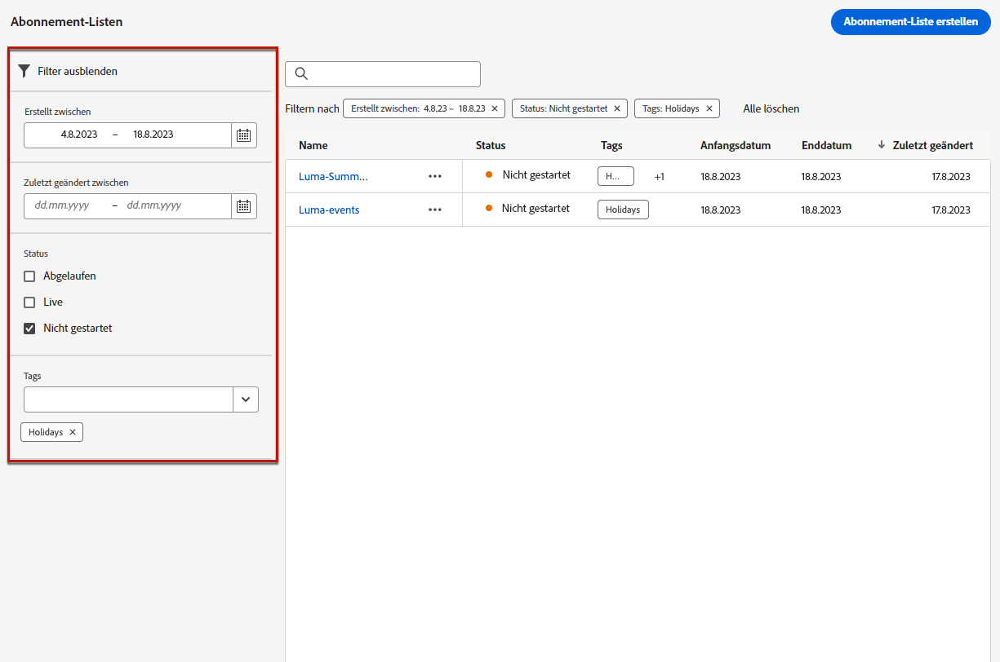

# Abonnementlisten {#create-subscription-list}

## Was ist eine Abonnementliste? {#subscription-list-definition}

>[!CONTEXTUALHELP]
>id="ajo_subscription_list"
>title="Abonnementliste einrichten"
>abstract="Erstellen Sie eine Abonnementliste, um Profile zu sammeln, die sich für den Empfang von Nachrichten zu einem bestimmten Thema oder Ereignis entschieden haben. "
>additional-url="https://experienceleague.adobe.com/docs/journey-optimizer/using/landing-pages/subscription-list.html#define-subscription-list" text="Abonnementliste erstellen"

Ein Anmeldedienst bezieht sich auf Marketing-Waren und -Dienstleistungen, die Kunden angeboten werden, die sich für den Erhalt von Mitteilungen zu einem bestimmten Thema/Ereignis/Interesse usw. entschieden haben. fortlaufend. In [!DNL Journey Optimizer], werden diese angemeldeten Kunden in einer Abonnementliste erfasst.

Ein Anmeldedienst kann:

* einen Newsletter, z. B.: &quot;Laufende Serie&quot;
* ein Ereignis, z. B.: &quot;Gipfel 2021&quot;
* ein Webinar, z. B.: &quot;Erfahren Sie mehr über &quot;crypto&quot;
* Interesse an einem bestimmten Produkt/Sport/Service usw., z. B.: &quot;Interesse daran, in den nächsten 12 Monaten ein Haus zu kaufen&quot;
* eine Präferenz für die Benachrichtigung, z. B.: &quot;Empfangen neuer Song-Benachrichtigungen per E-Mail&quot;

Die Profile können über eine [Landingpage](create-lp.md). Ein Beispiel finden Sie unter [diesem Abschnitt](lp-use-cases.md#subscription-to-a-service).

## Abonnementliste erstellen {#define-subscription-list}

Gehen Sie wie folgt vor, um eine Abonnementliste zu erstellen.

1. Um auf die Abonnementlisten zuzugreifen, wählen Sie **[!UICONTROL Customer]** > **[!UICONTROL Subscription list]**.

   

1. Wählen Sie die **[!UICONTROL Create subscription list]** Schaltfläche.

   

1. Fügen Sie einen Titel und eine Beschreibung hinzu. Diese Felder sind Pflichtfelder.

   

   >[!CAUTION]
   >
   >Derzeit können Sie keinen Abstand verwenden oder einen Namen eingeben, der bereits für eine andere Abonnementliste in der **[!UICONTROL Title]** -Feld.

1. Sie können ein Start- und ein Enddatum definieren.

   

1. Klicken **[!UICONTROL Save]**.

In der Liste werden alle erstellten Abonnementlisten angezeigt. Sie können sie nach dem Erstellungsdatum oder Änderungsdatum und ihrem Status filtern.

Folgende Status sind möglich:

* **[!UICONTROL Not started]**: Sie haben ein Startdatum definiert, das nach dem aktuellen Tag liegt. Die abonnierten Profile erhalten noch keine Nachrichten zu dieser Abonnementliste.
* **[!UICONTROL Live]**: Der aktuelle Tag besteht zwischen dem Start- und dem Enddatum der Abonnementliste oder Sie haben kein Enddatum/Startdatum definiert, was bedeutet, dass die Abonnementliste immer live ist.
* **[!UICONTROL Expired]**: Das Enddatum wird übergeben, sodass die Abonnementliste nicht mehr gültig ist. An abonnierte Profile werden keine weiteren Mitteilungen zu dieser Abonnementliste gesendet.

Nachdem die Abonnementliste erstellt wurde, können Sie sie in einer Landingpage verwenden. Die Profile, die sich über das Landingpage-Formular anmelden, werden der Liste hinzugefügt. [Weitere Infos](design-lp.md)

Sie können Abonnementlisten auch als Segmente verwenden, wenn Sie [Erstellen von Journeys](../building-journeys/journey-gs.md#jo-build) und Personalisierung hinzufügen.

>[!NOTE]
>
>Sie können die Auswirkungen Ihrer Abonnementliste über spezifische Berichte überwachen. [Weitere Infos](../reports/subscription-report-live.md)
