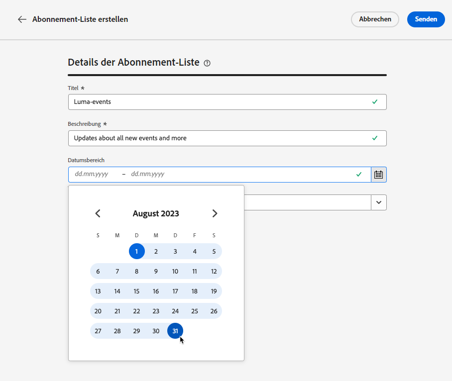

# Abonnement-Listen {#create-subscription-list}

>[!CONTEXTUALHELP]
>id="ajo_subscription_list"
>title="Einrichten einer Abonnement-Liste"
>abstract="Erstellen Sie eine Abonnement-Liste, um Profile zu erfassen, die sich für den Empfang von Nachrichten zu einem bestimmten Thema oder Ereignis entschieden haben. "
>additional-url="https://experienceleague.adobe.com/docs/journey-optimizer/using/content-management/landing-pages/subscription-list.html?lang=de#define-subscription-list" text="Erstellen einer Abonnement-Liste"

Ein Anmeldedienst unterstützt die Vermarktung von Waren und Dienstleistungen, die Kunden angeboten werden, die sich für den laufenden Erhalt von Mitteilungen zu einem bestimmten Thema/Ereignis/Interesse usw. entschieden haben. In [!DNL Journey Optimizer] werden diese angemeldeten Kunden in einer Abonnement-Liste erfasst.

Ein Abonnementdienst kann für Folgendes verwendet werden:

* ein Newsletter, z. B.: „Laufen als Sport“
* ein Ereignis, z. B.: „Summit 2021“
* ein Webinar, z. B.: „Mehr über Kryptowährungen erfahren“
* Interesse an einem bestimmten Produkt/Sport/Service usw., z. B.: „Interesse daran, in den nächsten 12 Monaten ein Haus zu kaufen“
* eine Präferenz für die Art der Benachrichtigung, z. B.: „Empfangen neuer Song-Benachrichtigungen per E-Mail“

Die Profile können über eine [Landingpage](create-lp.md) zu einer Abonnement-Liste hinzugefügt werden. Ein Beispiel dazu finden Sie in [diesem Abschnitt](lp-use-cases.md#subscription-to-a-service).

## Erstellen einer Abonnement-Liste {#define-subscription-list}

>[!NOTE]
>
>Wenn Sie eine Abonnement-Liste erstellen, wird automatisch ein entsprechendes Streaming-Segment in Adobe Experience Platform generiert. Damit das Streaming-Segment erfolgreich erstellt werden kann, muss die Option **Active-On-Edge** für die Zusammenführungsrichtlinie aktiviert sein. Weitere Informationen zu den Eignungskriterien für Streaming-Segmente finden Sie in der Dokumentation zu [Adobe Experience Platform](https://experienceleague.adobe.com/de/docs/experience-platform/segmentation/methods/streaming-segmentation).

Gehen Sie wie folgt vor, um eine Abonnement-Liste zu erstellen.

1. Um auf die Abonnement-Listen zuzugreifen, wählen Sie **[!UICONTROL Kunde]** > **[!UICONTROL Abonnement-Liste]** aus.

   

1. Wählen Sie die Schaltfläche **[!UICONTROL Abonnement-Liste erstellen]** aus.

   

1. Fügen Sie einen Titel und eine Beschreibung hinzu. Dies sind Pflichtfelder.

   

   >[!CAUTION]
   >
   >Derzeit können Sie im Feld **[!UICONTROL Titel]** keine Leerzeichen verwenden oder einen Namen eingeben, der bereits für eine andere Abonnement-Liste existiert.

1. Sie können ein Start- und Enddatum definieren.

   

1. Wählen oder erstellen Sie Adobe Experience Platform-Tags aus dem Feld **[!UICONTROL Tags]**, um Ihre Landingpage für eine verbesserte Suche zu kategorisieren. [Weitere Informationen](../start/search-filter-categorize.md#tags)

1. Klicken Sie auf **[!UICONTROL Speichern]**.

## Verwenden einer Abonnement-Liste {#use-subscription-lists}

Nachdem die Abonnement-Liste erstellt wurde, können Sie:

* Profile zur Abonnement-Liste hinzufügen

  Sie können Personen dazu einladen, **der Liste beizutreten**, indem sie einen Newsletter abonnieren oder sich für ein Ereignis registrieren. Sie können auch **personalisierte Nachrichten** an Abonnentinnen und Abonnenten senden.

  Um beispielsweise eine Zielgruppe dazu einzuladen, sich für ein Ereignis zu registrieren oder einen Newsletter zu abonnieren, können Sie ihr eine Nachricht mit einem Link zu einer Landingpage senden, auf der sie der Veranstaltung beitreten oder sie abonnieren können. Profile, die sich über das Landingpage-Formular anmelden, werden der von Ihnen zu diesem Zweck erstellten Abonnement-Liste hinzugefügt.

* Nachrichten an Abonnentinnen und Abonnenten senden

  Sie können Abonnement-Listen auch als Zielgruppen verwenden, wenn Sie Journeys erstellen und Personalisierung hinzufügen.

  Wenn Kundinnen und Kunden beispielsweise einen Streaming-Dienst abonnieren, kann dies den sofortigen Versand einer Begrüßungs-E-Mail-Serie auslösen, die die Kundinnen und Kunden dazu auffordert, sich zum ersten Mal bei der App anzumelden und ihre Anzeigevoreinstellungen festzulegen.

In [diesem Anwendungsfall](lp-use-cases.md#subscription-to-a-service) erfahren Sie, wie Sie Ihre Abonnement-Liste verwenden.

## Durchsuchen von Abonnement-Listen {#browse-subscription-lists}

In der Liste werden alle erstellten Abonnement-Listen angezeigt. Sie können sie nach dem Erstellungs- oder Änderungsdatum und ihrem Status filtern.

Folgende Status sind möglich:

* **[!UICONTROL Nicht gestartet]**: Sie haben ein Startdatum definiert, das nach dem aktuellen Datum liegt. Die angemeldeten Profile erhalten noch keine Nachrichten, die für diese Abonnement-Liste bestimmt sind.
* **[!UICONTROL Live]**: Das aktuelle Datum liegt zwischen dem Start- und dem Enddatum der Abonnement-Liste oder Sie haben kein Start-/Enddatum definiert, was bedeutet, dass die Abonnement-Liste immer live ist.
* **[!UICONTROL Abgelaufen]**: Das Enddatum wurde überschritten, sodass die Abonnement-Liste nicht mehr gültig ist. Profile mit Abonnements erhalten keine weiteren Mitteilungen mehr, die für diese Abonnement-Liste bestimmt sind.

## Überwachen von Abonnement-Listen {#monitor-subscription-lists}

Die Wirkung von Abonnement-Listen kann über entsprechende Berichte überwacht werden. Sie können auf zwei Berichtstypen zugreifen:

* Live-Bericht zu Abonnement-Listen

  Live-Berichte, auf die über die Registerkarte „Letzte 24 Std.“ zugegriffen werden kann, zeigen Ereignisse an, die innerhalb der letzten 24 Stunden stattgefunden haben. Der Zeitraum ab dem Auftreten des Ereignisses beträgt dabei mindestens zwei Minuten. [Weitere Informationen](../reports/subscription-report-live.md)

* Gesamtzeitberichte zu Abonnement-Listen, mit Customer Journey Analytics

  Diese Berichte konzentrieren sich auf Ereignisse, die vor mindestens zwei Stunden aufgetreten sind, und decken Ereignisse über einen ausgewählten Zeitraum ab. Der **Abonnementbericht** bietet wichtige Einblicke in Abonnements und Abmeldungen von Profilen, die mit bestimmten Listen verknüpft sind. Er hilft Ihnen dabei, die Effektivität verschiedener Abonnementkampagnen und -initiativen bei der Förderung von Interaktionen und Konversionen zu verstehen. [Weitere Informationen](../reports/subscription-report-global-cja.md)
