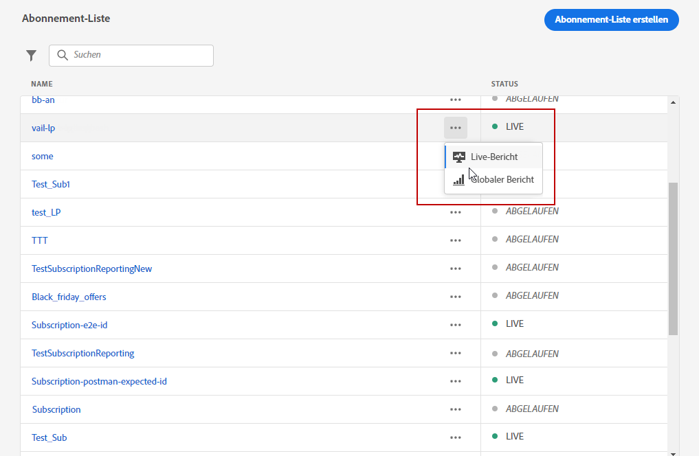
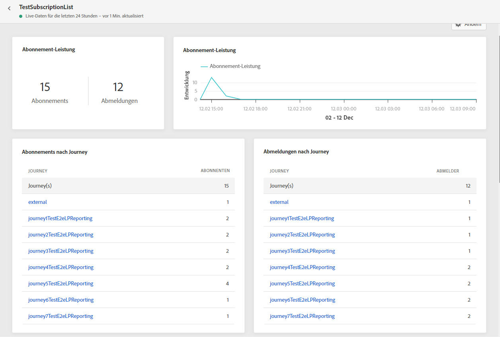
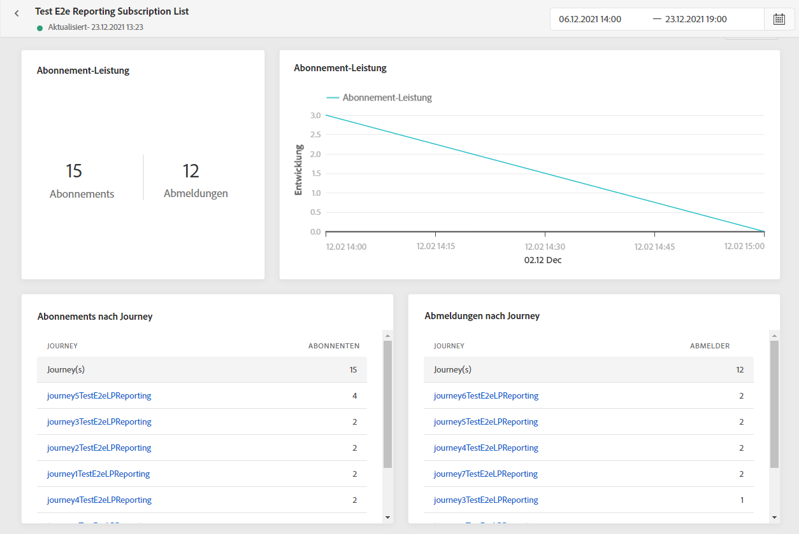

# Abonnementbericht {#subscription-report}

Der Abonnementbericht enthält Details zur Aktivität Ihrer Abonnenten. Zwei Berichtstypen sind verfügbar:

* Der **[!UICONTROL Live-Bericht]**, um die An- und Abmeldungen Ihrer Sendungen in den letzten 24 Stunden zu messen und zu visualisieren.

* Der **[!UICONTROL globale Bericht]**, um die An- und Abmeldungen Ihrer Sendungen über einen bestimmten Zeitraum zu messen und zu visualisieren.

Wenn Sie auf Ihre Berichte zugreifen möchten, wählen Sie im erweiterten Menü der ausgewählten Abonnement-Liste **Live** oder **[!UICONTROL Globaler Bericht]** aus.

## Abonnement-Live-Bericht {#subscription-live}

Die KPIs **[!UICONTROL Abonnement-Performance]** und die Tabellen **[!UICONTROL Anmeldungen nach Journey]**/**[!UICONTROL Abmeldungen nach Journey]** enthalten die wichtigsten Informationen zur Interaktion der Besucher mit Ihrer Landingpage. Die Tabellen und KPIs enthalten die für die Landingpage verfügbaren Daten, z. B.:

* **[!UICONTROL Anmeldungen]**: Gesamtzahl der Anmeldungen in den letzten 24 Stunden.

* **[!UICONTROL Abmeldungen]**: Gesamtzahl der Abmeldungen in den letzten 24 Stunden.

Das Diagramm **[!UICONTROL Abonnement-Performance]** zeigt die Entwicklung der Abonnements in den letzten 24 Stunden.

Die Diagramme **Anmeldungen – Aufschlüsselung** und **Abmeldungen – Aufschlüsselung** geben die Gesamtzahl der Personen an, die sich je nach Nachricht, Landingpage und Kanal in den letzten 24 Stunden an- oder abgemeldet haben.

## Globaler Abonnementbericht {#subscription-global}

Die KPIs **[!UICONTROL Abonnement-Performance]** und die Tabellen **[!UICONTROL Anmeldungen nach Journey]**/**[!UICONTROL Abmeldungen nach Journey]** enthalten die wichtigsten Informationen zur Interaktion der Besucher mit Ihrer Landingpage. Die Tabellen und KPIs enthalten die für die Landingpage verfügbaren Daten, z. B.:

* **[!UICONTROL Anmeldungen]**: Gesamtanzahl der Anmeldungen im betreffenden Zeitraum.

* **[!UICONTROL Abmeldungen]**: Gesamtanzahl der Abmeldungen im betreffenden Zeitraum.

Das Diagramm **[!UICONTROL Abonnement-Performance]** zeigt die Entwicklung der Anmeldungen im betreffenden Zeitraum.

Die Diagramme **Anmeldungen – Aufschlüsselung** und **Abmeldungen – Aufschlüsselung** geben die Gesamtzahl der Personen an, die sich je nach Nachricht, Landingpage und Kanal im betreffenden Zeitraum an- oder abgemeldet haben.
