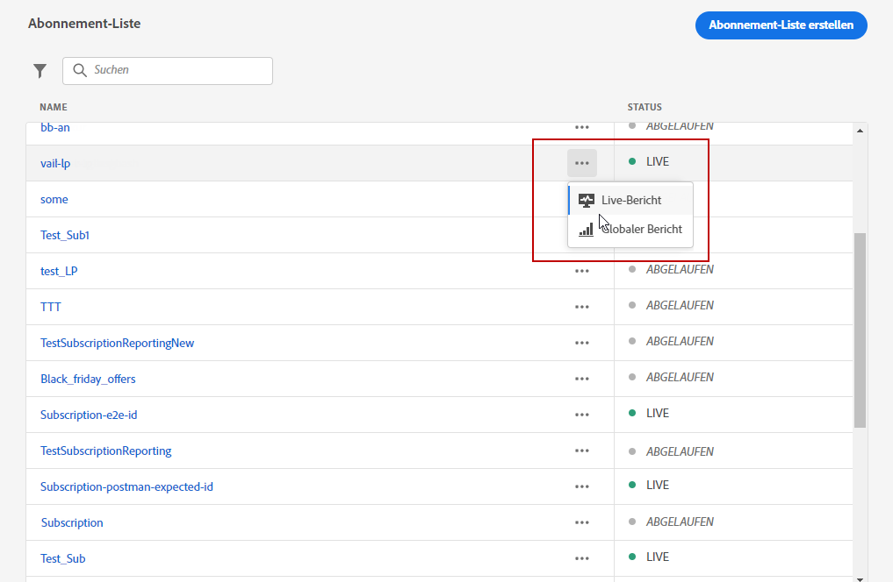
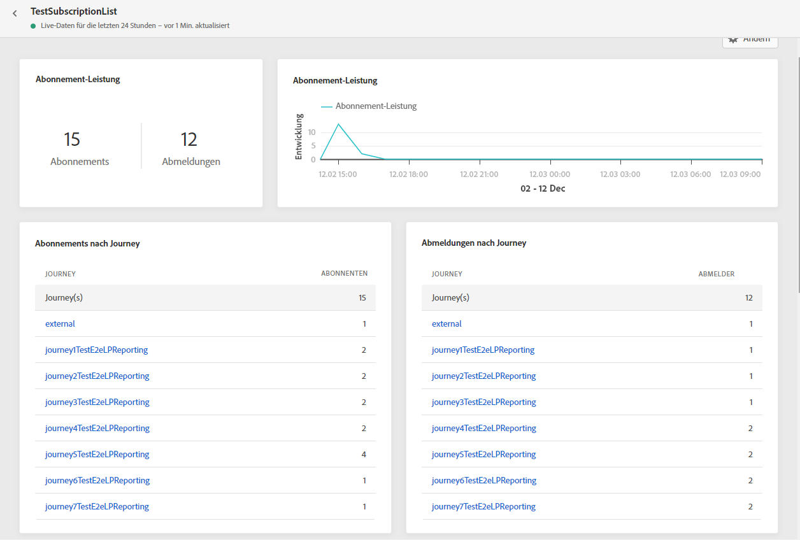
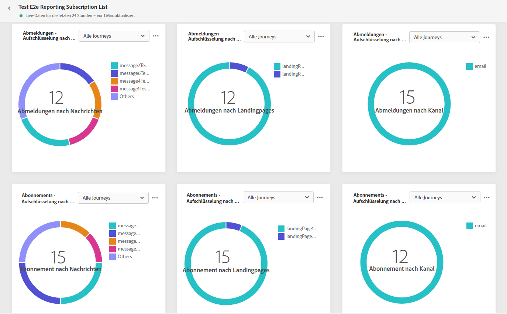
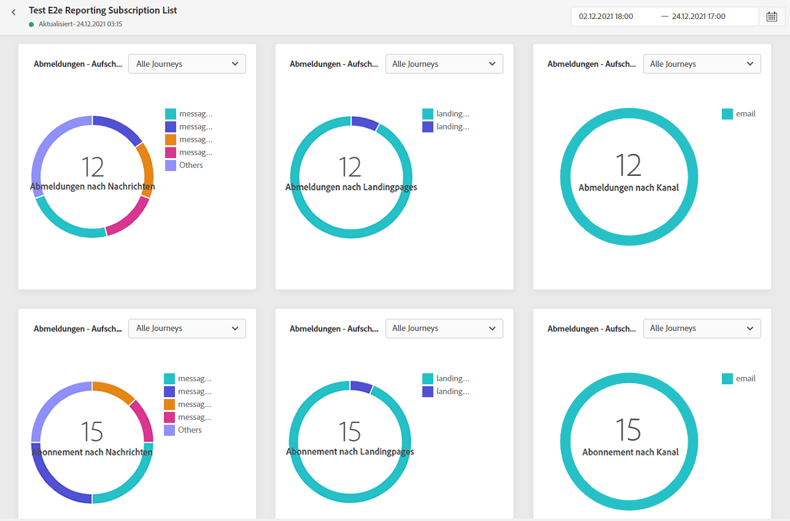

# Abonnementbericht {#subscription-report}

Der Abonnementbericht zeigt Details zur Aktivität Ihrer Abonnenten an. Zwei Berichtstypen sind verfügbar:

* Die **[!UICONTROL Live-Bericht]** um die An- und Abmeldungen Ihrer Sendungen in den letzten 24 Stunden zu messen und zu visualisieren.

* Die **[!UICONTROL Gesamtbericht]** um die An- und Abmeldungen Ihrer Sendungen über einen ausgewählten Zeitraum zu messen und zu visualisieren.

Um auf Ihre Berichte zuzugreifen, wählen Sie **Live** oder **[!UICONTROL Gesamtbericht]** im erweiterten Menü Ihrer ausgewählten Abonnementliste.

## Abonnement-Live-Bericht {#subscription-live}

Die **[!UICONTROL Anmeldeleistung]** KPIs und die **[!UICONTROL Abonnements nach Journey]**/**[!UICONTROL Abmeldungen durch Journey]** -Tabellen enthalten die wichtigsten Informationen zur Interaktion der Besucher mit Ihrer Landingpage. Die Tabellen und KPIs enthalten die für Ihre Landingpage verfügbaren Daten, z. B.:

* **[!UICONTROL Abonnements]**: Gesamtzahl der Anmeldungen in den letzten 24 Stunden.

* **[!UICONTROL Abmeldungen]**: Gesamtzahl der Abmeldungen in den letzten 24 Stunden.

Die **[!UICONTROL Anmeldeleistung]** -Diagramm zeigt die Entwicklung der Abonnements in den letzten 24 Stunden.

Die **Abonnements - Aufschlüsselung** und **Abmeldungen - Aufschlüsselung** -Diagramme geben die Gesamtzahl der Personen an, die sich in den letzten 24 Stunden angemeldet haben oder sich abgemeldet haben, je nach Nachricht, Landingpage und Kanal.

## Globaler Abonnementbericht {#subscription-global}

Die **[!UICONTROL Anmeldeleistung]** KPIs und die **[!UICONTROL Abonnements nach Journey]**/**[!UICONTROL Abmeldungen durch Journey]** -Tabellen enthalten die wichtigsten Informationen zur Interaktion Ihrer Besucher mit Ihrer Landingpage. Die Tabellen und KPIs enthalten die für Ihre Landingpage verfügbaren Daten, z. B.:

* **[!UICONTROL Abonnements]**: Gesamtzahl der Anmeldungen für den betreffenden Zeitraum.

* **[!UICONTROL Abmeldungen]**: Gesamtzahl der Abmeldungen für den betreffenden Zeitraum.

Die **[!UICONTROL Anmeldeleistung]** -Diagramm zeigt die Entwicklung der Anmeldungen für den betroffenen Zeitraum.

Die **Abonnements - Aufschlüsselung** und **Abmeldungen - Aufschlüsselung** die Gesamtzahl der Personen, die sich über den ausgewählten Zeitraum abgemeldet oder abgemeldet haben, in Abhängigkeit von Nachrichten, Landingpages und Kanälen.
