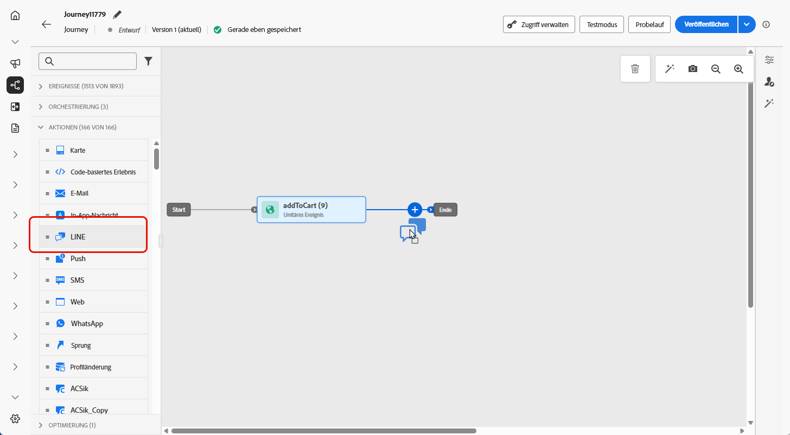
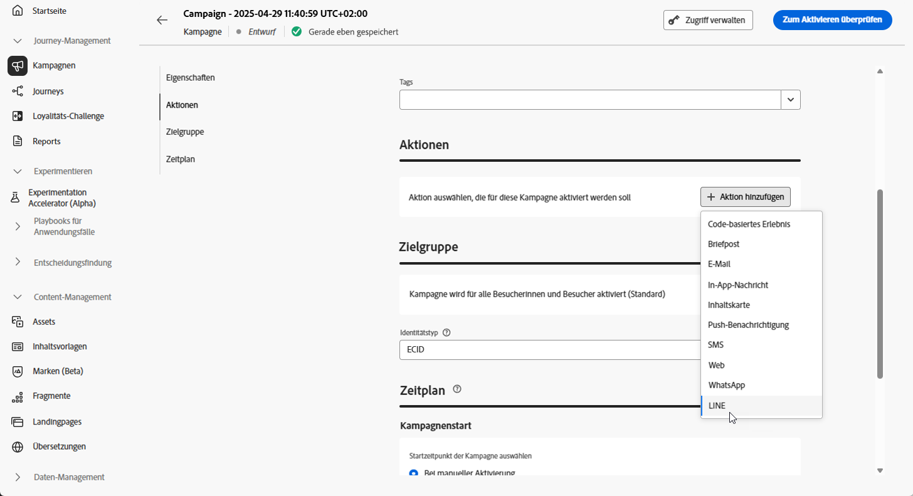

# Erstellen einer LINE-Nachricht {#create-line}

## Hinzufügen einer LINE-Nachricht {#create-line-journey-campaign}

Auf den folgenden Registerkarten finden Sie weitere Informationen dazu, wie Sie eine LINE-Nachricht in einer Kampagne oder Journey hinzufügen.

>[!BEGINTABS]

>[!TAB Hinzufügen einer LINE-Nachricht zu einer Journey]

1. Öffnen Sie Ihre Journey und ziehen Sie eine Aktivität **LINE** per Drag-and-Drop aus dem Abschnitt **Aktionen** der Palette.

   

1. Geben Sie allgemeine Informationen (Titel, Beschreibung, Kategorie) zu Ihrer Nachricht ein und wählen Sie dann die zu verwendende Konfiguration aus.

   Weitere Informationen zur Konfiguration der Journey finden Sie auf [dieser Seite](../building-journeys/journey-gs.md).

   Das Feld **[!UICONTROL Konfiguration]** ist standardmäßig mit der letzten Konfiguration für den Kanal vorausgefüllt, den die Benutzerin oder der Benutzer verwendet hat.

Sie können jetzt mit der Erstellung des Inhalts Ihrer SMS-Nachricht beginnen, indem Sie die Schaltfläche **[!UICONTROL Inhalt bearbeiten]** anklicken, wie unten beschrieben.

>[!TAB Hinzufügen einer LINE-Nachricht zu einer Kampagne]

1. Rufen Sie das Menü **[!UICONTROL Kampagnen]** auf und klicken Sie auf **[!UICONTROL Kampagne erstellen]**.

1. Wählen Sie den Typ der Kampagne aus, die Sie ausführen möchten.

   * **Geplant – Marketing**: die Kampagne wird sofort oder an einem bestimmten Datum ausgeführt. Geplante Kampagnen dienen dem Versand von Marketing-Nachrichten. Sie werden über die Benutzeroberfläche konfiguriert und ausgeführt.

   * **API-ausgelöst – Marketing/Transaktion**: die Kampagne wird mithilfe eines API-Aufrufs ausgeführt.  API-ausgelöste Kampagnen zielen auf den Versand von Nachrichten des Typs „Marketing“ oder „Transaktion“ ab. Beim Typ „Transaktion“ handelt es sich um Nachrichten, die nach einer von einem Kontakt durchgeführten Aktion verschickt werden: Zurücksetzen des Passworts und Verlassen des Warenkorbs.

1. Bearbeiten Sie im Bereich **[!UICONTROL Eigenschaften]** den **[!UICONTROL Titel]** und die **[!UICONTROL Beschreibung]** Ihrer Kampagne.

1. Klicken Sie auf die Schaltfläche **[!UICONTROL Zielgruppe auswählen]**, um die Zielgruppe aus der Liste der verfügbaren Adobe Experience Platform-Zielgruppen zu definieren. [Weitere Informationen](../audience/about-audiences.md).

1. Wählen Sie im Feld **[!UICONTROL Identity-Namespace]** den Namespace aus, der zur Identifizierung der Personen in der ausgewählten Zielgruppe verwendet werden soll. [Weitere Informationen](../event/about-creating.md#select-the-namespace).

1. Wählen Sie im Abschnitt **[!UICONTROL Aktionen]** die Option **[!UICONTROL LINE]** und dann eine Konfiguration aus oder erstellen Sie eine neue Konfiguration.

   Auf [dieser Seite](line-configuration.md) erfahren Sie mehr über die LINE-Konfiguration.

   

1. Klicken Sie auf **[!UICONTROL Experiment erstellen]**, um mit der Konfiguration Ihres Inhaltsexperiments zu beginnen und Abwandlungen zu erstellen, deren Performance zu messen und die beste Option für Ihre Zielgruppe zu ermitteln. [Weitere Informationen](../content-management/content-experiment.md)

1. Im Bereich **[!UICONTROL Tracking von Aktionen]** können Sie angeben, ob Sie Klicks auf Links in Ihrer SMS-Nachricht verfolgen möchten.

1. Kampagnen sind so konzipiert, dass sie an einem bestimmten Datum oder in regelmäßigen Abständen ausgeführt werden. Erfahren Sie in [diesem Abschnitt](../campaigns/create-campaign.md#schedule), wie Sie den **[!UICONTROL Zeitplan]** der Kampagne konfigurieren können.

1. Wählen Sie aus dem Menü **[!UICONTROL Aktions-Trigger]** die **[!UICONTROL Häufigkeit]** Ihrer SMS-Nachricht:

   * Einmal
   * Täglich
   * Wöchentlich
   * Monat

Sie können jetzt mit der Erstellung des Inhalts Ihrer Textnachricht beginnen, indem Sie die Schaltfläche **[!UICONTROL Inhalt bearbeiten]** anklicken, wie unten beschrieben.

>[!ENDTABS]

## Definieren Ihrer LINE-Inhalte{#line-content}

Gehen Sie wie folgt vor, um Ihren LINE-Inhalt zu konfigurieren. 

1. Klicken Sie auf dem Bildschirm der Journey- oder Kampagnenkonfiguration auf die Schaltfläche **[!UICONTROL Inhalt bearbeiten]**, um den Inhalt der Textnachricht zu konfigurieren.

1. Klicken Sie auf **[!UICONTROL Code bearbeiten]**, um JSON-Inhalte zu bearbeiten.

1. Verwenden Sie den Personalisierungseditor, um Inhalte zu definieren und Personalisierung sowie dynamischen Inhalt hinzuzufügen. Sie können jedes Attribut verwenden, wie etwa Profilname oder Stadt. Sie können auch bedingte Regeln definieren. Auf den folgenden Seiten erfahren Sie mehr über [Personalisierung](../personalization/personalize.md) und [dynamische Inhalte](../personalization/get-started-dynamic-content.md) im Personalisierungseditor.

1. Klicken Sie auf **[!UICONTROL Speichern]** und überprüfen Sie Ihre Nachricht in der Vorschau.

1. Verwenden Sie die Schaltfläche **[!UICONTROL Inhalte simulieren]**, um eine Vorschau des Inhalts Ihrer LINE-Nachricht und der personalisierten Inhalte anzuzeigen.

Sobald Sie Ihre Tests durchgeführt und den Inhalt validiert haben, können Sie Ihre LINE-Nachricht an Ihre Zielgruppe senden. Diese Schritte werden auf [dieser Seite](send-line.md) im Detail beschrieben.

Nach dem Versand können Sie die Wirkung Ihrer LINE-Nachricht in den Kampagnen- oder Journey-Berichten messen. Weiterführende Informationen zum Reporting finden Sie in [diesem Abschnitt](../reports/campaign-global-report-cja.md).
