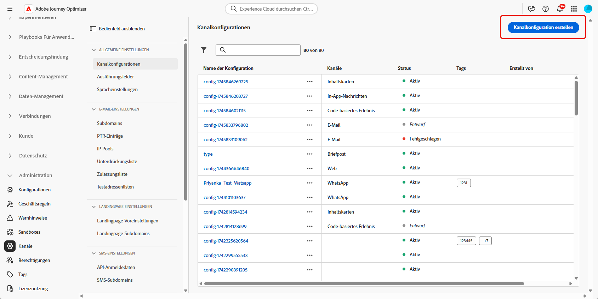
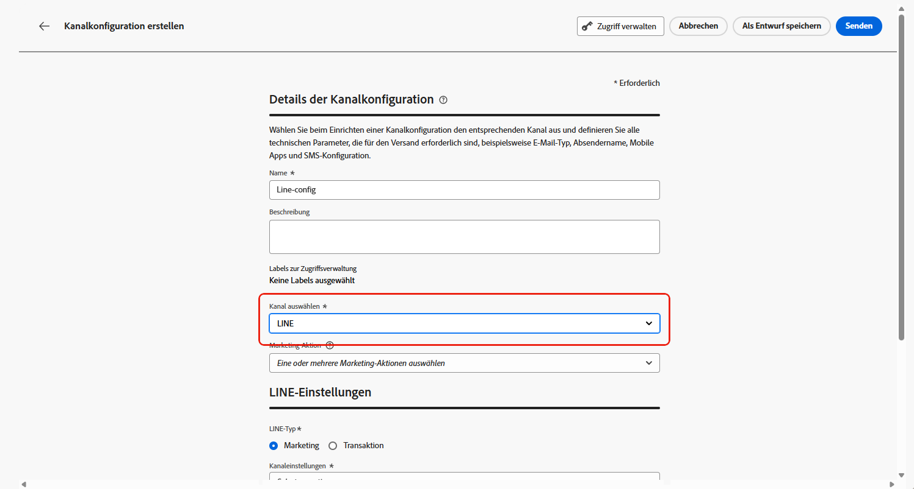

# Konfigurieren eines LINE-Kanals in Journey Optimizer {#line-configuration}

1. Rufen Sie das Menü **[!UICONTROL Kanäle]** > **[!UICONTROL Allgemeine Einstellungen]** > **[!UICONTROL Kanalkonfigurationen]** auf und klicken Sie dann auf **[!UICONTROL Kanalkonfiguration erstellen]**.

   

1. Geben Sie einen Namen und eine Beschreibung (optional) für die Konfiguration ein und wählen Sie dann den zu konfigurierenden Kanal aus.

   >[!NOTE]
   >
   > Namen müssen mit einem Buchstaben (A–Z) beginnen. Ein Name darf nur alphanumerische Zeichen enthalten. Sie können auch die Zeichen Unterstrich `_`, Punkt `.` und Bindestrich `-` verwenden.

1. Um der Konfiguration benutzerdefinierte oder grundlegende Datennutzungskennzeichnungen zuzuweisen, können Sie **[!UICONTROL Zugriff verwalten]** auswählen. [Weitere Informationen zur Zugriffssteuerung auf Objektebene (OLAC)](../administration/object-based-access.md).

1. Wählen Sie den Kanal **LINE** aus.

   

1. Wählen Sie eine **[!UICONTROL Marketing-Aktion]** aus, um Einverständnisrichtlinien mit den Nachrichten zu verknüpfen, die diese Konfiguration verwenden. Es werden alle mit der Marketing-Aktion verknüpften Einverständnisrichtlinien genutzt, um die Präferenzen Ihrer Kundinnen und Kunden zu respektieren. [Weitere Informationen](../action/consent.md#surface-marketing-actions)

1. Wählen Sie den Nachrichtentyp für die Konfiguration aus:

   * **Marketing**: Für Werbenachrichten, z. B. für wöchentliche Werbeaktionen eines Einzelhandelsgeschäfts. Diese Nachrichten erfordern das Einverständnis der Benutzerin bzw. des Benutzers und sollten den LINE-Richtlinien zu Benutzer-Opt-ins entsprechen.
   * **Transaktion**: Für nicht kommerzielle Nachrichten, z. B. Bestellbestätigungen, Benachrichtigungen bei Passwortrücksetzungen oder Versand-Updates. Diese Nachrichten können auch an Benutzende gesendet werden, die sich von Marketing-Kommunikation abgemeldet haben, sind jedoch streng auf bestimmte Transaktionskontexte beschränkt.

1. Wählen Sie Ihre **[!UICONTROL Kanaleinstellungen]** aus.

   Wenden Sie sich an den Adobe-Support, um Ihre **[!UICONTROL Kanaleinstellungen]** einzurichten.

   

1. Wählen Sie Ihre **[!UICONTROL LINE-Benutzer-ID]** aus, die zugeordnet werden soll. Dies ist die Kennung, über die Nachrichten mit einzelnen Benutzenden in Ihrem LINE-Kanal verknüpft werden.

1. Geben Sie Ihren **[!UICONTROL Absendernamen]** ein, z. B. den Namen Ihrer Marke.

1. Senden Sie Ihre Änderungen ab.

Sie können Ihre Konfiguration nun beim Erstellen Ihrer LINE-Nachricht auswählen.
