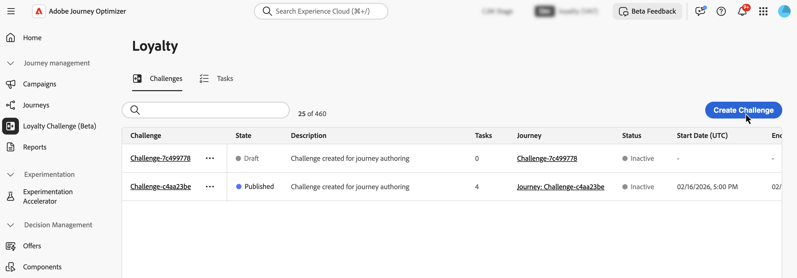
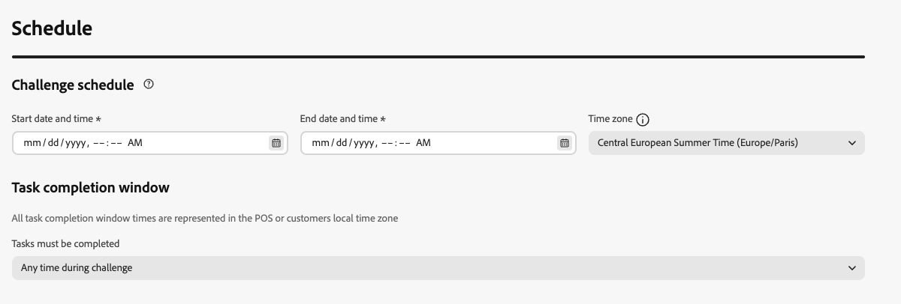
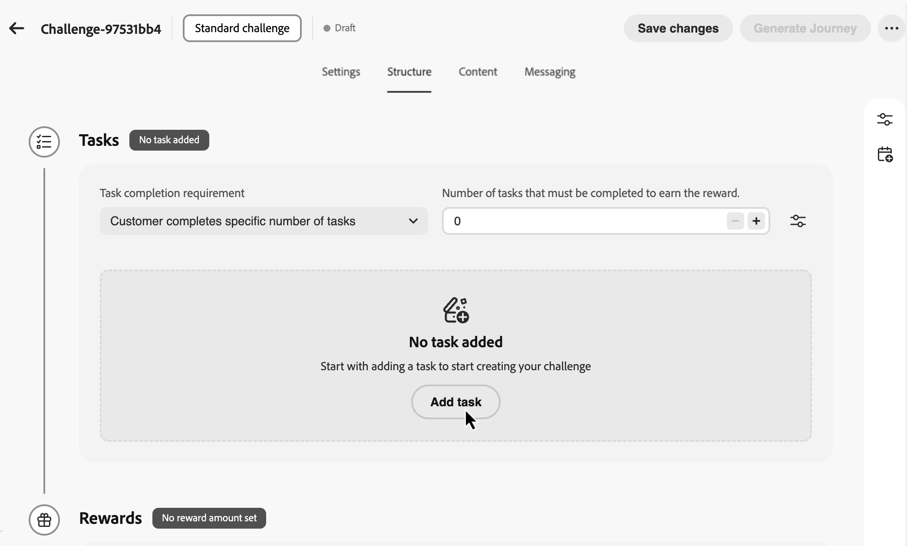
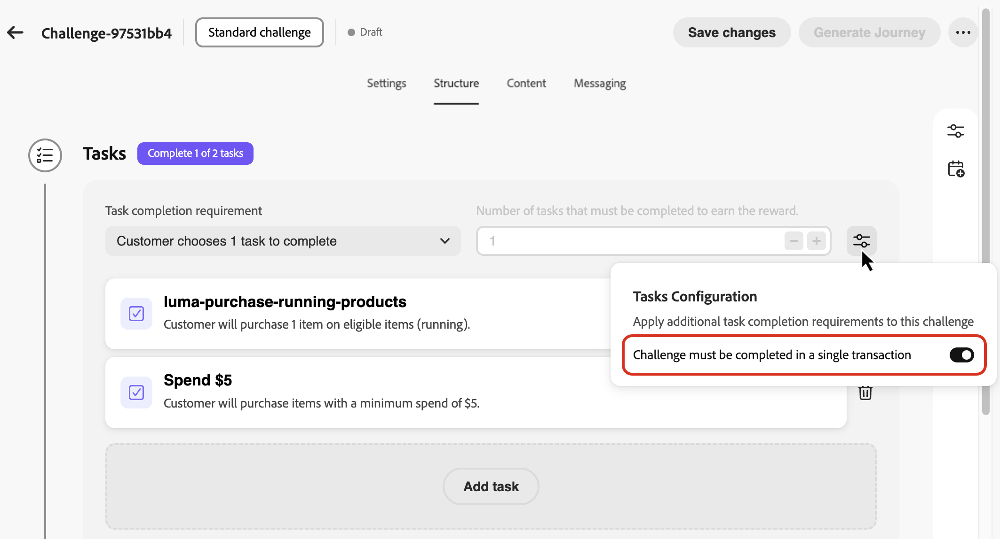
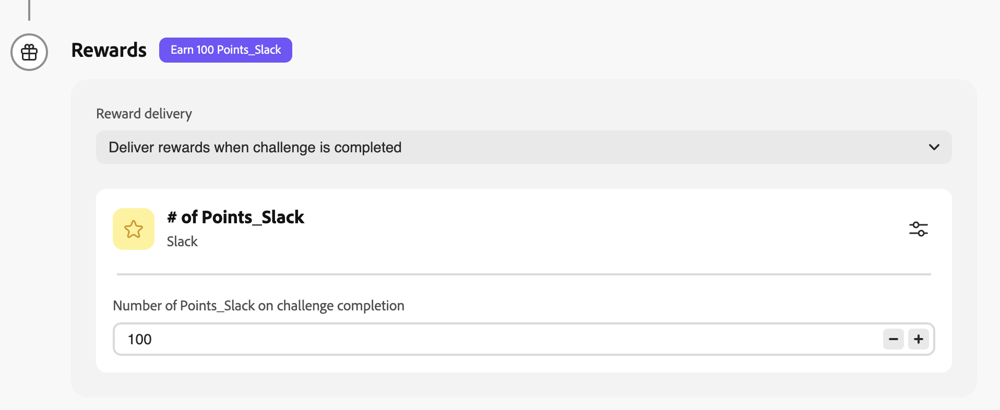
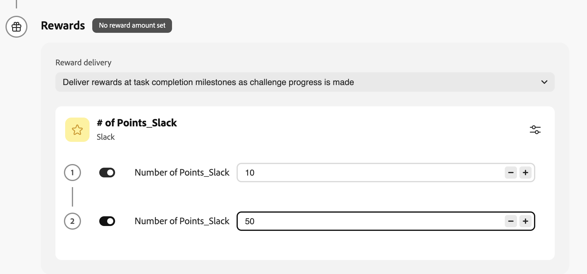
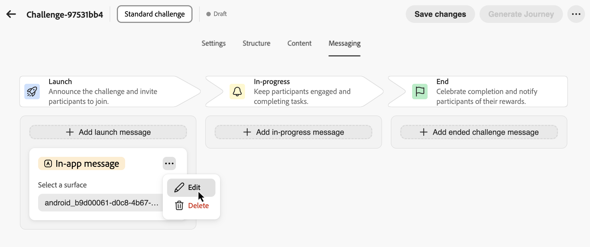
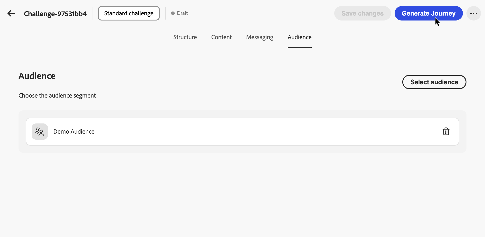
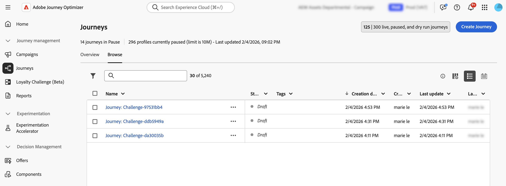

# Herausforderungen schaffen {#create-challenges}

>[!BEGINSHADEBOX]

**Inhaltsverzeichnis**

[Erste Schritte mit Herausforderungen im Zusammenhang mit der Treue](get-started.md)

<table style="table-layout:fixed">
<tr style="border: 0;">
<td style="vertical-align:top;">

**Herausforderungen erstellen und verwalten**

* [Zugriff und Verwaltung von Herausforderungen und Aufgaben](access-loyalty-challenges.md)
* **Herausforderungen schaffen** ◀︎ **Sie sind hier**
* [Aufgaben erstellen](create-tasks.md)
* [Überwachen der Leistung beim Treueprogramm](loyalty-reporting.md)

</td>
<td style="vertical-align:top;">

**Konfigurieren und Integrieren**

* [Herausforderungen bei der Treue konfigurieren](loyalty-admin.md)
* [Treuedaten und -datensätze](loyalty-data-and-datasets.md)
* [API-Referenz für Herausforderungen im Treueprogramm](https://developer.adobe.com/journey-optimizer-apis/references/loyalty-challenges){target="_blank"}

</td>
</tr>
</table>

>[!ENDSHADEBOX]

>[!AVAILABILITY]
>
>Diese Funktion befindet sich derzeit in der **privaten Betaversion**. Ausführliche Informationen zum Veröffentlichungszyklus und zur Verfügbarkeitsphase finden Sie unter [Veröffentlichungszyklus für Journey Optimizer](../rn/releases.md).

Auf dieser Seite wird der gesamte Prozess zur Erstellung einer Herausforderung für das Treueprogramm behandelt, von der Auswahl des Challenge-Typs und der Konfiguration von Einstellungen, Struktur, Inhalten und Messaging bis hin zur Erstellung und Veröffentlichung der Journey, die die Herausforderung für Ihre Kunden darstellt.

## Herausforderung erstellen {#create-the-challenge}

1. Navigieren Sie zu **[!UICONTROL Herausforderungen zum Treueprogramm (Beta]** in Journey Optimizer.

1. Wählen Sie die Registerkarte **[!UICONTROL Herausforderungen]** und wählen Sie **[!UICONTROL Herausforderung erstellen]**.

   

1. Wählen Sie den Challenge-Typ:

   * **[!UICONTROL Standard]**: Kunden führen eine beliebige Anzahl von Aufgaben in beliebiger Reihenfolge aus\
     *Beispiel: 3 von 5 verfügbaren Aufgaben abschließen*

   * **[!UICONTROL Streak]**: Kunden führen dieselbe Aufgabe mehrmals hintereinander aus\
     *Beispiel: Tätigen Sie einen Kauf an 7 aufeinander folgenden Tagen*

   * **[!UICONTROL Sequenziell]**: Kunden führen Aufgaben in einer definierten Reihenfolge aus\
     *Beispiel: → erwerben → überprüfen (muss in dieser Reihenfolge ausgefüllt werden)*

   * **[!UICONTROL Eigene Daten einbringen]**: Wählen Sie **[!UICONTROL Eigene Daten einbringen]**, wenn Sie möchten, dass das Challenge-Framework, z. B. Aufgaben und Belohnungen, aus Ihrer Loyalty Challenges-Datenintegration zusammengestellt wird. Wenn dieser Typ ausgewählt ist **[!UICONTROL ist]** Registerkarte „Struktur“ schreibgeschützt. Konfigurieren Sie **[!UICONTROL Einstellungen]**, **[!UICONTROL Inhalt]** und **[!UICONTROL Messaging]** auf dieselbe Weise wie andere Herausforderungstypen.

     >[!AVAILABILITY]
     >
     >Der Challenge **[!UICONTROL Typ „Eigene Daten]**&quot; steht derzeit einer begrenzten Anzahl von Organisationen zur Verfügung und wird in einer zukünftigen Version breiter verfügbar gemacht.

   Nach Auswahl eines Challenge-Typs wird der Challenge-Editor mit den folgenden Registerkarten geöffnet **[!UICONTROL „Einstellungen]**, **[!UICONTROL Struktur]**, **[!UICONTROL Inhalt]** und **[!UICONTROL Messaging]**. Beginnen Sie mit **[!UICONTROL Einstellungen]** um Challenge-Details, Audience, Zeitplan und Regeln zu definieren. Konfigurieren Sie dann **[!UICONTROL Struktur]** (Aufgaben und Belohnungen) für alle Typen außer **[!UICONTROL Eigene Daten einbringen]**.

## Konfigurieren der Challenge-Einstellungen {#settings}

Konfigurieren Sie auf **[!UICONTROL Registerkarte]** Einstellungen“ Eigenschaften auf Challenge-Ebene: Wer kann teilnehmen, wann die Challenge ausgeführt wird, wie sich Mitglieder anmelden und Fortschritte erzielen, sowie optionale Metadaten.

### Challenge-Details {#challenge-details}

>[!CONTEXTUALHELP]
>id="ajo_loyalty_challenge_properties"
>title="Challenge-Details"
>abstract="Legen Sie den Namen und die Beschreibung der Challenge fest. Die Challenge-ID wird beim Erstellen der Challenge automatisch zugewiesen und kann für die Verwendung der API oder der Integration kopiert werden."

1. Definieren **[!UICONTROL im Abschnitt]** Challenge-Details“ Folgendes:

   * **[!UICONTROL Name]**: Geben Sie einen beschreibenden Namen für Ihre Challenge ein. Dieser Name wird im Challenges-Inventar angezeigt.
   * **[!UICONTROL Challenge ID]**: Eine eindeutige Kennung, die zugewiesen wird, wenn die Challenge erstellt wird. Verwenden Sie das Kopiersteuerelement, um auf diese ID in APIs oder externen Systemen zu verweisen.
   * **[!UICONTROL Beschreibung]**: Geben Sie eine Beschreibung ein, die den Zweck und die Ziele der Herausforderung erklärt.

   

### Zielgruppe {#audience}

>[!CONTEXTUALHELP]
>id="ajo_loyalty_challenge_audience"
>title="Zielgruppe"
>abstract="Wählen Sie aus, wer an der Challenge teilnehmen kann. Fügen Sie eine Adobe Experience Platform-Zielgruppe hinzu oder lassen Sie die Zielgruppe leer, damit alle Mitglieder des Treueprogramms berechtigt sind. Optional können Sie den Abschluss weiterer Challenges als Voraussetzungen festlegen."

Definieren Sie, wer an Ihrer Herausforderung zur Treue teilnehmen kann.

1. Wählen Sie im **[!UICONTROL Audience]** die Option **[!UICONTROL Audience hinzufügen]** aus, um die Challenge auf eine bestimmte Adobe Experience Platform-Audience zu beschränken. [Erfahren Sie, wie Sie mit Audiences arbeiten](../audience/about-audiences.md).

   

1. Wählen Sie unter **[!UICONTROL Challenge-Voraussetzungen]** die Option **[!UICONTROL Challenge-Abschluss erforderlich]** aus, um die Berechtigung auf Mitglieder zu beschränken, die bereits eine oder mehrere ausgewählte Challenges abgeschlossen haben.

### Zeitplan {#schedule}

>[!CONTEXTUALHELP]
>id="ajo_loyalty_challenge_schedule"
>title="Challenge-Zeitplan"
>abstract="Legen Sie fest, wann die Challenge live ist, indem Sie Start- und Enddatum und -uhrzeit sowie eine Zeitzone angeben. Wählen Sie im Fenster zum Abschließen von Aufgaben aus, wann Kundinnen und Kunden während des Challenge-Zeitraums Aufgaben abschließen können."

Konfigurieren Sie, wann Ihre Challenge ausgeführt wird:

1. Legen Sie **[!UICONTROL Abschnitt &quot;]**&quot; Folgendes fest:

   * **[!UICONTROL Startdatum und -uhrzeit]**: Wenn die Challenge für Kunden verfügbar wird.
   * **[!UICONTROL Enddatum und -uhrzeit]**: Wenn die Challenge abläuft und keine neuen Abschlüsse mehr akzeptiert.
   * **[!UICONTROL Zeitzone]**: Die für den Zeitplan der Herausforderung verwendete Zeitzone.

   

1. Wählen **[!UICONTROL im Fenster „Aufgabenabschluss]** aus, wann Kunden Aufgaben abschließen können:

   * **[!UICONTROL Jederzeit während der Herausforderung]**: Kunden können Aufgaben jederzeit zwischen dem Start- und dem Enddatum der Herausforderung abschließen.
   * **[!UICONTROL Während bestimmter Tageszeiten:]** Sie den Aufgabenabschluss auf bestimmte tägliche Stunden ein, indem Sie **[!UICONTROL Startzeit]** und **[!UICONTROL Endzeit“]**.

### Regeln {#rules}

Konfigurieren Sie, wie Mitglieder sich anmelden, wann der Aufgabenfortschritt für die Herausforderung zählt und wie oft die Herausforderung abgeschlossen werden kann.

* **[!UICONTROL Opt-in-Trigger]**:

   * **[!UICONTROL Opt-in-Methode]** Wählen Sie aus, ob Kunden der Challenge manuell oder über einen Ereignis-Trigger beitreten möchten.
   * **[!UICONTROL Ereignis]**: Wählen Sie für das ereignisbasierte Opt-in das Ereignis aus, an dem sich Trigger anmelden. Administratoren können auf die Schaltfläche  klicken, um eine Ereignisdefinition zu erstellen. [Erfahren Sie, wie Sie Ereignisdefinitionen konfigurieren](loyalty-admin.md#event-definitions)

* **[!UICONTROL Fortschritt verfolgen]**:

   * **[!UICONTROL Verfolgung des Aufgabenfortschritts beginnt]**: Wählen Sie aus, wann Aufgabenabschlüsse auf den Challenge-Fortschritt angerechnet werden sollen. Wählen Sie beispielsweise **[!UICONTROL Wenn die Herausforderung beginnt (nach dem Opt-in)]** sodass der Fortschritt beginnt, nachdem das Mitglied sich angemeldet hat und die Herausforderung aktiv ist.

     Sie können entkoppeln, wenn eine Herausforderung für Mitglieder sichtbar ist, und den Fortschritt verfolgen. Beispielsweise kann eine Challenge-Karte angezeigt werden und Opt-ins akzeptieren, bevor der Abschluss einer Aufgabe zu einem späteren Zeitpunkt auf den Fortschritt gezählt wird.

   * **[!UICONTROL Start]**: Wenn Sie eine benutzerdefinierte Startoption auswählen, legen Sie das Datum und die Uhrzeit fest, zu der die Fortschrittsverfolgung beginnt.

* **[!UICONTROL Wiederholungsbeschränkungen]**:

   * **[!UICONTROL Herausforderung kann abgeschlossen werden]** Wählen Sie aus, ob die Herausforderung ein- oder mehrmals abgeschlossen werden kann. Beispiel: **[!UICONTROL Einmal]** oder eine definierte Anzahl von Abschlüssen.

   * **[!UICONTROL Häufigkeit, mit der die Aufgabe abgeschlossen werden kann]**: Wenn die Wiederholung aktiviert ist, geben Sie an, wie oft ein Mitglied die Herausforderung abschließen kann.

* **[!UICONTROL Completion Requirements]** *(nur Standard-Challenges)*:

   * **[!UICONTROL In einer einzigen Transaktion abschließen]**: Wenn diese Option aktiviert ist, müssen Kunden alle Aufgaben innerhalb einer einzigen Transaktion abschließen. Wenn diese Option deaktiviert ist, können Aufgaben über separate Transaktionen hinweg ausgeführt werden.

### Benutzerdefinierte Metadaten {#custom-metadata}

Wählen Sie im Abschnitt **[!UICONTROL Benutzerdefinierte Metadaten]** die Option **[!UICONTROL Schlüssel/Wert-Paar hinzufügen]** aus, um benutzerdefinierte Metadaten hinzuzufügen. Verwenden Sie Metadaten für das Tracking oder die Integration mit externen Systemen.

## Konfiguration der Challenge-Struktur {#structure}

Definieren Sie auf **[!UICONTROL Registerkarte]** Struktur“ die Aufgaben, die Kundinnen und Kunden erledigen müssen, und die Belohnungen, die sie verdienen. Diese Registerkarte wird nicht für Herausforderungen **[!UICONTROL Eigene Daten mitbringen]** verwendet.

### Aufgaben hinzufügen {#add-tasks}

>[!CONTEXTUALHELP]
>id="ajo_loyalty_challenge_tasks"
>title="Aufgaben"
>abstract="Wählen Sie die Aufgaben aus, die ausgeführt werden sollen, um die Challenge abzuschließen. Konfigurieren Sie anschließend, wie die Challenge abgeschlossen wird. Die verfügbaren Optionen hängen von Ihrem Challenge-Typ ab (Standard, Streak oder Sequenziell)."

Aufgaben definieren die spezifischen Aktionen, die Kunden durchführen müssen, um Belohnungen zu erhalten. Sie können Aufgabentypen (Kauf, Ausgaben oder benutzerspezifisches Ereignis), Mengen, Produktfilter und andere Attribute konfigurieren.

Gehen Sie wie folgt vor, um Ihrer Herausforderung Aufgaben hinzuzufügen:

1. Wählen Sie **[!UICONTROL Abschnitt]** Aufgaben“ **[!UICONTROL Aufgabe hinzufügen]** aus.

   

1. Das **[!UICONTROL Aufgabeninventar]** wird geöffnet. Wählen Sie eine oder mehrere Aufgaben aus der Liste aus und klicken Sie auf **[!UICONTROL Hinzufügen]**. Um eine neue Aufgabe zu erstellen, wählen Sie **[!UICONTROL Neu]** aus. [Erfahren Sie, wie Sie Aufgaben erstellen und konfigurieren](create-tasks.md).

1. Geben Sie an, wann die Herausforderung als abgeschlossen gilt. Die verfügbaren Einstellungen hängen vom Challenge-Typ ab:

   +++Standardmäßige Herausforderungen

   Wählen Sie in **[!UICONTROL Dropdown-Liste]** Anforderung für Aufgabenabschluss“ zwischen:

   * **[!UICONTROL Der Kunde wählt eine zu]** Aufgabe aus *- Kunden können jede einzelne Aufgabe auswählen und abschließen, um Belohnungen zu erhalten*
   * **[!UICONTROL Kunde führt eine bestimmte Anzahl von Aufgaben aus]** - *Kunden müssen eine definierte Anzahl von Aufgaben ausführen. Geben Sie die erforderliche Anzahl von Aufgaben an, die abgeschlossen werden sollen.*

   +++

   +++Herausforderungen meistern

   Wählen **[!UICONTROL in der Dropdown]** Liste „Streak-Typ“ zwischen:

   * **Aufeinander folgend**: Kunden müssen die Aufgabe an aufeinander folgenden Tagen ohne Pausen abschließen. *Beispiel: Kauf am Montag, Dienstag, Mittwoch - ein Tag fehlt, bricht die Serie.*

   * **Nicht fortlaufend**: Kunden können die Aufgabe mit Lücken zwischen den Abschlüssen abschließen. *Beispiel: 7 Käufe über 30 Tage abschließen, wobei Pausen erlaubt sind.*

   Geben **[!UICONTROL im Feld]** an, wie oft die Aufgabe abgeschlossen werden soll. *Beispiel: Für eine „7-tägige Kauf-Stream“ auf 7 festgelegt*

   +++

   +++Sequenzielle Herausforderungen

   Wählen Sie in **[!UICONTROL Dropdown-Liste]** Anforderung für Aufgabenabschluss“ zwischen:

   * **[!UICONTROL Der Kunde wählt eine zu]** Aufgabe aus *- Kunden können jede einzelne Aufgabe auswählen und abschließen, um Belohnungen zu erhalten*
   * **[!UICONTROL Kunde führt eine bestimmte Anzahl von Aufgaben aus]** - *Kunden müssen eine definierte Anzahl von Aufgaben in der von Ihnen definierten Reihenfolge ausführen. Fehlende oder ausgelassene Aufgaben unterbrechen die Sequenz. Geben Sie die erforderliche Anzahl von Aufgaben an, die abgeschlossen werden sollen*

   +++

1. Standardmäßig können Kunden mit standardmäßigen und sequenziellen Herausforderungen Aufgaben über mehrere Transaktionen hinweg ausführen. Um alle Aufgaben in einer Transaktion auszuführen, öffnen Sie das Menü Aufgabenoptionen und aktivieren Sie die Option Einzeltransaktion .

   

Nachdem Sie Aufgaben zu Ihrer Challenge hinzugefügt haben, konfigurieren Sie die Belohnungen, die Kunden für den Abschluss erhalten.

### Konfigurieren von Prämien {#rewards}

>[!CONTEXTUALHELP]
>id="ajo_loyalty_challenge_rewards"
>title="Prämien"
>abstract="Wählen Sie aus, wann Kundinnen und Kunden Punkte sammeln: wenn sie die gesamte Challenge abgeschlossen haben, oder bei einzelnen Meilensteinen im Verlauf der Aufgabe. Wählen Sie Ihren Prämienanbieter aus (Ihre Treuelösung, die Punkte und Prämien verwaltet) und legen Sie dann die Beträge fest: einen Gesamtbetrag für den vollständigen Abschluss oder Werte pro Aufgabe für Meilensteine, wobei Prämien nur für die Aufgaben aktiviert werden, für die Sie eine Auszahlung vornehmen möchten."

Prämien sind die Treuepunkte oder Vorteile, die Kundinnen und Kunden bei der Bewältigung von Herausforderungen erhalten.

So konfigurieren Sie, wann und wie Belohnungen bereitgestellt werden:

1. Wählen Sie im Dropdown **[!UICONTROL Menü]** Belohnungsversand“ aus, wann Belohnungen bereitgestellt werden sollen:

   * **[!UICONTROL Belohnungen nach Abschluss der Herausforderung bereitstellen]**: Belohnungen erhalten, wenn Kunden die gesamte Herausforderung bewältigen\
     *Beispiel: Vergabe von 100 Punkten nach Abschluss aller 5 Aufgaben*

   * **[!UICONTROL Belohnungen bei Meilensteinen zum Abschluss von Aufgaben bereitstellen, sobald der Fortschritt der Herausforderung erreicht wird]**: Belohnungen werden schrittweise verliehen, sobald Kunden einzelne Aufgaben erledigen (nur für Herausforderungen, die mehr als eine Aufgabe erfordern).\
     *Beispiel: Vergabe von 10 Punkten nach Aufgabe 1, 20 Punkten nach Aufgabe 2 und 50 Punkten nach Aufgabe 3*

1. Wählen Sie Ihren Belohnungsanbieter. Dies ist Ihre Treuelösung, mit der Kundenpunkte und -belohnungen verwaltet werden. Belohnungsanbieter werden im Menü **[!UICONTROL Treueprogramm-Administrator]** erstellt, bevor Sie Herausforderungen für Ihre Autoren erstellen. [Erfahren Sie, wie Sie Belohnungsanbieter konfigurieren](loyalty-admin.md#reward-providers)

   

1. Konfigurieren Sie die Belohnungsbeträge basierend auf Ihrer ausgewählten Versandmethode:

   +++Belohnungen nach Abschluss der Challenge bereitstellen

   Geben Sie den Gesamtbelohnungsbetrag an, der gegeben werden soll, wenn Kunden die gesamte Challenge abschließen.

   *Im folgenden Beispiel erhalten Kunden 100 Punkte, wenn sie die Challenge abschließen.*

   

   +++

   +++Belohnungen bei Meilensteinen bei Aufgabenabschluss bereitstellen

   Belohnungsbeträge für Meilensteine bei Aufgabenabschluss angeben. Mit dieser Option können Sie progressive Belohnungen schaffen, die die Motivation der Kunden im Laufe der Challenge steigern.

   Schalten Sie für jede Aufgabe, für die Sie eine Belohnung bereitstellen möchten, die Option Belohnung ein und geben Sie an, wie viele Punkte Kunden erhalten sollen, wenn sie diese Aufgabe erfüllen. Sie können festlegen, dass nur bestimmte Aufgabenabschlüsse belohnt werden sollen. Wenn Sie beispielsweise 10 Aufgaben haben, belohnen Sie möglicherweise nur die Aufgaben 1, 5 und 10.

   *Im folgenden Beispiel erhalten Kunden beim Abschluss der ersten Aufgabe 10 Punkte und nach Abschluss der zweiten Aufgabe 50 zusätzliche Punkte.*

   

   +++

Nachdem Sie die Challenge-Struktur mit Aufgaben und Belohnungen konfiguriert haben, können Sie optional konfigurieren, wie die Challenge für Kunden dargestellt wird. Wenn Sie keine Challenge-Inhalte benötigen, überspringen Sie diesen Schritt und fahren Sie direkt mit [Konfigurieren von Messaging](#configure-messaging) fort.

## Konfigurieren von Challenge-Inhalten (optional) {#configure-content-cards}

>[!CONTEXTUALHELP]
>id="ajo_loyalty_challenge_content"
>title="Inhalt"
>abstract="Konfigurieren Sie, wie Ihre Herausforderung an Orten dargestellt wird, an denen Mitglieder des Treueprogramms auf Herausforderungen zugreifen und ihren Fortschritt verfolgen. Verwenden Sie die Aktion „Hinzufügen“, um die Inhaltskarte auszuwählen, um ein kartenartiges Erlebnis anzuzeigen, oder das Code-basierte Erlebnis, um Inhalte über Ihre eigene benutzerdefinierte Implementierung bereitzustellen."

Die Registerkarte **[!UICONTROL Inhalt]** steuert, wie die Herausforderung an Orten dargestellt wird, an denen Mitglieder des Treueprogramms auf Herausforderungen zugreifen und ihren Fortschritt verfolgen.

So konfigurieren Sie Challenge-Inhalte:

1. Navigieren Sie zur Registerkarte **[!UICONTROL Inhalt]** und klicken Sie auf **[!UICONTROL Aktion hinzufügen]**.

1. Wählen Sie den Aktionstyp aus:

   * **[!UICONTROL Inhaltskarte]**: Zeigt die Herausforderung als kartenartiges Erlebnis auf Kundengeräten an. Wählen Sie eine **[!UICONTROL Kanalkonfiguration]** und klicken Sie auf **[!UICONTROL Inhalt bearbeiten]**, um die Karte zu entwerfen und zu personalisieren. [Weitere Informationen zu Inhaltskarten](../content-card/create-content-card.md).
   * **[!UICONTROL Code-basiertes Erlebnis]**: Liefert Challenge-Inhalte über Ihre eigene benutzerdefinierte Implementierung mithilfe des Code-basierten Kanals von Journey Optimizer. Wählen Sie eine **[!UICONTROL Kanalkonfiguration]** und klicken Sie auf **[!UICONTROL Inhalt bearbeiten]** um den Inhalt zu definieren. [Erfahren Sie mehr über Code-basierte Erlebnisse](../code-based/create-code-based.md).

   

   Sie können mehrere Aktionen hinzufügen, um die Herausforderung auf verschiedenen Oberflächen darzustellen.

Richten Sie nach der Konfiguration des Inhalts Messaging ein, um Kunden während des gesamten Challenge-Lebenszyklus anzusprechen.

### Konfigurieren von Messaging {#configure-messaging}

>[!CONTEXTUALHELP]
>id="ajo_loyalty_challenge_messaging"
>title="Messaging"
>abstract="Messaging unterstützt die Interaktion über den gesamten Challenge-Lebenszyklus hinweg. Fügen Sie auf der Registerkarte „Messaging“ Nachrichten für jeden Schritt hinzu: „Start“ (wenn die Challenge beginnt), „In Bearbeitung“ (Erinnerungen und Fortschrittsaktualisierungen) und „Abschluss“ (Erfolg feiern und Prämien bestätigen). Fügen Sie für jeden Schritt eine Nachricht hinzu, wählen Sie den Kanal aus, wählen Sie eine Kanalkonfiguration aus und klicken Sie dann auf „Bearbeiten“, um den Nachrichteninhalt zu entwerfen."

Richten Sie Multi-Channel-Nachrichten ein, um Kunden in wichtigen Phasen des Challenge-Lebenszyklus anzusprechen. Messaging ist optional, wird aber zur Maximierung der Kundeninteraktion empfohlen.

1. Navigieren Sie zur Registerkarte **[!UICONTROL Messaging]** und konfigurieren Sie Nachrichten für jede Lebenszyklusphase:

   * **Launch**-Nachricht: Kunden benachrichtigen, wenn die Herausforderung beginnt
   * **In Bearbeitung** Nachricht: Halten Sie Kunden mit Erinnerungen und Fortschrittsaktualisierungen in Verbindung
   * **Completion** Nachricht: Erfolg feiern und Zuweisung der Belohnung bestätigen

1. Klicken Sie für jede Phase auf die Schaltfläche Nachricht hinzufügen , um eine Nachricht für diese Phase zu erstellen.

1. Wählen Sie den gewünschten Kanal aus: **[!UICONTROL In-App]**, **[!UICONTROL E-Mail]** oder **[!UICONTROL Push-Benachrichtigung]** und wählen Sie die zugehörige Kanalkonfiguration.

1. Klicken Sie auf das  und wählen Sie **[!UICONTROL Bearbeiten]** aus, um den Nachrichteninhalt zu entwerfen.

   

In diesen Abschnitten erfahren Sie, wie Sie Nachrichten für bestimmte Kanäle erstellen: [In-App-Nachrichten](../in-app/get-started-in-app.md) - [E-Mail-Nachrichten](../email/get-started-email.md) - [Push-Benachrichtigungen](../push/get-started-push.md)

Ihre Challenge ist jetzt mit den Einstellungen, der Struktur, dem Inhalt und dem Messaging vollständig konfiguriert. Um ihn zu starten, müssen Sie die Challenge und die zugehörige Journey veröffentlichen.

## Challenge starten {#launch}

Das Starten einer Challenge erfordert **drei Schritte**: (1) Veröffentlichen der Challenge, (2) Generieren der Journey, (3) Veröffentlichen der Journey. Alle drei Punkte müssen erfüllt sein, damit die Herausforderung an die Kunden ausgeliefert werden kann.

1. Überprüfen Sie Ihre Challenge-Konfiguration, um sicherzustellen, dass alle erforderlichen Felder ausgefüllt sind.

1. Klicken Sie auf das Symbol  und wählen Sie **[!UICONTROL Veröffentlichen]** aus.

   

1. Wählen Sie **[!UICONTROL Journey generieren]**, um die Journey zu erstellen, die Ihren Challenge-Versand koordiniert.

   

1. Journey Optimizer erstellt automatisch eine Journey im Status „Entwurf“. Die Journey erscheint im Journey-Bestand mit dem Namensformat *&quot;Journey: [Challenge Name]&quot;*. [Erfahren Sie mehr über den Journey-Bestand](../building-journeys/journey-ui.md).

   

1. Öffnen Sie die Journey und veröffentlichen Sie sie. Der Journey startet automatisch am angegebenen Startdatum der Challenge und sendet Inhalte und Nachrichten entsprechend Ihrer Konfiguration. [Erfahren Sie, wie Sie eine Journey veröffentlichen](../building-journeys/publish-journey.md).

1. Sobald Ihre Challenge live ist, überwachen Sie Programm-KPIs, Challenge-Ergebnisse und Aufgabenmetriken in den [Treueprogramm-Challenge-Berichten](loyalty-reporting.md). Sie können den Nachrichtenversand auch im Bericht [Journey überwachen](../reports/journey-global-report-cja.md).

>[!NOTE]
>
>Die automatisch generierte Journey kann angepasst werden, um zusätzliche Logik oder Messaging hinzuzufügen. Direkt am Journey vorgenommene Änderungen werden jedoch nicht mit der Challenge-Konfiguration synchronisiert. Wenn Sie die Challenge später bearbeiten, gehen alle Journey-Anpassungen verloren, wenn die Journey neu generiert wird.
