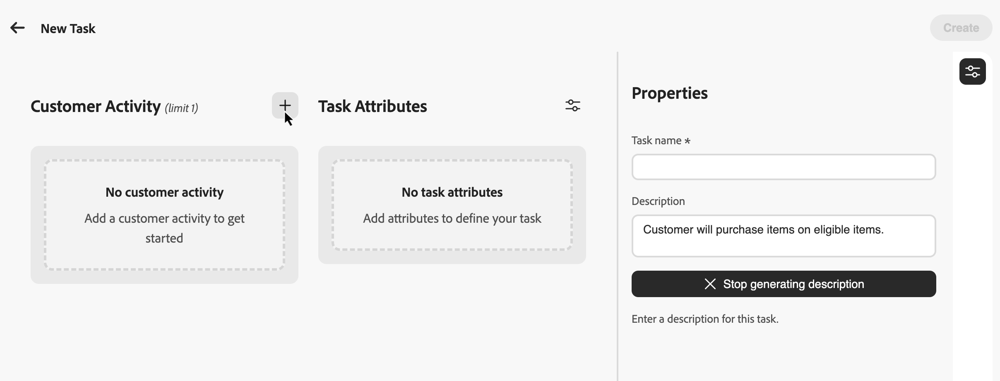
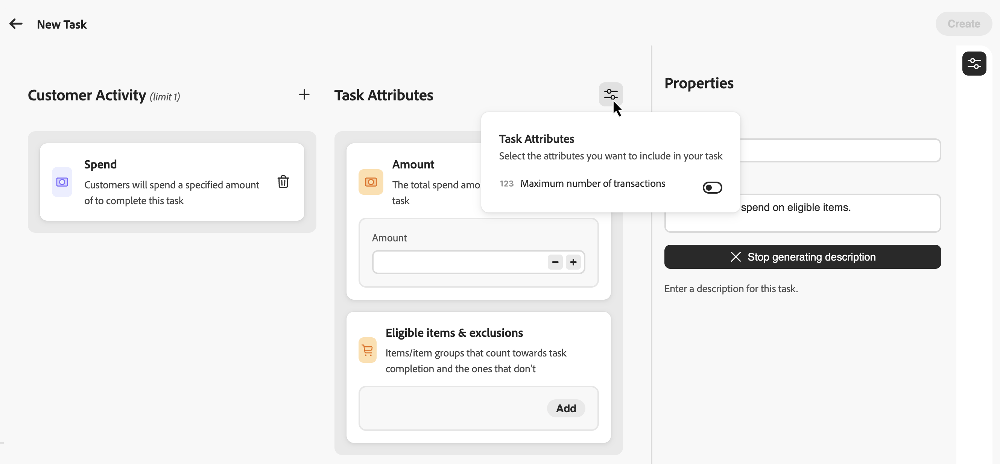
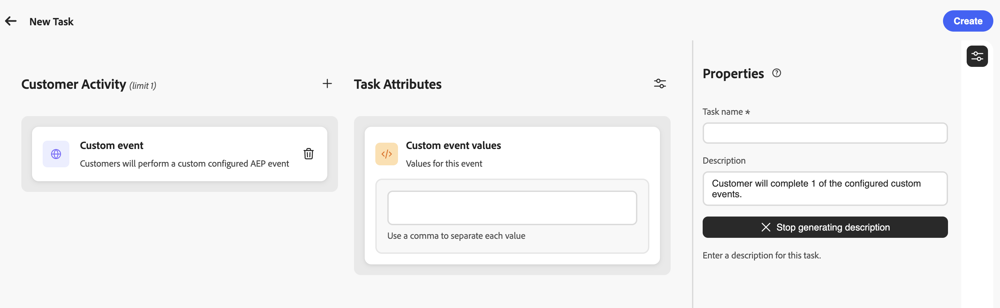

# Aufgaben erstellen {#create-tasks}

>[!BEGINSHADEBOX]

**Inhaltsverzeichnis**

[Erste Schritte mit Herausforderungen im Zusammenhang mit der Treue](get-started.md)

<table style="table-layout:fixed">
<tr style="border: 0;">
<td style="vertical-align:top;">

**Herausforderungen erstellen und verwalten**

* [Zugriff und Verwaltung von Herausforderungen und Aufgaben](access-loyalty-challenges.md)
* [Herausforderungen schaffen](create-challenges.md)
* **Aufgaben erstellen** ◀︎ **Sie sind hier**
* [Überwachen der Leistung beim Treueprogramm](loyalty-reporting.md)

</td>
<td style="vertical-align:top;">

**Konfigurieren und Integrieren**

* [Herausforderungen bei der Treue konfigurieren](loyalty-admin.md)
* [Treuedaten und -datensätze](loyalty-data-and-datasets.md)
* [API-Referenz für Herausforderungen im Treueprogramm](https://developer.adobe.com/journey-optimizer-apis/references/loyalty-challenges){target="_blank"}

</td>
</tr>
</table>

>[!ENDSHADEBOX]

>[!AVAILABILITY]
>
>Diese Funktion befindet sich derzeit in der **privaten Betaversion**. Ausführliche Informationen zum Veröffentlichungszyklus und zur Verfügbarkeitsphase finden Sie unter [Veröffentlichungszyklus für Journey Optimizer](../rn/releases.md).

Aufgaben definieren die spezifischen Aktionen oder Meilensteine, die Kundinnen und Kunden abschließen müssen, um bei einer Herausforderung im Rahmen des Treueprogramms Belohnungen zu erhalten. Sie können Kauf- und Ausgabenaufgaben oder **[!UICONTROL Benutzerspezifische Ereignisse“-]** konfigurieren, mit denen Adobe Experience Platform-Erlebnisereignisse verfolgt werden, die Ihr Unternehmen bereits erfasst.

Jede Aufgabe stellt eine messbare Aktion dar, die zum Abschluss der Herausforderung beiträgt. Aufgaben sind wiederverwendbare Komponenten, die unabhängig erstellt und dann zu einer oder mehreren Herausforderungen hinzugefügt oder direkt in einer Herausforderung erstellt werden können.

## Erstellen einer Aufgabe {#create-task}

>[!CONTEXTUALHELP]
>id="ajo_loyalty_task_create"
>title="Erstellen einer Aufgabe"
>abstract="Wählen Sie eine Kundenaktivität aus (Kauf, Ausgaben oder benutzerspezifisches Ereignis) und konfigurieren Sie dann aktivitätsspezifische Attribute. Legen Sie im Bereich „Eigenschaften“ den Namen und die Beschreibung der Aufgabe fest."

Sie können Aufgaben aus zwei Einstiegspunkten erstellen. Der Konfigurationsprozess ist unabhängig davon, wo Sie beginnen, identisch.

>[!BEGINTABS]

>[!TAB Aus dem Aufgabeninventar]

Wählen Sie die Registerkarte **[!UICONTROL Aufgaben]** und wählen Sie **[!UICONTROL Aufgabe erstellen]**. Aus dem Inventar erstellte Aufgaben werden gespeichert und stehen zur Wiederverwendung über mehrere Herausforderungen hinweg zur Verfügung.

>[!TAB Aus einer Herausforderung]

Öffnen Sie eine bestehende Challenge oder erstellen Sie eine neue. Wählen Sie **[!UICONTROL Aufgabe hinzufügen]** und klicken Sie auf die Schaltfläche **[!UICONTROL Neu]**. Auf diese Weise erstellte Aufgaben werden automatisch zu Ihrer Challenge hinzugefügt und auch im Aufgabeninventar gespeichert, um sie in anderen Challenges wiederzuverwenden.

>[!ENDTABS]

## Kundenaktivität auswählen {#choose-activity}

Wählen Sie den Aktivitätstyp aus, den Kunden ausführen müssen, um diese Aufgabe abzuschließen:

* **[!UICONTROL Kauf]**: Kunden müssen einen oder mehrere Artikel kaufen, um diese Aufgabe abzuschließen
* **[!UICONTROL Ausgaben]**: Kunden müssen einen bestimmten Betrag ausgeben, um diese Aufgabe abzuschließen
* **[!UICONTROL Benutzerspezifisches Ereignis]**: Kunden müssen eine Aktivität ausführen, die durch ein Adobe Experience Platform-Erlebnisereignis repräsentiert wird. Zum Beispiel ein Hotel-Check-in, eine Mobile-App-Aktion oder eine Überprüfung der Übermittlung. Das zugrunde liegende Ereignis muss bereits in Experience Platform erfasst und über eine Ereignisdefinition im Menü **[!UICONTROL Treueprogramm-Admin]** zugeordnet worden sein. [Erfahren Sie, wie Sie Ereignisdefinitionen konfigurieren](loyalty-admin.md#event-definitions)

Um eine Aktivität auszuwählen, klicken Sie auf das Symbol **+** und wählen Sie die Kundenaktivität aus, die am besten zu Ihren Ergebniszielen passt. Jeder Aktivitätstyp verfügt über bestimmte konfigurierbare Attribute, um die Aufgabenanforderungen weiter zu definieren und zu gestalten.

## Aufgabenattribute definieren {#define-attributes}

Konfigurieren Sie die Aufgabenattribute basierend auf dem ausgewählten Aktivitätstyp. Auf den folgenden Registerkarten finden Sie die verfügbaren Attribute für jeden Aktivitätstyp:

>[!BEGINTABS]

>[!TAB Kaufaktivität]

Verfügbare Attribute für **Kauf**-Aktivitäten:

* **[!UICONTROL Menge]**: Geben Sie die Anzahl der Artikel ein, die gekauft werden müssen, um diese Aufgabe abzuschließen.
* **[!UICONTROL Mögliche Artikel und Ausschlüsse]**: Definieren Sie Artikel oder Artikelgruppen, die für den Abschluss von Aufgaben zählen, und solche, die dies nicht tun, oder wählen Sie **[!UICONTROL Eigene Daten einbringen]**, um die Eignung aus Ihren externen Daten zu generieren. [Weitere Informationen](#eligible-items-exclusions)
* **[!UICONTROL Mindestausgabewert-Betrag]**: Legen Sie eine Anforderung für den Mindestbezugsbetrag fest.
* **[!UICONTROL Maximale Anzahl von Transaktionen]**: Schränken Sie ein, wie viele Transaktionen zum Abschließen der Aufgabe verwendet werden können.

>[!TAB Ausgabenaktivität]

Verfügbare Attribute für **Ausgaben**-Aktivitäten:

* **[!UICONTROL Betrag]**: Geben Sie den Gesamtbetrag der Ausgaben ein, der erforderlich ist, um die Aufgabe abzuschließen.
* **[!UICONTROL Mögliche Artikel und Ausschlüsse]**: Definieren Sie Artikel oder Artikelgruppen, die für die Aufgabenfertigstellung angerechnet werden, und solche, die dies nicht tun. [Erfahren Sie mehr über geeignete Elemente und Ausschlüsse](#eligible-items-exclusions)
* **[!UICONTROL Maximale Anzahl von Transaktionen]**: Geben Sie an, wie viele Transaktionen die Ausgabenanforderung erfüllen dürfen. Sie können dieses Attribut über das Symbol Parameter aktivieren.

>[!TAB Aktivität für benutzerspezifische Ereignisse]

Verfügbare Attribute für Aktivitäten **[!UICONTROL benutzerdefiniertes Ereignis]**:

* **[!UICONTROL Benutzerdefinierte Ereigniswerte]**: Geben Sie die Werte für das benutzerdefinierte Ereignis ein, das Kundinnen und Kunden abschließen müssen. Trennen Sie die Werte mit Kommas. Diese Werte müssen mit den Ereignisdefinitionen übereinstimmen, die im Menü **[!UICONTROL Treueprogramm-Admin]** konfiguriert sind. [Erfahren Sie, wie Sie Ereignisdefinitionen konfigurieren](loyalty-admin.md#event-definitions)

>[!ENDTABS]

## Definieren der geeigneten Artikel und Ausschlüsse {#eligible-items-exclusions}

>[!CONTEXTUALHELP]
>id="ajo_loyalty_task_eligible_items_exclusion"
>title="Geeignete Artikel und Ausschlüsse"
>abstract="Sowohl für die Aktivität **Kauf** als auch für die Aktivität **Ausgaben** können Sie das Attribut **[!UICONTROL Geeignete Artikel und Ausschlüsse]** verwenden, um festzulegen, welche Artikel und Gruppen zulässig und welche ausgeschlossen sind. Auf diese Weise können Sie bestimmte Produkte, Kategorien oder Standorte auswählen, um sie an Ihre Challenge-Ziele anzupassen. Sie können beispielsweise eine Aufgabe des Typs „Ausgaben“ auf bestimmte Produktkategorien beschränken oder Geschenkgutscheine oder Werbeartikel von der Anrechnung auf die Erledigung der Aufgabe ausschließen."

<!-- SCREENSHOT: Eligible items & exclusions popup showing the two sections: "Eligible task purchases are limited to the following" and "The following are excluded from this task" with text input fields -->

Für **Kauf** und **Ausgaben** können Sie das Attribut **[!UICONTROL Mögliche Artikel und Ausschlüsse]** verwenden, um festzulegen, welche Artikel und Gruppen förderfähig sind und welche ausgeschlossen werden. Auf diese Weise können Sie bestimmte Produkte, Kategorien oder Standorte auswählen, um sie an Ihre Challenge-Ziele anzupassen. Produktgruppen und Ausschlussgruppen, die im Menü **[!UICONTROL Treueprogramm-Admin]** hochgeladen wurden, sind verfügbar, wenn Sie dieses Attribut konfigurieren. [Erfahren Sie, wie Sie den Produktbestand und Ausschlüsse konfigurieren](loyalty-admin.md#product-inventory)

**[!UICONTROL Benutzerspezifisches Ereignis]** Aufgaben verwenden keine zulässigen Elemente und Ausschlüsse. Der Abschluss wird durch die von Ihnen **[!UICONTROL benutzerdefinierten Ereigniswerte]** gesteuert.

Sie können beispielsweise eine Aufgabe auf bestimmte Produktkategorien beschränken oder Geschenkgutscheine oder Werbeartikel von der Zählung für die Aufgabenfertigstellung ausschließen.

### Zulässige Elemente für die Aufgabe festlegen

Um geeignete Artikel zu definieren, geben Sie bestimmte Artikel-IDs, Kategorien oder Ziel-IDs ein, getrennt durch Kommas im Feld **[!UICONTROL Mögliche Aufgabenkäufe sind auf das folgende Feld beschränkt]**. Wenn Sie dieses Feld leer lassen, sind standardmäßig alle Käufe berechtigt. Sie können auch `*` eingeben, um alle Käufe explizit als geeignet festzulegen.

Beispiel: `SKU001, SKU002, CategoryA`

### Elemente aus der Aufgabe ausschließen

Um Elemente aus der Aufgabe auszuschließen, geben Sie bestimmte Element-IDs, Kategorien oder Ziel-IDs in das Feld **[!UICONTROL Folgendes ist von dieser Aufgabe ausgeschlossen]** ein.

Beispiel: `CLEARANCE01, GIFTCARD, SALE_CATEGORY`

### Eigene Daten für Berechtigung und Ausschlüsse einbringen {#byod-personalization}

>[!AVAILABILITY]
>
>Die **[!UICONTROL Eigene Daten einbringen]** ist derzeit für eine begrenzte Anzahl von Organisationen verfügbar und wird in einer zukünftigen Version auf breiterer Basis verfügbar gemacht.

Zusätzlich zur Eingabe von Element-IDs, um sie als berechtigt oder ausgeschlossen festzulegen, können Sie die Berechtigung auch zur Laufzeit aus Ihren externen Treueprogramm-Challenges mithilfe der Option **[!UICONTROL Eigene Daten]**.

Wenn **[!UICONTROL Eigene Daten einbringen]** ausgewählt ist, wird die Berechtigung pro Teilnehmer zur Laufzeit aus Daten aufgelöst, die mit Ihrer Umgebung für Treueprogramm-Herausforderungen synchronisiert sind, anstatt aus einer Liste von Element-IDs.

Um diese Option zu verwenden, wählen Sie das Personalisierungssymbol unter **[!UICONTROL Mögliche Elemente und Ausschlüsse]** und dann **[!UICONTROL Eigene Daten einbringen]** aus.

>[!IMPORTANT]
>
>Wenn Sie diese Aufgabe einer Herausforderung zuweisen, wählen Sie **[!UICONTROL Standard]** als Herausforderungstyp aus. Wählen Sie auf **[!UICONTROL Ebene der Herausforderung nicht]** Eigene Daten einbringen“, da diese Option vollständig datengesteuerten Herausforderungen vorbehalten ist, bei denen die gesamte Struktur, einschließlich Aufgaben und Belohnungen, extern bereitgestellt wird.

## Aufgabeneigenschaften definieren {#define-task-properties}

Konfigurieren Sie im Bereich **[!UICONTROL Eigenschaften]** die grundlegenden Informationen zur Aufgabe:

* **[!UICONTROL Aufgabenname]**: Geben Sie einen beschreibenden Namen für die Aufgabe ein.
* **[!UICONTROL Aufgabenbeschreibung]**: Die Beschreibung wird automatisch auf der Grundlage der konfigurierten Aktivität und der Attribute generiert. Um eine benutzerdefinierte Beschreibung einzugeben, deaktivieren Sie die Option Automatische Generierung und geben Sie Ihre Beschreibung in das Textfeld ein.

Klicken Sie nach dem Konfigurieren aller Attribute und Eigenschaften auf **[!UICONTROL Erstellen]**, um die Aufgabe zu speichern. Die Aufgabe wird in Ihrem Aufgabeninventar gespeichert und, wenn sie innerhalb einer Herausforderung erstellt wurde, automatisch zu dieser Herausforderung hinzugefügt.
