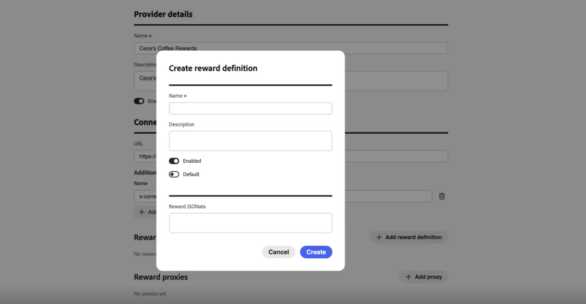
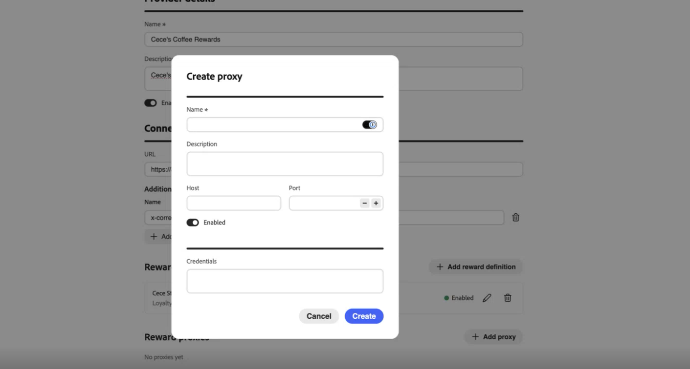
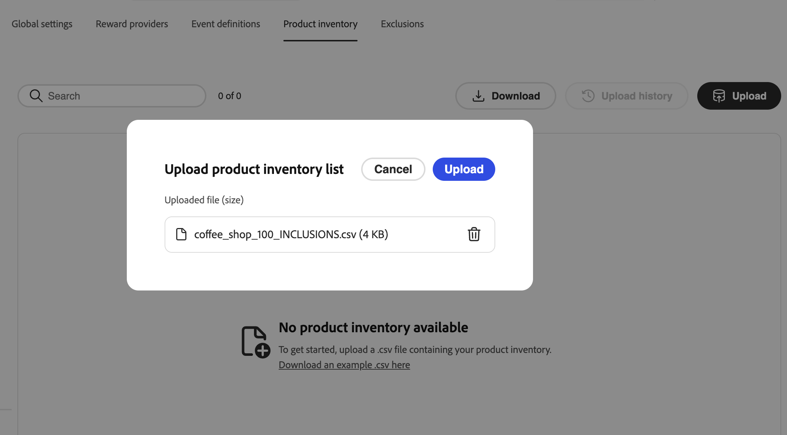
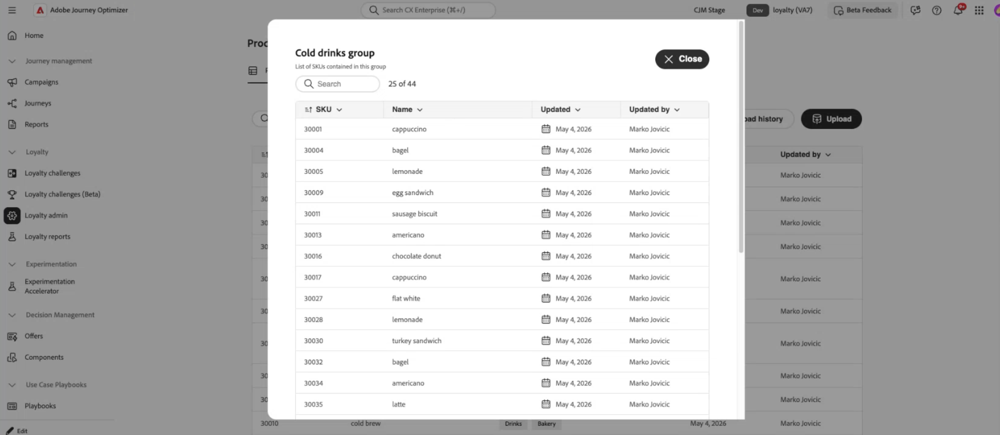

# Herausforderungen bei der Treue konfigurieren {#loyalty-admin}

<!-- Unpublished draft: Loyalty Admin UI documentation is not validated for Experience League. This page uses hide: true until review. -->

>[!BEGINSHADEBOX]

**Inhaltsverzeichnis**

[Erste Schritte mit Herausforderungen im Zusammenhang mit der Treue](get-started.md)

<table style="table-layout:fixed">
<tr style="border: 0;">
<td style="vertical-align:top;">

**Herausforderungen erstellen und verwalten**

* [Zugriff und Verwaltung von Herausforderungen und Aufgaben](access-loyalty-challenges.md)
* [Herausforderungen schaffen](create-challenges.md)
* [Aufgaben erstellen](create-tasks.md)
* [Überwachen der Leistung beim Treueprogramm](loyalty-reporting.md)

</td>
<td style="vertical-align:top;">

**Konfigurieren und Integrieren**

* **Herausforderungen für die Treue konfigurieren** ◀︎ **Sie sind hier**
* [Treuedaten und -datensätze](loyalty-data-and-datasets.md)
* [API-Referenz für Herausforderungen im Treueprogramm](https://developer.adobe.com/journey-optimizer-apis/references/loyalty-challenges){target="_blank"}

</td>
</tr>
</table>

>[!ENDSHADEBOX]

>[!AVAILABILITY]
>
>Diese Funktion befindet sich derzeit in der **privaten Betaversion**. Umfassende Informationen über den Veröffentlichungszyklus und die Verfügbarkeitsphasen in [!DNL Journey Optimizer] finden Sie [Veröffentlichungszyklus](../rn/releases.md).

## Überblick {#access-loyalty-admin}

Die Konfiguration Herausforderungen im Zusammenhang mit dem Treueprogramm verbindet [!DNL Journey Optimizer] mit Ihren externen Treuesystemen, indem Belohnungserfüllung, Ereigniszuordnung, Produktinventar und Ausschlüsse eingerichtet werden, bevor Marketer Herausforderungen erstellen.

>[!NOTE]
>
>Die Konfiguration von Herausforderungen im Zusammenhang mit dem Treueprogramm erfordert zusätzlich zu den für Herausforderungen im Zusammenhang mit dem Treueprogramm erforderlichen Berechtigungen Administratorzugriff auf Ihre [!DNL Journey Optimizer]. Wenden Sie sich an Ihren Adobe-Administrator, um Zugriff zu erhalten.

Um die Konfigurationsoberfläche zu öffnen, wählen Sie im linken Navigationsbereich das Menü **[!UICONTROL Treueprogramm]** Admin) aus. Die Benutzeroberfläche ist in Registerkarten unterteilt:

* **Globale Einstellungen** - Wählen Sie den Identity-Namespace von Experience Platform für Ihr Programm aus. [Erfahren Sie, wie Sie globale Einstellungen konfigurieren](#global-settings)
* **Belohnungsanbieter** - Verbinden Sie die APIs, die die Belohnungen erfüllen, wenn Kunden Fortschritte machen oder Herausforderungen meistern. [Erfahren Sie, wie Sie Belohnungsanbieter konfigurieren](#reward-providers)
* **Ereignisdefinitionen** - Ordnen Sie eingehende Erlebnisereignisse Aktivitäten zu, die in Aufgaben **[!UICONTROL Benutzerspezifisches Ereignis“]** werden. [Erfahren Sie, wie Sie Ereignisdefinitionen konfigurieren](#event-definitions)
* **Produktinventar** - Laden Sie Zuordnungen von Elementen zu Gruppen hoch, um sie in Eignungsregeln für Aufgaben zu verwenden. [Erfahren Sie, wie Sie den Produktbestand konfigurieren](#product-inventory)
* **Ausnahmen** - Laden Sie organisationsweite Element- und Gruppenausschlüsse für die Aufgabenkonfiguration hoch. [Erfahren Sie, wie Sie Ausschlüsse konfigurieren](#exclusions)

## Globale Einstellungen {#global-settings}

>[!CONTEXTUALHELP]
>id="ajo_loyalty_admin_global_settings"
>title="Globale Einstellungen"
>abstract="Globale Einstellungen definieren die Konfiguration auf Organisationsebene für Treue-Challenges, einschließlich des Identity-Namespace, anhand dessen Mitglieder über Ereignisse und Challenges hinweg identifiziert werden."

Öffnen Sie die Registerkarte **[!UICONTROL Globale Einstellungen]** und wählen Sie den Adobe Experience Platform [Identity-Namespace](https://experienceleague.adobe.com/de/docs/experience-platform/identity/features/namespaces) für Herausforderungen im Zusammenhang mit Treue in der Dropdown-Liste **[!UICONTROL Namespace]** aus. Dieser Namespace muss mit der Art und Weise übereinstimmen, wie Mitgliederprofile in Ihren Daten identifiziert werden.


➡️ [Erfahren Sie, wie Sie mit Identity-Namespaces arbeiten](https://experienceleague.adobe.com/de/docs/experience-platform/identity/features/namespaces){target="_blank"}

## Prämienanbieter {#reward-providers}

>[!CONTEXTUALHELP]
>id="ajo_loyalty_admin_reward_providers"
>title="Prämienanbieter"
>abstract="Ein Prämienanbieter definiert das externe System, das [!DNL Journey Optimizer] aufruft, um Prämien zu vergeben, wenn Kundinnen und Kunden Challenges abschließen. Konfigurieren Sie den Anbieterendpunkt, Prämiendefinitionen, Proxy-Einstellungen und die Authentifizierung für jede Integration."

>[!CONTEXTUALHELP]
>id="ajo_loyalty_admin_reward_providers_connection"
>title="Verbindung zum Prämienanbieter"
>abstract="Konfigurieren Sie, wie [!DNL Journey Optimizer] eine Verbindung zu Ihrer Reward-API herstellt: Anbietername, Beschreibung, Endpunkt-URL und HTTP-Header, die für Erfüllungsaufrufe erforderlich sind."

>[!CONTEXTUALHELP]
>id="ajo_loyalty_admin_reward_providers_details"
>title="Prämiendefinitionen"
>abstract="Prämiendefinitionen geben jeden Prämientyp an, den dieser Anbieter ausgeben kann (z. B. Punkte oder Sterne), sowie die Payload, die [!DNL Journey Optimizer] sendet, wenn Prämien gewährt werden."

>[!CONTEXTUALHELP]
>id="ajo_loyalty_admin_reward_providers_proxy"
>title="Prämien-Proxy"
>abstract="Optional können Sie Erfüllungsaufrufe über einen Proxy-Server leiten, anstatt sie direkt an Ihren Prämien-API-Endpunkt zu senden. Konfigurieren Sie den Host, den Port, die Anmeldedaten und geben Sie an, ob der Proxy aktiviert ist. Der Wert der Anmeldedaten sieht in der Regel wie folgt aus: `{ "userName": "test", "password": "xxxx" }`"

Ein **Belohnungsanbieter** teilt [!DNL Journey Optimizer] mit, wohin Erfüllungsanrufe gesendet werden sollen, wenn der Challenge-Fortschritt aufgezeichnet oder eine Challenge abgeschlossen ist. Beispielsweise eine API, die Treuepunkte oder Sterne einem Mitgliedskonto gutschreibt.

Gehen Sie wie folgt vor, um einen Belohnungsanbieter zu erstellen:

1. Öffnen Sie die Registerkarte **[!UICONTROL Belohnungsanbieter]** und wählen Sie **[!UICONTROL Belohnungsanbieter erstellen]** aus.

   

1. Geben Sie **[!UICONTROL Name]** und **[!UICONTROL Beschreibung]** ein.

1. Geben Sie im Feld **[!UICONTROL URL]** den API-Endpunkt ein, der Erfüllungsanfragen empfängt.

1. Fügen Sie **[!UICONTROL Kopfzeilen]** nach Bedarf für Ihre API hinzu (z. B. API-Schlüssel oder Inhaltstypen).

1. Konfigurieren Sie die Ressourcen, die Ihrem Belohnungsanbieter zugeordnet sind. Erweitern Sie die folgenden Abschnitte, um Felddetails anzuzeigen:

   +++Prämiendefinitionen

   Fügen Sie pro Belohnungstyp, den Ihr Anbieter unterstützt, einen Eintrag hinzu (z. B. Programmpunkte, Sterne oder Geldguthaben). Für jede Definition gilt:

   * Geben Sie **[!UICONTROL Name]** und **[!UICONTROL Beschreibung]** ein.
   * Geben Sie an, ob die Definition **[!UICONTROL Aktiviert]** ist.
   * Stellen Sie **[!UICONTROL Standard]** ein, um eine Definition als Standard für diesen Anbieter zu markieren.
   * Definieren Sie die **Payload** die mit Erfüllungsaufrufen gesendet wird.

   

   +++

   +++Prämien-Proxy

   Routet Erfüllungsaufrufe über einen Zwischenserver, anstatt sie direkt an Ihren Endpunkt zu senden. Verwenden Sie auf den Bildschirmen Belohnungsanbieter und **[!UICONTROL Proxy erstellen]** das Feld **[!UICONTROL Anmeldeinformationen]** für die Proxy-Authentifizierung.

   * Geben Sie **[!UICONTROL Name]** und **[!UICONTROL Beschreibung]** ein.
   * Geben Sie **[!UICONTROL Host]** und **[!UICONTROL Port]** ein.
   * Geben Sie an, ob der Proxy **[!UICONTROL aktiviert]** ist.
   * Geben **[!UICONTROL unter]** den Proxy-Benutzernamen und das Kennwort als JSON ein. Der Wert der Anmeldeinformationen sieht in der Regel wie folgt aus:

     ```json
     { "userName": "test", "password": "xxxx" }
     ```

   

   +++

   +++Auth-Token-Generator

   Verwenden Sie , wenn Ihre API ein Bearer-Token oder eine ähnliche Authentifizierung erfordert.

   * Geben Sie **[!UICONTROL Name]** und **[!UICONTROL Beschreibung]** ein.
   * Geben **[!UICONTROL unter „Authentifizierungstyp]** den Authentifizierungstyp ein (z. B. Bearer).
   * Wählen Sie die HTTP-Methode aus (z. B. POST).
   * Geben Sie die Token-Endpunkt-URL und den **[!UICONTROL Token-Schlüssel]** in der Antwort ein (z. B. `access_token`).
   * Geben Sie an, ob der Authentifizierungs-Token **[!UICONTROL Generator aktiviert]**.
   * Fügen Sie alle Kopfzeilen hinzu, die für Ihren Token-Endpunkt erforderlich sind.

   [!DNL Journey Optimizer] verwendet diese Konfiguration, um vor jedem Aufruf Ihrer Belohnungs-API ein neues Token zu erhalten.

   

   +++

1. Wählen Sie **[!UICONTROL Belohnungsanbieter erstellen]** aus. Der Anbieter und alle konfigurierten Ressourcen werden zusammen gespeichert.

Nach dem Speichern wird der Anbieter in der Liste der Belohnungsanbieter angezeigt. Marketer können es bei der Konfiguration von Challenge-Belohnungen auswählen. [Erfahren Sie, wie Sie Challenge Rewards konfigurieren](create-challenges.md#rewards)

Um einen Belohnungsanbieter zu bearbeiten, öffnen Sie die Registerkarte **[!UICONTROL Belohnungsanbieter]**, wählen Sie den Anbieter aus und aktualisieren Sie die Felder an Ort und Stelle. Änderungen an Belohnungsdefinitionen, Proxys und Authentifizierungs-Token-Generatoren werden automatisch gespeichert, wenn Sie sie aktualisieren.

>[!NOTE]
>
>**[!UICONTROL Bringen Sie Ihre eigenen Daten mit]** Herausforderungen erfüllen Belohnungen durch Ihre eigene Datenintegration. Die hier konfigurierten Belohnungsanbieter gelten nicht für diese Herausforderungen. [Erfahren Sie, wie Sie Ihre eigenen Herausforderungen an Daten stellen](create-challenges.md#create-the-challenge)

## Ereignisdefinitionen {#event-definitions}

>[!CONTEXTUALHELP]
>id="ajo_loyalty_admin_event_definitions"
>title="Ereignisdefinitionen"
>abstract="Ereignisdefinitionen zeigen [!DNL Journey Optimizer], wie eingehende Ereignisdaten aus Ihren externen Quellen identifiziert und interpretiert werden sollen. Jede Definition ordnet einen bestimmten Ereignistyp zu, z. B. einen Kauf oder einen Check-in, damit das System den Kundenfortschritt bei den Challenge-Aufgaben verfolgen kann."

>[!CONTEXTUALHELP]
>id="ajo_loyalty_admin_event_schema"
>title="Ereignisschema und Transformer"
>abstract="Wenn Ihre Organisation Ereignisse im benutzerdefinierten JSON-Format sendet, verwenden Sie **[!UICONTROL Schema]**, um die Payload zu validieren, und **[!UICONTROL Transformer]** (z. B. ein JSONata-Ausdruck), um Felder dem Format zuzuordnen, das Treue-Challenges erwartet."

>[!CONTEXTUALHELP]
>id="ajo_loyalty_admin_event_identification"
>title="Ereignisidentifizierung"
>abstract="Geben Sie an, wie [!DNL Journey Optimizer] das Ereignis in eingehenden Payloads erkennt, indem Sie einen Kennungspfad, Kennungswerte, eine XDM-Schema-ID oder eine Kombination dieser Felder verwenden."

**[!UICONTROL Ereignisdefinitionen]** teilen [!DNL Journey Optimizer] mit, welche eingehenden Adobe Experience Platform-Erlebnisereignisse verarbeitet werden sollen. Zum Beispiel ein Kauf oder ein Check-in im Hotel. Marketing-Experten verweisen auf diese Definitionen, wenn sie **[!UICONTROL benutzerdefiniertes Ereignis]** Aufgaben im Task Builder erstellen. Ereignisse, die keiner Definition entsprechen, werden ignoriert.

Wenn Ihr Unternehmen Ereignisse im eigenen JSON-Format sendet, helfen **[!UICONTROL Schema]** und **[!UICONTROL Transformer]** dabei, die Payload [!DNL Journey Optimizer] validieren, sie zu analysieren und zu entscheiden, ob die Aktivität verfolgt werden soll.

Gehen Sie wie folgt vor, um eine Ereignisdefinition zu erstellen:

1. Öffnen Sie die **[!UICONTROL Ereignisdefinitionen]** und erstellen Sie eine neue Definition.

   

1. Geben Sie einen **[!UICONTROL Namen]** für das Ereignis ein (z. B. `Coffee purchase`). Marketing-Experten sehen diesen Namen beim Konfigurieren einer Aufgabe **[!UICONTROL Benutzerspezifisches Ereignis]**.

1. Geben Sie an, wie [!DNL Journey Optimizer] das Ereignis in eingehenden Payloads erkennt. Geben Sie einen **[!UICONTROL Kennungspfad]** eine **[!UICONTROL XDM-Schema-ID]** oder beides an:

   * **[!UICONTROL Kennungspfad]** - Pfad zu einem Feld in der Payload (z. B. `data.memberId`). Verwenden Sie diese Option, wenn Sie Ereignisse anhand von Werten in der Payload abgleichen.
   * **[!UICONTROL Kennungswerte]** - Werte im Kennungspfad, die vorhanden sein müssen, damit diese Definition übereinstimmt.
   * **[!UICONTROL XDM-Schema-]**: ID des Experience Platform-XDM-Schemas für diesen Ereignistyp. Verwenden Sie diese Option, wenn Ereignisse für ein bekanntes Schema erfasst werden.

1. Fügen Sie bei Bedarf Zeichenfolgen in &quot;**[!UICONTROL &quot;]** &quot;**[!UICONTROL &quot;]**:

   * **[!UICONTROL Schema]** - Validierungszeichenfolge für die eingehende Payload.
   * **[!UICONTROL Transformer]** - Umwandlungsausdruck (z. B. JSONata), der Ihre Payload dem Format zuordnet, das die Herausforderungen im Zusammenhang mit dem Treueprogramm erwarten.

1. Speichern Sie die Ereignisdefinition. Er wird in der Liste **[!UICONTROL Ereignisdefinitionen]** angezeigt und ist verfügbar, wenn Marketer **[!UICONTROL benutzerspezifische Ereignisaufgaben]** erstellen. [Erfahren Sie, wie Sie Aufgaben erstellen](create-tasks.md#choose-activity)

## Produktinventar {#product-inventory}

>[!CONTEXTUALHELP]
>id="ajo_loyalty_admin_product_inventory"
>title="Produktinventar"
>abstract="Laden Sie eine CSV-Datei hoch, die Artikelkennungen Produktgruppen zuordnet. Marketing-Fachleute können diese Gruppen referenzieren, wenn sie geeignete Artikel für Kauf- und Ausgabenaufgaben konfigurieren, ohne jede Artikel-ID einzugeben."

Die Registerkarte **[!UICONTROL Produktinventar]** gruppiert Katalogelemente, damit Marketing-Experten sie in Aufgaben auswählen können, ohne jede Element-ID einzugeben. Laden Sie eine **CSV-Datei** hoch, die jede Elementkennung einer oder mehreren **Produktgruppen** zuordnet (dasselbe Element kann mehreren Gruppen angehören). Importierte Gruppen sind bei der Konfiguration der Aufgabeneignung verfügbar. [Erfahren Sie, wie Sie Aufgaben erstellen](create-tasks.md)

Gehen Sie wie folgt vor, um eine Produktinventardatei hochzuladen:

1. Bereiten Sie eine CSV-Datei vor, die jede Artikelkennung einer oder mehreren Produktgruppen zuordnet. Erweitern Sie den folgenden Abschnitt, um ein Beispiel zu sehen.

   +++CSV-Beispiel für Produktinventar

   

   +++

1. Öffnen Sie die Registerkarte **[!UICONTROL Produktinventar]**.

1. Wählen Sie **[!UICONTROL Hochladen]** und wählen Sie Ihre CSV-Datei aus.

   

1. Überprüfen Sie die importierten Daten in der Inventarliste. Die Liste zeigt eine Zeile pro Element an. Die Spalte **[!UICONTROL Gruppen enthalten in]** zeigt jede Produktgruppe für dieses Element als Pille oder mehrere Pillen an, wenn das Element zu mehreren Gruppen gehört.

   

1. Um alle Elemente in einer Produktgruppe anzuzeigen, wählen Sie die Pille dieser Gruppe in der Spalte **[!UICONTROL Gruppen enthalten in]** in einer beliebigen Zeile aus. Die Ansicht Gruppendetails listet jedes Element in der Gruppe auf.

   

1. Öffnen Sie **[!UICONTROL Upload-Verlauf]**, um frühere CSV-Uploads anzuzeigen.

## Ausschlüsse {#exclusions}

>[!CONTEXTUALHELP]
>id="ajo_loyalty_admin_exclusions"
>title="Ausschlüsse"
>abstract="Laden Sie eine CSV-Datei hoch, die programmweit ausgeschlossene Katalogelemente und Gruppen definiert. Importierte Ausschlussgruppen werden angezeigt, wenn Marketing-Fachleute geeignete Elemente und Ausschlüsse für Aufgaben konfigurieren."

Die Registerkarte **[!UICONTROL Ausschlüsse]** definiert Katalogelemente und Gruppen, die programmweit ausgeschlossen sind, sodass Marketing-Experten nicht bei jeder Aufgabe dieselben Ausschlüsse auflisten müssen. Laden Sie eine **CSV-Datei** hoch, die jede Elementkennung einer oder mehreren **Ausschlussgruppen** zuordnet (dasselbe Element kann mehreren Gruppen angehören).

Nach dem Import werden ausgeschlossene Elemente und Gruppen im Task Builder angezeigt, wenn Marketing-Fachleute **[!UICONTROL Mögliche Elemente und Ausschlüsse]** konfigurieren. [Erfahren Sie, wie Sie geeignete Elemente und Ausschlüsse für Aufgaben definieren](create-tasks.md#eligible-items-exclusions)

Gehen Sie wie folgt vor, um Ausschlüsse hochzuladen:

1. Bereiten Sie eine CSV-Datei vor, die jede Elementkennung einer oder mehreren Ausschlussgruppen zuordnet. Erweitern Sie den folgenden Abschnitt, um ein Beispiel zu sehen.

   +++CSV-Beispiel für Ausschlüsse

   

   +++

1. Öffnen Sie die **[!UICONTROL Ausschlüsse]**.

1. Wählen Sie **[!UICONTROL Hochladen]** und wählen Sie Ihre CSV-Datei aus.

   

1. Überprüfen Sie die importierten Daten in der Ausschlussliste. Die Liste zeigt eine Zeile pro Element an. Die Spalte **[!UICONTROL Gruppen enthalten in]** zeigt jede Ausschlussgruppe für dieses Element als Pille oder mehrere Pillen an, wenn das Element zu mehreren Gruppen gehört.

<!-- SCREENSHOT: Exclusions list after CSV upload -->

1. Um alle Elemente in einer Ausschlussgruppe anzuzeigen, wählen Sie die Pille dieser Gruppe in der Spalte **[!UICONTROL Gruppen enthalten in]** in einer beliebigen Zeile aus. Die Ansicht Gruppendetails listet jedes Element in der Gruppe auf.

<!-- SCREENSHOT: Exclusion group details -->

1. Öffnen Sie **[!UICONTROL Upload-Verlauf]**, um frühere CSV-Uploads anzuzeigen.
