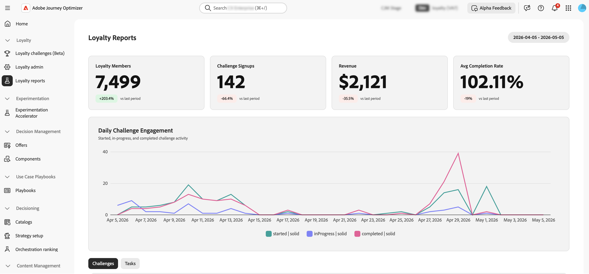

# Überwachen der Leistung beim Treueprogramm {#loyalty-reporting}

>[!BEGINSHADEBOX]

**Dokumentation zu Herausforderungen im Zusammenhang mit der Treue:**

* [Erste Schritte mit Herausforderungen im Zusammenhang mit der Treue](get-started.md)
* [Zugriff und Verwaltung von Herausforderungen und Aufgaben](access-loyalty-challenges.md)
* [Herausforderungen schaffen](create-challenges.md)
* [Aufgaben erstellen](create-tasks.md)
* **Überwachen der Leistung** Treueprogramm◀ ︎ **Sie sind hier**
* [API-Referenz für Herausforderungen im Treueprogramm](https://developer.adobe.com/journey-optimizer-apis/references/loyalty-challenges){target="_blank"}

>[!ENDSHADEBOX]

>[!AVAILABILITY]
>
>Diese Funktion befindet sich derzeit in der **privaten Betaversion**. Ausführliche Informationen zum Veröffentlichungszyklus und zur Verfügbarkeitsphase finden Sie unter [Veröffentlichungszyklus für Journey Optimizer](../rn/releases.md).

Die Berichterstellung zu Treueprogramm-Herausforderungen bietet Dashboards auf Challenge-Ebene, mit denen Sie Schlüsselmetriken wie die funnel-Zielgruppenleistung, Aufgabenabschlussraten, Belohnungsausgabe und Auswirkungen auf den Umsatz verfolgen können. Alle Daten werden aus Adobe Customer Journey Analytics bezogen und in einer benutzerdefinierten, speziell entwickelten Oberfläche angezeigt.

<!--
A direct **Analyze in CJA** button will be added to the reporting interface before the feature reaches general availability.
-->

## Zugreifen auf Treueberichte {#access-reports}

Um die Reporting-Dashboards für das Treueprogramm zu öffnen, gehen Sie zu **[!UICONTROL Herausforderungen im Treueprogramm (Beta]** in Journey Optimizer und wählen **[!UICONTROL Treueprogramm-Berichte]** aus der linken Navigationsleiste aus.

Die Reporting-Benutzeroberfläche bietet drei Ansichten mit jeweils unterschiedlichen Detaillierungsgraden. Die **[Übersicht](#overview)** zeigt eine Zusammenfassung aller aktiven Herausforderungen an. Unterhalb können Sie mit zwei Registerkarten zwischen detaillierteren Ansichten wechseln:

* **[Challenges](#challenges-view)**: Eine Aufschlüsselung nach Herausforderung mit Drilldown-Funktion,
* **[Aufgaben](#tasks-view)**: Eine Aufgabenansicht der Umsatz- und Abschlussmetriken.

Sie können den Datumsbereich für alle Ansichten mithilfe der Datumsauswahl oben auf der Seite anpassen. Es sind auch standardmäßige Datumsvorgaben verfügbar.

## Überblick {#overview}

Auf **Seite**&#x200B;Überblick“ werden Metriken angezeigt, die für alle aktiven Herausforderungen des ausgewählten Zeitraums aggregiert sind.

Am oberen Seitenrand werden die folgenden Metriken angezeigt:

**Mitglieder des Treueprogramms** - Anzahl der Mitglieder des Treueprogramms, die im ausgewählten Zeitraum aktiv waren.
**Challenge Signups** - Gesamtzahl der neuen Challenge-Registrierungen für alle Challenges.
**Umsatz** - Gesamtumsatz, der mit einer Challenge-Aktivität während des Zeitraums verknüpft ist.
**Durchschnittliche Abschlussrate** - Prozentsatz der registrierten Kunden, die mindestens eine Herausforderung abgeschlossen haben.

Unter diesen Metriken zeigt ein **Tägliche Challenge-Interaktion** Zeitrahmen, wie sich die Challenge-Beteiligung im Laufe des Zeitraums entwickelt hat und dabei drei Serien dargestellt werden:

* Kunden **die eine** gestartet haben,
* Kunden, die zum Status **In Bearbeitung** übergegangen sind,
* Kunden, **eine** abgeschlossen haben.

## Ansicht „Herausforderungen“ {#challenges-view}

Auf **Registerkarte** Herausforderungen“ wird die Leistung nach individuellen Herausforderungen aufgeschlüsselt. Jede Challenge wird mit Schlüsselspalten wie Typ, Status, Registrierung, Abschluss und mehr aufgeführt. Die Liste ist nach dem Datum der letzten Änderung sortiert und zeigt zehn Herausforderungen auf einmal an. Verwenden Sie die **Weiter**-Schaltfläche unten, um weiter zu navigieren.

Wählen Sie eine Herausforderung aus der Liste aus, um die Detailansicht zu öffnen. Der Bericht enthält mehrere Metrikblöcke wie Gesamtumsatz, Registrierung, Abschlussrate und Trenddiagramme sowie eine tägliche Aufschlüsselung.

+++Beispiel für einen Challenge-Bericht

+++

## Aufgabenansicht {#tasks-view}

Die **Aufgaben** bietet eine anspruchsübergreifende Ansicht der Aufgabenleistung. Sie können zwischen den wichtigsten Aufgaben nach Umsatz und den wichtigsten Aufgaben nach Abschlüssen hin- und herschalten, um sich auf die für Sie relevanteste Metrik zu konzentrieren.

Die Registerkarte zeigt auch die sechs wichtigsten Aufgaben nach Umsatz an und bietet einen schnellen Überblick darüber, welche Aufgaben den größten Nutzen bringen.

Unterhalb des Radardiagramms zeigt eine Aufgabenliste jede Aufgabe mit Schlüsselspalten wie Abschlüsse, Umsatz und die Herausforderungen an, zu denen jede Aufgabe gehört. Die Liste ist nach Umsatz sortiert und zeigt zehn Aufgaben gleichzeitig an. Verwenden Sie die Schaltfläche **Weiter**, um weiter zu suchen.

