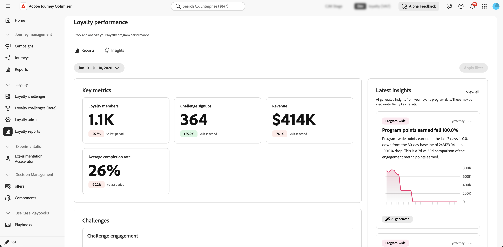

# Überwachen der Leistung beim Treueprogramm {#loyalty-reporting}

>[!BEGINSHADEBOX]

**Inhaltsverzeichnis**

[Erste Schritte mit Herausforderungen im Zusammenhang mit der Treue](get-started.md)

<table style="table-layout:fixed">
<tr style="border: 0;">
<td style="vertical-align:top;">

**Herausforderungen erstellen und verwalten**

* [Zugriff und Verwaltung von Herausforderungen und Aufgaben](access-loyalty-challenges.md)
* [Herausforderungen schaffen](create-challenges.md)
* [Aufgaben erstellen](create-tasks.md)
* **Überwachen der Leistung** Treueprogramm◀ ︎ **Sie sind hier**

</td>
<td style="vertical-align:top;">

**Konfigurieren und Integrieren**

* [Herausforderungen bei der Treue konfigurieren](loyalty-admin.md)
* [Treuedaten und -datensätze](loyalty-data-and-datasets.md)
* [API-Referenz für Herausforderungen im Treueprogramm](https://developer.adobe.com/journey-optimizer-apis/references/loyalty-challenges){target="_blank"}

</td>
</tr>
</table>

>[!ENDSHADEBOX]

>[!AVAILABILITY]
>
>Diese Funktion befindet sich derzeit in der **privaten Betaversion**. Ausführliche Informationen zum Veröffentlichungszyklus und zur Verfügbarkeitsphase finden Sie unter [Veröffentlichungszyklus für Journey Optimizer](../rn/releases.md).

Verwenden Sie die Berichterstellung zu Treueproblemen , um zu sehen, wie Ihre Herausforderungen funktionieren. Überprüfen Sie, wer sich anmeldet, wer Herausforderungen bewältigt und wie viel Umsatz Ihr Programm generiert - alles an einem Ort. Die Daten stammen aus Adobe Customer Journey Analytics.

Um die Berichts-Dashboards zu öffnen, gehen Sie zu **[!UICONTROL Herausforderungen im Treueprogramm (Beta]** in Journey Optimizer und wählen Sie **[!UICONTROL Treueprogramm-Berichte]** in der linken Navigationsleiste aus.

Die Berichterstellungsoberfläche umfasst zwei Registerkarten:

* **[Berichte](#reports-view)**: Zahlen und Diagramme für Ihre Herausforderungen.
* **[Insights](#insights-cards)**: Karten, die hervorheben, was derzeit Ihre Aufmerksamkeit verdient.

## Berichtsansicht {#reports-view}

Die **Berichte** gibt Ihnen einen Überblick darüber, wie sich Ihr Programm im ausgewählten Zeitraum entwickelt. Verwenden Sie die Datumsauswahl oben auf der Seite und wählen Sie die Schaltfläche **[!UICONTROL Filter anwenden]**, um den Berichtszeitraum zu ändern und aktualisierte Zahlen und Diagramme anzuzeigen.

Der Bereich **Schlüsselmetriken** zeigt vier Zahlen auf einen Blick. Jede Metrik zeigt auch eine prozentuale Änderung im Vergleich zum vorherigen Zeitraum an.

* **Mitglieder des Treueprogramms**: Wie viele Mitglieder des Treueprogramms waren während des Zeitraums aktiv.
* **Challenge-Anmeldungen**: Wie oft sich Mitglieder für eine Challenge registriert haben.
* **Umsatz**: Gesamtumsatz im Zusammenhang mit Challenge-Aktivitäten.
* **Durchschnittliche Abschlussrate**: Der Prozentsatz der registrierten Mitglieder, die mindestens eine Herausforderung abgeschlossen haben.

Das Bedienfeld **Neueste Einblicke** auf der rechten Seite zeigt die neuesten KI-generierten Einblicke aus Ihrem Programm. Wählen Sie **[!UICONTROL Alle anzeigen]** aus, um die vollständige Registerkarte **Insights** zu öffnen.

Unter den Schlüsselmetriken finden Sie im **Herausforderungen** Abschnitt zwei Ansichten der Challenge-Aktivität.

* **Challenge-Interaktion**: Ein Zeitplan, der anzeigt, wie viele Mitglieder im Laufe des Zeitraums begonnen haben, aktuell sind und welche Herausforderungen abgeschlossen wurden.
* **Challenge-Berichte**: Eine Tabelle aller Challenges mit Details wie Typ, Aufgaben, Status und Registrierungsnummern. Verwenden Sie die Suchleiste, um eine bestimmte Herausforderung zu finden. Wählen Sie eine Herausforderung aus, um den vollständigen Bericht mit Interaktionstrends und Leistungsdetails anzuzeigen.

  +++Beispiel für einen Challenge-Bericht

  

  +++

## Registerkarte „Insights“ {#insights-cards}

Die **Insights** zeigt KI-generierte Karten an, die Anomalien, Trends und Chancen in Ihrem Treueprogramm kennzeichnen. Jede Karte stellt eine einzelne Beobachtung dar und wird nach ihrer Signifikanz im Verhältnis zu Ihren aktuellen Programmdaten geordnet.

Ein **Zuletzt crawlen** Zeitstempel oben rechts zeigt an, wann die insight-Engine Ihre Programmdaten zuletzt verarbeitet hat.

### Kartenaktionen {#insight-card-actions}

Jede Karte verfügt über ein  mit zwei Aktionen:

* **Schließen**: Entfernt die Karte dauerhaft aus der Insights-Liste.
* **Erinnern**: Blendet die Karte vorübergehend aus. Wählen Sie, ob Sie für **1 Tag**, **3 Tage** oder **7 Tage** ein Nickerchen halten möchten. Nach Ablauf der Schlummerperiode wird die Karte erneut angezeigt.

<!--
### Priority badges {#insight-badges}

Each card has a priority badge — **High**, **Medium**, or **Low** — based on how significant the underlying signal is relative to your current program data. These levels are relative: there are always a few **High** cards, even in a quiet week. **High** means "most relevant right now", not that a fixed threshold was crossed.
-->

### Kategorie-Tags {#insight-category-tags}

Jede Karte trägt ein **Kategorie-Tag** das angibt, auf welchen Teil Ihres Programms sich die insight bezieht.

| Kategorie | Was es abdeckt |
| --- | --- |
| **programmweit** | Gesamtzustand und Leistung Ihres Treueprogramms |
| **Ebene** | Ertragsraten, Bewegungen und Verteilung über Mitgliedsstufen hinweg |
| **Challenge** | Aktivität, Abschlussraten und Anomalien für eine bestimmte Herausforderung oder über Herausforderungen hinweg |
| **Produkt** | Produktkatalog-Performance, einschließlich Ansichten, Einlösungen und Trends auf Katalogebene |
| **Lebenszyklus der Mitglieder** | Fortschritt der Mitglieder durch die Phasen Registrierung, Interaktion und Abwanderung |
| **Trend** | Zeitbasierte Muster, z. B. wöchentliche Zyklen, saisonale Spitzen oder Trendumkehr |
