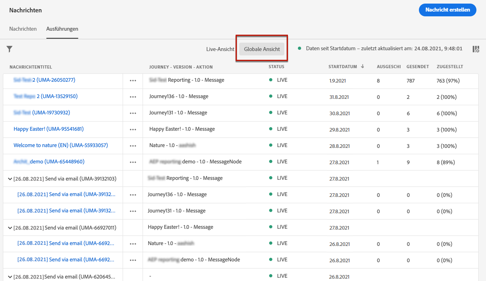
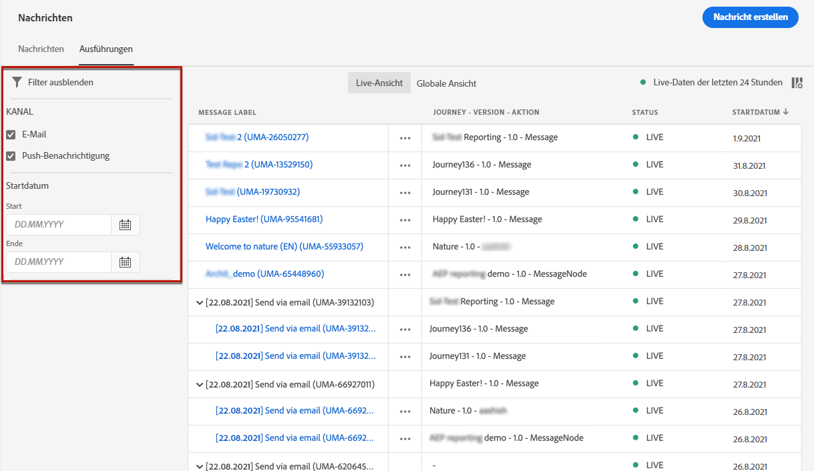

# Überwachen von Nachrichten  {#monitor-message-execution}

Um sicherzustellen, dass Ihre Nachrichten erfolgreich ausgeführt, gesendet und zugestellt werden, bietet [!DNL Journey Optimizer] Funktionen zum Überwachen der aktuell veröffentlichten und ausgelösten Nachrichten. Sie können sehen, wie sich Ihre Nachrichten <!--and APIs--> in Echtzeit verhalten, wenn Sie die Liste **[!UICONTROL Ausführungen]** aufrufen.

Um auf diese Liste zuzugreifen, wählen Sie auf der Startseite von **[!DNL Journey Optimizer]** die Option **[!UICONTROL Nachrichten]** und klicken Sie auf die Registerkarte **[!UICONTROL Ausführungen]**.

Diese Registerkarte bietet zwei Ansichten: **[!UICONTROL Live-Ansicht]** und **[!UICONTROL Globale Ansicht]**.

* Die Registerkarte **[!UICONTROL Live-Ansicht]** bietet einen **Echtzeitüberblick über alle ausgeführten Nachrichten**, die von einer oder mehreren [Journeys](building-journeys/journey.md) **in den letzten 24 Stunden ausgelöst wurden**.

   

   Diese Liste wird alle sechzig Sekunden automatisch aktualisiert. Wenn in den letzten 24 Stunden für eine bestimmte Nachricht keine Ausführung stattgefunden hat, zeigen alle Spalten für diese Nachricht Null-Werte (0) an.

* Die Registerkarte **[!UICONTROL Globale Ansicht]** enthält einen **Überblick über alle ausgeführten Nachrichten**, die von einer oder mehreren [Journeys](building-journeys/journey.md) **seit dem Startdatum des Nachrichtenversands ausgelöst wurden**.

   

   Diese Liste wird alle neunzig Minuten automatisch aktualisiert. Die Daten werden im Zeitverlauf seit dem Startdatum der einzelnen Nachrichten aggregiert.

Wenn eine Nachricht veröffentlicht, aber noch nicht durch eine Journey ausgelöst wird, wird sie auf keiner der Registerkarten angezeigt. Es werden nur die folgenden Elemente aufgelistet:
* Nachrichten, die ausgelöst, aber noch nicht gestartet wurden (ausstehend).
* Nachrichten, die ausgelöst wurden und die derzeit ausgeführt werden (in Bearbeitung).

<!--For multichannel messages, one row per channel is displayed for each message. STILL VALID? looks like NOT-->

>[!NOTE]
>
>Wenn eine Nachricht in mehreren Journeys verwendet wurde, wird für jede Ausführung eine Zeile pro Journey angezeigt.

<!---->

<!--If a message has been used in several journeys, the **[!UICONTROL Source]** column displays **[!UICONTROL Multiple]**.-->

Standardmäßig werden die Nachrichten ab dem letzten Ausführungsdatum angezeigt. Klicken Sie auf das Symbol **[!UICONTROL Filter]**, um die Nachrichten nach dem Kanal, dem Startdatum und/oder dem Enddatum zu durchsuchen.

Die zweite Spalte <!--**[!UICONTROL Quick action]**--> ermöglicht es Ihnen, die entsprechende [Nachricht](create-message.md) zu öffnen und auf den [Live-Bericht](reports/live-report.md) zuzugreifen, wenn Sie sich in der **[!UICONTROL Live-Ansicht]** befinden, oder auf den [Globalen Bericht](reports/global-report.md), wenn Sie sich in der **[!UICONTROL Globalen Ansicht]** befinden.

Für jede Nachrichtenausführung wird eine Reihe von Indikatoren angezeigt:

* **[!UICONTROL Nachrichtenbezeichnung]**: Nachrichtentitel, den Sie beim [Erstellen der Nachricht](create-message.md) definiert haben. Die automatisch generierte Ausführungs-ID wird in Klammern angezeigt.

   <!--**[!UICONTROL Execution ID]**: Automatically generated identifier.
  **[!UICONTROL Source]**: Name of the journey leveraging that message.-->

* **[!UICONTROL Journey – Version – Aktion]**: Name der Journey, die die Nachricht verwendet, Version der Journey und Titel der Aktion, die die Nachricht in der Journey verwendet.

* **[!UICONTROL Status]**: Ausführungsstatus der Nachricht. <!--List all the possible statuses? For now only Live status? The user cannot stop or cancel the execution. TBC by Fred-->

* **[!UICONTROL Startdatum]**: Datum und Uhrzeit, an dem die Nachricht von der Journey ausgeführt wurde.

   <!--Targeted: Number of targeted profiles for each message execution. To come?-->

* **[!UICONTROL Ausgeschlossen]**: Anzahl der Profile, die aufgrund von Ausschlussregeln von der ursprünglichen Zielgruppe ausgeschlossen wurden.

* **[!UICONTROL Gesendet]**: Anzahl der gesendeten Nachrichten.

* **[!UICONTROL Zugestellt]**: Anzahl der erfolgreich im Postfach (E-Mail) oder auf dem Gerät (Push-Benachrichtigung) des Empfängers zugestellten Nachrichten, ohne dass ein Bounce oder ein sonstiger Versandfehler erzeugt wird.

* **[!UICONTROL Bounces]**: Anzahl der Nachrichten, die aufgrund eines Versandfehlers nicht zugestellt werden können. [Weitere Informationen zu Bounces](suppression-list.md)

* **[!UICONTROL Öffnungen]**: Anzahl der Nachrichten, die geöffnet wurden.

* **[!UICONTROL Klicks]**: Anzahl der Klicks auf Links in einer E-Mail.

   >[!NOTE]
   >
   >Für Push-Benachrichtigungen sind keine Klicks verfügbar: Wenn ein Benutzer auf eine Push-Benachrichtigung klickt, wird die Mobile App geöffnet, was nur als Öffnung betrachtet werden kann.

* **[!UICONTROL Fehler]**: Anzahl der Nachrichten, die aufgrund eines technischen Fehlers nicht gesendet werden können.

* **[!UICONTROL Spam-Beschwerden]**: Anzahl der Nachrichten, die von Empfängern als Spam gekennzeichnet wurden. [Weitere Informationen zu Beschwerden](https://experienceleague.adobe.com/docs/deliverability-learn/deliverability-best-practice-guide/metrics-for-deliverability/complaints.html?lang=de#metrics-for-deliverability?lang=de).

Wenn Sie auf einen Hyperlink klicken, wird die zugehörige Ansicht für die Nachrichtenübersicht geöffnet. [Weitere Informationen zu Nachrichten](create-message.md).
