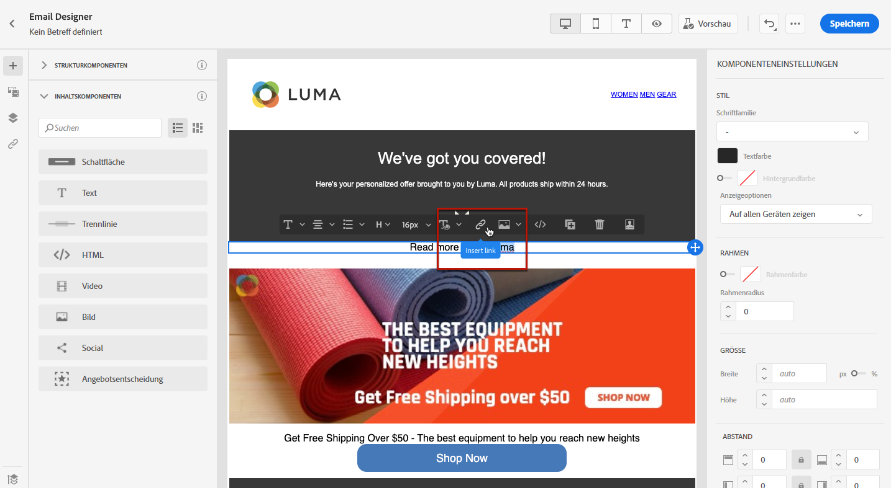
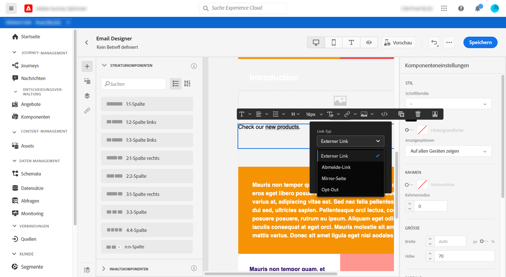
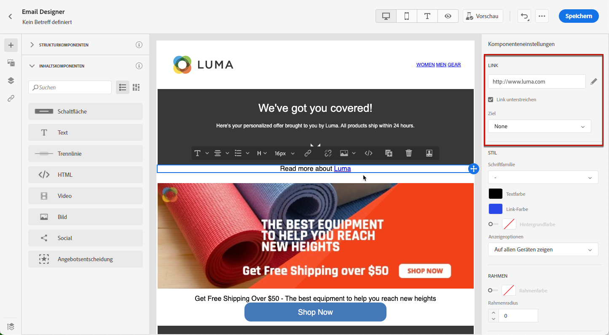
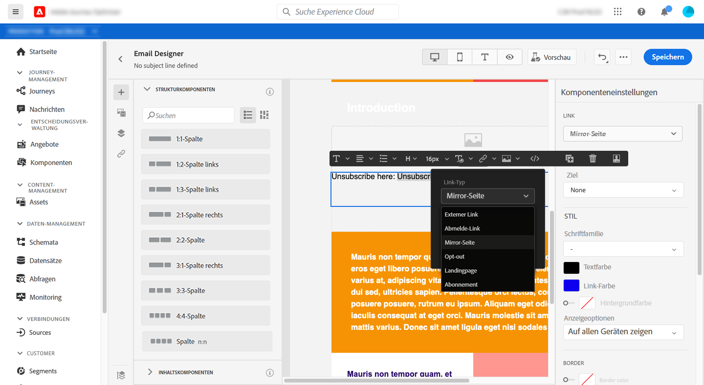
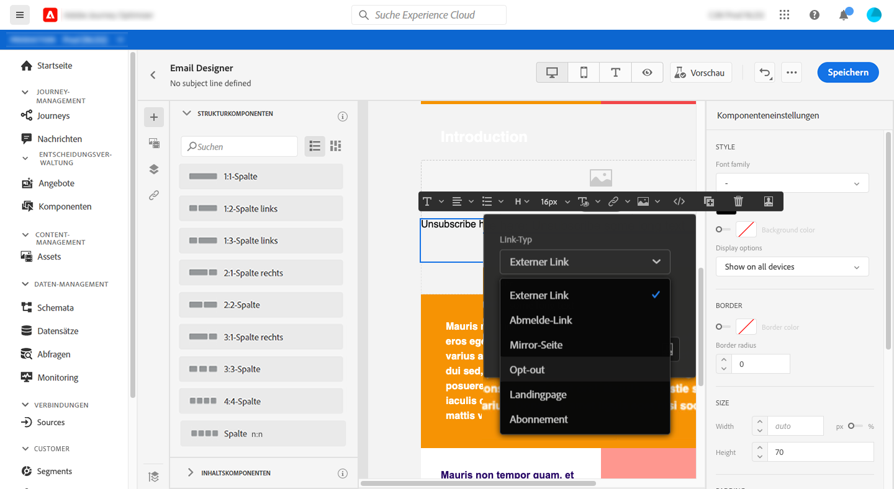
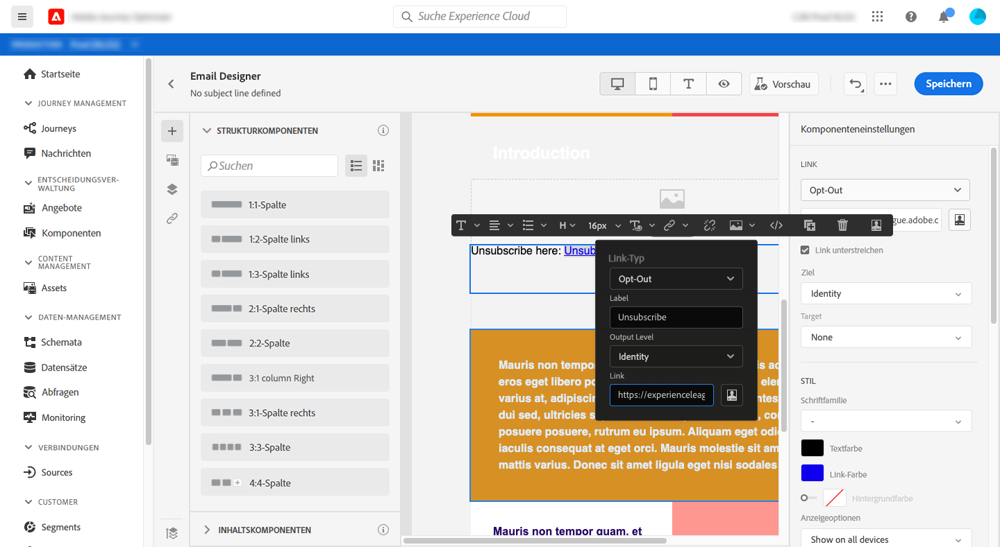
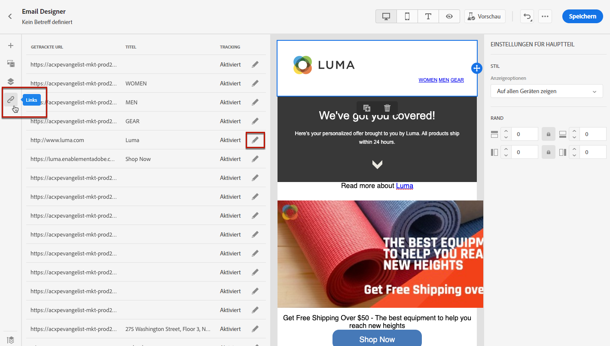
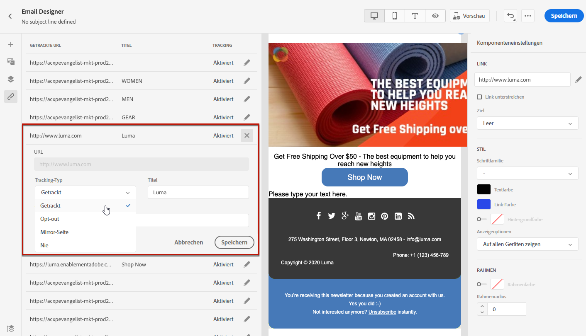

# Links hinzufügen und Nachrichten verfolgen {#tracking}

Verwenden Sie [!DNL Journey Optimizer], um Links zu Ihrem Inhalt hinzuzufügen und die gesendeten Nachrichten zu verfolgen, um das Verhalten Ihrer Empfänger zu überwachen.

## Tracking aktivieren {#enable-tracking}

Sie können das Nachrichten-Tracking aktivieren, indem Sie die Optionen **[!UICONTROL Öffnungs-Tracking für E-Mail]** und/oder **[!UICONTROL Klick-Tracking für E-Mail]** markieren, wenn Sie [Ihre Nachricht erstellen](create-message.md).

>[!NOTE]
>
>Beide Optionen sind standardmäßig aktiviert.

Auf diese Weise können Sie das folgende Verhalten Ihrer Empfänger verfolgen:

* **[!UICONTROL Tracking der Öffnungen bei E-Mails]**: Nachrichten, die geöffnet wurden.
* **[!UICONTROL Tracking der Klicks bei E-Mails]**: Klicks auf Links in einer E-Mail.

## Links einfügen {#insert-links}

Beim Entwerfen einer Nachricht können Sie Links zu Ihren Inhalten hinzufügen.

>[!NOTE]
>
>Wenn das [Tracking aktiviert ist](#enable-tracking), werden alle im Nachrichteninhalt enthaltenen Links verfolgt.

Gehen Sie wie folgt vor, um Links in Ihren E-Mail-Inhalt einzufügen:

1. Wählen Sie zuerst ein Element aus und danach in der dedizierten Symbolleiste die Option **[!UICONTROL Link einfügen]**.

   

1. Wählen Sie den gewünschten Link-Typ aus.

   * **[!UICONTROL Externer Link]**: Fügen Sie einen Link auf eine externe URL ein.

   * **[!UICONTROL Abmelde-Link]**: Fügen Sie einen Link ein, über den man sich vom Erhalt von Nachrichten Ihrer Marke abmelden kann. Weitere Informationen zur Opt-out-Verwaltung finden Sie in [diesem Abschnitt](consent.md#opt-out-management).

   * **[!UICONTROL Mirrorseite]**: Fügen Sie einen Link ein, um den E-Mail-Inhalt in einem Webbrowser anzuzeigen. Weiterführende Informationen finden Sie in diesem [Abschnitt](#mirror-page).

   * **[!UICONTROL Opt-out]**: Fügen Sie einen Link ein, über den sich Benutzer schnell von Ihren Nachrichten abmelden können, ohne die Abmeldung bestätigen zu müssen. Weiterführende Informationen finden Sie in diesem [Abschnitt](#one-click-opt-out-link).

   

1. Sie können Ihre Links personalisieren. Weitere Informationen zu personalisierten URLs finden Sie in [diesem Abschnitt](personalization/personalization-syntax.md#perso-urls).

1. Speichern Sie Ihre Änderungen.

1. Sie können auch nach dem Erstellen des Links noch Änderungen im Bereich der **[!UICONTROL Komponenteneinstellungen]** auf der rechten Seite vornehmen.

   * Klicken Sie auf das Stiftsymbol, um den Link zu bearbeiten.
   * Sie können den Link unterstreichen oder nicht unterstreichen, indem Sie die entsprechende Option markieren.

   

## Link zu einer Mirrorseite {#mirror-page}

Bei der Mirrorseite handelt es sich um eine HTML-Seite, auf die online über einen Webbrowser zugegriffen werden kann. Der Inhalt entspricht dem Inhalt Ihrer E-Mail.

Um Ihrer E-Mail einen Link zu einer Mirrorseite hinzuzufügen, fügen Sie [einen Link](#insert-links) ein und wählen Sie **[!UICONTROL Mirrorseite]** als Link-Typ aus.

Die Mirrorseite wird automatisch erstellt.

>[!NOTE]
>
>Der automatisch generierte Link kann nicht bearbeitet werden.

Wenn die Empfänger nach dem Versand der E-Mail auf den Mirrorseiten-Link klicken, wird der Inhalt der E-Mail in ihrem Standard-Webbrowser angezeigt.

>[!NOTE]
>
>Im [Testversand](preview.md#send-proofs) an die Testprofile ist der Link zur Mirrorseite nicht aktiv. Er wird erst in den endgültigen Nachrichten aktiviert.

Die Aufbewahrungsfrist für eine Mirrorseite beträgt 60 Tage. Nach dieser Frist ist die Mirrorseite nicht mehr verfügbar.

## Opt-out-Link mit einem Klick {#one-click-opt-out-link}

Damit sich Ihre Empfänger schnell vom Erhalt von Nachrichten Ihrer Marke abmelden können, können Sie einen Opt-out-Link mit einem Klick in Ihren E-Mail-Inhalt einfügen. Durch diese Funktion werden Benutzer nicht erst zu einer Landingpage weitergeleitet, auf der sie ihre Auswahl bestätigen müssen, was den Abmeldevorgang beschleunigt.

Gehen Sie wie folgt vor, um Ihrer E-Mail einen Opt-out-Link hinzuzufügen.

1. [Fügen Sie einen Link ein](#insert-links) und wählen Sie **[!UICONTROL Opt-out]** als Link-Typ aus.

   

1. Wählen Sie aus, wie Sie die Abmeldung anwenden möchten: auf Kanal-, Identitäts- oder Abonnementebene.

   

   * **[!UICONTROL Kanal]**: Die Abmeldung gilt für künftige Nachrichten, die im aktuellen Kanal an das Ziel des Profils (d. h. die E-Mail-Adresse) gesendet werden. Wenn einem Profil mehrere Ziele zugeordnet sind, gilt die Abmeldung für alle Ziele (d. h. E-Mail-Adressen) im Profil für diesen Kanal.
   * **[!UICONTROL Identität]**: Die Abmeldung gilt für künftige Nachrichten, die an das Ziel (d. h. die E-Mail-Adresse) gesendet werden, das für die aktuelle Nachricht verwendet wird.
   * **[!UICONTROL Abonnement]**: Die Abmeldung gilt für künftige Nachrichten, die mit einer bestimmten Abonnentenliste verbunden sind. Diese Option kann nur ausgewählt werden, wenn die aktuelle Nachricht einer Abonnementliste zugeordnet ist.

1. Geben Sie die URL der Landingpage ein, zu der der Benutzer weitergeleitet werden soll, sobald er sich abgemeldet hat. Diese Seite dient nur zur Bestätigung, dass die Abmeldung erfolgreich war.

   

   Sie können Ihre Links personalisieren. Weitere Informationen zu personalisierten URLs finden Sie in [diesem Abschnitt](personalization/personalization-syntax.md).

1. Speichern Sie Ihre Änderungen.

Wenn Empfänger nach dem Versand Ihrer Nachricht auf den Abmelde-Link klicken, werden sie sofort abgemeldet.

## Tracking verwalten {#manage-tracking}

Mit [Email Designer](create-email-content.md) können Sie die verfolgten URLs verwalten, z. B. den Tracking-Typ für jeden Link bearbeiten.

1. Klicken Sie auf das Symbol **[!UICONTROL Links]** im linken Bereich, um die Liste aller URLs Ihres Inhalts, die verfolgt werden sollen, anzuzeigen.

   Diese Liste bietet einen guten Überblick und ermöglicht das Auffinden aller im E-Mail-Inhalt vorhandenen URLs.

1. Um einen Link zu bearbeiten, wählen Sie das entsprechende Stiftsymbol aus.

   

1. Sie können den **[!UICONTROL Tracking-Typ]** bei Bedarf ändern:

   

   Für jede verfolgte URL können Sie einen der folgenden Tracking-Modi festlegen:

   * **[!UICONTROL Verfolgt]**: Aktiviert das Tracking dieser URL.
   * **[!UICONTROL Opt-out]**: Diese URL wird als Opt-out- oder Abmelde-URL behandelt.
   * **[!UICONTROL Mirrorseite]**: Diese URL wird als Mirror-Seite behandelt.
   * **[!UICONTROL Nie]**: Das Tracking dieser URL wird nie aktiviert. <!--This information is saved: if the URL appears again in a future message, its tracking is automatically deactivated.-->

Die Anzahl der geöffneten Nachrichten und der angeklickten Links sind auf der Registerkarte [Ausführungen](message-monitoring.md) aufgeführt.

Das Reporting zu Öffnungen und Klicks ist im [E-Mail-Live-Bericht](reports/email-live-report.md) und im [Globalen E-Mail-Bericht](reports/email-global-report.md) verfügbar.
