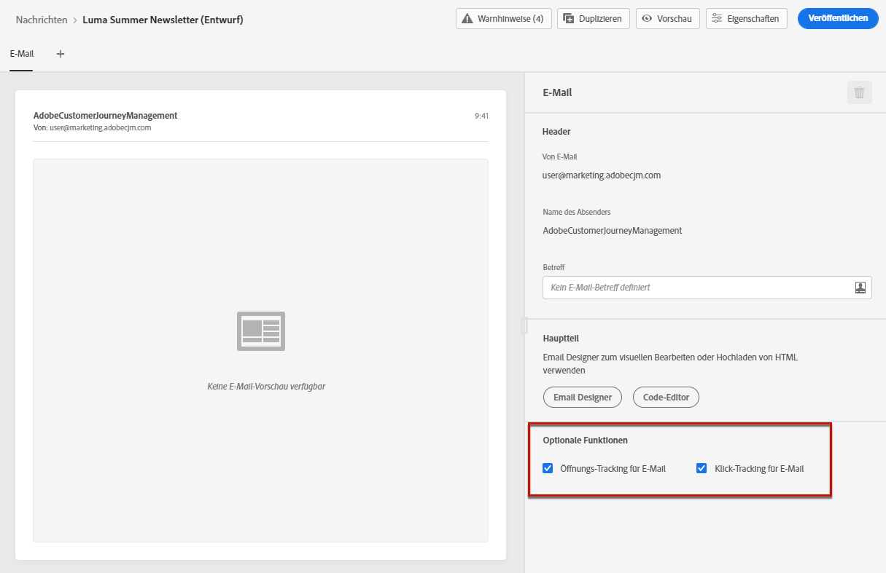
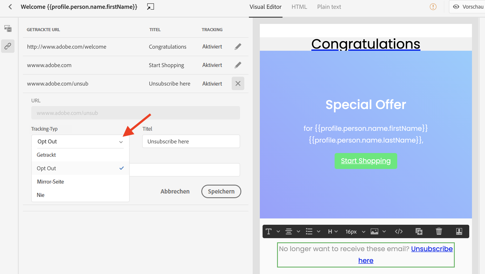

# Nachrichten-Tracking {#tracking}

Mit Journey Optimizer können Sie die gesendeten Nachrichten und das Verhalten Ihrer Empfänger verfolgen.

Sie können das Tracking auf Nachrichtenebene aktivieren, indem Sie die Optionen **[!UICONTROL Tracking der Öffnungen bei E-Mails]** und/oder **[!UICONTROL Tracking der Klicks bei E-Mails]** aktivieren. Auf diese Weise können Sie das Verhalten Ihrer Empfänger durch Öffnungen und/oder Klicks auf Links verfolgen. [Erfahren Sie mehr über das Erstellen von Nachrichten](create-message.md).

Beim Entwerfen einer Nachricht können Sie verfolgte Links zu Ihren Inhalten hinzufügen. Darüber hinaus können Sie mit Email Designer die zu verfolgenden URLs verwalten, z. B. die Aktivierung/Deaktivierung des Trackings oder die Bearbeitung des Tracking-Typs für jeden Link. [Weitere Informationen zum Arbeiten mit Email Designer](create-email-content.md).

Die Anzahl der geöffneten Meldungen und die Anzahl der angeklickten Links sind auf der Registerkarte [Ausführungen](message-monitoring.md) aufgeführt.
