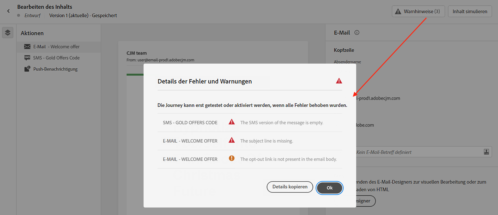

# Überprüfen von Warnhinweisen für Ihre Nachrichten {#messages-alerts}

## Prüfungen vor dem Senden {#message-alerting}

Während Sie Ihre Nachrichten entwerfen, werden Warnhinweise auf der Benutzeroberfläche angezeigt, wenn wichtige Einstellungen fehlen.

Warnhinweise werden bei der Bearbeitung des Nachrichteninhalts oben rechts im Bildschirm angezeigt.

>[!NOTE]
>
>Wenn diese Schaltfläche nicht angezeigt wird, wurde kein Warnhinweis erkannt.

Es können zwei Arten von Warnhinweisen auftreten:

* **Warnhinweise** geben Hinweise auf Empfehlungen und zeigen Best Practices. Wenn beispielsweise der Ausschluss-Link fehlt, wird eine Meldung angezeigt.

* **Fehler** verhindern, dass Sie die Journey testen oder aktivieren, solange nicht alle Fehler behoben sind. Beispielsweise wird eine Meldung angezeigt, dass die Betreffzeile fehlt.

Alle möglichen Warnhinweise und Fehler sind [unten](#alerts-and-warnings) genauer beschrieben.

>[!CAUTION]
>
> Vor dem Testen oder Aktivieren der Journey müssen Sie alle **Fehler**-Warnhinweise mithilfe der entsprechenden Meldung auflösen.

## Liste von Warnhinweisen und Fehlern {#alerts-and-warnings}

Die vom System geprüften Einstellungen und Elemente sind unten aufgeführt. Sie finden hier auch Informationen zur Anpassung Ihrer Konfiguration, um die entsprechenden Probleme zu lösen.

**Warnungen**:

* **[!UICONTROL Der Ausschluss-Link ist nicht im E-Mail-Text vorhanden]**: Es empfiehlt sich, einen Link zur Abmeldung in Ihren E-Mail-Textkörper einzufügen. In [diesem Abschnitt](../privacy/opt-out.md#opt-out-management) erfahren Sie, wie Sie diesen konfigurieren.

   >[!NOTE]
   >
   >E-Mail-Nachrichten vom Typ Marketing müssen einen Ausschluss-Link enthalten, der für Transaktionsnachrichten nicht erforderlich ist. Die Kategorie der Nachricht (**[!UICONTROL Marketing]** oder **[!UICONTROL Transaktion]**) wird auf Ebene der [Kanaloberfläche](../configuration/channel-surfaces.md#email-type) (d. h. Nachrichtenvoreinstellung) und bei der [Erstellung der Nachricht](get-started-content.md#create-new-message) definiert.

* **[!UICONTROL Textversion von HTML ist leer]**: Vergessen Sie nicht, eine Textversion Ihres E-Mail-Textkörpers zu definieren, da diese verwendet wird, wenn HTML-Inhalte nicht angezeigt werden können. In [diesem Abschnitt](../design/text-version-email.md) erfahren Sie, wie Sie die Textversion erstellen.

* **[!UICONTROL Leerer Link ist im E-Mail-Text vorhanden]**: Überprüfen Sie, ob alle Links in Ihrer E-Mail korrekt sind. In [diesem Abschnitt](../design/create-email-content.md) erfahren Sie, wie Sie Inhalte und Links verwalten.

* **[!UICONTROL Die E-Mail-Größe überschreitet den Grenzwert von 100 KB]**: Stellen Sie sicher, dass die Größe Ihrer E-Mail 100 KB nicht überschreitet, um einen optimalen Versand zu erzielen. In [diesem Abschnitt](../design/create-email-content.md) erfahren Sie, wie Sie E-Mail-Inhalte bearbeiten.

**Fehler**:

* **[!UICONTROL Die Betreffzeile fehlt]**: Die E-Mail-Betreffzeile ist obligatorisch. In [diesem Abschnitt](create-email.md) erfahren Sie, wie Sie sie definieren und personalisieren.

   <!--HTML is empty when Amp HTML is present-->

* **[!UICONTROL Die Push-Version der Nachricht ist leer]**: Dieser Fehler wird angezeigt, wenn der Text oder Titel der Push-Benachrichtigung fehlt. In [diesem Abschnitt](create-push.md) erfahren Sie, wie Sie den Inhalt einer Push-Benachrichtigung definieren.

* **[!UICONTROL Die E-Mail-Version der Nachricht ist leer]**: Dieser Fehler wird angezeigt, wenn der E-Mail-Inhalt nicht konfiguriert wurde. In [diesem Abschnitt](../design/design-emails.md) erfahren Sie, wie Sie E-Mail-Inhalte entwerfen.

* **[!UICONTROL Oberfläche ist nicht vorhanden]**: Sie können Ihre Nachricht nicht veröffentlichen, wenn die gewählte Oberfläche nach der Erstellung der Nachricht gelöscht wird. Wenn dieser Fehler auftritt, wählen Sie in den **[!UICONTROL Eigenschaften]** der Nachricht eine andere Oberfläche aus. Weitere Informationen zu Kanaloberflächen finden Sie in [diesem Abschnitt](../configuration/channel-surfaces.md).

* **[!UICONTROL Die Payload für Push-Benachrichtigungen an iOS-/Android überschreitet die Beschränkung von 4 KB]**: Die Größe der Push-Benachrichtigung darf 4 KB nicht überschreiten. Um diese Grenze zu beachten, versuchen Sie, die Verwendung von Bildern oder Emojis zu reduzieren. In [diesem Abschnitt](create-push.md) erfahren Sie, wie Sie Ihre Push-Benachrichtigungsinhalte verwalten.

>[!CAUTION]
>
> Um Ihre Nachricht veröffentlichen zu können, müssen Sie alle **Fehler**-Warnhinweise auflösen.

<!--Other issues can stop publication such as:
* The push notification title is empty-->
