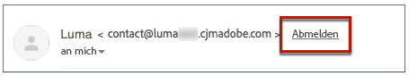

# Einverständnisverwaltung {#consent}

Verwenden Sie [!DNL Journey Optimizer], um die Zustimmung Ihrer Empfänger zur Kommunikation nachzuverfolgen und anhand der Verwaltung ihrer Voreinstellungen und Abonnements zu verstehen, wie sie mit Ihrer Marke interagieren möchten.

Gesetzliche Bestimmungen wie die DSGVO verlangen die Erfüllung bestimmter Anforderungen, bevor Sie Informationen von betroffenen Personen verwenden können. Darüber hinaus sollten die betroffenen Personen ihre Einwilligung jederzeit ändern können.

**Warum ist das wichtig?**

* Die Nichtbeachtung dieser Vorschriften birgt rechtliche Risiken für Ihre Marke.
* Auf diese Weise vermeiden Sie das Verschicken unerwünschter Nachrichten an Empfänger, die Ihre Nachrichten als Spam kennzeichnen und Ihrem Ruf schaden könnten.

Weitere Informationen zur Verwaltung der Datenschutzeinstellungen und den geltenden Vorschriften finden Sie in der [Dokumentation zu Experience Platform](https://experienceleague.adobe.com/docs/experience-platform/privacy/home.html?lang=de){target=&quot;_blank&quot;}.

>[!NOTE]
>
>In [!DNL Journey Optimizer], wird die Einwilligung von der Experience Platform bearbeitet. [Einverständnisschema](https://experienceleague.adobe.com/docs/experience-platform/xdm/field-groups/profile/consents.html){target=&quot;_blank&quot;}. Standardmäßig ist der Wert für das Einverständnisfeld leer und wird als Einverständnis für den Empfang Ihrer Nachrichten behandelt. Sie können diesen Standardwert beim Onboarding auf einen der möglichen Werte ändern [here](https://experienceleague.adobe.com/docs/experience-platform/xdm/data-types/consents.html#choice-values){target=&quot;_blank&quot;}.

## Opt-out-Verwaltung für E-Mails {#opt-out-management}

Die Möglichkeit für Empfänger, den Empfang von Mitteilungen einer Marke zu kündigen, ist eine gesetzliche Anforderung. Weitere Informationen zu den geltenden Rechtsvorschriften finden Sie in der [Dokumentation zu Adobe Experience Platform](https://experienceleague.adobe.com/docs/experience-platform/privacy/regulations/overview.html?lang=de){target=&quot;_blank&quot;}.

Aus diesem Grund müssen Sie in jeder E-Mail, die an Empfänger gesendet wird, immer einen **Link zur Abmeldung** einfügen:

* Wenn Sie auf diesen Link klicken, werden die Empfänger zu einer Landingpage weitergeleitet, um sich abzumelden.
* Nach Bestätigung ihrer Wahl werden die Profildaten mit diesen Informationen aktualisiert.

### Externes Opt-out {#opt-out-external-lp}

Hierfür können Sie einen Link zu einer externen Landingpage in eine E-Mail einfügen, damit sich Benutzer von dem Erhalt von Nachrichten Ihrer Marke abmelden können.

#### Hinzufügen eines Abmelde-Links {#add-unsubscribe-link}

Zunächst müssen Sie einen Abmelde-Link zu einer Nachricht hinzufügen. Gehen Sie dazu wie folgt vor:

1. Erstellen Sie Ihre eigene Abmelde-Landingpage.

1. Hosten Sie sie auf einem Drittanbietersystem Ihrer Wahl.

1. [Erstellen einer Nachricht](create-message.md) in [!DNL Journey Optimizer].

1. Wählen Sie Text in Ihrem Inhalt aus und [fügen Sie mithilfe der kontextbezogenen Symbolleiste einen Link ](message-tracking.md#insert-links) ein.

   

1. Auswählen **[!UICONTROL Externes Opt-out/Abmeldung]** von **[!UICONTROL Link-Typ]** Dropdown-Liste.

   

1. Im **[!UICONTROL Link]** den Link zu Ihrer Drittanbieter-Landingpage einfügen.

   

1. Klicken Sie auf **[!UICONTROL Speichern]**.

1. Speichern Sie den Inhalt und [veröffentlichen Sie Ihre Nachricht](publish-manage-message.md).

#### API-Aufruf zum Opt-out implementieren {#opt-out-api}

Damit sich Ihre Empfänger bei der Auswahl über die Landingpage abmelden können, müssen Sie eine **Abonnement-API-Aufruf** durch Adobe I/O, um die Voreinstellungen der entsprechenden Profile zu aktualisieren.

Dieser Adobe I/O-POST-Aufruf lautet wie folgt:

Endpunkt: platform.adobe.io/journey/imp/consent/preferences

Abfrageparameter:

* **params**: enthält die verschlüsselte Payload
* **sig**: Signatur
* **pid**: verschlüsselte Profil-ID

Diese drei Parameter werden in die URL der Landingpage eines Drittanbieters eingefügt, die an Ihren Empfänger gesendet wird:


Header-Anforderungen:

* x-api-key
* x-gw-ims-org-id
* x-sandbox-name
* authorization (Benutzer-Token ihres technischen Accounts)

Hauptteil der Anfrage:

```
{
   "marketing": [
       {
            "type": "email",           
            "choice": "no",          
            "scope": "channel"       
        }
    ],
 
}
```

[!DNL Journey Optimizer] verwendet diese Parameter, um die Auswahl des entsprechenden Profils über den Adobe I/O-Aufruf zu aktualisieren.

#### Nachricht mit Abmelde-Link senden {#send-message-unsubscribe-link}

Nachdem Sie den Abmelde-Link zu Ihrer Landingpage konfiguriert und den API-Aufruf implementiert haben, kann Ihre Nachricht gesendet werden.

1. Senden Sie die Nachricht einschließlich des Links über eine [Journey](../building-journeys/journey.md).

1. Wenn der Empfänger nach Erhalt der Nachricht auf den Abmelde-Link klickt, wird die Landingpage angezeigt.

   

1. Wenn der Empfänger das Formular sendet (hier durch Drücken der **Abmelden** -Schaltfläche in Ihrer Landingpage) werden die Profildaten über die [Adobe I/O-Aufruf](#opt-out-api).

1. Der abgemeldete Empfänger wird dann zu einem Bestätigungsbildschirm weitergeleitet, der die erfolgte Abmeldung bestätigt.

   

   Ab sofort erhält dieser Benutzer keine weitere Kommunikation von Ihrer Marke, es sei denn, er meldet sich erneut an.

1. Um sich zu vergewissern, dass die Aktualisierung des betreffenden Profils erfolgt ist, öffnen Sie das Profil in Adobe Experience Platform, indem Sie einen Identity-Namespace und einen entsprechenden Identitätswert auswählen. Weitere Informationen finden Sie in der [Dokumentation zu Experience Platform](https://experienceleague.adobe.com/docs/experience-platform/profile/ui/user-guide.html?lang=de#getting-started){target=&quot;_blank&quot;}.

   

   Auf der Registerkarte **[!UICONTROL Attribute]** sehen Sie, dass der Wert für **[!UICONTROL choice]** auf **[!UICONTROL no]** geändert wurde.

### Opt-out mit einem Klick {#one-click-opt-out}

Da sich viele Kunden einen einfachen Abmeldevorgang wünschen, können Sie auch einen Opt-out-Link mit einem Klick in Ihren E-Mail-Inhalt einfügen. Über diesen Link können sich Ihre Empfänger schnell von Ihrer Nachricht abmelden, ohne auf eine Landingpage weitergeleitet zu werden, auf der sie ihre Auswahl bestätigen müssen, was den Abmeldevorgang beschleunigt.

Gehen Sie wie folgt vor, um Ihrer E-Mail einen Opt-out-Link hinzuzufügen.

1. [Link einfügen](message-tracking.md#insert-links) und wählen Sie **[!UICONTROL Opt-out mit einem Klick]** als Typ des Links.

   

1. Wählen Sie aus, wie Sie die Abmeldung anwenden möchten: auf Kanal-, Identitäts- oder Abonnementebene.

   

   * **[!UICONTROL Kanal]**: Die Abmeldung gilt für künftige Nachrichten, die im aktuellen Kanal an das Ziel des Profils (d. h. die E-Mail-Adresse) gesendet werden. Wenn einem Profil mehrere Ziele zugeordnet sind, gilt die Abmeldung für alle Ziele (d. h. E-Mail-Adressen) im Profil für diesen Kanal.
   * **[!UICONTROL Identität]**: Die Abmeldung gilt für künftige Nachrichten, die an das Ziel (d. h. die E-Mail-Adresse) gesendet werden, das für die aktuelle Nachricht verwendet wird.
   * **[!UICONTROL Abonnement]**: Die Abmeldung gilt für künftige Nachrichten, die mit einer bestimmten Abonnentenliste verbunden sind. Diese Option kann nur ausgewählt werden, wenn die aktuelle Nachricht einer Abonnementliste zugeordnet ist.

1. Geben Sie die URL der Landingpage ein, zu der der Benutzer weitergeleitet werden soll, sobald er sich abgemeldet hat. Diese Seite dient nur zur Bestätigung, dass die Abmeldung erfolgreich war.

   

   Sie können Ihre Links personalisieren. Weitere Informationen zu personalisierten URLs finden Sie in [diesem Abschnitt](../personalization/personalization-syntax.md).

1. Speichern Sie Ihre Änderungen.

Wenn Ihre Nachricht über eine [Journey](../building-journeys/journey.md) gesendet wurde, wird ein Empfänger, der auf den Ausschluss-Link klickt, sofort abgemeldet.

### Abmelde-Link in der Kopfzeile der Nachricht {#unsubscribe-email}

Wenn der E-Mail-Client des Empfängers die Anzeige eines Abmelde-Links in der E-Mail-Kopfzeile unterstützt, enthalten E-Mails, die mit [!DNL Journey Optimizer] gesendet werden, automatisch diesen Link.

Der Abmelde-Link wird beispielsweise in Gmail wie folgt angezeigt:



Je nach E-Mail-Client hat das Klicken auf den Abmelde-Link in der Kopfzeile eine der folgenden Auswirkungen:

* Das entsprechende Profil wird sofort abgemeldet und in Experience Platform aktualisiert. Weitere Informationen finden Sie in der [Dokumentation zu Experience Platform](https://experienceleague.adobe.com/docs/experience-platform/profile/ui/user-guide.html#getting-started){target=&quot;_blank&quot;}.

* Dies hat die gleiche Wirkung wie das Klicken auf den Abmelde-Link im E-Mail-Inhalt: Der Empfänger wird zu einer Landingpage weitergeleitet, die eine Schaltfläche enthält, mit der er seine Abmeldung bestätigt. Weitere Informationen zur Opt-out-Verwaltung finden Sie in [diesem Abschnitt](#opt-out-management).

## Push-Opt-out-Verwaltung {#push-opt-out-management}

Push-Empfänger können sich über ihre Geräte selbst abmelden.

Beispielsweise können sie den Versand von Benachrichtigungen beim Herunterladen oder bei der Nutzung Ihrer Mobile App deaktivieren. Ebenso können sie die Benachrichtigungseinstellungen über das mobile Betriebssystem ändern.
