# Entwerfen von E-Mail-Inhalten in der Benutzeroberfläche {#create-email-content}

Nachdem Sie [Ihre Nachricht erstellt](create-message.md) haben, können Sie mit der Erstellung Ihres E-Mail-Inhalts beginnen.

➡️ [Entdecken Sie diese Funktion im Video](#video).

1. Wählen Sie in der neu erstellten Nachricht **[!UICONTROL Email Designer]** im Abschnitt **[!UICONTROL Textkörper]** aus.

   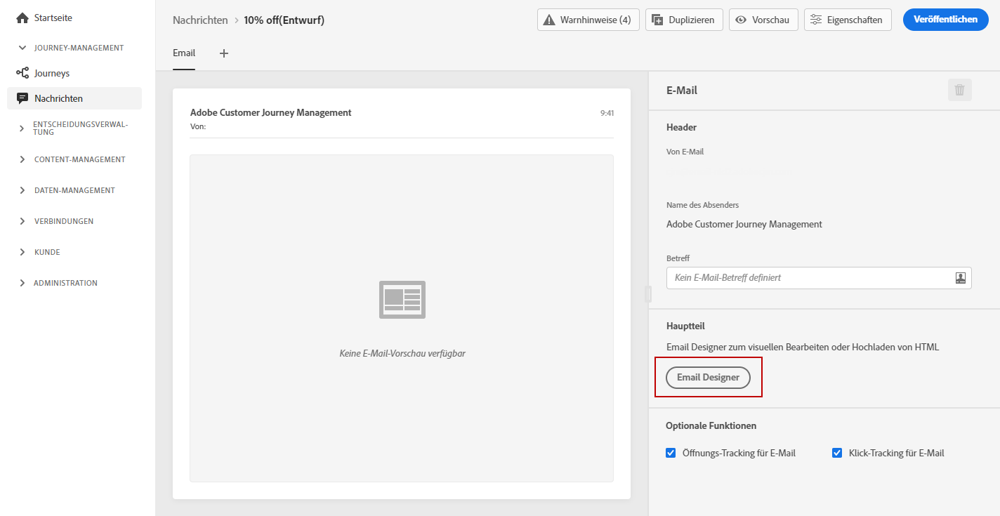

1. Wählen Sie auf der Startseite von Email Designer unter den folgenden Optionen, wie Sie Ihre E-Mail gestalten möchten:

   * Wählen Sie **[!UICONTROL Von Grund auf gestalten]**, um die Funktionen von Email Designer zum Erstellen Ihres E-Mail-Inhalts zu verwenden. [Weitere Informationen](#design-scratch)

   * Wählen Sie **[!UICONTROL Von Vorlage starten]** aus, um Ihre E-Mail aus einer integrierten Liste von Vorlagen zu erstellen. Beachten Sie, dass Sie keine anderen Vorlagen erstellen können.

   * Wählen Sie **[!UICONTROL Eigenen Code verwenden]**, um HTML-Roh-Code einzugeben oder einzufügen. [Weitere Informationen](existing-content.md#import-raw-html-code).

   * Wählen Sie **[!UICONTROL HTML importieren]**, um eine HTML-Datei oder einen ZIP-Ordner zu importieren. [Weitere Informationen](existing-content.md#import-html-content-from-file).

   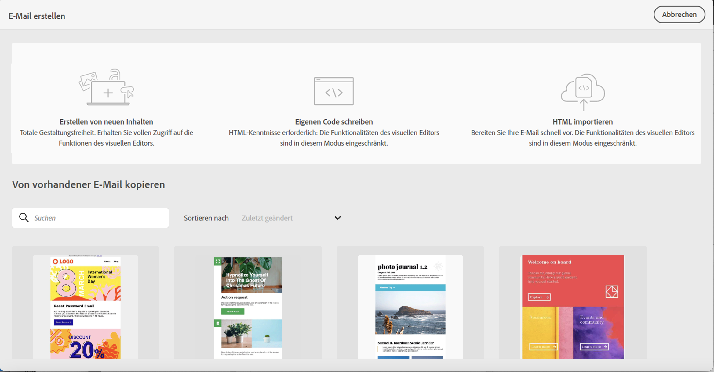

## Von Grund auf gestalten {#design-scratch}

>[!CONTEXTUALHELP]
>id="ac_structure_components"
>title="Über Strukturkomponenten"
>abstract="Strukturkomponenten definieren das Layout der E-Mail."

>[!CONTEXTUALHELP]
>id="ac_edition_columns"
>title="Definieren von E-Mail-Spalten"
>abstract="Mit Email Designer können Sie das Layout Ihrer E-Mail einfach definieren, indem Sie die Spaltenstruktur definieren."

Email Designer bietet eine einfache Möglichkeit, die Struktur Ihrer E-Mail zu bestimmen. Durch das Hinzufügen und Verschieben von strukturellen Elementen durch einfaches Drag &amp; Drop können Sie Ihrer E-Mail in Sekundenschnelle die gewünschte Form verleihen.

Um bei der Erstellung Ihrer E-Mail-Inhalte mit Email Designer zu beginnen, führen Sie die folgenden Schritte aus:

1. Nach Auswahl der Option **[!UICONTROL Von Grund auf gestalten]** beginnen Sie mit der Gestaltung Ihres E-Mail-Inhalts, indem Sie **[!UICONTROL Strukturkomponenten]** per Drag-and-Drop hineinziehen, um das Layout Ihrer E-Mail zu definieren.

   >[!NOTE]
   >
   >Beachten Sie, dass das Stapeln von Spalten nicht mit allen E-Mail-Programmen kompatibel ist. Wenn dies nicht unterstützt wird, werden Spalten nicht gestapelt.
   >
   >Sobald die Komponenten in der E-Mail platziert sind, können sie nicht mehr verschoben oder entfernt werden, außer es befindet sich bereits eine Inhaltskomponente oder ein Fragment darin.

   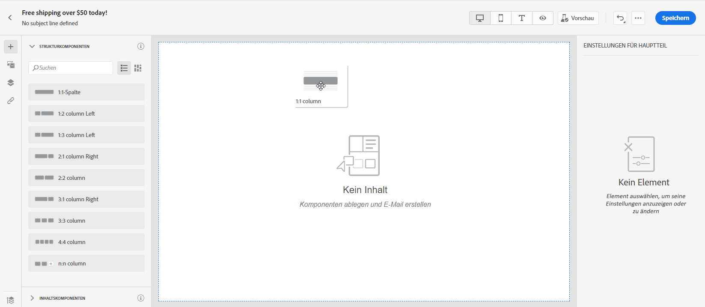

1. Fügen Sie beliebig viele **[!UICONTROL Strukturkomponenten]** hinzu.

   Wählen Sie die Komponente **[!UICONTROL n:n Spalte]** aus, um die Anzahl der Spalten zu definieren (3 bis 10). Sie können auch die Breite jeder Spalte ändern, indem Sie den Pfeil am unteren Rand einer jeden Spalte verschieben.

   >[!NOTE]
   >
   >Die Größe einer Spalte muss immer mindestens 10 % der Gesamtbreite der Strukturkomponente betragen. Sie können nur leere Spalten entfernen.

1. Aus der Dropdown-Liste **[!UICONTROL Inhaltskomponenten]** können Sie so viele **[!UICONTROL Inhaltskomponenten]** hinzufügen, wie Sie in Ihrer Strukturkomponente benötigen. [Weitere Informationen zu Inhaltskomponenten](content-components.md).

   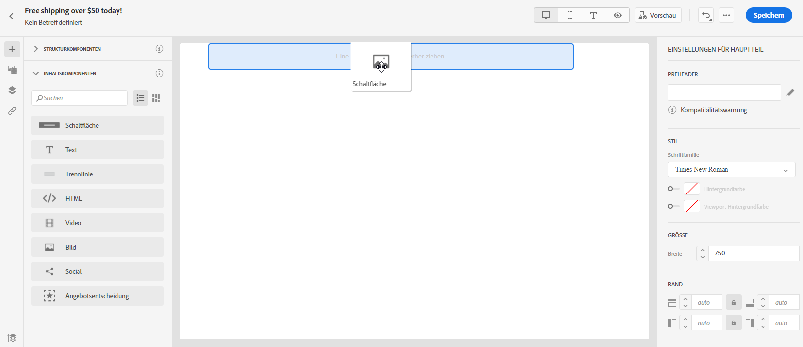

1. Jede Komponente kann mit dem Abschnitt **[!UICONTROL Komponenteneinstellungen]** weiter angepasst werden. Sie können beispielsweise Ihren Textstil, den Abstand oder den Rand Ihrer Komponente ändern. [Erfahren Sie mehr über Ausrichtung und Abstand](#adjusting-vertical-alignment-and-padding).

   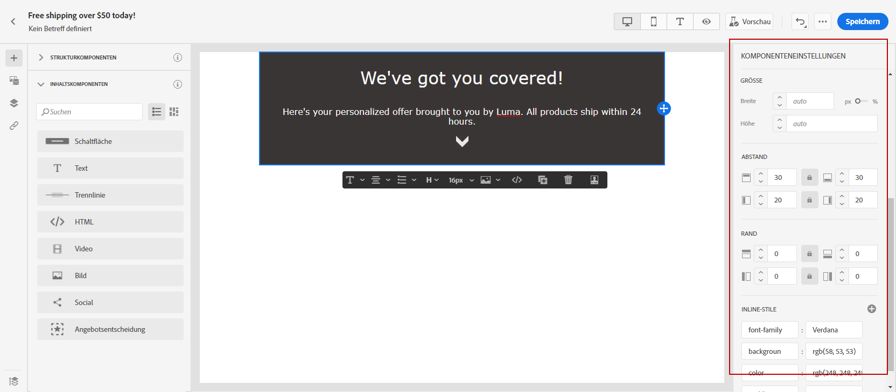

1. Über die **[!UICONTROL Asset-Auswahl]** können Sie Ihrer E-Mail direkt Assets hinzufügen, die in der **[!UICONTROL Asset-Bibliothek]** gespeichert sind. [Weitere Informationen über Asset-Management.](assets-essentials.md)

   Doppelklicken Sie auf den Ordner, der Ihre Assets enthält, und ziehen Sie das Asset, das Sie Ihrer E-Mail hinzufügen möchten, per Drag-and-Drop hinein.

   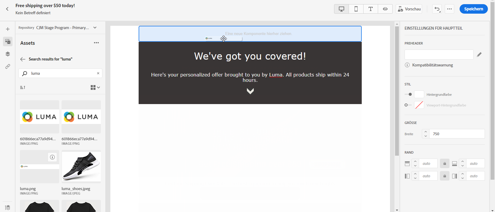

1. Fügen Sie Personalisierungsfelder hinzu, um den Inhalt aus Ihren Profildaten zu personalisieren. [Weitere Informationen über die Personalisierung von Inhalt](../personalization/personalize.md).

   

1. Überprüfen Sie auf der Registerkarte **[!UICONTROL Links]** im linken Bereich die Liste aller URLs Ihres Inhalts, die verfolgt werden sollen. Sie können bei Bedarf ihren **[!UICONTROL Tracking-Typ]**, **[!UICONTROL Label]** und **[!UICONTROL Tags]** ändern.

   

   >[!NOTE]
   >
   >Weitere Informationen zu Links und zum Nachrichten-Tracking finden Sie auf [dieser Seite](message-tracking.md).

1. Bei Bedarf können Sie zum Code-Editor wechseln, um Ihre E-Mail weiter zu personalisieren, indem Sie im erweiterten Menü auf **[!UICONTROL Zum Code-Editor wechseln]** klicken. Weitere Informationen zum Code-Editor finden Sie auf [dieser Seite](existing-content.md#import-raw-html-code).

   >[!NOTE]
   >
   >Nach dem Wechsel zum Code-Editor können Sie den visuellen Designer für diese E-Mail nicht mehr verwenden.

   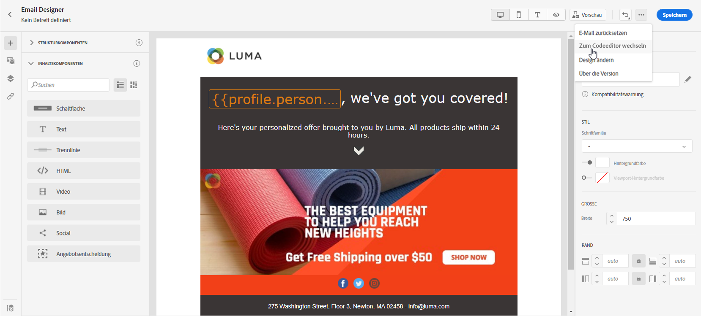

1. Klicken Sie auf **[!UICONTROL Vorschau anzeigen]**, um Ihre gerenderte E-Mail zu überprüfen. Sie können zwischen der Desktop- oder der mobilen Ansicht wählen.

   Weiterführende Informationen zur Vorschau Ihrer E-Mail finden Sie auf [dieser Seite](preview.md).

   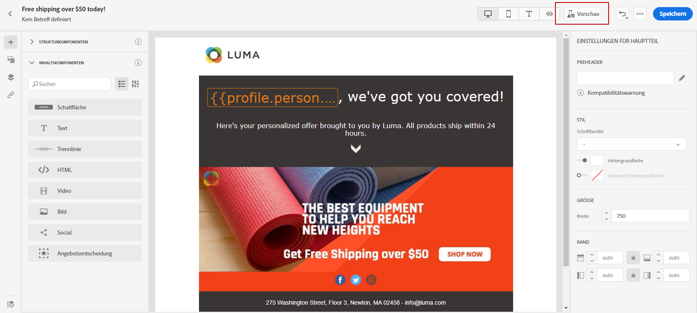

1. Wenn Ihre E-Mail fertig ist, klicken Sie auf **[!UICONTROL Speichern und schließen]**.

Ihr E-Mail-Inhalt kann jetzt in einer Nachricht verwendet werden. [Erfahren Sie, wie Sie eine Nachricht senden](publish-manage-message.md).

## Erstellen der Textversion einer E-Mail {#generate-text-version}

Es wird empfohlen, eine Textversion Ihres E-Mail-Textkörpers zu erstellen, die verwendet wird, wenn HTML-Inhalte nicht angezeigt werden können.

Standardmäßig erstellt Email Designer eine **[!UICONTROL Nur-Text-Version]** Ihrer E-Mail einschließlich Personalisierungsfeldern. Diese Version wird automatisch generiert und mit der HTML-Version Ihres Inhalts synchronisiert.

Wenn Sie lieber einen anderen Inhalt für die Nur-Text-Version verwenden, führen Sie die folgenden Schritte aus:

1. Wählen Sie in Ihrer E-Mail die Registerkarte **[!UICONTROL Nur-Text]** aus.

   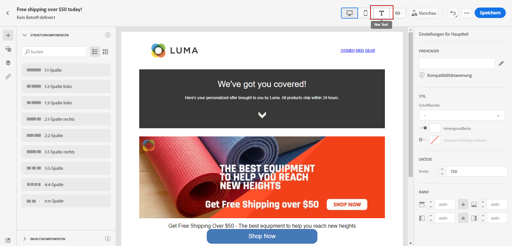

1. Verwenden Sie den Umschalter **[!UICONTROL Mit HTML synchronisieren]**, um die Synchronisierung zu deaktivieren.

   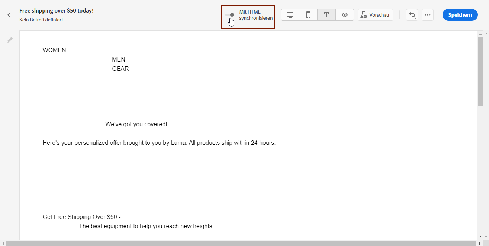

1. Klicken Sie auf das Häkchen, um Ihre Auswahl zu bestätigen.

   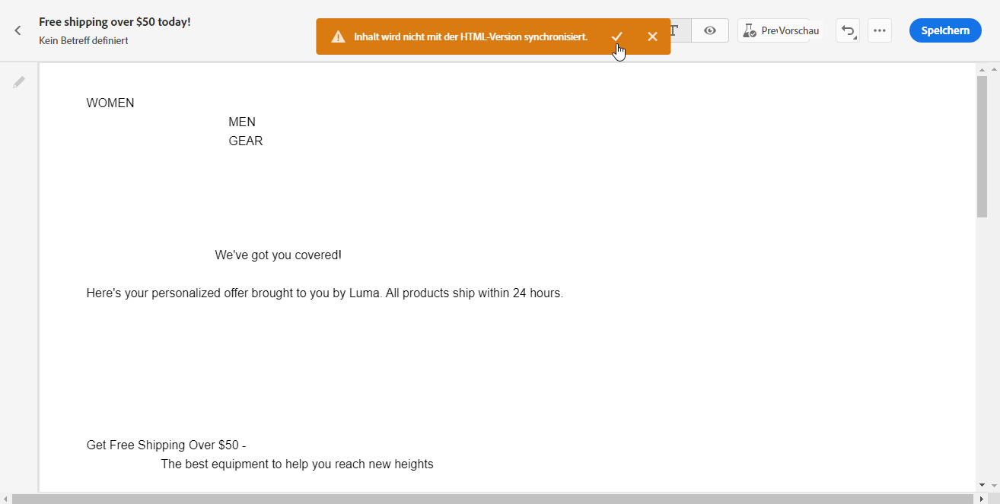

1. Sie können die Nur-Text-Version dann nach Belieben bearbeiten.

>[!CAUTION]
>
>* Die Änderungen, die Sie in der **[!UICONTROL Nur-Text-Ansicht]** vorgenommen haben, werden in der HTML-Ansicht nicht dargestellt.
>
>* Wenn Sie die Option **[!UICONTROL Mit HTML synchronisieren]** erneut aktivieren, nachdem Sie Ihren Nur-Text-Inhalt aktualisiert haben, gehen Ihre Änderungen verloren und werden durch Textinhalte ersetzt, die aus der HTML-Version generiert wurden.

## Preheader hinzufügen {#preheader}

>[!CONTEXTUALHELP]
>id="ac_edition_preheader"
>title="Preheader hinzufügen"
>abstract="Ein Preheader ist ein kurzer zusammenfassender Text, der auf die Betreffzeile folgt, wenn Sie eine E-Mail in Ihrem E-Mail-Programm anzeigen. In vielen Fällen bietet sie eine kurze Zusammenfassung der E-Mail und ist in der Regel ein Satz lang."

Ein Preheader ist ein kurzer zusammenfassender Text, der auf die Betreffzeile folgt, wenn Sie eine E-Mail in Ihrem E-Mail-Programm anzeigen. In vielen Fällen bietet sie eine kurze Zusammenfassung der E-Mail und ist in der Regel ein Satz lang.

>[!NOTE]
>
>Preheader werden nicht von allen E-Mail-Clients unterstützt. Wird der Preheader nicht unterstützt, wird er nicht angezeigt.

Gehen Sie wie folgt vor, um den E-Mail-Preheader zu definieren:

1. Fügen Sie in Email Designer eine **[!UICONTROL Strukturkomponente]** hinzu, um Ihre E-Mail zu entwerfen.

   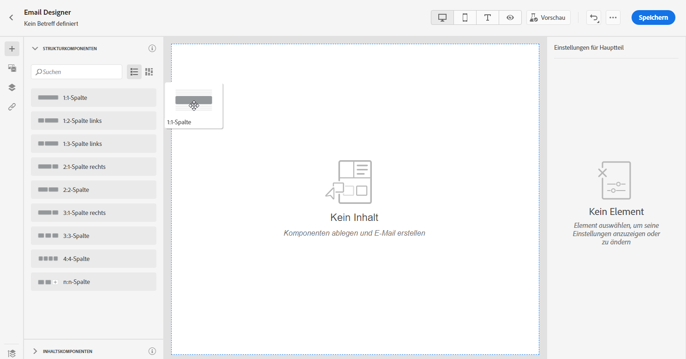

1. Klicken Sie im rechten Bereich in **[!UICONTROL Texteinstellungen]** auf **Bearbeiten** neben dem Feld **[!UICONTROL Preheader]**, um Inhalt hinzuzufügen.

   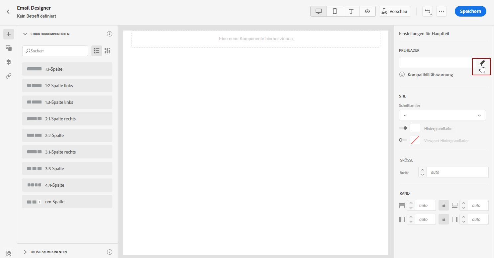

1. Fügen Sie Ihren Preheader hinzu. Sie können ihn weiter personalisieren, indem Sie auf das Symbol **[!UICONTROL Personalisierung hinzufügen]** klicken.

   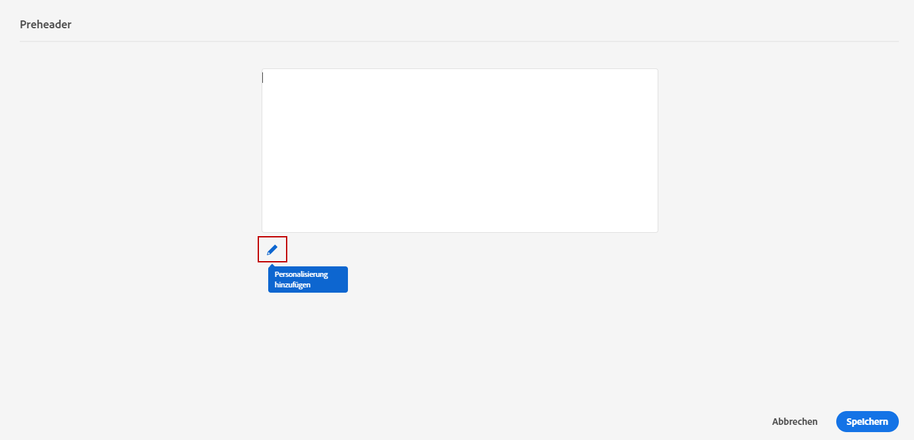

1. Im Fenster **[!UICONTROL Personalisierung bearbeiten]** können Sie **[!UICONTROL Inhaltsbausteine]**, **[!UICONTROL dynamische Inhalte]** oder **[!UICONTROL Personalisierungsfelder]** hinzufügen.

1. Klicken Sie auf **[!UICONTROL Validieren]**, um Ihre Personalisierungssyntax zu prüfen.

   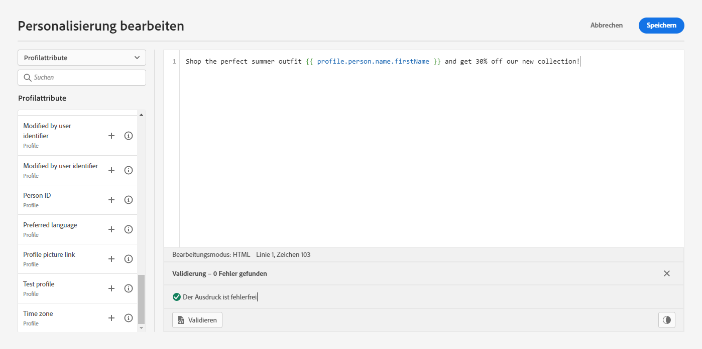

1. Klicken Sie auf **[!UICONTROL Speichern]**.

Ihr Preheader ist jetzt für Ihre E-Mail konfiguriert.

## Hintergrundeinstellungen {#about-backgrounds}

>[!CONTEXTUALHELP]
>id="ac_edition_backgroundimage"
>title="Hintergrundeinstellungen"
>abstract="Sie können die Hintergrundfarbe oder das Hintergrundbild für Ihren Inhalt personalisieren. Beachten Sie, dass Hintergrundbilder nicht von allen E-Mail-Clients unterstützt werden."

Für die Einstellung von Hintergründen mit Email Designer empfiehlt Adobe Folgendes:

1. Wenden Sie eine Hintergrundfarbe auf den Hauptteil Ihrer E-Mail an, wenn das Design es so verlangt.
1. Meistens wird die Hintergrundfarbe auf Spaltenebene festgelegt.
1. Versuchen Sie nicht, Hintergrundfarben für Bilder oder Textkomponenten zu verwenden, da sie schwierig zu handhaben sind.

Unten finden Sie die verfügbaren Einstellungen für den Hintergrund.

* Legen Sie eine **[!UICONTROL Hintergrundfarbe]** für die gesamte E-Mail fest. Wählen Sie die Einstellungen für den Hauptteil im Navigationsbaum aus, auf den Sie über die linke Palette zugreifen können.

* Legen Sie dieselbe Hintergrundfarbe für alle Strukturkomponenten fest, indem Sie **[!UICONTROL Viewport-Hintergrundfarbe auswählen]**. Mit dieser Option können Sie eine andere Einstellung als die Hintergrundfarbe auswählen.

* Legen Sie für jede Strukturkomponente eine andere Hintergrundfarbe fest. Wählen Sie in der linken Palette eine Struktur im Navigationsbaum aus, um eine bestimmte Hintergrundfarbe nur dieser Struktur zuzuweisen.

   Wählen Sie aber keine Viewport-Hintergrundfarbe aus, da diese die Struktur-Hintergrundfarben verdecken könnte.

* Legen Sie für den Inhalt einer Strukturkomponente ein **[!UICONTROL Hintergrundbild]** fest.

   >[!NOTE]
   >
   >Manche E-Mail-Programme unterstützen keine Hintergrundbilder. Wenn diese nicht unterstützt werden, wird stattdessen die Zeilenhintergrundfarbe verwendet. Wählen Sie daher eine passende Fallback-Hintergrundfarbe auf, falls das Bild nicht dargestellt werden kann.

* Legen Sie auf Spaltenebene eine Hintergrundfarbe fest.

   >[!NOTE]
   >
   >Dies ist der häufigste Anwendungsfall. Adobe empfiehlt, Hintergrundfarben auf Spaltenebene festzulegen, da dies mehr Flexibilität bietet, wenn der gesamte E-Mail-Inhalt bearbeitet wird.

   Sie können auch ein Hintergrundbild auf Spaltenebene einrichten, was aber nur selten verwendet wird.

## Anpassen der senkrechten Ausrichtung und des Abstands {#adjusting-vertical-alignment-and-padding}

In diesem Beispiel passen wir den Abstand und die senkrechte Ausrichtung innerhalb einer Strukturkomponente an, die aus drei Spalten besteht.

1. Wählen Sie eine Strukturkomponente direkt in der E-Mail oder über den **[!UICONTROL Navigationsbaum]** im linken Menü aus.

   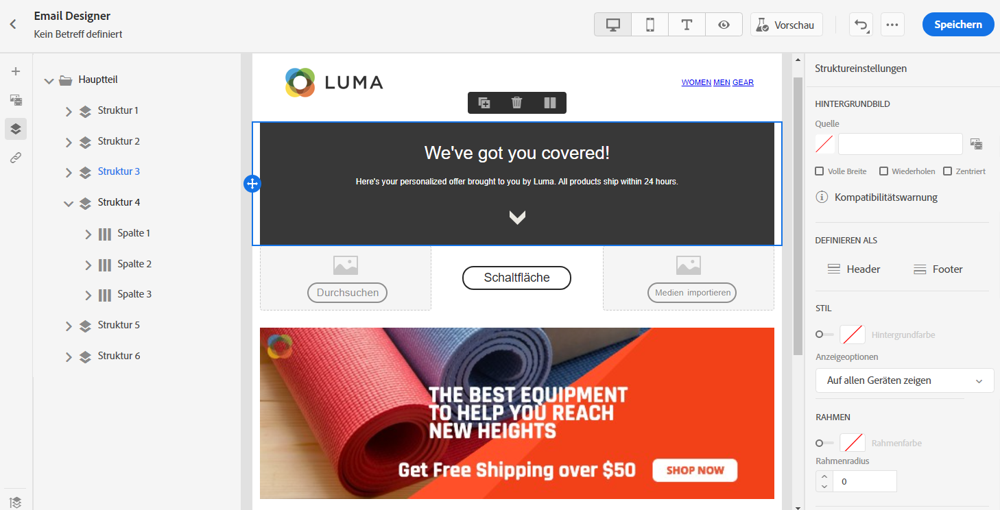

1. Wählen Sie in der Symbolleiste mit der Option **[!UICONTROL Spalte auswählen]** die gewünschte Spalte aus. Sie können sie auch im Strukturbaum auswählen.

   Die bearbeitbaren Parameter für diese Spalte werden im Menü **[!UICONTROL Spalteneinstellungen]** angezeigt.

   

1. Wählen Sie unter **[!UICONTROL Vertikale Ausrichtung]** die Option **[!UICONTROL Unten]** aus.

   Die Inhaltskomponente wird an den unteren Rand der Spalte verschoben.

   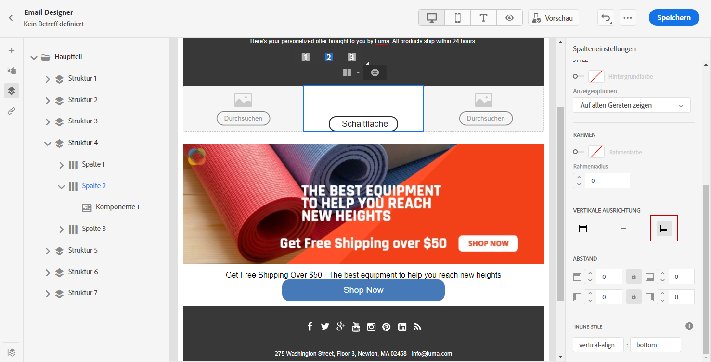

1. Definieren Sie unter **[!UICONTROL Abstand]** den Abstand der Spalte vom oberen Rand. Wählen Sie das Schlosssymbol aus, um die Synchronisation mit dem Abstand vom unteren Rand aufzuheben.

   Definieren Sie den linken und rechten Abstand für diese Spalte.

   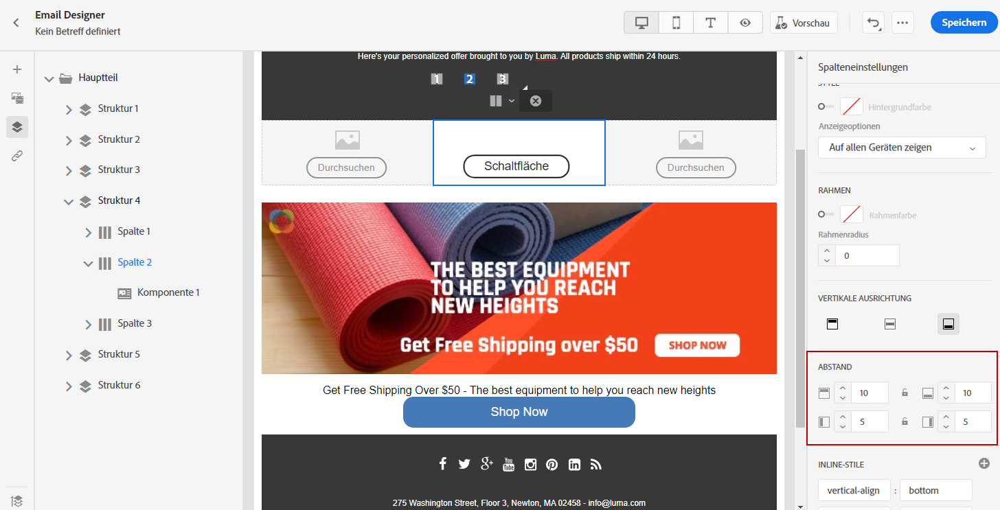

1. Gehen Sie analog mit den anderen Ausrichtungs- und Abstandseinstellungen der Spalten vor.

1. Speichern Sie Ihre Änderungen.

## Definieren eines Stils für Links {#about-styling-links}

Sie können einen Link unterstreichen und in Email Designer dessen Farbe und Ziel auswählen.

1. Wählen Sie Ihren Link in einer **[!UICONTROL Textinhaltskomponente]** aus, in die ein Link eingefügt wird.

1. Aktivieren Sie im Menü **[!UICONTROL Komponenteneinstellungen]** die Option **[!UICONTROL Link unterstreichen]**, um den Titeltext Ihres Links zu unterstreichen.

   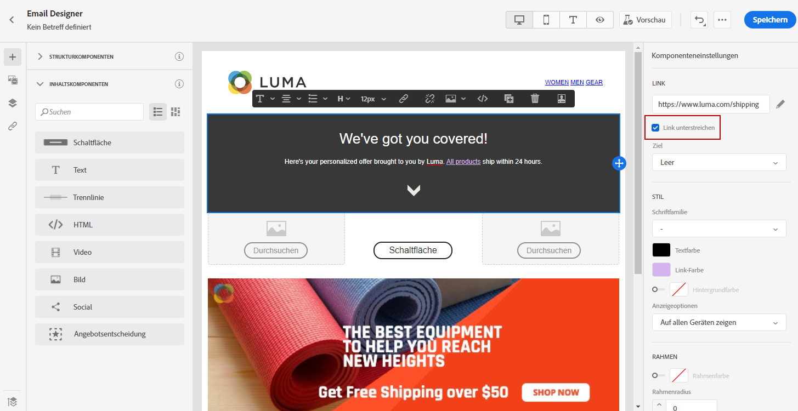

1. Wählen Sie mit der Dropdown-Liste **[!UICONTROL Target]** aus, wie Ihre Audience umgeleitet werden soll:

   * **[!UICONTROL None]**: öffnet den Link in demselben Frame, in dem er angeklickt wurde (Standardwert).
   * **[!UICONTROL Blank]**: öffnet den Link in einem neuen Fenster oder auf einer neuen Registerkarte.
   * **[!UICONTROL Self]**: öffnet den Link in demselben Frame, in dem er angeklickt wurde.
   * **[!UICONTROL Parent]**: öffnet den Link im übergeordneten Frame.
   * **[!UICONTROL Top]**: öffnet den Link im gesamten Fenster.

   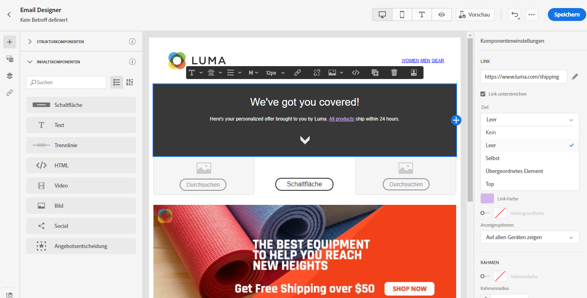

1. Wenn Sie die Farbe Ihres Links ändern möchten, klicken Sie auf **[!UICONTROL Linkfarbe]**.

   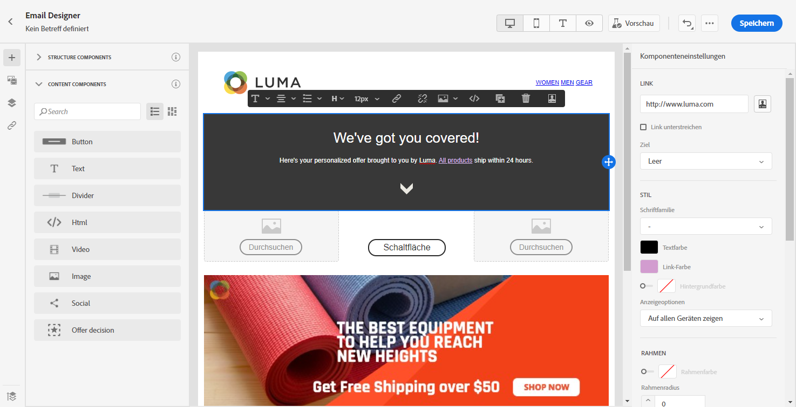

1. Wählen Sie die gewünschte Farbe aus.

1. Speichern Sie Ihre Änderungen.

## Hinzufügen von Inline-Stilattributen {#adding-inline-styling-attributes}

Wenn Sie in der Benutzeroberfläche von Email Designer ein Element auswählen und im seitlichen Fenster seine Einstellungen anzeigen, können Sie seine Inline-Attribute und deren Werte ändern.

1. Wählen Sie in Ihrem Inhalt ein Element aus.
1. Suchen Sie im seitlichen Fenster nach den Einstellungen für **[!UICONTROL Inline-Stile]**.

1. Ändern Sie die Werte der vorhandenen Attribute oder fügen Sie mit den Schaltflächen **+** neue hinzu. Sie können alle Attribute und Werte hinzufügen, die CSS-kompatibel sind.

Der Stil wird auf das ausgewählte Element angewendet. Wenn für die untergeordneten Elemente keine speziellen Stilattribute definiert sind, wird der Stil des übergeordneten Elements verwendet.

## Anleitungsvideo {#video}

Erfahren Sie, wie Sie mit dem Nachrichteneditor E-Mail-Inhalte erstellen.

>[!VIDEO](https://video.tv.adobe.com/v/334150?quality=12)
