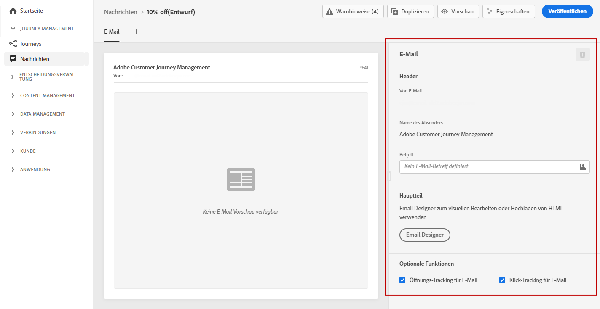

# Erstellen einer E-Mail {#configure-email}

>[!CONTEXTUALHELP]
>id="ajo_message_email"
>title="Email-Erstellung"
>abstract="Definieren Sie Ihre E-Mail-Parameter in drei einfachen Schritten."

Nachdem Sie [eine Nachricht erstellt](get-started-content.md) haben, verwenden Sie die Registerkarte **[!UICONTROL E-Mail]**, um die Einstellungen und den Inhalt für den E-Mail-Kanal zu definieren.

>[!NOTE]
>
>Die Felder **[!UICONTROL Von E-Mail]** und **[!UICONTROL Von Name]** sind schreibgeschützt und werden durch die **[!UICONTROL Voreinstellung]** bestimmt, die beim [Erstellen der Nachricht](get-started-content.md) ausgewählt wurde.

Die Schritte zum Konfigurieren einer E-Mail sind:

1. Geben Sie den E-Mail-Betreff im Feld der **[!UICONTROL Betreffzeile]** an. Klicken Sie dazu auf die Schaltfläche auf der rechten Seite, um den Ausdruckseditor zu öffnen und den E-Mail-Betreff zu erstellen. In [diesem Abschnitt](../personalization/personalize.md) erfahren Sie, wie Sie eine Personalisierung hinzufügen.

1. Klicken Sie auf die Schaltfläche **[!UICONTROL Email Designer]**, um Ihre E-Mail zu entwerfen. In [diesem Abschnitt](../design/design-emails.md) erfahren Sie, wie Sie E-Mails entwerfen.

1. Wenn Sie das Verhalten Ihrer Empfänger über Öffnungen und/oder Klicks auf Links verfolgen möchten, stellen Sie sicher, dass die Optionen **[!UICONTROL Öffnungs-Tracking für E-Mails]** und **[!UICONTROL Klick-Tracking für E-Mails]** aktiviert sind. Weitere Informationen zu Tracking finden Sie in [diesem Abschnitt](../design/message-tracking.md).
