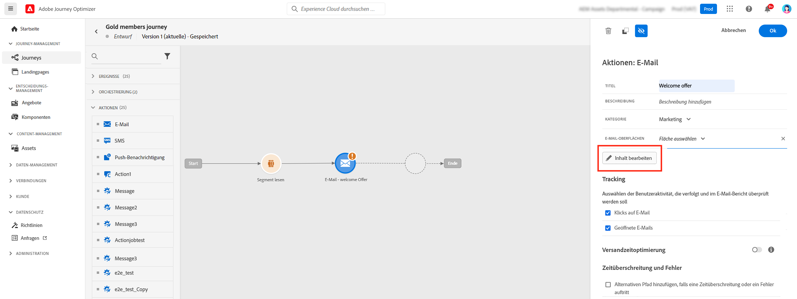
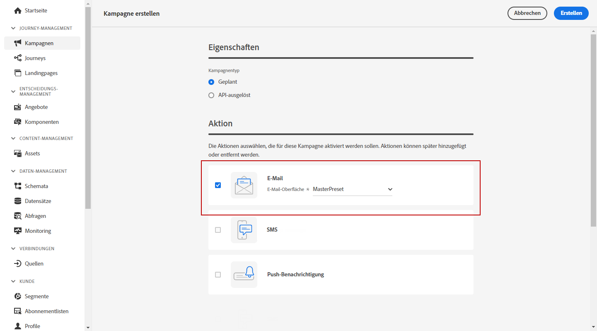
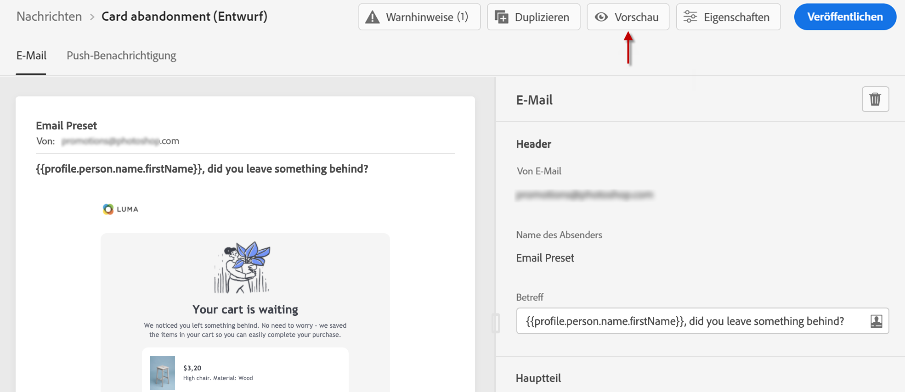

# Erstellen einer E-Mail {#configure-email}

>[!CONTEXTUALHELP]
>id="ajo_message_email"
>title="E-Mail-Erstellung"
>abstract="Definieren Sie Ihre E-Mail-Parameter in drei einfachen Schritten."

E-Mails können erstellt werden:

* In einer **Journey**: Nachdem Sie eine E-Mail-Aktivität zu Ihrer Journey hinzugefügt und die Grundeinstellungen festgelegt haben, verwenden Sie den rechten Fensterbereich **[!UICONTROL Aktionen: E-Mail]**, um den Inhalt für die E-Mail zu erstellen.

   Weitere Informationen zur Konfiguration Ihrer Journey finden Sie auf [dieser Seite](../building-journeys/journey-gs.md).

   

* In einer **Kampagne**: Nachdem Sie eine Kampagne erstellt haben, wählen Sie „E-Mail“ als Aktion aus und definieren Sie die grundlegenden Einstellungen.

   Weitere Informationen zur Konfiguration Ihrer Kampagne finden Sie auf [dieser Seite](../campaigns/create-campaign.md#configure).

   

## Definieren des E-Mail-Inhalts{#email-content}

Verwenden Sie [!DNL Journey Optimizer] Email Designer, um die [E-Mail von Grund auf neu zu erstellen](../design/create-email-content.md). Wenn Sie über einen vorhandenen Inhalt verfügen, können Sie [ihn in Email Designer importieren](../design/existing-content.md) oder [Ihren eigenen Inhalt in [!DNL Journey Optimizer] kodieren](../design/code-content.md).

[!DNL Journey Optimizer] verfügt über eine Reihe von [integrierten Vorlagen](../design/email-templates.md), die Ihnen den Einstieg erleichtern. Jede E-Mail kann auch als Vorlage gespeichert werden.

Verwenden Sie den [!DNL Journey Optimizer]-Ausdruckseditor, um Ihre Nachrichten mit den Daten der Profile zu personalisieren. Weiterführende Informationen zur Personalisierung finden Sie in [diesem Abschnitt](../personalization/personalize.md).

Den Inhalt von Nachrichten durch die Verwendung von [!DNL Journey Optimizer]-Funktionen für dynamische Inhalte an die ausgewählten Profile anpassen. [Erste Schritte mit dynamischen Inhalten](../personalization/get-started-dynamic-content.md)

## E-Mail-Tracking{#email-tracking}

Wenn Sie das Verhalten der Empfänger in Bezug auf Öffnungen und/oder Klicks auf Links verfolgen möchten, aktivieren Sie die folgenden Optionen: **[!UICONTROL E-Mail-Öffnungen]** und **[!UICONTROL Klick auf E-Mail]**.

Weitere Informationen zu Tracking finden Sie in [diesem Abschnitt](../design/message-tracking.md).

## Validieren des E-Mail-Inhalts{#email-content-validate}

Im Abschnitt „Vorschau“ auf der linken Seite können Sie das E-Mail-Rendering und die Personalisierungseinstellungen mithilfe von Testprofilen überprüfen. Weiterführende Informationen hierzu finden Sie in [diesem Abschnitt](../design/preview.md).

Sie müssen auch Warnhinweise im oberen Bereich des Editors überprüfen.  Einige davon sind einfache Warnhinweise, andere können die Verwendung der Nachricht verhindern. Weiterführende Informationen finden Sie in [diesem Abschnitt](alerts.md).

>[!NOTE]
>
>Die Felder **[!UICONTROL Von E-Mail]** und **[!UICONTROL Name des Absenders]** werden durch die **[!UICONTROL Oberfläche]** bestimmt, die beim [Erstellen der Nachricht](get-started-content.md) ausgewählt wurde.

