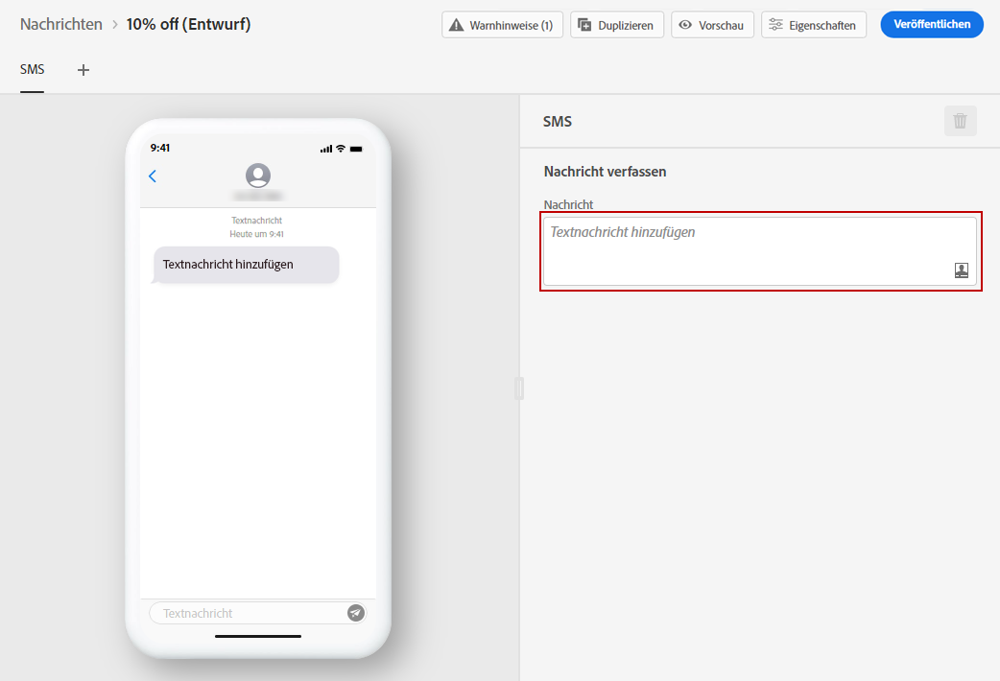
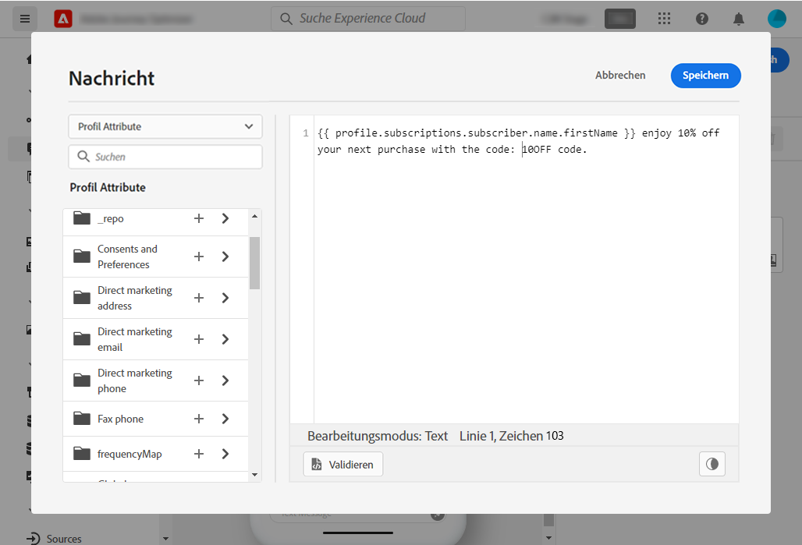

# Erstellen einer SMS-Nachricht {#create-sms}

>[!CONTEXTUALHELP]
>id="ajo_message_sms"
>title="SMS-Erstellung"
>abstract="Fügen Sie Ihre Textnachricht hinzu und beginnen Sie mit ihrer Personalisierung mithilfe des Ausdruckseditors."

Einmal [eine Nachricht erstellt haben](get-started-content.md), verwenden Sie die **[!UICONTROL SMS]** um die Einstellungen und den Inhalt der SMS-Nachricht zu definieren.

>[!AVAILABILITY]
>
>Der SMS-Kanal ist derzeit nur für eine Reihe von ausgewählten Organisationen verfügbar (eingeschränkte Verfügbarkeit). Weitere Informationen erhalten Sie bei Ihrem Adobe-Support-Mitarbeiter.

Wenn Sie zum ersten Mal eine SMS erstellen, stellen Sie sicher, dass der SMS-Kanal konfiguriert wurde. [Weitere Informationen](../configuration/sms-configuration.md).

## SMS-Inhalt definieren{#sms-content}

Gehen Sie wie folgt vor, um mit der Personalisierung Ihrer SMS-Nachricht zu beginnen:

1. Klicken Sie auf das Feld **[!UICONTROL Textnachricht hinzufügen]**, um den Ausdruckseditor zu öffnen.

   

1. Verwenden Sie den Ausdruckseditor, um Inhalte zu definieren. Sie können jedes Attribut verwenden, um Inhalte zu personalisieren, z. B. den Profilnamen oder die Stadt. Weitere Informationen zur Personalisierung im Ausdruckseditor finden Sie in [diesem Abschnitt](../personalization/personalize.md).

   >[!NOTE]
   >
   > Eine SMS-Nachricht kann bis zu 160 Zeichen lang sein, einschließlich Leerzeichen und Zeilenumbrüchen.

   

1. Klicken **[!UICONTROL Speichern]** wenn Ihre Nachricht fertig ist.

## SMS validieren{#sms-preview}

Sobald der Inhalt der Nachricht festgelegt wurde, können Sie mithilfe von Testprofilen eine Vorschau erstellen und einen Testversand durchführen. Wenn Sie [personalisierter Inhalt](../personalization/personalize.md)können Sie anhand von Testprofildaten überprüfen, wie dieser Inhalt in der Nachricht angezeigt wird.

Um zu visualisieren, wie Ihre SMS-Nachricht auf Mobilgeräten angezeigt wird, navigieren Sie zum **[!UICONTROL Vorschau]** Registerkarte.

Weiterführende Informationen hierzu finden Sie in [diesem Abschnitt](../design/preview.md).

## Veröffentlichen Ihrer SMS {#sms-publish}

Sobald Ihre Nachricht fertig ist, können Sie sie über die Schaltfläche **[!UICONTROL Veröffentlichen]** veröffentlichen und sie damit dem Versand zur Verfügung stellen. Durch diese Aktion wird die neue Version der Nachricht veröffentlicht, die für die nächsten Ausführungen in Ihren Journey verwendet wird.

Ihre SMS-Nachricht kann jetzt in einer Journey verwendet werden. [Erfahren Sie, wie Sie Journeys erstellen](../building-journeys/journey-gs.md).

## Opt-in und Opt-out{#sms-opt-in-out}

Bei allen Marketingnachrichten muss die SMS eine Möglichkeit enthalten, die Empfänger sich einfach abzumelden. Nach der Abmeldung werden die Profile automatisch aus der Audience künftiger Marketing-Nachrichten entfernt. Für Transaktionsnachrichten ist das Hinzufügen eines Abmelde-Links nicht erforderlich.

SMS-Empfänger können mit Opt-in- und Opt-out-Keywords antworten. In Übereinstimmung mit den Branchenstandards und -vorschriften verarbeitet Adobe Journey Optimizer automatisch die folgenden Schlüsselwörter in eingehenden Nachrichten: START, STOP und UNSTOP. Diese Schlüsselwörter Trigger automatische Standardantworten des SMS-Anbieters.

Weiterführende Informationen zur Unterstützung von nativen eingehenden Keywords (Start, Stopp und Unstop) für SMS finden Sie im folgenden Video.

>[!VIDEO](https://video.tv.adobe.com/v/344026?quality=12)

## Anleitungsvideo

Erfahren Sie, wie Sie SMS-Nachrichten konfigurieren, erstellen und in Ihre Journey integrieren können.

>[!VIDEO](https://video.tv.adobe.com/v/344460?quality=12)

**Verwandte Themen**

* [Konfigurieren des SMS-Kanals](../configuration/sms-configuration.md)
* [SMS-Bericht](../reports/journey-global-report.md#sms-global)
* [Erstellen einer neuen Nachricht](get-started-content.md)
* [Hinzufügen einer Nachricht zu einer Journey](../building-journeys/journeys-message.md)
