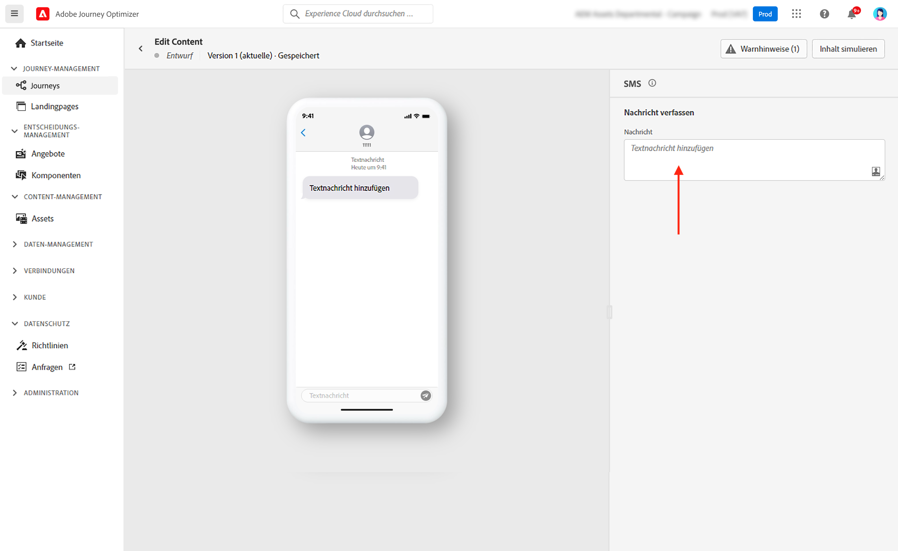
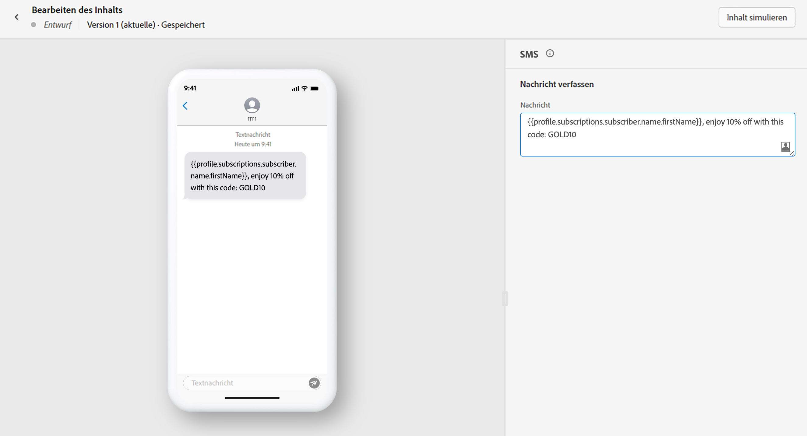
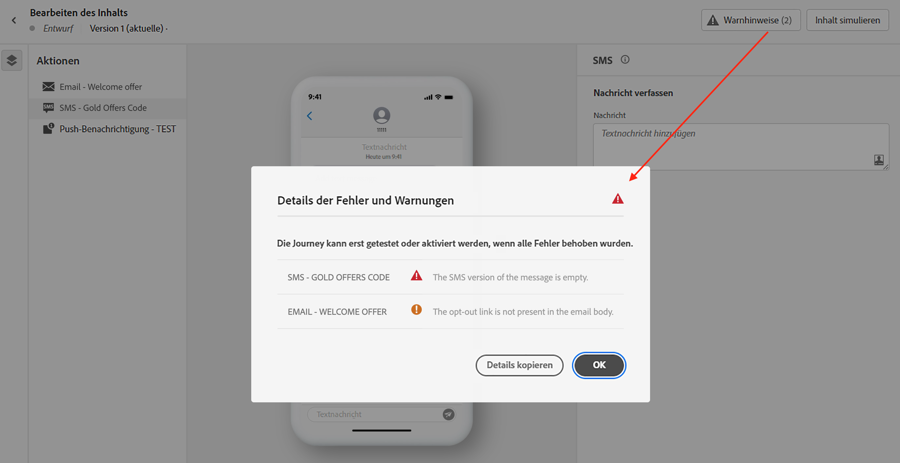

# Erstellen einer SMS-Nachricht {#create-sms}

>[!CONTEXTUALHELP]
>id="ajo_message_sms"
>title="SMS-Erstellung"
>abstract="Fügen Sie eine Textnachricht hinzu und beginnen Sie mit ihrer Personalisierung mithilfe des Ausdruckseditors."

Verwenden Sie [!DNL Journey Optimizer], um Textnachrichten an die mobilen Geräte Ihrer Kunden zu senden. Mit dem SMS-Editor können Sie Nachrichten im Textformat erstellen, personalisieren und in der Vorschau anzeigen.

>[!NOTE]
>
>In Übereinstimmung mit den Branchenstandards und -vorschriften müssen alle SMS-Marketing-Nachrichten eine Möglichkeit für die Empfänger enthalten, ihr Abo einfach zu kündigen. Zu diesem Zweck können SMS-Empfänger mit Keywords zum Opt-in oder Opt-out antworten. [Informationen über die Verwaltung des Opt-outs](../privacy/opt-out.md#sms-opt-out-management-sms-opt-out-management)

SMS-Versand-Erstellung möglich:

* In einer **Journey**: Nachdem eine SMS-Aktivität zur Journey hinzugefügt und die Grundeinstellungen festgelegt wurden, bitte den rechten Bereich **[!UICONTROL Aktionen: SMS]** verwenden, um den Inhalt für die SMS-Nachricht zu erstellen.

   Weitere Informationen zur Konfiguration der Journey auf [dieser Seite](../building-journeys/journey-gs.md).

* In einer **Kampagne**: Nach Erstellen einer Kampagne „SMS“ als Aktion auswählen und die Grundeinstellungen definieren.

   Weitere Informationen zur Konfiguration einer Kampagne auf [dieser Seite](../campaigns/create-campaign.md#configure).

Wenn Sie zum ersten Mal eine SMS erstellen, stellen Sie sicher, dass der SMS-Kanal konfiguriert wurde. [Weitere Informationen](../configuration/sms-configuration.md).

## Definieren Ihres SMS-Inhalts{#sms-content}

Gehen Sie wie folgt vor, um mit der Personalisierung Ihrer SMS-Nachricht zu beginnen:

1. Klicken Sie auf das Feld **[!UICONTROL Nachricht]**, um den Ausdruckseditor zu öffnen.

   

1. Verwenden Sie den Ausdruckseditor, um Inhalte zu definieren und dynamische Inhalte hinzuzufügen. Sie können jedes Attribut verwenden, sowie z. B. Profilnamen oder Stadt. Weitere Informationen zu [Personalisierung](../personalization/personalize.md) und [dynamischen Inhalten](../personalization/get-started-dynamic-content.md) finden Sie im Ausdruckseditor.

1. Klicken Sie auf **[!UICONTROL Speichern]** und überprüfen Sie Ihre Nachricht in der Vorschau.

   

## Validieren Ihrer SMS{#sms-preview}

>[!NOTE]
>
> Zur besseren Zustellbarkeit sollte stets die Telefonnummern in den vom Provider unterstützten Formaten verwendet werden. Beispielsweise unterstützen Twilio und Sinch nur Telefonnummern im E.164-Format.

Sobald der Inhalt der Nachricht erstellt wurde, können Sie mithilfe von Testprofilen eine Vorschau erstellen und einen Testversand durchführen. Wenn [personalisierte Inhalte](../personalization/personalize.md) eingefügt wurden, kann unter Verwendung von Testprofildaten überprüft werden, wie diese Inhalte in der Nachricht angezeigt werden.

Um zu sehen, wie Ihre SMS-Nachricht auf mobilen Geräten angezeigt wird, klicken Sie auf die Registerkarte **[!UICONTROL Inhalt simulieren]**. Weiterführende Informationen zum Simulieren von Inhalten finden Sie in [diesem Abschnitt](../design/preview.md).

Sie müssen auch Warnhinweise im oberen Bereich des Editors überprüfen.  Einige davon sind einfache Warnhinweise, andere können die Verwendung der Nachricht verhindern. Weiterführende Informationen finden Sie in [diesem Abschnitt](alerts.md).

<!--
## How-to video

Learn how to configure, author, and include SMS messaging into your customer journeys.

>[!VIDEO](https://video.tv.adobe.com/v/344460?quality=12)
-->
**Verwandte Themen**

* [Konfigurieren des SMS-Kanals](../configuration/sms-configuration.md)
* [SMS-Bericht](../reports/journey-global-report.md#sms-global)
* [Erstellen einer neuen Nachricht](get-started-content.md)
* [Hinzufügen einer Nachricht zu einer Journey](../building-journeys/journeys-message.md)
