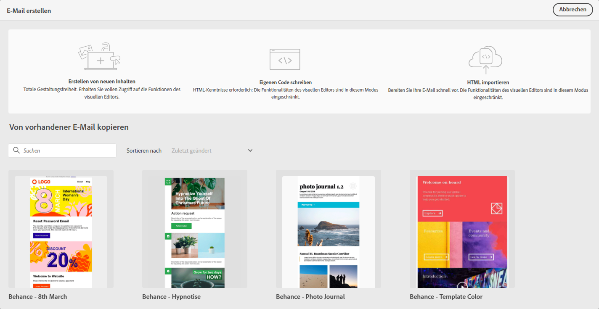

# Erste Schritte beim Gestalten von E-Mails {#get-started-content-design}

Beim Erstellen von E-Mail-Inhalt mit [!DNL Journey Optimizer] haben Sie verschiedene Möglichkeiten:

* **Entwerfen Sie Ihre E-Mail von Grund auf** über die Benutzeroberfläche von Email Designer und nutzen Sie Bilder aus [Adobe Experience Manager Assets Essentials](assets-essentials.md). Erfahren Sie [in diesem Abschnitt](create-email-content.md), wie Sie E-Mail-Inhalt gestalten oder integrierte Vorlagen verwenden.

* **Kodieren oder fügen Sie rohe HTML-Zeilen** direkt in Email Designer ein. Erfahren Sie [in diesem Abschnitt](existing-content.md#import-raw-html-code), wie Sie Ihren eigenen Inhalt kodieren.

* **Importieren Sie vorhandenen HTML-Inhalt** aus einer Datei oder einem .zip-Ordner. Erfahren Sie [in diesem Abschnitt](existing-content.md#import-html-content-from-file), wie Sie E-Mail-Inhalt importieren.

Diese Funktionen stehen beim Aufrufen von Email Designer im Bildschirm „Nachrichtenerstellung“ zur Verfügung. [Weitere Informationen zur Nachrichtenerstellung](create-message.md).

>[!NOTE]
>
>Beachten Sie, dass die Vorlagen im unteren Bereich statisch sind und nicht bearbeitet werden können. Die Vorlagen dienen nur der Illustration.
