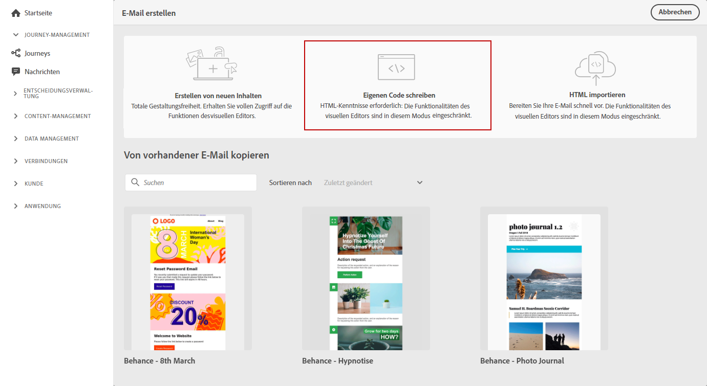
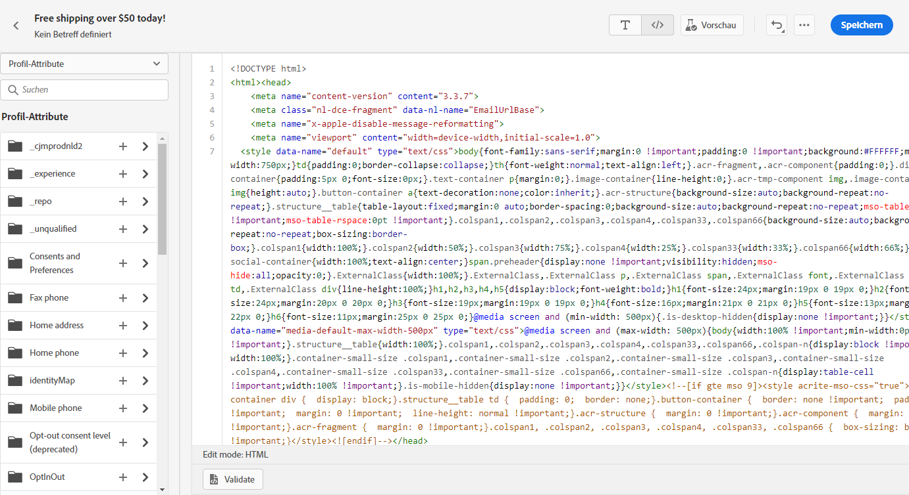
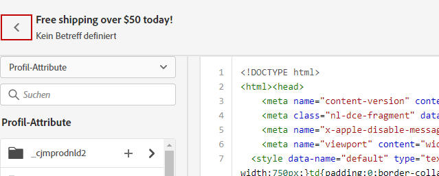
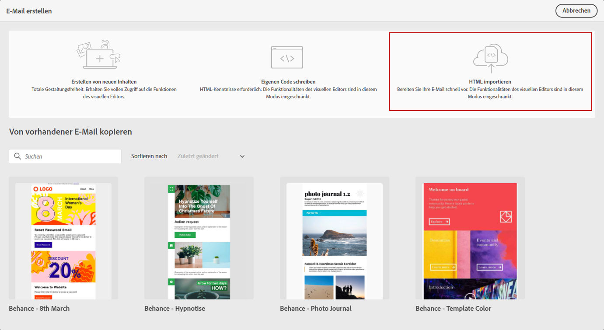
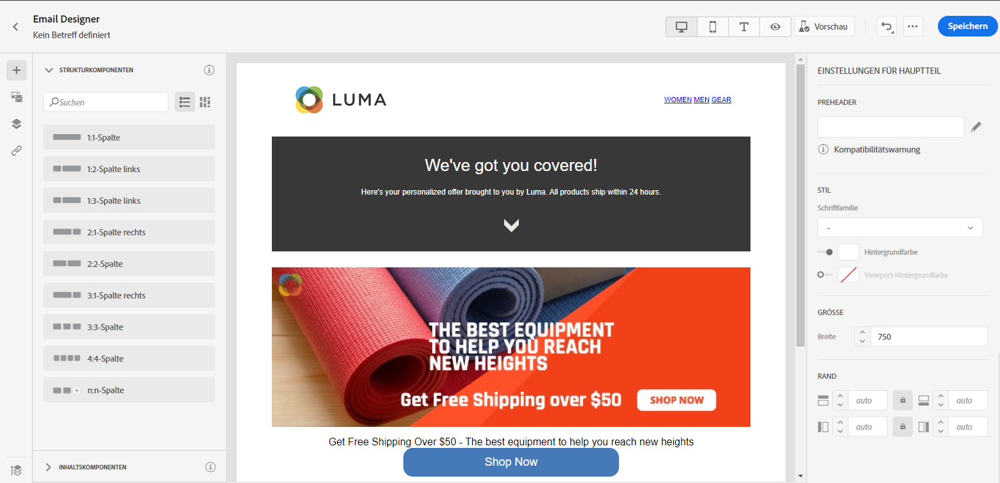

# Importieren oder Codieren Ihres E-Mail-Inhalts {#existing-content}

Mit Journey Optimizer können Sie vorhandenen HTML-Inhalt importieren, um Ihre E-Mails zu gestalten. Bei diesem Inhalt kann es sich um HTML-Roh-Code oder Inhalt aus einer vorhandenen HTML-Datei oder einem ZIP-Ordner handeln.

➡️ [Entdecken Sie diese Funktion im Video](#video).

Gehen Sie wie folgt vor, um HTML-Inhalt zu kodieren oder vorhandenen Inhalt zu importieren:

1. [Erstellen einer Nachricht](create-message.md)

1. Öffnen Sie **[!UICONTROL Email Designer]** im Abschnitt **[!UICONTROL Inhalt bearbeiten]**.

   

1. Wählen Sie **[!UICONTROL Eigenen Code erstellen]** oder **[!UICONTROL HTML importieren]**. Die nächsten Schritte finden Sie in den folgenden Abschnitten.

## Erstellen des eigenen Codes {#import-raw-html-code}

Verwenden Sie den Modus **[!UICONTROL Eigenen Code erstellen]**, um HTML-Roh-Code zu importieren und/oder Ihren E-Mail-Inhalt zu kodieren. Diese Methode setzt HTML-Kenntnisse voraus.

>[!CAUTION]
>
> Bilder von [Adobe Experience Manager Assets Essentials](assets-essentials.md) können bei dieser Methode nicht referenziert werden. Die Bilder, auf die im HTML-Code verwiesen wird, müssen an einem öffentlichen Speicherort abrufbar sein.

1. Wählen Sie in der Startseite von Email Designer die Option **[!UICONTROL Eigenen Code erstellen]**.

   

1. Geben Sie Ihren HTML-Roh-Code ein oder fügen Sie ihn ein.

1. Verwenden Sie den linken Bereich, um die Personalisierungsfunktionen von [!DNL Journey Optimizer] anzuwenden. Weiterführende Informationen hierzu finden Sie in [diesem Abschnitt](../personalization/personalize.md).

   

1. Wenn Sie Email Designer öffnen möchten, um Ihre E-Mail auf der Basis eines neuen Entwurfs zu gestalten, wählen Sie **[!UICONTROL Entwurf ändern]** aus dem Menü „Optionen“.

   

1. Klicken Sie auf die Schaltfläche **[!UICONTROL Vorschau]**, um den Nachrichtenentwurf und die Personalisierung mithilfe von Testprofilen zu überprüfen. Weiterführende Informationen hierzu finden Sie in [diesem Abschnitt](preview.md).

   

1. Wenn Ihr Code fertig ist, klicken Sie auf **[!UICONTROL Speichern]** und kehren Sie dann zurück zum Bildschirm „Nachrichtenerstellung“, um die Nachricht fertigzustellen.

   

## Importieren von HTML {#import-html-content-from-file}

Sie können HTML-Inhalt in Email Designer importieren. Der Inhalt kann vorliegen als

* eine **HTML-Datei** mit integriertem Stylesheet
* ein **komprimierter Ordner** (ZIP) mit HTML-Datei, Stylesheet (.css) und Bildern.

   >[!NOTE]
   >
   >Die Dateistruktur des komprimierten Ordners ist freigestellt. Verweise müssen jedoch relativ sein und mit der Baumstruktur des ZIP-Ordners übereinstimmen.

Gehen Sie wie folgt vor, um eine Datei mit HTML-Inhalt zu importieren:

1. Wählen Sie auf der Startseite von Email Designer die Option **[!UICONTROL HTML importieren]**.

   

1. Ziehen Sie die HTML- oder ZIP-Datei mit Ihrem HTML-Inhalt per Drag-and-Drop.

1. Sobald der HTML-Inhalt hochgeladen wurde, können Sie die Funktionen von Email Designer nutzen, um Ihre E-Mail zu bearbeiten und Vorschauen zu erstellen. [Weiterführende Informationen finden Sie in diesem Abschnitt](create-email-content.md).

   

## Anleitungsvideo {#video}

Erfahren Sie, wie Sie vorhandenen HTML-Inhalt importieren, das Design anpassen, Mirrorseiten- und Abmelde-Links hinzufügen und Ihren Inhalt kodieren können.

>[!VIDEO](https://video.tv.adobe.com/v/334102?quality=12)
