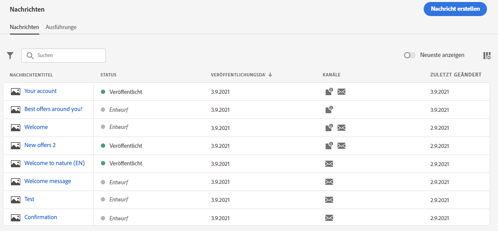
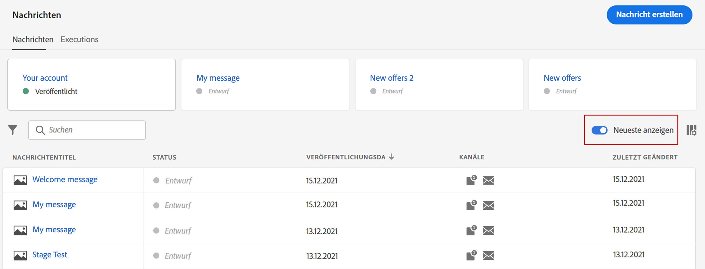
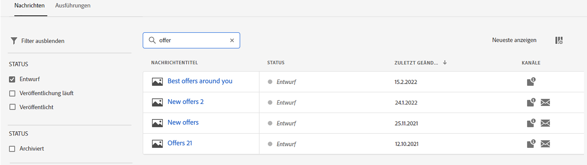
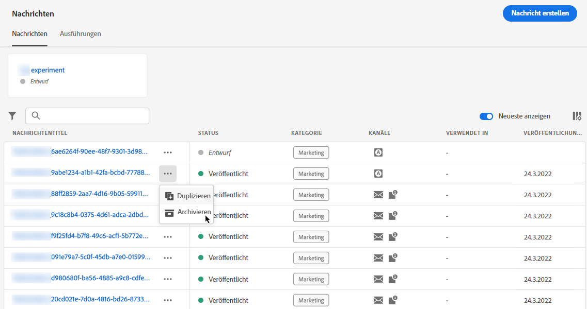
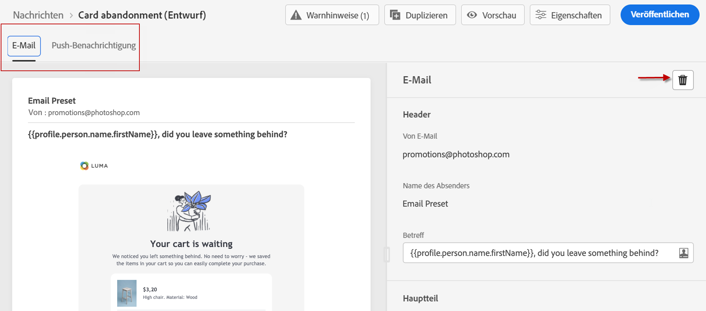
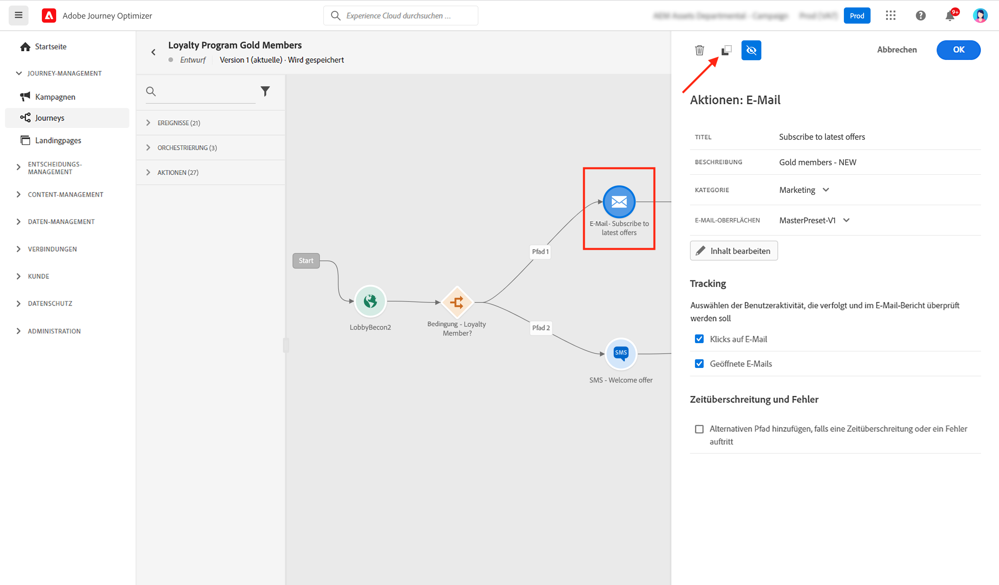
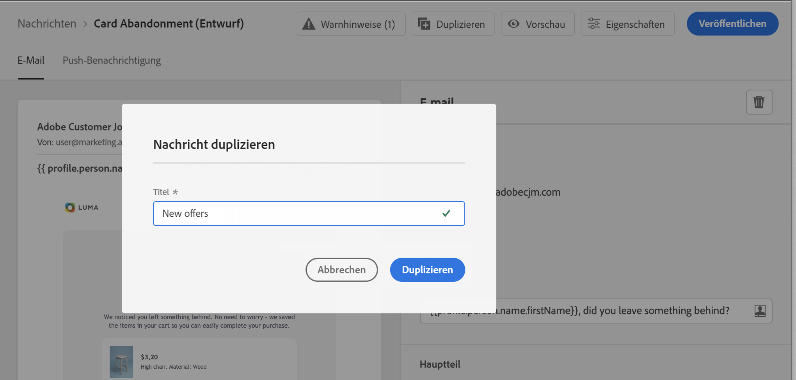
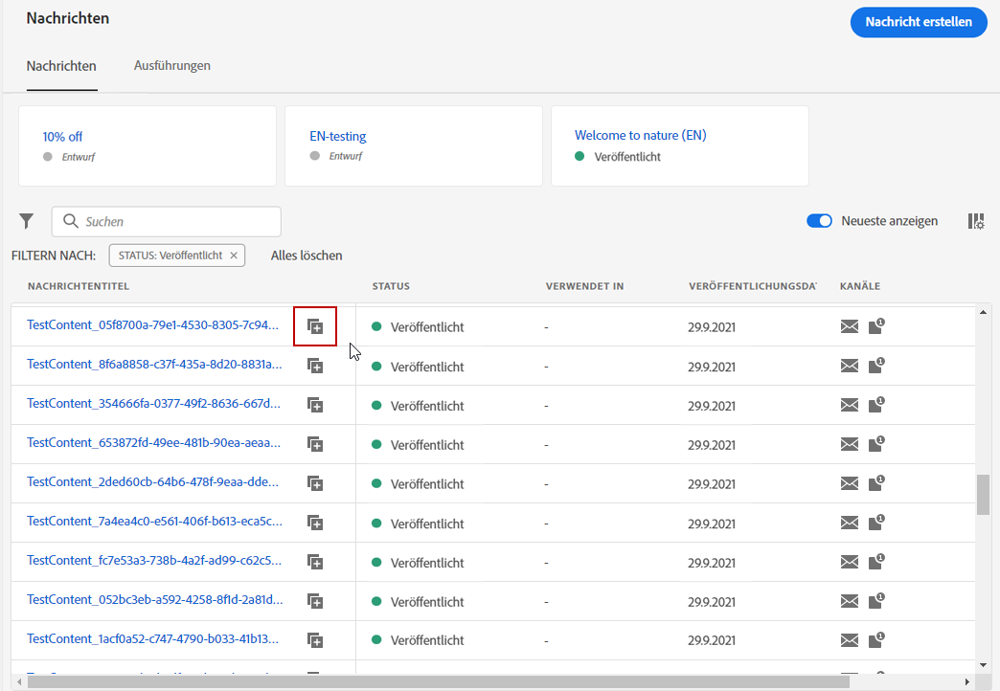

# Erste Schritte mit Nachrichten {#get-started-contents-messages}

Verwenden Sie [!DNL Journey Optimizer], um mehrere Ressourcen wie Assets und Inhalte an einem Ort zu nutzen und personalisierte Push-Benachrichtigungen und E-Mail-Nachrichten zu erstellen und zu veröffentlichen.

* Nutzen Sie **E-Mail-Entwurfsfunktionen** von [!DNL Journey Optimizer], um responsive E-Mails zu erstellen oder zu importieren.

* Nutzen Sie **Adobe Experience Manager Assets Essentials**, um eine eigene Asset-Datenbank zu erstellen und Ihre E-Mails zu ergänzen.

* Verbessern Sie das Kundenerlebnis, indem Sie **personalisierte Push- und E-Mail-Nachrichten** auf der Basis von Kundenprofil-Attributen erstellen.

* **Erstellen Sie Push- und E-Mail-Nachrichten** basierend auf diesen Inhalten und veröffentlichen Sie die Nachrichten.

## Zugriff auf Nachrichten {#access-messages}

Nachrichten sind über den Shortcut **[!UICONTROL Nachrichten]** auf der linken Leiste verfügbar. Alle Nachrichten werden aufgelistet und nach Veröffentlichungsdatum (bei veröffentlichten Nachrichten) oder Erstellungsdatum (bei Nachrichtenentwürfen) sortiert.

>[!NOTE]
>
>Benutzer können je nach ihrem Produktprofil auf Nachrichten zugreifen, Nachrichten erstellen, bearbeiten und/oder veröffentlichen. Weitere Informationen zu Benutzerberechtigungen finden Sie in [diesem Abschnitt](../administration/permissions.md).

* Verwenden Sie den Umschalter **[!UICONTROL Aktuelle Nachrichten anzeigen]**, um den Nachrichten, die Sie in den letzten 5 Tagen geöffnet haben, direkte Links hinzuzufügen.

   

* Klicken Sie auf das Filtersymbol, um nur Entwürfe, bereits veröffentlichte Nachrichten oder in Veröffentlichung befindliche Nachrichten anzuzeigen. Außerdem können Sie nach Nachrichtenbezeichnungen suchen:

   

* Sie können nicht verwendete Nachrichten mithilfe des entsprechenden Symbols im Schnellaktionsmenü archivieren, um die Nachrichtenliste zu löschen.

   

   Verwenden Sie das Filtersymbol, um alle archivierten Nachrichten anzuzeigen, und klicken Sie auf das Symbol **[!UICONTROL Archivierung aufheben]**, um ein Element aus der Liste der archivierten Nachrichten zu entfernen.

   >[!NOTE]
   >
   >Eine archivierte Nachricht kann nicht geöffnet werden. In diesem Fall müssen Sie zunächst die Archivierung aufheben.

## Erstellen einer neuen Nachricht {#create-new-message}

Gehen Sie wie folgt vor, um eine neue Nachricht zu erstellen:

1. Rufen Sie die Nachrichtenliste auf und klicken Sie anschließend auf **[!UICONTROL Nachricht erstellen]**.

1. Definieren Sie die Nachrichteneigenschaften.

   

   * Geben Sie einen **[!UICONTROL Titel]** (obligatorisch) und eine **[!UICONTROL Beschreibung]** ein.

   * Wählen Sie die **[!UICONTROL Nachrichtenkategorie]**: Marketing oder Transaktionsnachricht.

   * Wählen Sie den oder die Kanäle aus, die Sie für diese Nachricht nutzen möchten: E-Mail und/oder Push-Benachrichtigung. Sie müssen mindestens einen Kanal auswählen, um die Nachricht erstellen zu können.
   >[!NOTE]
   >
   >Sie können auf den Link **[!UICONTROL Häufigkeitsregel]** klicken, um die Häufigkeitsregeln anzuzeigen, die für die ausgewählte Kategorie und die ausgewählten Kanäle gelten. Weitere Informationen finden Sie unter [Häufigkeitsregeln](../configuration/frequency-rules.md).

   * Wählen Sie die **[!UICONTROL Voreinstellung]** aus, die für die Nachricht verwendet werden soll.

      Voreinstellungen enthalten alle Parameter, die erforderlich sind, damit eine E-Mail- und/oder Push-Benachrichtigung markenkonform gesendet werden kann. Weitere Informationen finde Sie unter [Voreinstellungen](../configuration/message-presets.md).
   >[!CAUTION]
   >
   >Sie müssen eine gültige Nachrichtenvoreinstellung für die ausgewählte Kategorie und die ausgewählten Kanäle wählen.

   Beachten Sie, dass Sie über die Schaltfläche **[!UICONTROL Eigenschaften]** jederzeit auf Titel, Beschreibung und Voreinstellung der Nachricht zugreifen und diese ändern können.

1. Klicken Sie auf **[!UICONTROL Erstellen]**, um die Nachrichtenerstellung zu bestätigen. Ihre Nachricht wird mit dem Status **[!UICONTROL Entwurf]** der Nachrichtenliste hinzugefügt.

   Für jeden ausgewählten Kanal steht eine Registerkarte zur Verfügung. Mit diesen Registerkarten können Sie den Inhalt für jeden Kanal konfigurieren. Um eine Registerkarte zu entfernen, wählen sie diese aus und klicken auf der rechten Seite auf die Schaltfläche **[!UICONTROL Kanal löschen]**.

   

   <!--
   >[!NOTE]
   >
   >If you enabled the **[!UICONTROL BCC email]** option in the preset, the BCC email address will display under the sender email. [Learn more](../configuration/email-settings.md#bcc-email)
   -->

   Nun können Sie den Inhalt für die Nachricht erstellen und die Einstellungen anpassen. Detaillierte Informationen zur Konfiguration von E-Mails und Push-Benachrichtigungen finden Sie in den folgenden Abschnitten:

   * [Erstellen einer E-Mail](create-email.md)
   * [Erstellen einer Push-Benachrichtigung ](create-push.md)

   >[!NOTE]
   >   
   >Sie können Ihre Nachrichten im Ausdruckseditor anhand der Profildaten personalisieren. Weiterführende Informationen zur Personalisierung finden Sie in [diesem Abschnitt](../personalization/personalize.md).

1. Im Abschnitt „Vorschau“ auf der linken Seite können Sie das Nachrichten-Rendering anpassen und die Personalisierungseinstellungen mithilfe der Testprofile überprüfen. Weiterführende Informationen hierzu finden Sie in [diesem Abschnitt](../design/preview.md).

   

1. Überprüfen Sie Warnhinweise im oberen Abschnitt des Editors.  Einige davon sind einfache Warnhinweise, andere können die Veröffentlichung der Nachricht verhindern. Weiterführende Informationen finden Sie in diesem [Abschnitt](alerts.md).

1. Sie können Ihre Nachricht jetzt veröffentlichen, indem Sie auf die Schaltfläche **[!UICONTROL Veröffentlichen]** klicken, oder die Nachricht als Entwurf speichern und zu einem späteren Zeitpunkt veröffentlichen. Weiterführende Informationen zur Veröffentlichung von Nachrichten finden Sie in [diesem Abschnitt](publish-manage-message.md).

## Duplizieren einer Nachricht {#duplicate-message}

Gehen Sie wie folgt vor, um eine Nachricht aus einer vorhandenen zu erstellen.

1. Öffnen Sie die Nachricht, die Sie kopieren möchten.

1. Verwenden Sie die Schaltfläche **[!UICONTROL Duplizieren]** in der Nachrichtenschnittstelle.

   

   Alle Einstellungen und Konfigurationen werden für die neue Nachricht übernommen.

1. Sie können die Nachricht umbenennen, bevor Sie die Duplizierung bestätigen.

   

1. Eine Bestätigungsmeldung wird am unteren Rand des Fensters angezeigt, sobald die neue Nachricht erstellt wurde.

Sie können eine Nachricht auch aus der Nachrichtenliste duplizieren, indem Sie das entsprechende Symbol im Schnellaktionsmenü verwenden.

Darauf folgt der gleiche Bestätigungsprozess.

