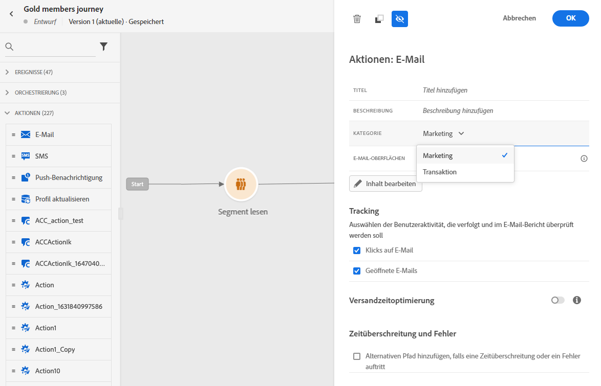
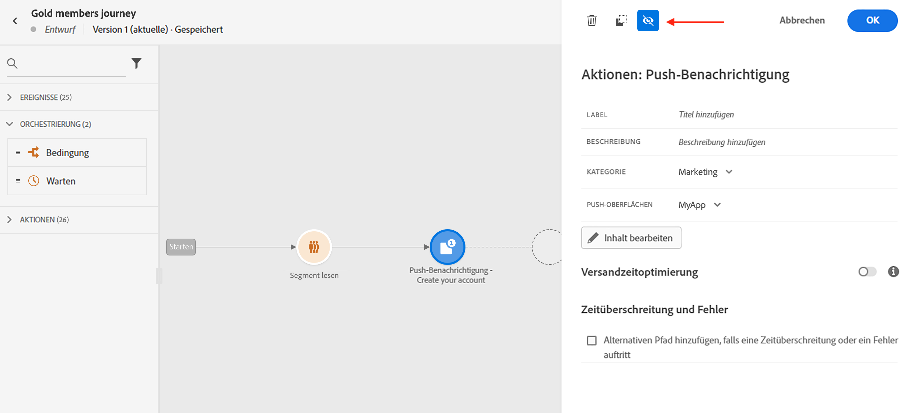
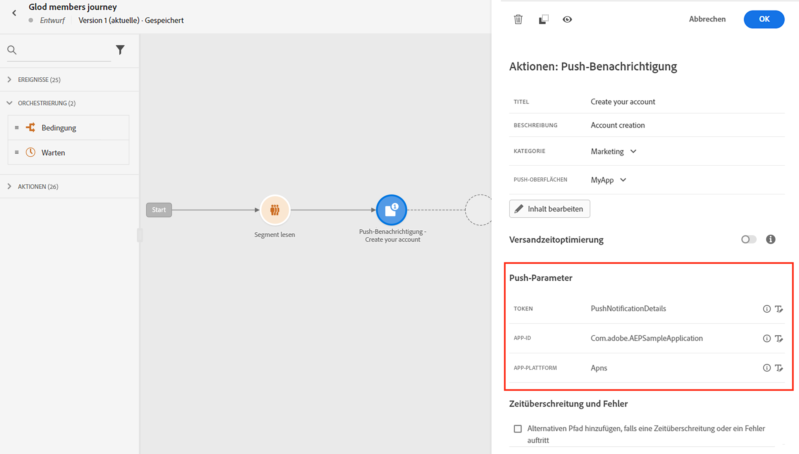
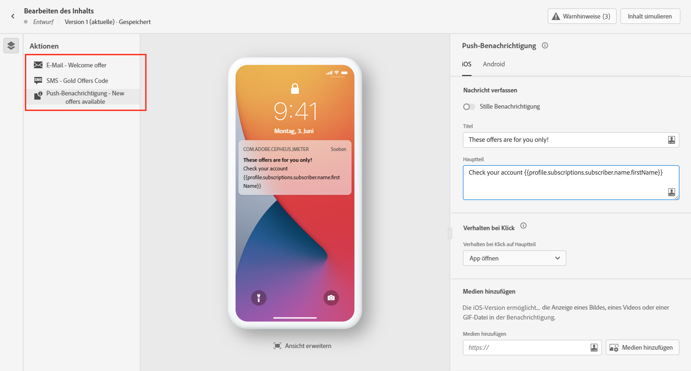
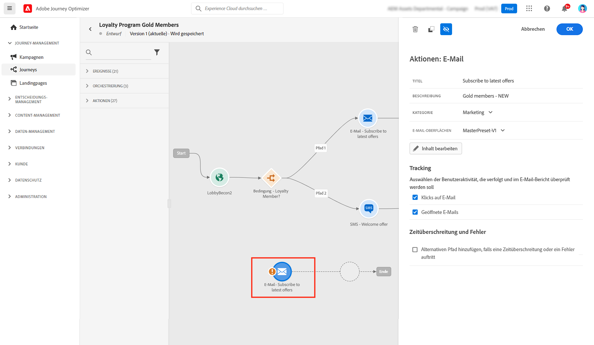
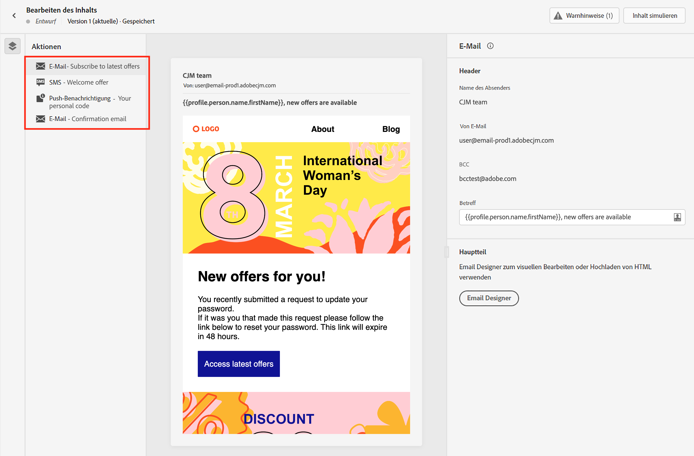
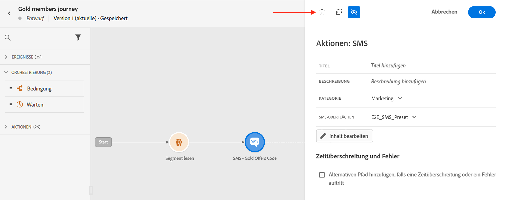

# Erste Schritte mit Nachrichten {#get-started-messages}

>[!CONTEXTUALHELP]
>id="ajo_journey_message"
>title="Kanalaktionen"
>abstract="Verwenden Sie Kanalaktionen, um eine Push-, SMS- oder E-Mail-Nachricht zu senden."

Verwendung [!DNL Journey Optimizer] , um personalisierte Push-Benachrichtigungen, SMS und E-Mail-Nachrichten zu erstellen und zu versenden. Alle Nachrichten können im Rahmen einer Aktion auf der Journey-Arbeitsfläche bearbeitet werden.  Verwenden Sie die Funktion Als Vorlage speichern , um Ihren Inhalt einfach wiederzuverwenden. Sie haben folgende Möglichkeiten:

* Verwendung [!DNL Journey Optimizer] **E-Mail-Designfunktionen** , um responsive E-Mails zu erstellen oder zu importieren.

* Nutzung **Adobe Experience Manager Assets Essentials** um Ihre E-Mails anzureichern, erstellen und verwalten Sie Ihre eigene Asset-Datenbank.

* Suchen **Adobe Stock-Fotos** um Ihren Inhalt zu erstellen und Ihr E-Mail-Design zu verbessern.

* Verbessern des Kundenerlebnisses durch die Erstellung personalisierter **Push-Benachrichtigungen, SMS und E-Mails** basierend auf ihren Profilattributen.

* **Sendungen senden** auf diesen Inhalten basieren und das Kundenverhalten verfolgen.

>[!NOTE]
>
>Benutzer können je nach Produktprofil auf Journey zugreifen, diese erstellen, bearbeiten und/oder veröffentlichen. Weitere Informationen zu Benutzerberechtigungen finden Sie in [diesem Abschnitt](../administration/permissions.md).

## Hinzufügen von Nachrichten in Ihren Journey{#messages-in-journeys}

>[!CONTEXTUALHELP]
>id="ajo_message_category"
>title="Nachrichtenkategorie"
>abstract="Wählen Sie Marketing für kommerzielle Nachrichten oder Transaktionsnachrichten für nicht kommerzielle Nachrichten wie Bestellbestätigungen, Benachrichtigungen beim Zurücksetzen des Kennworts oder Versandinformationen."

>[!CONTEXTUALHELP]
>id="ajo_message_surface"
>title="Kanaloberfläche"
>abstract="Eine Kanaloberfläche ist eine Instanz dieses Kanals, die über alle Einstellungen verfügt, um eine Aktion erfolgreich über eine Kampagne oder eine Journey bereitzustellen. Sie wird von einem Systemadministrator definiert."

Um Nachrichten in Ihren Journey hinzuzufügen, fügen Sie einfach eine Push-, SMS- oder E-Mail-Aktivität in die Journey-Arbeitsfläche ein.

1. Starten Sie Ihre Journey mit einem [Ereignis](../building-journeys/general-events.md) oder [Segment lesen](../building-journeys/read-segment.md) Aktivität.

1. Aus dem **Aktionen** Ziehen Sie einen **email**, und **SMS** oder **Push** -Aktivität in die Arbeitsfläche.

   

1. Geben Sie einen Titel und eine Beschreibung ein.

1. Nachricht auswählen **[!UICONTROL Kategorie]**: Auswählen **Marketing** für kommerzielle Nachrichten oder **Transactional** für nicht kommerzielle Nachrichten wie Bestellbestätigungen, Benachrichtigungen beim Zurücksetzen des Kennworts oder Versandinformationen.

   >[!CAUTION]
   >
   >Wenn Sie [Frequenzregeln](../configuration/frequency-rules.md) für einen bestimmten Kanal und eine bestimmte Kategorie, werden sie bei der Auswahl dieses Kanals und dieser Kategorie automatisch auf die Nachricht angewendet. Derzeit ist nur der **[!UICONTROL Marketing]** -Kategorie für Frequenzregeln verfügbar.

   

   >[!CAUTION]
   >
   >Nachrichten vom Typ Marketing müssen eine [Ausschluss-Link](../messages/consent.md#opt-out-management). Dies ist für Transaktionsnachrichten nicht erforderlich, da diese Nachrichten an Profile gesendet werden können, die sich von Marketing-Nachrichten abgemeldet haben.

1. Kanal auswählen **[!UICONTROL Oberfläche]** (d. h. Nachrichtenvorgabe), die zum Senden Ihrer Nachricht verwendet werden soll.

   Eine Oberfläche ist eine Konfiguration, die durch eine [Systemadministrator](../start/path/administrator.md). Sie enthält alle technischen Parameter zum Senden der Nachricht, wie z. B. Kopfzeilenparameter, Subdomäne, Mobile Apps usw. [Weitere Informationen](../configuration/channel-surfaces.md).

   >[!CAUTION]
   >
   >Sie müssen eine gültige Kanaloberfläche für die ausgewählte Nachrichtenkategorie und den ausgewählten Kanal auswählen.

   Titel, Beschreibung und Oberfläche der Nachricht können jederzeit mit der Variablen **[!UICONTROL Eigenschaften]** in der Nachrichtenschnittstelle.

1. Nachrichteninhalt erstellen.

   Auf der folgenden Seite erfahren Sie, wie Sie Ihren Nachrichteninhalt mit detaillierten Schritten erstellen:

   * [Erstellen einer E-Mail](create-email.md)
   * [Erstellen einer Push-Benachrichtigung](create-push.md)
   * [Erstellen einer SMS-Nachricht](create-sms.md)

## Aktivieren der Sendezeitoptimierung{#sto-in-journeys}

Für E-Mail- und Push-Benachrichtigungen können Sie **[!UICONTROL Sendezeitoptimierung]**.

Verwendung **[!UICONTROL Sendezeitoptimierung]** , um personalisierte Sendezeiten für jeden Benutzer zu planen, um die Öffnungs- und Klickraten Ihrer Nachrichten zu erhöhen. [Weitere Informationen](../messages/send-time-optimization.md).

## Erweiterte Parameter{#adv-settings}

Erweiterte Parameter sind schreibgeschützt und werden standardmäßig ausgeblendet.

Um auf erweiterte Parameter zuzugreifen, klicken Sie auf die Schaltfläche **[!UICONTROL Schreibgeschützte Felder anzeigen]** im oberen Bereich des Nachrichtenfensters.

Erweiterte Parameter werden am unteren Rand des Nachrichtenfensters angezeigt. Diese Parameter werden durch die Variable [Systemadministrator](../start/path/administrator.md) im [Kanaloberfläche](../configuration/channel-surfaces.md) (d. h. Nachrichtenvorgabe), die mit der Nachricht verknüpft ist.

Für Push-Benachrichtigungen können Sie die folgenden Parameter anzeigen: Token, AppID, AppPlatform.

Für E-Mails können Sie die primäre E-Mail-Adresse anzeigen.

Für bestimmte Zwecke können Sie diese Werte in bestimmten Kontexten überschreiben. Um einen Wert zu erzwingen, klicken Sie auf die **Parameterüberschreibungen aktivieren** rechts neben dem Feld. Diese Option kann beispielsweise für Folgendes nützlich sein:

* Testen Sie eine E-Mail, fügen Sie Ihre E-Mail-Adresse hinzu. Nachdem Sie die Journey veröffentlicht haben, wird die E-Mail an Sie gesendet.
* Siehe E-Mail-Adresse der Abonnenten einer Liste. Weitere Informationen finden Sie unter [dieser Anwendungsfall](../building-journeys/message-to-subscribers-uc.md).

Klicken Sie auf dasselbe Symbol, um auf den Standardparameter zurückzusetzen.

## Nachrichten durchsuchen{#browse-message}

Wenn auf einer Journey mehrere Nachrichten verwendet werden, können Sie von der **Inhalt bearbeiten** angezeigt.

Sie können dann [Warnungen überprüfen](alerts.md) und [simulieren](../design/preview.md) jeden Inhalt aus einer einzelnen Ansicht.

## Duplizieren einer Nachricht {#duplicate-message}

Sie können eine vorhandene Nachricht aus der Journey-Arbeitsfläche kopieren.

Gehen Sie dazu wie folgt vor:

1. Wählen Sie die Nachricht aus, die Sie kopieren möchten.

1. Verwenden Sie die **[!UICONTROL Kopieren]** -Schaltfläche in der **[!UICONTROL Aktion]** -Bereich.

   

1. Eingabe **Strg+V** um die Nachricht einzufügen.

   Die Nachricht wird der Journey-Arbeitsfläche hinzugefügt. Alle Einstellungen und Konfigurationen werden für die neue Nachricht übernommen.

   

1. Benennen Sie die Nachricht um, um die ursprüngliche Nachricht von der Kopie zu unterscheiden, z. B. bei der Bearbeitung von Nachrichten, wie unten dargestellt:

   

>[!NOTE]
>
>Bei E-Mails können Sie auch eine vorhandene Nachricht in eine Vorlage umwandeln. [Weitere Informationen](../design/email-templates.md).

## Nachricht löschen{#delete-message}

Um eine Nachricht zu löschen, verwenden Sie das Papierkorbsymbol oben im Aktivitätsbereich für die Kanalaktivität.

Verwenden Sie die **[!UICONTROL Bestätigen]** zu validieren.
