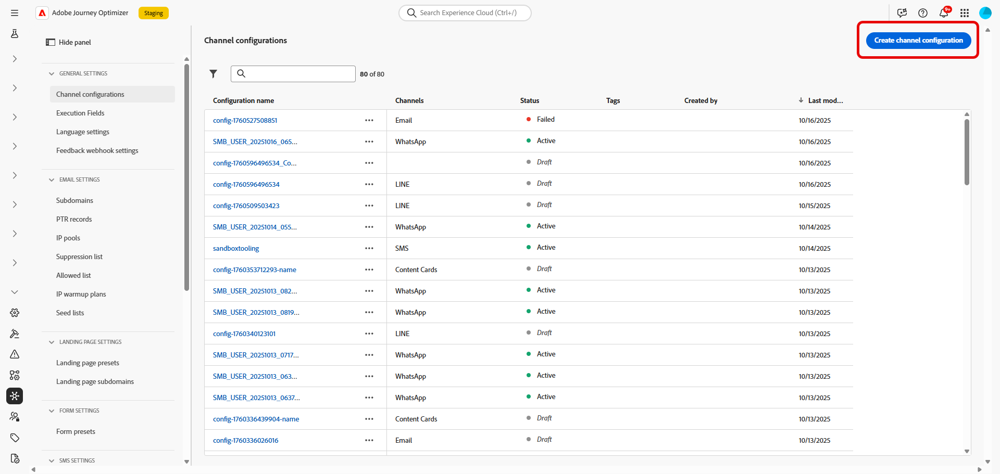

# Erste Schritte mit der Konfiguration von Live-Aktivitäten {#mobile-live-config}

>[!BEGINSHADEBOX]

**Auf dieser Seite:** Richten Sie Ihre Push-Anmeldedaten und die Konfiguration des Live-Aktivitätskanals ein, damit Sie Adobe Journey Optimizer autorisieren können, Echtzeitaktualisierungen an Ihre iOS-App zu senden.

>[!ENDSHADEBOX]

Bevor Sie Live-Aktivitäten senden können, müssen Sie Ihre Adobe Journey Optimizer-Umgebung konfigurieren. Gehen Sie hierfür wie folgt vor:

## Schritt 1: Hinzufügen von App-Push-Anmeldedaten in Journey Optimizer{#push-credentials-launch}

Die Registrierung der App-Push-Anmeldedaten ist erforderlich, um Adobe zu erlauben, Push-Benachrichtigungen in Ihrem Namen zu senden.

Schritt 1 ist optional, wenn Ihre Push-Anmeldedaten bereits konfiguriert wurden, da diese für die Konfiguration des Live-Aktivitätskanals wiederverwendet werden können. Wenn keine Anmeldedaten definiert sind, müssen Sie neue Push-Anmeldedaten für Ihre App erstellen. Gehen Sie wie folgt vor:

1. Öffnen Sie das Menü **[!UICONTROL Kanäle]** > **[!UICONTROL Push-Einstellungen]** > **[!UICONTROL Push-Anmeldedaten]**.

1. Klicken Sie auf **[!UICONTROL Push-Anmeldedaten erstellen]**.

   

1. Wählen Sie aus der Dropdown-Liste **[!UICONTROL Plattform]** das Betriebssystem aus:

1. Geben Sie die **[!UICONTROL App-ID]** der App ein.

   

1. Aktivieren Sie die Option **[!UICONTROL Auf alle Sandboxes anwenden]**, um diese Push-Anmeldedaten für alle Sandboxes verfügbar zu machen. Wenn eine bestimmte Sandbox über eigene Anmeldedaten für dasselbe Platform- und App-ID-Paar verfügt, haben diese Sandbox-spezifischen Anmeldedaten Vorrang.

1. Aktivieren Sie die Schaltfläche **[!UICONTROL Push-Anmeldedaten manuell eingeben]**, um Ihre Anmeldedaten hinzuzufügen.

1. Ziehen Sie die p8-Datei mit dem Apple-Authentifizierungsschlüssel für Push-Benachrichtigungen per Drag-and-Drop in den Arbeitsbereich. Dieser Schlüssel kann von der Seite **Zertifikate**, **Kennungen** und **Profile** abgerufen werden.

1. Geben Sie die **Key ID** an. Dies ist eine 10-stellige Zeichenfolge, die bei der Erstellung des p8-Authentifizierungsschlüssels zugewiesen wurde. Sie finden sie auf der Registerkarte **Schlüssel** auf der Seite **Zertifikate**, **Kennungen** und **Profile**.

1. Geben Sie die **Team ID** an. Dies ist ein Zeichenfolgenwert, der auf der Registerkarte „Abonnement“ zu finden ist.

1. Klicken Sie auf **[!UICONTROL Senden]**, um Ihre App-Konfiguration zu erstellen.

## Schritt 2: Erstellen Sie Ihre Live-Aktivitätskonfiguration {#config-live-activity}

1. Navigieren Sie in der linken Leiste zu **[!UICONTROL Administration]** > **[!UICONTROL Kanäle]** und wählen Sie **[!UICONTROL Allgemeine Einstellungen]** > **[!UICONTROL Kanalkonfigurationen]**. Klicken Sie auf die Schaltfläche **[!UICONTROL Kanalkonfiguration erstellen]**.

   

1. Geben Sie einen Namen und eine Beschreibung (optional) für die Konfiguration ein und wählen Sie dann den Kanal Live-Aktivität aus.

   >[!NOTE]
   >
   > Namen müssen mit einem Buchstaben (A–Z) beginnen. Ein Name darf nur alphanumerische Zeichen enthalten. Sie können auch die Zeichen Unterstrich `_`, Punkt `.` und Bindestrich `-` verwenden.

1. Wählen Sie **[!DNL Live activity]** als Kanal aus.

   

1. Wählen Sie **[!UICONTROL Marketing-Aktion(en)]** aus, um Einverständnisrichtlinien mit den Nachrichten zu verknüpfen, die diese Konfiguration verwenden. Es werden alle mit der Marketing-Aktion verknüpften Einverständnisrichtlinien genutzt, um die Präferenzen Ihrer Kundinnen und Kunden zu respektieren. Weitere Informationen

1. Wählen Sie „iOS“ als **[!UICONTROL Plattform]** aus.

1. Wählen Sie aus der Dropdown-Liste dieselbe **[!UICONTROL App-ID]** wie für Ihre oben konfigurierten [Push-Anmeldedaten](#push-credentials-launch) oder eine vorhandene aus.

   

1. Nachdem alle Parameter konfiguriert wurden, klicken Sie zur Bestätigung auf **[!UICONTROL Senden]**. Sie können die Kanalkonfiguration auch als Entwurf speichern und ihre Konfiguration später fortsetzen.

1. Nachdem die Kanalkonfiguration erstellt wurde, wird sie in der Liste mit dem Status **[!UICONTROL Verarbeitung läuft]** angezeigt.

   >[!NOTE]
   >
   >In [diesem Abschnitt](../configuration/channel-surfaces.md) erfahren Sie mehr über die möglichen Fehlerursachen, wenn die Prüfungen nicht erfolgreich sind.

1. Sobald die Prüfungen erfolgreich abgeschlossen sind, erhält die Kanalkonfiguration den Status **[!UICONTROL Aktiv]**. Sie kann nun zum Versand von Nachrichten verwendet werden.

Sie können jetzt die Integration mit Adobe Experience Platform Mobile SDK starten, um dynamische Echtzeit-Aktualisierungen auf dem Sperrbildschirm und auf der Dynamic Island zu ermöglichen.

➡️ [Weitere Informationen zur Integration von Adobe Experience Platform Mobile SDK](mobile-live-configuration-sdk.md)

>[!TIP]
>
>Wenn bei der Konfiguration oder dem Versand von Live-Aktivitäten Probleme auftreten, finden Sie unter [Fehlerbehebung bei Live-Aktivitäten](troubleshoot-mobile-live.md) Informationen zu den Debugging-Schritten.