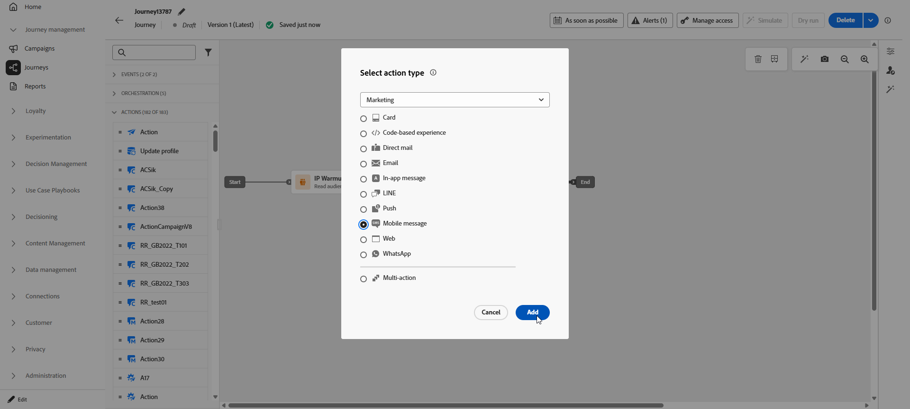
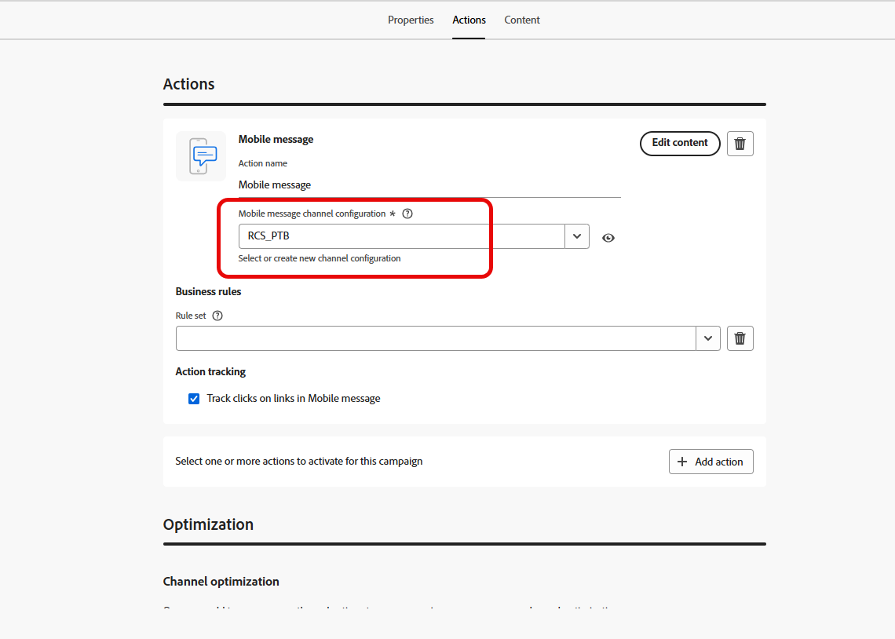
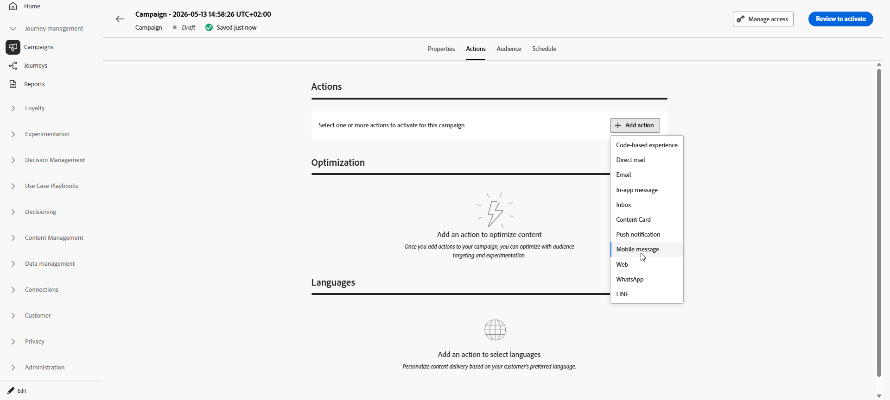

# Erstellen einer Mobile-Nachricht {#create-sms}

>[!CONTEXTUALHELP]
>id="ajo_message_sms"
>title="Erstellen einer Textnachricht"
>abstract="Um eine Nachricht für Mobilgeräte zu erstellen, fügen Sie eine SMS-Aktion in einer Journey oder einer Kampagne hinzu und beginnen Sie mit der Personalisierung mit dem Personalisierungseditor."

>[!AVAILABILITY]
>
>RCS ist kein HIPAA-fähiger Service und darf nicht zur Erfassung, Speicherung oder Verarbeitung sensibler personenbezogener Daten verwendet werden, einschließlich zulässiger Gesundheitsdaten, z. B. persönlicher Gesundheitsinformationen, die Ihr Unternehmen ansonsten möglicherweise in Journey Optimizer verarbeiten darf.

Mit Adobe Journey Optimizer können Sie Text- (SMS), Rich Communication- (RCS) und Multimedia-Nachrichten (MMS) entwerfen und versenden. Zunächst müssen Sie eine Aktion für Mobilnachrichten in einer Journey oder einer Kampagne hinzufügen und dann den Inhalt der Textnachricht definieren, wie unten beschrieben. Adobe Journey Optimizer bietet auch die Möglichkeit, Ihre Textnachrichten vor dem Versand zu testen, sodass Sie das Rendering, die Personalisierungsattribute und alle anderen Einstellungen überprüfen können.

In Übereinstimmung mit den Branchenstandards und -vorschriften müssen alle SMS/MMS-Marketing-Nachrichten eine Möglichkeit für die Empfängerinnen und Empfänger enthalten, ihr Abo einfach zu kündigen. Zu diesem Zweck können SMS-Empfänger mit Keywords zum Opt-in oder Opt-out antworten. [Informationen über die Verwaltung des Opt-outs](../privacy/opt-out.md#opt-out-decision-management)

## Hinzufügen einer Textnachricht {#create-sms-journey-campaign}

Auf den folgenden Registerkarten erfahren Sie, wie Sie eine Mobile-Nachricht zu einer Kampagne oder einer Journey hinzufügen.

>[!BEGINTABS]

>[!TAB Hinzufügen einer Textnachricht zu einer Journey]

1. Öffnen Sie Ihren Journey und ziehen Sie eine **[!UICONTROL Aktion]**-Aktivität per Drag-and-Drop aus dem Bereich **[!UICONTROL Aktionen]** der Palette. Weitere Informationen über die [Aktionsaktivität](../building-journeys/journey-action.md).

   >[!IMPORTANT]
   >
   >Ältere native Kanalaktivitäten (E-Mail, Push, SMS, In-App, Web, Code-basiertes Erlebnis und Inhaltskarte) werden seit der Version vom März 2026 nicht mehr unterstützt. Vorhandene Journey, die diese Aktivitäten verwenden, funktionieren weiterhin unverändert - es ist keine Migration erforderlich.

1. Wählen Sie **[!UICONTROL Aktionstyp]** Nachricht für Mobilgeräte“ aus und klicken Sie auf **[!UICONTROL Hinzufügen]**.

   

1. Geben Sie einen **[!UICONTROL Titel]** ein, um Ihre Aktion auf der Journey-Arbeitsfläche zu identifizieren.

1. Klicken Sie auf **[!UICONTROL Schaltfläche „Aktion konfigurieren]**.

1. Sie werden zur Registerkarte **[!UICONTROL Aktionen]** geleitet. Wählen oder erstellen Sie von dort aus die zu verwendende Mobile-Nachrichtenkonfiguration. [Weitere Informationen](mobile-configuration.md)

   

1. Darüber hinaus können Sie Begrenzungsregeln auf Ihre Mobile-Nachrichtenaktion anwenden, indem Sie einen Regelsatz in der Dropdown-Liste **[!UICONTROL Geschäftsregeln]** auswählen. [Weitere Informationen](../conflict-prioritization/channel-capping.md)

1. Klicken Sie auf die **[!UICONTROL Inhalt bearbeiten]** und erstellen Sie den Inhalt nach Bedarf. [Weitere Informationen](design-mobile.md)

1. Zurück zur Journey-Arbeitsfläche. Schließen Sie bei Bedarf Ihren Journey-Fluss ab, indem Sie zusätzliche Aktionen oder Ereignisse per Drag-and-Drop verschieben. [Weitere Informationen](../building-journeys/about-journey-activities.md)

Weitere Informationen zum Erstellen, Konfigurieren und Veröffentlichen einer Journey finden Sie auf [dieser Seite](../building-journeys/journey-gs.md).

>[!TAB Hinzufügen einer Textnachricht zu einer Kampagne]

1. Rufen Sie das Menü **[!UICONTROL Kampagnen]** auf und klicken Sie auf **[!UICONTROL Kampagne erstellen]**.

1. Wählen Sie den Typ der Kampagne aus, die Sie ausführen möchten.

   * **Geplant – Marketing**: die Kampagne wird sofort oder an einem bestimmten Datum ausgeführt. Geplante Kampagnen dienen dem Versand von Marketing-Nachrichten. Sie werden über die Benutzeroberfläche konfiguriert und ausgeführt.

   * **API-ausgelöst – Marketing/Transaktion**: die Kampagne wird mithilfe eines API-Aufrufs ausgeführt. Durch API ausgelöste Kampagnen zielen auf den Versand von Marketing- oder Transaktionsnachrichten ab, d. h. Nachrichten, die aufgrund einer von einem Kontakt durchgeführten Aktion gesendet werden: Zurücksetzen des Passworts, Warenkorbkauf usw.

1. Bearbeiten Sie im Bereich **[!UICONTROL Eigenschaften]** den **[!UICONTROL Titel]** und die **[!UICONTROL Beschreibung]** Ihrer Kampagne.

1. Klicken Sie auf der **[!UICONTROL Aktion]** auf **[!UICONTROL Aktion hinzufügen]** und wählen Sie **[!UICONTROL Nachricht für Mobilgeräte]**. Wählen oder erstellen Sie dann eine neue Konfiguration.

   Weitere Informationen zur Konfiguration mobiler Nachrichten finden Sie auf [dieser Seite](mobile-configuration.md).

   

1. Klicken Sie auf **[!UICONTROL Experiment erstellen]**, um mit der Konfiguration Ihres Inhaltsexperiments zu beginnen und Abwandlungen zu erstellen, deren Performance zu messen und die beste Option für Ihre Zielgruppe zu ermitteln. [Weitere Informationen](../content-management/content-experiment.md)

1. Geben **[!UICONTROL im Abschnitt]** an, ob Sie Klicks auf Links in Ihrer Mobile-Nachricht verfolgen möchten.

1. Klicken Sie auf der Registerkarte **[!UICONTROL Audience]** auf die Schaltfläche **[!UICONTROL Audience auswählen]**, um die Audience aus der Liste der verfügbaren Adobe Experience Platform-Audiences zu definieren. [Weitere Informationen](../audience/about-audiences.md).

1. Wählen Sie im Feld **[!UICONTROL Identity-Namespace]** den Namespace aus, der zur Identifizierung der Personen in der ausgewählten Zielgruppe verwendet werden soll. [Weitere Informationen](../event/about-creating.md#select-the-namespace).

1. Auf der Registerkarte **[!UICONTROL Zeitplan]** können Sie Kampagnen so entwerfen, dass sie an einem bestimmten Datum oder in regelmäßigen Abständen ausgeführt werden. Erfahren Sie in [diesem Abschnitt](../campaigns/campaign-schedule.md#action-campaign-schedule), wie Sie den **[!UICONTROL Zeitplan]** der Kampagne konfigurieren können.

1. Wählen Sie im Menü **[!UICONTROL Aktionsnachrichten]** die **[!UICONTROL Häufigkeit]** Ihrer Mobiltelefonnachricht aus:

   * Einmal
   * Täglich
   * Wöchentlich
   * Monat

Sie können jetzt mit der Erstellung des Inhalts Ihrer Textnachricht beginnen, indem Sie die Schaltfläche **[!UICONTROL Inhalt bearbeiten]** anklicken, wie unten beschrieben. [Weitere Informationen](design-mobile.md)

Weitere Informationen zum Erstellen, Konfigurieren und Aktivieren einer Kampagne finden Sie auf [&#x200B; Seite](../campaigns/get-started-with-campaigns.md).

>[!ENDTABS]

**Verwandte Themen**

* [Gestalten einer Mobile-Nachricht](design-mobile.md)
* [Hinzufügen einer Nachricht in einer Kampagne](../campaigns/create-campaign.md)
* [Vorschau, Test und Versand Ihrer Textnachricht](send-mobile-message.md)
* [Konfigurieren des mobilen Nachrichtenkanals](mobile-configuration.md)
* [Mobile-Nachrichtenberichte](../reports/journey-global-report-cja-sms.md)

