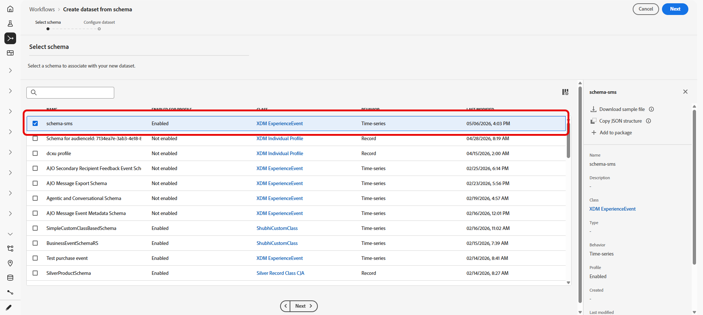
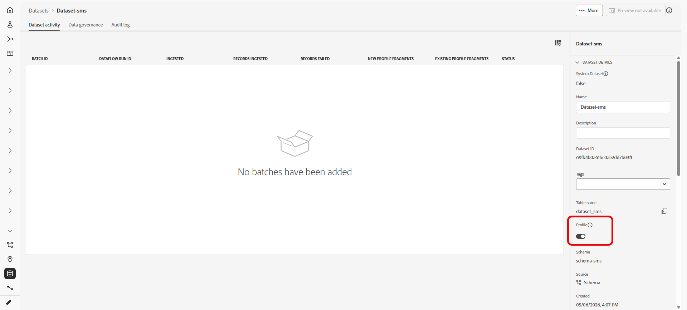

# Benutzerdefinierten Datensatz für eingehende Keywords verwenden {#custom-dataset-inbound-keywords}

Eingehende SMS-Schlüsselwörter können in einem profilaktivierten benutzerdefinierten Datensatz gespeichert werden. Die Konfiguration besteht aus einem Adobe Experience Platform-Schema, einem aus diesem Schema erstellten Datensatz und Journey Optimizer SMS-API-Anmeldeinformationen, die auf den Datensatz für eingehende Nachrichten verweisen.

>[!NOTE]
>
>Wenn kein benutzerdefinierter Datensatz konfiguriert ist, werden eingehende Keywords standardmäßig im Ereignisdatensatz für eingehende Aktivitäten des Systems _AJO_ gespeichert. Ein Profil muss über mindestens eine von [!DNL Journey Optimizer] gesendete Nachricht verfügen, bevor eingehende Nachrichten in diesem Datensatz erfasst werden. [Weitere Informationen zu Systemdatensätzen](../data/get-started-datasets.md#system-datasets)

Hintergrundinformationen zu Schemata, Feldergruppen und Datensätzen finden Sie in der folgenden Dokumentation zu Adobe Experience Platform:

* [XDM-System – Übersicht](https://experienceleague.adobe.com/docs/experience-platform/xdm/home.html?lang=de){target="_blank"}
* [Grundlagen der Schema-Komposition](https://experienceleague.adobe.com/docs/experience-platform/xdm/schema/composition.html?lang=de){target="_blank"}
* [Datensätze – Übersicht](https://experienceleague.adobe.com/docs/experience-platform/catalog/datasets/overview.html?lang=de){target="_blank"}

Um einen benutzerdefinierten Datensatz für ein eingehendes Keyword zu verwenden, müssen Sie:

1. [Erstellen eines Schemas](#create-schema)
1. [Erstellen eines Datensatzes](#create-dataset)
1. [Konfigurieren von API-Anmeldeinformationen](#configure-api-credentials)

## Erstellen eines Schemas {#create-schema}

Ein Schema definiert die Struktur und die Validierungsregeln, die für aufgenommene Daten gelten. Erstellen Sie ein Erlebnisereignis-Schema für die Erfassung eingehender Keywords, indem Sie die unten aufgeführten vorhandenen Feldergruppen hinzufügen.

➡️ [Weitere Informationen zur Schemaerstellung finden Sie in der Dokumentation zu Adobe Experience Platform](https://experienceleague.adobe.com/de/docs/experience-platform/xdm/schema/composition)

1. Greifen Sie in Adobe Experience Platform über **[!UICONTROL Daten-Management]** auf **[!UICONTROL Schemata]** zu und wählen Sie **[!UICONTROL Schema erstellen]**.

   

1. Wählen Sie **[!UICONTROL Standardschema]** aus.

1. Wählen Sie **[!UICONTROL Erlebnisereignis]** aus.

   

1. Geben Sie einen **[!UICONTROL Anzeigenamen]** für das Schema ein und klicken Sie auf **[!UICONTROL Beenden]**.

   Das Schema wird gespeichert und der Schema-Editor wird geöffnet.

1. Öffnen Sie **[!UICONTROL Schemaeigenschaften]** und aktivieren Sie das Schema für **[!UICONTROL Profil]**.

   

1. Fügen **[!UICONTROL in &quot;]**&quot; die folgenden vorhandenen Feldergruppen hinzu:

   * [!DNL Adobe CJM ExperienceEvent - Message interaction details]
   * [!DNL Adobe CJM ExperienceEvent - Message Execution Details]
   * [!DNL Adobe CJM ExperienceEvent - Message Profile Details]

1. Klicken Sie auf **[!UICONTROL Speichern]**.

## Erstellen eines Datensatzes {#create-dataset}

Ein Datensatz ist der Speicher-Container für aufgenommene Daten. Jeder Datensatz ist genau einem Schema zugeordnet und die in den Datensatz geschriebenen Datensätze müssen diesem Schema entsprechen.

1. Greifen Sie in Adobe Experience Platform über **[!UICONTROL Daten-Management]** auf **[!UICONTROL Datensätze]** zu und wählen Sie **[!UICONTROL Datensatz erstellen]**.

   

1. Wählen Sie **[!UICONTROL Datensatz aus Schema erstellen]** aus.

1. Wählen Sie das im vorherigen Abschnitt erstellte Schema aus und klicken Sie auf **[!UICONTROL Weiter]**.

   

1. Geben Sie einen **[!UICONTROL Namen]** ein und klicken Sie auf **[!UICONTROL Beenden]**.

1. Aktivieren Sie auf der Registerkarte **[!UICONTROL Datenaktivität]** die Option Daten für **[!UICONTROL Profil]**.

   Wählen Sie die **[!UICONTROL Datenaufbewahrungs]**-Richtlinie, die den Anforderungen der Unternehmensführung entspricht.

   

1. Klicken Sie auf **[!UICONTROL Speichern]**.

## Konfigurieren von API-Anmeldeinformationen {#configure-api-credentials}

Konfigurieren Sie die Anmeldedaten entsprechend Ihrem SMS-Provider mit [Erste Schritte mit der SMS-/MMS-/RCS-Konfiguration](mobile-configuration.md). Führen Sie dann die folgenden Schritte aus, um den benutzerdefinierten eingehenden Datensatz auszuwählen.

1. Navigieren Sie in der linken Leiste zu **[!UICONTROL Administration]** > **[!UICONTROL Kanäle]** `>` **[!UICONTROL SMS-Einstellungen]** und wählen Sie das Menü **[!UICONTROL API-Anmeldedaten]**. Klicken Sie auf die Schaltfläche **[!UICONTROL Neue API-Anmeldedaten erstellen]**.

1. Erstellen oder bearbeiten Sie Anmeldeinformationen je nach Anbieter.

1. Aktivieren Sie **[!UICONTROL Option Benutzerdefinierten Datensatz für eingehende]** verwenden .

1. Wählen Sie den **[!UICONTROL Datensatz]** aus, der im vorherigen Abschnitt erstellt wurde.

   

1. Füllen Sie alle verbleibenden erforderlichen Felder aus und klicken Sie auf **[!UICONTROL Speichern]**.

   >[!NOTE]
   >
   >Beim Speichern der API-Anmeldeinformationen überprüft Journey Optimizer, ob der Datensatz für eingehende Keywords korrekt konfiguriert ist. Wenn die Validierung fehlschlägt, wird eine Fehlermeldung angezeigt, die auf die erforderliche Korrektur hinweist.

Nach dem Speichern der Anmeldeinformationen bleibt das Verhalten für ausgehende und eingehende Nachrichten unverändert. Eingehende Keywords für diese Anmeldeinformationen werden im ausgewählten benutzerdefinierten Datensatz aufgezeichnet.
