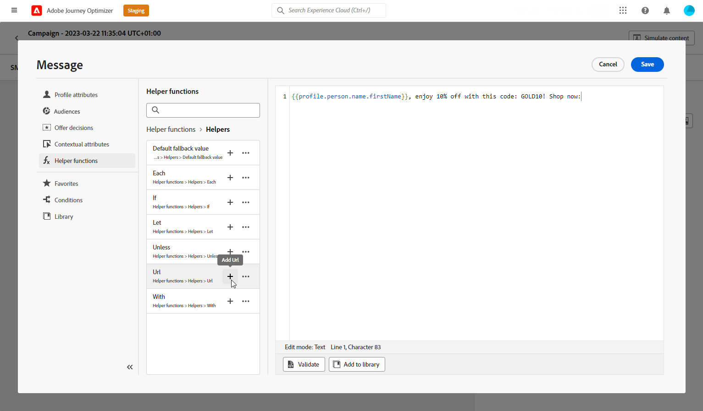
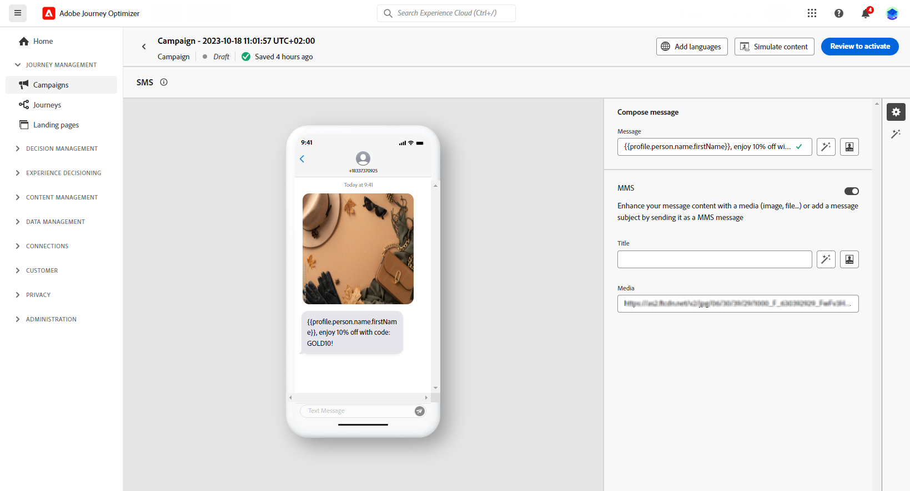

# Gestalten einer Mobile-Nachricht {#design-mobile}

Mit Adobe Journey Optimizer können Sie Text- (SMS), Rich-Communication- (RCS) und Multimedia-Nachrichten (MMS) entwerfen und senden. Zunächst müssen Sie eine Aktion für Mobilnachrichten in einer Journey oder einer Kampagne hinzufügen und dann den Inhalt der Mobilnachricht definieren, wie unten beschrieben. Adobe Journey Optimizer bietet außerdem Funktionen zum Testen Ihrer Mobile-Nachrichten vor dem Senden, damit Sie das Rendering, die Personalisierungsattribute und alle anderen Einstellungen überprüfen können.

In Übereinstimmung mit den Branchenstandards und -vorschriften müssen alle SMS-/RCS-/MMS-Marketing-Nachrichten eine Möglichkeit enthalten, mit der sich die Profile einfach abmelden können. Dazu können SMS-Profile mit Keywords zum Opt-in oder Opt-out antworten. [Informationen über die Verwaltung des Opt-outs](../privacy/opt-out.md#opt-out-decision-management)

## RCS-Inhalt definieren{#rcs-content}

Mit RCS können Sie visuell ansprechende Nachrichten mit Bildern, Videos, Karussells und interaktiven Schaltflächen senden, die über die native Messaging-App auf unterstützten Geräten bereitgestellt werden. Nachrichten werden von einem markenspezifischen, verifizierten Absender gesendet. Wenn das Gerät oder der Provider eines Profils RCS nicht unterstützt, greift Journey Optimizer automatisch auf eine Standard-SMS zurück.

Jede RCS-Nachricht erfordert einen **[!UICONTROL Standard-Fallback-Text]**: eine SMS-Version im Klartext, die an Profile gesendet wird, deren Gerät oder Provider RCS nicht unterstützt. Eine Kampagne kann ohne sie nicht aktiviert werden.

Beachten Sie beim Schreiben von Fallback-Text Folgendes:

* **Halten Sie es kurz.** SMS-Nachrichten sind auf 160 Zeichen pro Segment beschränkt. Längere Nachrichten sind in mehrere Teile aufgeteilt und können zusätzliche Kosten verursachen.
* **Schließen Sie wichtige URLs ein.** Wenn Ihre RCS-Nachricht über Aktionsschaltflächen mit einer URL verknüpft ist, fügen Sie dem Fallback-Text eine gekürzte URL hinzu, damit SMS-Profile weiterhin das Ziel erreichen können.
* **RCS-Referenzen vermeiden.** Erwähnen Sie keine Visualisierungen, Karussells oder interaktiven Funktionen, die nicht in normalen SMS verfügbar sind.
* **Personalization wird unterstützt.** Sie können Personalisierungs-Token im Fallback-Text verwenden, um die Nachricht über beide Versionen hinweg konsistent zu halten.

Gehen Sie wie folgt vor, um den Inhalt Ihrer RCS-Nachricht festzulegen.

1. Wählen Sie im Bedienfeld „Authoring“ Ihren **[!UICONTROL Content-Typ]**:

   +++ Text

   Ein Textkörper mit optionalen interaktiven Schaltflächen. Optimiert für Benachrichtigungen, Warnhinweise, Erinnerungen und Konversationsflüsse, bei denen keine Visualisierungen erforderlich sind.

   +++

   +++ Medien

   Ein eigenständiges Bild oder Video mit optionalem Text und interaktiven Schaltflächen. Verwenden Sie sie, wenn ein einzelnes visuelles Element (ein Produktbild, ein Banner oder ein Videoclip) im Mittelpunkt Ihrer Nachricht steht.

   1. Geben Sie im Kopfzeilenmenü eine **[!UICONTROL Medien-URL]** ein, die auf das anzuzeigende Bild oder Video verweist.

   1. Wenn es sich bei dem Medium um eine Videodatei handelt, geben Sie optional eine **[!UICONTROL Miniatur-URL]** ein.

   +++

   +++ Karte

   Eine strukturierte Karte, die ein Bild oder Video, einen Titel, einen Textkörper und Aktionsschaltflächen kombiniert. Verwenden Sie sie, um ein Produkt, ein Angebot oder ein Inhaltselement in einem Markenformat zu präsentieren.

   1. Geben Sie **[!UICONTROL Titel]** und **[!UICONTROL Beschreibung]** ein.

   1. Geben Sie eine **[!UICONTROL Medien-URL]** ein, die auf das anzuzeigende Bild oder Video verweist.

   1. Wenn es sich bei dem Medium um eine Videodatei handelt, geben Sie optional eine **[!UICONTROL Miniatur-URL]** ein.

   +++

   +++ Karussell

   Eine horizontal scrollbare Reihe von Rich-Karten in einer einzigen Nachricht, jede mit einem eigenen Bild, Titel, Beschreibung und Schaltflächen. Ideal für Produktkataloge oder Werbeaktionen. Es sind mindestens 2 Karten erforderlich.

   1. Wählen Sie eine **[!UICONTROL Kartenbreite]**, um die Anzeigebreite jeder Karte zu steuern.
   1. Geben Sie für jede Karte einen **[!UICONTROL Titel]** und **[!UICONTROL Beschreibung]** ein.

   1. Geben Sie eine **[!UICONTROL Medien-URL]** ein, die auf das Bild oder Video für diese Karte verweist.

   1. Wählen Sie optional eine **[!UICONTROL Medienhöhe]** aus und fügen Sie vorgeschlagene Aktionsschaltflächen hinzu.

   +++

   +++ Standort

   Sendet eine Zuordnungs-Pin an einen Satz von Koordinaten, die als Inline-Zuordnungs-Vorschau im Messaging-Thread des Profils angezeigt werden. Verwenden Sie diese Option zum Freigeben einer Store-Adresse, eines Veranstaltungsortes oder eines Servicebereichs.

   1. Geben Sie die Dezimalzahl **[!UICONTROL Breitengrad]** und **[!UICONTROL Längengrad]** des Speicherorts ein.

   1. Geben Sie optional einen **[!UICONTROL Ortsnamen]** ein, der als Beschriftung auf dem Zuordnungspin angezeigt werden soll.

   +++

1. Geben **[!UICONTROL im Feld]** Nachricht“ den Nachrichteninhalt ein. Sie können Personalisierung verwenden, um den Text an jedes Profil anzupassen. Beachten Sie, dass die Zeichenbeschränkungen je nach Nachrichtentyp variieren: 3.072 Zeichen für Rich Media (Single) und 160 Zeichen für Basic RCS.

1. Verwenden Sie den **[!UICONTROL Personalization]** Editor, um Inhalte zu definieren, Personalisierung und dynamische Inhalte hinzuzufügen. Sie können jedes Attribut verwenden, wie etwa Profilname oder Stadt. Sie können auch bedingte Regeln definieren.

1. Fügen Sie optional **[!UICONTROL Vorgeschlagene Aktionen]**, interaktive Schaltflächen hinzu, mit denen Profile mit einem einzigen Tippen reagieren können.

1. Geben Sie **[!UICONTROL Ihrer]** Aktion **[!UICONTROL einen]** ein.

1. Wählen Sie Ihren **[!UICONTROL Aktionstyp]**:

   * **[!UICONTROL Antwort]**: sendet eine vordefinierte Textantwort im Namen des Profils zurück an den RCS Agenten. Verwenden Sie diese Option, um Absichten zu erfassen, Gesprächsflüsse zu fördern oder Trigger nachgelagerte Journey-Ereignisse zu erfassen. Es sind keine zusätzlichen Felder erforderlich. Der Antworttext entspricht der Schaltflächenbeschriftung.

   * **[!UICONTROL URL öffnen]**: Leitet das Profil zu einer Web-Seite, einem Deep-Link oder einem In-App-Ziel weiter. Unterstützt Personalisierungs-Token und UTM-Tracking-Parameter, z. B. `https://www.example.com/offers?id={{profile.userId}}`.

   * **[!UICONTROL Telefonnummer wählen]**: Öffnet den Gerätewähler mit einer vorausgefüllten Telefonnummer, die vom Profil angerufen werden kann.

   * **[!UICONTROL Standort anzeigen]**: Öffnet die standardmäßige Zuordnungsanwendung des Geräts an einem bestimmten Speicherort. Geben Sie die Dezimalzahl **[!UICONTROL Breitengrad]** und **[!UICONTROL Längengrad]** des anzuzeigenden Speicherorts an.

1. Geben **[!UICONTROL im Feld „Standardfallback]** Text die Nur-Text-SMS-Version Ihrer Nachricht ein. Dies ist erforderlich und wird an Profile übermittelt, deren Gerät oder Träger RCS nicht unterstützt.

1. Wählen Sie aus **[!UICONTROL Dropdown]** Liste „Webansicht“ die Größe Ihrer **[!UICONTROL Webansicht]** wenn Sie eine **[!UICONTROL URL öffnen]**-Aktion senden.

1. Klicken Sie auf **[!UICONTROL Speichern]** und überprüfen Sie Ihre Nachricht in der Vorschau. Sie können nun den Inhalt Ihrer Nachricht testen und überprüfen, wie in [diesem Abschnitt](send-mobile-message.md) beschrieben.

## Definieren Ihres SMS-Inhalts{#sms-content}

>[!CONTEXTUALHELP]
>id="ajo_message_sms_content"
>title="Definieren Ihres SMS-Inhalts"
>abstract="Passen Sie Ihre Mobile-Nachricht mit dem Personalisierungseditor an und personalisieren Sie sie, indem Sie den Inhalt definieren und dynamische Elemente integrieren."

Gehen Sie wie folgt vor, um Ihren Nachrichteninhalt zu konfigurieren. Die Einstellungen für MMS-Nachrichten sind in [diesem Abschnitt](#mms-content) beschrieben.

1. Klicken Sie im Konfigurationsbildschirm der Journey oder Kampagne auf die Schaltfläche **[!UICONTROL Inhalt bearbeiten]**, um den Inhalt der Mobile-Nachricht zu konfigurieren.

1. Klicken Sie auf das Feld **[!UICONTROL Nachricht]**, um den Personalisierungseditor zu öffnen.

   

1. Erstellen Sie mit dem [KI-Assistenten für die Textgenerierung) ansprechende mobile Nachrichten, die auf Ihre Zielgruppe zugeschnitten &#x200B;](../content-management/generative-text.md).

1. Verwenden Sie den Personalisierungseditor, um Inhalte zu definieren und Personalisierung sowie dynamischen Inhalt hinzuzufügen. Sie können jedes Attribut verwenden, wie etwa Profilname oder Stadt. Sie können auch bedingte Regeln definieren. Auf den folgenden Seiten erfahren Sie mehr über [Personalisierung](../personalization/personalize.md) und [dynamische Inhalte](../personalization/get-started-dynamic-content.md) im Personalisierungseditor.

1. Nach dem Definieren Ihres Inhalts können Sie das Verfolgen von URLs für Ihre Nachricht aktivieren. Rufen Sie dazu das Menü **[!UICONTROL Hilfsfunktionen]** auf und wählen Sie **[!UICONTROL Helfer]** aus.

   

1. Wählen Sie **[!UICONTROL URL]** und klicken Sie auf **[!UICONTROL URL hinzufügen]**. Weitere Informationen zur `Url`-Hilfsfunktion finden Sie [&#x200B; (diesem Abschnitt](../personalization/functions/helpers.md#url).

   

1. Um die URL zu kürzen, fügen Sie sie in das Feld `originalUrl` ein und klicken Sie auf **[!UICONTROL Speichern]**.

   >[!CAUTION]
   >
   >Um die Funktion der URL-Verkürzung zu verwenden, müssen Sie zunächst eine Subdomain konfigurieren, die dann mit Ihrer Konfiguration verknüpft wird. [Weitere Informationen](mobile-subdomains.md)
   >
   > Die Lebensdauer kurzer URLs ist auf 30 Tage festgelegt. Nach diesem Zeitraum sind diese kurzen URLs nicht mehr zugänglich und zeigen die folgende Meldung an: `404 short-code not found`.

1. Um einen Deep-Link hinzuzufügen, der einen bestimmten Bildschirm in Ihrer Mobile App öffnet, verwenden Sie die Hilfsfunktion `Url` mit dem `DEEPLINK` wie im folgenden Beispiel. [Erfahren Sie mehr über Deep-Links](../email/deeplinks.md)

   ```
   {{url originalUrl='<<deeplink_url>>' type='DEEPLINK' action='CLICK'}}
   ```

   >[!CAUTION]
   >
   >Bevor Sie Deep-Linking verwenden, stellen Sie sicher, dass Sie die entsprechenden [Konfigurationsschritte](../email/deeplinks.md#configuration) in Journey Optimizer abgeschlossen und [Deep-Link-Handhabung](../email/deeplinks.md#mobile-implementation) in Ihrer Mobile App implementiert haben. Andernfalls leitet der Deep-Link die Benutzer nicht zum gewünschten In-App-Inhalt weiter.
   >
   >Stellen Sie außerdem sicher, dass das Linktracking im Abschnitt **[!UICONTROL Aktionen]** Ihrer Journey oder Kampagne aktiviert ist, sodass die URL über Adobe-Systeme neu geschrieben wird.

1. Im Menü **[!UICONTROL Decisioning]** können Sie den Inhalt Ihrer Mobile-Nachrichten mit **Decisioning** personalisieren und optimieren. Mit dieser Funktion können Sie Prioritätswerte, Formeln oder KI-Modelle verwenden, um die besten Inhalte dynamisch auszuwählen und für Ihre Kunden anzuzeigen.

   Weiterführende Informationen zur Erstellung und Verwendung von Entscheidungsrichtlinien in mobilen Nachrichten finden Sie [diesem Abschnitt](../experience-decisioning/create-decision.md).

1. Klicken Sie auf **[!UICONTROL Speichern]** und überprüfen Sie Ihre Nachricht in der Vorschau. Sie können nun den Inhalt Ihrer Nachricht testen und überprüfen, wie in [diesem Abschnitt](send-mobile-message.md) beschrieben.

## Definieren Ihrer MMS-Inhalte{#mms-content}

Sie können Ihre Kommunikation verbessern, indem Sie MMS-Nachrichten (Multimedia Message Service) versenden, was das Weitergeben von Medien wie Videos, Fotos, Audioclips, GIFs und vielem mehr ermöglicht. Außerdem können Sie mit MMS bis zu 1.600 Zeichen Text in Ihre Nachricht einfügen.

>[!NOTE]
>
> Der MMS-Kanal ist mit einigen Einschränkungen verbunden, die auf [dieser Seite](../start/guardrails.md#sms-guardrails) aufgeführt sind.

Gehen Sie wie folgt vor, um MMS-Inhalte zu erstellen:

1. Erstellen Sie eine Nachricht für Mobilgeräte wie in [diesem Abschnitt](#create-sms-journey-campaign) beschrieben.

1. Bearbeiten Sie Ihren SMS-Inhalt wie in [diesem Abschnitt](#sms-content) beschrieben.

1. Aktivieren Sie die MMS-Option, um Medien zu Ihrem SMS-Inhalt hinzuzufügen.

   

1. Fügen Sie einen **[!UICONTROL Titel]** zu Ihrem Medium hinzu.

1. Geben Sie die URL des Mediums in das Feld **[!UICONTROL Medien]** ein.

   

1. Klicken Sie auf **[!UICONTROL Speichern]** und überprüfen Sie Ihre Nachricht in der Vorschau. Sie können nun den Inhalt Ihrer Nachricht wie unten beschrieben testen und überprüfen.

Nachdem Sie Ihre Tests durchgeführt und den Inhalt validiert haben, können Sie Ihre Mobile-Nachricht an Ihre Audience senden. Diese Schritte werden auf [dieser Seite](send-mobile-message.md) im Detail beschrieben.

